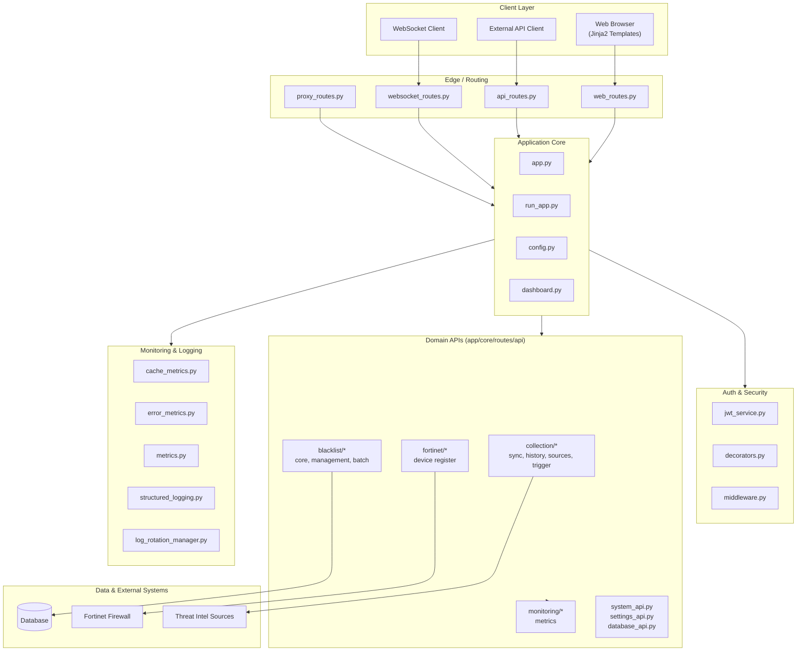

# Blacklist Service Management

> 통합 위협 인텔리전스 수집·동기화·블랙리스트 중앙 관리·Fortinet 자동 배포 플랫폼
> Unified threat-intelligence aggregation, centralized blacklist management, and Fortinet deployment platform.

---

## Table of Contents / 목차

- [한국어](#한국어)
  - [개요](#개요)
  - [주요 기능](#주요-기능)
  - [아키텍처](#아키텍처)
  - [빠른 시작](#빠른-시작)
  - [설정](#설정)
  - [명령어 레퍼런스](#명령어-레퍼런스)
  - [로컬 개발](#로컬-개발)
  - [테스트](#테스트)
  - [기여 가이드](#기여-가이드)
  - [라이선스](#라이선스)
- [English](#english)
  - [Overview](#overview)
  - [Features](#features)
  - [Architecture](#architecture)
  - [Quick Start](#quick-start)
  - [Configuration](#configuration)
  - [Commands Reference](#commands-reference)
  - [Local Development](#local-development)
  - [Testing](#testing)
  - [Contributing](#contributing)
  - [License](#license)
- [Repository Structure](#repository-structure)

---

## 한국어

### 개요

**Blacklist Service Management**는 다양한 외부 위협 인텔리전스 소스(악성 IP, 도메인 등)에서 데이터를 수집·동기화하고, 중앙 집중식 블랙리스트로 통합 관리한 뒤 Fortinet 방화벽 등 외부 보안 장비로 자동 배포하는 Python 기반의 통합 관리 플랫폼입니다. 웹 UI(Jinja2), REST API, WebSocket을 통해 실시간 모니터링과 운영 자동화를 제공합니다.

핵심 사용자:

- **보안 운영팀(SOC)** — 위협 인텔리전스 통합·자동 차단
- **네트워크 엔지니어** — Fortinet 등 외부 장비로의 정책 배포
- **플랫폼 운영자** — 단일 콘솔에서 컬렉션·세션·통합·설정 관리

기본 서비스 포트는 `2542`이며(`PORT` 환경 변수로 변경 가능), 기본 환경은 `development`입니다.

### 주요 기능

- **중앙 집중식 블랙리스트 관리** — IP/도메인 블랙리스트 CRUD, 일괄 처리(batch), 외부 컬렉션과 동기화, 변경 이력 추적
- **컬렉션 동기화** — 여러 위협 인텔리전스 소스에서 주기적/수동 데이터 수집, 히스토리 추적, 트리거 실행
- **Fortinet 연동** — Fortinet 장비 등록, 블랙리스트 항목의 정책/주소 객체 자동 배포
- **인증/인가** — JWT 기반 세션, 데코레이터·미들웨어 기반 라우트 보호, 역할 기반 접근 제어
- **모니터링** — 캐시/에러/시스템 메트릭 수집, 대시보드, 구조화 로깅, 로그 로테이션 관리
- **REST API + WebSocket** — 도메인별 모듈화된 API, 실시간 이벤트 스트림
- **프록시 라우트** — 외부 시스템 연동을 위한 중계
- **웹 UI** — Jinja2 기반 페이지(인덱스, 컬렉션, 세션, 통합, 설정, 모니터링 대시보드)
- **데이터베이스 마이그레이션** — 내장 스키마 진화 및 검증 도구
- **Docker 기반 배포** — 개발/운영 환경 통합, 핫 리로드, 배포 검증 스크립트

### 아키텍처



계층 요약:

- **Edge / Routing** — `web_routes`, `api_routes`, `websocket_routes`, `proxy_routes`가 HTTP/WS 진입점을 분리 제공
- **Auth & Security** — `jwt_service`가 토큰 발급·검증, `decorators`/`middleware`가 라우트 보호
- **Application Core** — `app.py`/`run_app.py`로 앱 부트스트랩, `config.py`로 환경 설정 로드, `dashboard.py`로 운영 뷰 구성
- **Domain APIs** — `collection/`, `blacklist/`, `fortinet/`, `monitoring/`, `system_api` 등으로 책임 분리
- **Observability** — 메트릭·구조화 로그·로그 로테이션을 한 곳에서 관리
- **Data & External** — 내부 DB, Fortinet, 외부 위협 인텔리전스 소스

### 빠른 시작

1. 저장소 클론 후 최상위에서 환경 변수 파일을 준비합니다.
   ```bash
   cp deploy/.env.example deploy/.env   # 예시 파일이 있는 경우
   ```
2. 개발 환경을 구동합니다(핫 리로드 활성, 이미지 리빌드 포함).
   ```bash
   make dev
   ```
3. 브라우저에서 접속합니다.
   ```
   http://localhost:2542
   ```

운영 환경에 준하는 구동(핫 리로드 비활성, 오버라이드 없음):
```bash
make dev-prod
```

### 설정

설정은 주로 환경 변수와 `deploy/.env`를 통해 주입됩니다. 주요 항목:

| 변수 | 설명 | 기본값 |
| --- | --- | --- |
| `ENV` | 실행 환경 (`development` / `production`) | `development` |
| `PORT` | 서비스 포트 | `2542` |
| `COMPOSE_FILE` | Docker Compose 파일 경로 | `deploy/docker-compose.yml` |
| 그 외 | DB/JWT/Fortinet/외부 소스 자격 증명 등 | `.env` 참조 |

`app/core/config.py`가 환경 변수 로드와 검증을 담당하며, `app/deployment_validation.py`가 배포 전 필수 환경값을 검사합니다.

### 명령어 레퍼런스

`make help`로 전체 목록을 확인할 수 있습니다. 주요 타겟:

| 명령어 | 설명 |
| --- | --- |
| `make help` | 사용 가능한 명령어와 설명 출력 |
| `make setup-hooks` | pre-commit/commit-msg 훅 설치, 프런트엔드 의존성 설치 |
| `make dev` | 개발 환경 기동(리빌드 + 핫 리로드) |
| `make dev-no-build` | 기존 이미지로 개발 환경 기동 |
| `make dev-prod` | 운영에 준하는 환경 기동(핫 리로드 없음) |
| `make dev-app` | 앱 서비스만 재기동 |
| `make build` / `make up` / `make down` | 이미지 빌드 / 스택 기동 / 종료 |
| `make logs` | 컨테이너 로그 스트림 |
| `make restart` | 서비스 재기동 |
| `make health` | 헬스 체크 |
| `make test` | 테스트 실행 |
| `make clean` | 정리(볼륨/캐시 등) |
| `make deploy` | 배포 절차 수행 |
| `make prod` | 운영 모드 기동 |
| `make release` / `make release-dry` | 릴리스 / 릴리스 사전 점검 |
| `make verify` | 검증 묶음 실행(`verify-lint`, `verify-types`, `verify-secrets`, `verify-pre-commit`, `verify-quick`, `verify-all`) |

### 로컬 개발

- Python 3.11 / Ruff / mypy / pre-commit / pytest 환경을 가정합니다.
- 의존성 설치:
  ```bash
  pip install -r app/requirements.txt
  pip install pre-commit
  pre-commit install --install-hooks
  pre-commit install --hook-type commit-msg
  ```
- 직접 실행(컨테이너 외부):
  ```bash
  cd app
  python run_app.py
  ```
- 커밋 메시지 규약은 `commitlint.config.js`에 정의된 Conventional Commits를 따릅니다.

### 테스트

`pyproject.toml`의 pytest 설정을 따릅니다.

- 테스트 경로: `tests/`
- 마커: `unit`, `integration`, `security`, `db`, `api`
- 기본 옵션: `-v --tb=short`
- 예시 실행:
  ```bash
  pytest                              # 전체
  pytest -m unit                      # 단위 테스트만
  pytest -m "integration and api"     # 마커 조합
  ```

### 기여 가이드

- 저장소 루트의 `CONTRIBUTING.md`를 먼저 읽어 주세요.
- 커밋 메시지는 Conventional Commits를 따릅니다(`commitlint.config.js`).
- PR 전 `make verify`로 린트/타입/시크릿/훅 검사를 통과해 주세요.

### 라이선스

본 저장소의 라이선스는 루트의 `LICENSE` 파일을 따릅니다.

---

## English

### Overview

**Blacklist Service Management** is a Python-based platform that ingests threat-intelligence feeds (malicious IPs, domains, etc.) from multiple sources, normalizes them into a centralized blacklist, and pushes the result to external security devices such as Fortinet firewalls. It exposes a web UI (Jinja2), REST APIs, and WebSocket channels for real-time monitoring and operational automation.

Primary audiences:

- **SOC / Security Operations** — unified threat-intel ingestion and automated blocking
- **Network Engineers** — policy deployment to Fortinet and similar devices
- **Platform Operators** — single console for collections, sessions, integrations, and settings

Default service port: `2542` (overridable via `PORT`). Default environment: `development`.

### Features

- **Centralized Blacklist Management** — CRUD for IP/domain blacklists, batch operations, sync with external collections, change history
- **Collection Sync** — scheduled and manual ingestion from multiple threat-intel sources, history tracking, manual triggers
- **Fortinet Integration** — device registration, automated deployment of blacklist entries as policy/address objects
- **AuthN / AuthZ** — JWT-based sessions, decorator- and middleware-based route protection, role-based access control
- **Monitoring** — cache, error, and system metrics, dashboard views, structured logging, log-rotation management
- **REST API + WebSocket** — modular domain APIs, real-time event streams
- **Proxy Routes** — passthrough to upstream systems
- **Web UI** — Jinja2 pages for index, collections, sessions, integrations, settings, and the monitoring dashboard
- **Database Migrations** — built-in schema evolution and validation helpers
- **Docker-based Deployment** — unified dev/prod environments, hot reload, deployment-validation script

### Architecture


Layer summary:

- **Edge / Routing** — `web_routes`, `api_routes`, `websocket_routes`, `proxy_routes` segregate entry points by protocol and surface area
- **Auth & Security** — `jwt_service` issues/validates tokens; `decorators` and `middleware` enforce protection at the route boundary
- **Application Core** — `app.py` / `run_app.py` bootstrap the app, `config.py` loads environment-driven settings, `dashboard.py` wires operational views
- **Domain APIs** — `collection/`, `blacklist/`, `fortinet/`, `monitoring/`, and the system/settings/database APIs separate concerns
- **Observability** — metrics, structured logging, and log rotation in a single cohesive surface
- **Data & External** — internal database, Fortinet devices, and upstream threat-intel sources

### Quick Start

1. Clone the repository and prepare the env file at the repo root.
   ```bash
   cp deploy/.env.example deploy/.env   # adjust as needed
   ```
2. Start the development environment (rebuild + hot reload):
   ```bash
   make dev
   ```
3. Open the service in a browser:
   ```
   http://localhost:2542
   ```

For a production-like run without hot reload or compose overrides:
```bash
make dev-prod
```

### Configuration

Settings are injected primarily through environment variables and `deploy/.env`. The key variables include:

| Variable | Description | Default |
| --- | --- | --- |
| `ENV` | Runtime environment (`development` / `production`) | `development` |
| `PORT` | Service port | `2542` |
| `COMPOSE_FILE` | Docker Compose file path | `deploy/docker-compose.yml` |
| Other | Database / JWT / Fortinet / upstream credentials, etc. | See `deploy/.env` |

`app/core/config.py` loads and validates configuration, while `app/deployment_validation.py` performs pre-deployment checks for required values.

### Commands Reference

Run `make help` to see the full list. Common targets:

| Command | Description |
| --- | --- |
| `make help` | Print available targets and descriptions |
| `make setup-hooks` | Install pre-commit / commit-msg hooks and frontend deps |
| `make dev` | Start the dev environment (rebuild + hot reload) |
| `make dev-no-build` | Start the dev environment using existing images |
| `make dev-prod` | Start a production-like environment (no hot reload) |
| `make dev-app` | Restart only the app service |
| `make build` / `make up` / `make down` | Build images / bring stack up / tear down |
| `make logs` | Stream container logs |
| `make restart` | Restart services |
| `make health` | Run health checks |
| `make test` | Run the test suite |
| `make clean` | Clean volumes and caches |
| `make deploy` | Run the deployment procedure |
| `make prod` | Start in production mode |
| `make release` / `make release-dry` | Release / dry-run release |
| `make verify` | Run verification suite (`verify-lint`, `verify-types`, `verify-secrets`, `verify-pre-commit`, `verify-quick`, `verify-all`) |

### Local Development

- Targets Python 3.11 with Ruff, mypy, pre-commit, and pytest.
- Install dependencies:
  ```bash
  pip install -r app/requirements.txt
  pip install pre-commit
  pre-commit install --install-hooks
  pre-commit install --hook-type commit-msg
  ```
- Run outside of containers:
  ```bash
  cd app
  python run_app.py
  ```
- Commit messages follow the Conventional Commits convention enforced by `commitlint.config.js`.

### Testing

The project follows the pytest configuration in `pyproject.toml`.

- Test root: `tests/`
- Markers: `unit`, `integration`, `security`, `db`, `api`
- Default options: `-v --tb=short`
- Example invocations:
  ```bash
  pytest                              # full suite
  pytest -m unit                      # unit tests only
  pytest -m "integration and api"     # marker combinations
  ```

### Contributing

- Read `CONTRIBUTING.md` at the repository root first.
- Follow the Conventional Commits convention enforced by `commitlint.config.js`.
- Before opening a PR, run `make verify` to pass lint / type / secret / hook checks.

### License

This project is licensed under the terms described in the `LICENSE` file at the repository root.

---

## Repository Structure

The actual top-level layout of this repository:

```
.
├── AGENTS.md
├── CHANGELOG.md
├── CONTRIBUTING.md
├── LICENSE
├── Makefile
├── OWNERS
├── README.md
├── VERSION
├── commitlint.config.js
├── mypy.ini
├── pyproject.toml
└── app/
    ├── AGENTS.md
    ├── Dockerfile
    ├── __init__.py
    ├── deployment_validation.py
    ├── entrypoint.sh
    ├── requirements.txt
    ├── run_app.py
    ├── core/
    │   ├── AGENTS.md
    │   ├── __init__.py
    │   ├── app.py
    │   ├── auth_manager.py
    │   ├── config.py
    │   ├── dashboard.py
    │   ├── testing_app.py
    │   ├── auth/         (JWT, decorators, middleware)
    │   ├── monitoring/   (cache, error, metrics)
    │   └── routes/       (web, api, websocket, proxy, system)
    ├── templates/        (Jinja2 pages, monitoring dashboard)
    └── utils/            (structured logging, log rotation)
```

> Note: The `Makefile` references additional paths such as `deploy/` and `frontend/` (e.g., `deploy/docker-compose.yml`, `deploy/.env`). These are not enumerated above because they are not part of the provided layout snapshot; treat them as deployment assets defined by the Makefile.

---

## Technology Stack

- **Language**: Python 3.11
- **Web**: Flask-style routing with Jinja2 templates, WebSockets for real-time updates
- **Auth**: JWT (`app/core/auth/jwt_service.py`), decorators + middleware
- **Persistence**: Pluggable DB layer with built-in migrations
- **Integrations**: Fortinet firewall, external threat-intel sources
- **Observability**: Cache / error / system metrics, structured logging, log rotation
- **Tooling**: Ruff, mypy, pre-commit, pytest (with `unit` / `integration` / `security` / `db` / `api` markers)
- **Packaging & Deploy**: `pyproject.toml`, `Makefile`, Docker Compose