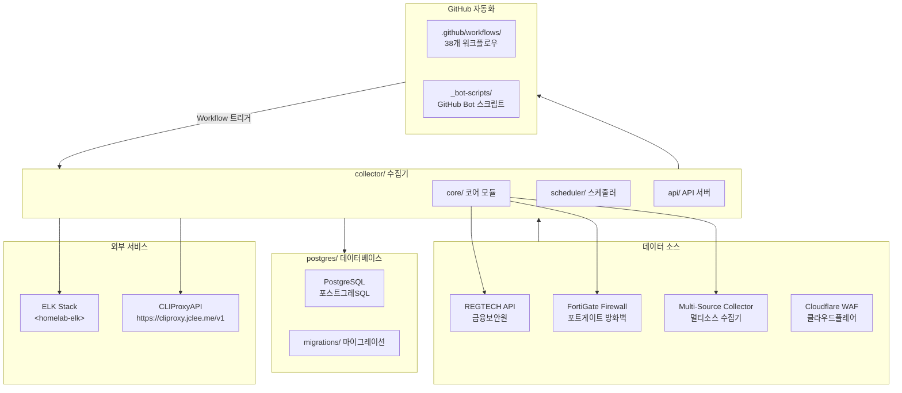
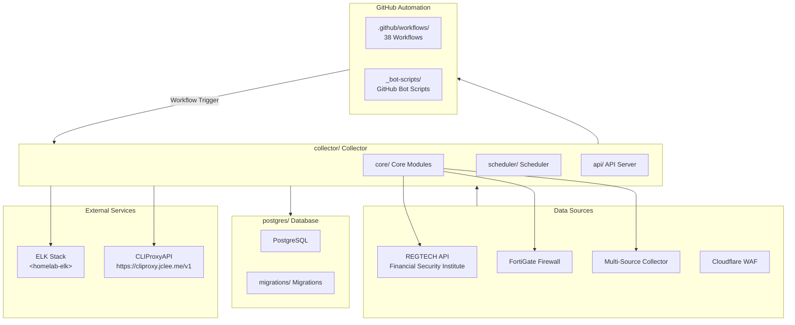

# Blacklist Service Management

Korean | [English](#english)

---

## Korean (한국어)

### 개요

**Blacklist Service Management**는 금융보안원(REGTECH) 기반 IP 블랙리스트 데이터를 수집, 처리, 분산하는 위협 인텔리전스 플랫폼입니다. FortiGate 방화벽 및 Cloudflare WAF와 연동하여 악성 IP 목록을 자동 수집합니다.

### 주요 기능

- **멀티 소스 수집**: REGTECH, FortiGate, 다중 외부 소스로부터 IP 블랙리스트 자동 수집
- **데이터 품질 관리**: 수집된 데이터의 무결성 검증 및 중복 제거
- **자동 아카이브**: 일별/월별 백업 및 증분 아카이브 지원
- **정책 모니터링**: 블랙리스트 정책 변경 사항 실시간 추적
- **Rate Limiting**: API 호출 제한으로 서비스 안정성 확보
- **데이터베이스 관리**: PostgreSQL 기반 스토리지 및 마이그레이션
- **Docker 배포**: 컨테이너화된 애플리케이션 및 데이터베이스

### 아키텍처



### 프로젝트 구조

```
/
├── collector/              # 메인 데이터 수집기 (Python)
│   ├── core/              # 코어 모듈
│   │   ├── fortigate/     # FortiGate 수집기
│   │   ├── regtech/       # REGTECH 수집기
│   │   ├── multi_source/  # 멀티소스 수집기
│   │   └── database/      # 데이터베이스 레이어
│   ├── scheduler/         # 스케줄러
│   ├── api/               # API 서버
│   └── health_server.py   # 헬스 체크 서버
├── postgres/              # PostgreSQL 설정
│   ├── initdb/            # 초기화 스크립트
│   └── migrations/        # 데이터베이스 마이그레이션
├── .github/workflows/     # GitHub Actions 워크플로우 (38개)
├── _bot-scripts/          # GitHub Bot 자동화 스크립트
├── Makefile               # 개발 명령어
└── pyproject.toml         # Python 프로젝트 설정
```

### GitHub 자동화 인벤토리

#### 워크플로우 파일 (38개)

| 파일명 | 설명 |
|--------|------|
| `01_branch-to-pr.yml` | 브랜치에서 PR로 자동 전환 |
| `02_issue-to-branch.yml` | 이슈에서 작업 브랜치 생성 |
| `03_pr-checks.yml` | PR 필수 체크実行 |
| `04_actionlint.yml` | 워크플로우 lint 검사 |
| `05_gitleaks.yml` | 시크릿 스캐닝 |
| `06_codeql.yml` | CodeQL 정적 분석 |
| `07_dependency-review.yml` | 의존성 보안 검토 |
| `08_scorecard.yml` | OpenSSF Scorecard 평가 |
| `09_semantic-pr.yml` | 시맨틱 PR 검증 |
| `10_pr-review.yml` | 자동 PR 리뷰 (qodo-ai/pr-agent) |
| `12_dependabot-auto-merge.yml` | Dependabot 자동 병합 |
| `13_pr-auto-merge.yml` | PR 자동 병합 |
| `14_bot-auto-fix.yml` | Bot 자동 수정 |
| `15_merged-pr-cleanup.yml` | 병합 후 브랜치 정리 |
| `18_issue-management.yml` | 이슈 수명 주기 관리 |
| `19_issue-backfill.yml` | 이슈 백필 |
| `20_readme-gen.yml` | README 자동 생성 |
| `21_docs-sync.yml` | 문서 동기화 |
| `24_release-notes.yml` | Release Notes 생성 |
| `25_release-publish.yml` | Release 게시 |
| `29_downstream-health-check.yml` | 다운스트림 헬스 체크 |
| `37_ci-failure-issues.yml` | CI 실패 시 이슈 생성 |
| `42_reusable-docs-sync.yml` | 재사용 가능 문서 동기화 |
| `43_reusable-issue-management.yml` | 재사용 가능 이슈 관리 |
| `44_reusable-pr-checks.yml` | 재사용 가능 PR 체크 |
| `45_reusable-gitleaks.yml` | 재사용 가능 gitleaks |
| `60_ci-auto-heal.yml` | CI 자동 복구 |
| `91_issue-classification.yml` | 이슈 자동 분류 |
| `_ci-node.yml` | Node.js CI 템플릿 |
| `auto-merge.yml` | 자동 병합 워크플로우 |
| `build-images.yml` | Docker 이미지 빌드 |
| `ci.yml` | 기본 CI 워크플로우 |
| `labeler.yml` | PR 라벨러 |
| `release.yml` | Release 워크플로우 |
| `security.yml` | 보안 스캐닝 |
| `standard-ci.yml` | 표준 CI |
| `welcome.yml` | 신규 기여자 환영 |
| `security/11_pr-review.yml` | 보안 PR 리뷰 |

#### Bot 스크립트 (_bot-scripts/)

GitHub Bot 자동화를 위한 Python 스크립트 컬렉션입니다.

### 빠른 시작

#### prerequisites

- Docker & Docker Compose
- Python 3.11+
- PostgreSQL 클라이언트 (선택)

#### 개발 환경 시작

```bash
# 저장소 복제
git clone <repository-url>
cd <repository-name>

# 개발 환경 시작 (최초 빌드 포함)
make dev

# 또는 빌드 없이 기존 이미지 사용
make dev-no-build
```

#### 컨테이너 관리

```bash
make up          # 전체 서비스 시작
make down        # 전체 서비스 중지
make logs        # 로그 확인
make restart     # 서비스 재시작
```

### 로컬 개발

#### Git Hooks 설정

```bash
make setup-hooks
```

Pre-commit 훅은 다음을 수행합니다:

- Python linting (Ruff, mypy)
- 시크릿 감지 (gitleaks)
- 커밋 메시지 검증 (Conventional Commits)
- Frontend linting (ESLint, Prettier)

#### 검증 명령어

```bash
make verify           # 전체 검증
make verify-quick     # 빠른 검증
make verify-lint      # Ruff linting
make verify-types     # mypy 타입 체크
make verify-secrets   # 시크릿 스캐닝
make verify-pre-commit # pre-commit 검증
```

### 명령어 레퍼런스

| 명령어 | 설명 |
|--------|------|
| `make help` | 도움말 표시 |
| `make setup-hooks` | Git hooks 설치 |
| `make dev` | 개발 환경 시작 (빌드 포함) |
| `make dev-no-build` | 빌드 없이 개발 환경 시작 |
| `make dev-prod` | 프로덕션 유사 환경 시작 |
| `make dev-app` | 앱 서비스만 재시작 |
| `make up` | Docker Compose 서비스 시작 |
| `make down` | Docker Compose 서비스 중지 |
| `make logs` | 서비스 로그 확인 |
| `make clean` | Docker 리소스 정리 |
| `make test` | 테스트 실행 |
| `make deploy` | 배포 실행 |
| `make restart` | 서비스 재시작 |
| `make health` | 헬스 체크 |
| `make release` | Release 실행 |
| `make verify` | 전체 검증 실행 |
| `make verify-all` | 전체 검증 실행 |

### 기여 가이드

기여를 환영합니다! 자세한 내용은 [CONTRIBUTING.md](CONTRIBUTING.md)를 참고하세요.

1. Fork 후 브랜치 생성: `git checkout -b feature/your-feature`
2. 변경 사항 커밋: `git commit -m 'feat: add new feature'`
3. PR 제출 (conventional commits 형식 필수)
4. 자동화 체크가 모두 통과해야 합니다

### 라이선스

LICENSE 파일을 참고하세요.

---

## English

### Overview

**Blacklist Service Management** is a threat intelligence platform that collects, processes, and distributes IP blacklist data from Korea's Financial Security Institute (REGTECH). It integrates with FortiGate firewalls and Cloudflare WAF to automatically gather malicious IP lists.

### Key Features

- **Multi-Source Collection**: Automatic IP blacklist collection from REGTECH, FortiGate, and multiple external sources
- **Data Quality Management**: Integrity validation and deduplication of collected data
- **Automatic Archiving**: Daily/monthly backups with incremental archive support
- **Policy Monitoring**: Real-time tracking of blacklist policy changes
- **Rate Limiting**: API call limiting for service stability
- **Database Management**: PostgreSQL-based storage and migrations
- **Docker Deployment**: Containerized application and database

### Architecture



### Project Structure

```
/
├── collector/              # Main data collector (Python)
│   ├── core/              # Core modules
│   │   ├── fortigate/     # FortiGate collector
│   │   ├── regtech/       # REGTECH collector
│   │   ├── multi_source/  # Multi-source collector
│   │   └── database/      # Database layer
│   ├── scheduler/         # Scheduler
│   ├── api/               # API server
│   └── health_server.py   # Health check server
├── postgres/              # PostgreSQL configuration
│   ├── initdb/            # Initialization scripts
│   └── migrations/        # Database migrations
├── .github/workflows/     # GitHub Actions workflows (38 total)
├── _bot-scripts/          # GitHub Bot automation scripts
├── Makefile               # Development commands
└── pyproject.toml         # Python project configuration
```

### GitHub Automation Inventory

#### Workflow Files (38 total)

| Filename | Description |
|----------|-------------|
| `01_branch-to-pr.yml` | Automatic branch to PR conversion |
| `02_issue-to-branch.yml` | Create working branch from issue |
| `03_pr-checks.yml` | PR required checks execution |
| `04_actionlint.yml` | Workflow lint validation |
| `05_gitleaks.yml` | Secret scanning |
| `06_codeql.yml` | CodeQL static analysis |
| `07_dependency-review.yml` | Dependency security review |
| `08_scorecard.yml` | OpenSSF Scorecard assessment |
| `09_semantic-pr.yml` | Semantic PR validation |
| `10_pr-review.yml` | Automated PR review (qodo-ai/pr-agent) |
| `12_dependabot-auto-merge.yml` | Dependabot auto-merge |
| `13_pr-auto-merge.yml` | PR auto-merge |
| `14_bot-auto-fix.yml` | Bot auto-fix |
| `15_merged-pr-cleanup.yml` | Post-merge branch cleanup |
| `18_issue-management.yml` | Issue lifecycle management |
| `19_issue-backfill.yml` | Issue backfill |
| `20_readme-gen.yml` | Automated README generation |
| `21_docs-sync.yml` | Documentation sync |
| `24_release-notes.yml` | Release notes generation |
| `25_release-publish.yml` | Release publishing |
| `29_downstream-health-check.yml` | Downstream health check |
| `37_ci-failure-issues.yml` | CI failure issue creation |
| `42_reusable-docs-sync.yml` | Reusable docs sync |
| `43_reusable-issue-management.yml` | Reusable issue management |
| `44_reusable-pr-checks.yml` | Reusable PR checks |
| `45_reusable-gitleaks.yml` | Reusable gitleaks |
| `60_ci-auto-heal.yml` | CI auto-heal |
| `91_issue-classification.yml` | Issue auto-classification |
| `_ci-node.yml` | Node.js CI template |
| `auto-merge.yml` | Auto-merge workflow |
| `build-images.yml` | Docker image build |
| `ci.yml` | Base CI workflow |
| `labeler.yml` | PR labeler |
| `release.yml` | Release workflow |
| `security.yml` | Security scanning |
| `standard-ci.yml` | Standard CI |
| `welcome.yml` | New contributor welcome |
| `security/11_pr-review.yml` | Security PR review |

#### Bot Scripts (_bot-scripts/)

Python script collection for GitHub Bot automation.

### Quick Start

#### Prerequisites

- Docker & Docker Compose
- Python 3.11+
- PostgreSQL client (optional)

#### Start Development Environment

```bash
# Clone repository
git clone <repository-url>
cd <repository-name>

# Start development environment (first build)
make dev

# Or use existing images without rebuilding
make dev-no-build
```

#### Container Management

```bash
make up          # Start all services
make down        # Stop all services
make logs        # View logs
make restart     # Restart services
```

### Local Development

#### Git Hooks Setup

```bash
make setup-hooks
```

Pre-commit hooks perform:

- Python linting (Ruff, mypy)
- Secret detection (gitleaks)
- Commit message validation (Conventional Commits)
- Frontend linting (ESLint, Prettier)

#### Verification Commands

```bash
make verify           # Run all verifications
make verify-quick     # Quick verification
make verify-lint      # Ruff linting
make verify-types     # mypy type checking
make verify-secrets   # Secret scanning
make verify-pre-commit # pre-commit verification
```

### Command Reference

| Command | Description |
|---------|-------------|
| `make help` | Show help message |
| `make setup-hooks` | Install Git hooks |
| `make dev` | Start development environment (with build) |
| `make dev-no-build` | Start without rebuild |
| `make dev-prod` | Start production-like environment |
| `make dev-app` | Restart only app service |
| `make up` | Start Docker Compose services |
| `make down` | Stop Docker Compose services |
| `make logs` | View service logs |
| `make clean` | Clean Docker resources |
| `make test` | Run tests |
| `make deploy` | Run deployment |
| `make restart` | Restart services |
| `make health` | Health check |
| `make release` | Run release |
| `make verify` | Run all verifications |
| `make verify-all` | Run all verifications |

### Contributing

Contributions are welcome! See [CONTRIBUTING.md](CONTRIBUTING.md) for details.

1. Fork and create a branch: `git checkout -b feature/your-feature`
2. Commit changes: `git commit -m 'feat: add new feature'`
3. Submit a PR (conventional commits format required)
4. All automated checks must pass

### License

See LICENSE file.

---

*Documentation auto-generated by README-gen model: minimax-m2.7 (CLIProxyAPI)*
