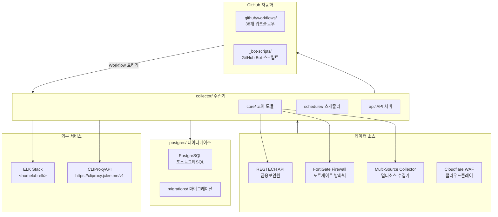
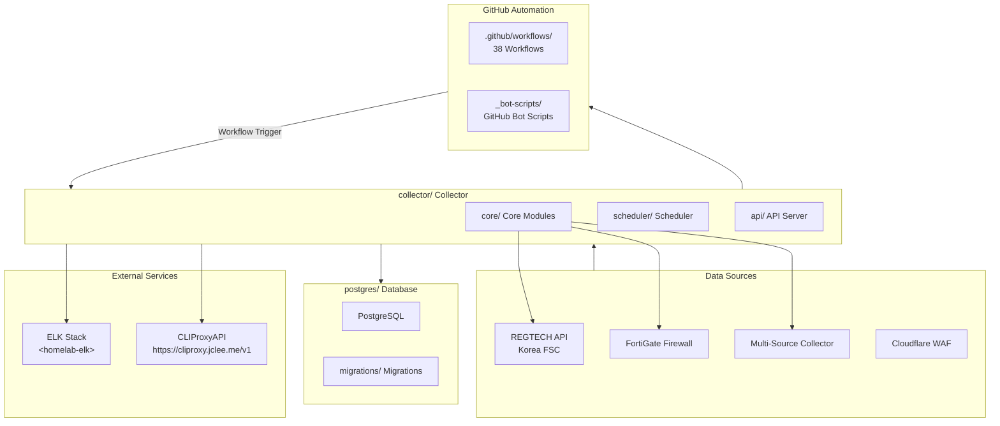

# Blacklist Service Management

Korean | [English](#english)

---

## Korean (한국어)

### 개요

**Blacklist Service Management**는 금융보안원(REGTECH) 기반 IP 블랙리스트 데이터를 수집, 처리, 분산하는 위협 인텔리전스 플랫폼입니다. FortiGate 방화벽 및 Cloudflare WAF와 연동하여 악성 IP 목록을 자동 수집합니다.

### 주요 기능

- **멀티 소스 수집**: REGTECH, FortiGate, 다중 외부 소스로부터 IP 블랙리스트 자동 수집
- **데이터 품질 관리**: 수집된 데이터의 무결성 검증 및 중복 제거
- **자동 아카이브**: 일별/월별 백업 및 증분 아카이브 지원
- **정책 모니터링**: 블랙리스트 정책 변경 사항 실시간 추적
- **Rate Limiting**: API 호출 제한으로 서비스 안정성 확보
- **데이터베이스 관리**: PostgreSQL 기반 스토리지 및 마이그레이션
- **Docker 배포**: 컨테이너화된 애플리케이션 및 데이터베이스

### 아키텍처



### 프로젝트 구조

```
/
├── collector/              # 메인 데이터 수집기 (Python)
│   ├── core/               # 코어 모듈
│   │   ├── fortigate/      # FortiGate 수집기
│   │   ├── regtech/        # REGTECH 수집기
│   │   ├── multi_source/  # 멀티소스 수집기
│   │   └── database/       # 데이터베이스 레이어
│   ├── scheduler/          # 작업 스케줄러
│   └── api/                # REST API 서버
├── postgres/               # PostgreSQL 데이터베이스
│   ├── initdb/            # 초기화 스크립트
│   └── migrations/        # 데이터베이스 마이그레이션
├── _bot-scripts/          # GitHub 자동화 봇 스크립트
├── .github/
│   └── workflows/          # 38개 GitHub Actions 워크플로우
├── pyproject.toml         # Python 프로젝트 설정
├── Makefile               # 개발/배포 명령어
└── VERSION                # 현재 버전
```

### GitHub 자동화 인벤토리

#### GitHub Actions 워크플로우 (38개)

| 워크플로우 파일 | 설명 |
|----------------|------|
| `01_branch-to-pr.yml` | 브랜치에서 PR로 전환 |
| `02_issue-to-branch.yml` | 이슈에서 브랜치 생성 |
| `03_pr-checks.yml` | PR 체크 (린트, 테스트) |
| `04_actionlint.yml` | GitHub Actions lint 검사 |
| `05_gitleaks.yml` | 시크릿 스캐닝 |
| `06_codeql.yml` | 코드 품질 분석 |
| `07_dependency-review.yml` | 의존성 보안 검토 |
| `08_scorecard.yml` | 보안 점수 카드 |
| `09_semantic-pr.yml` | 시맨틱 PR 검증 |
| `10_pr-review.yml` | 자동 PR 리뷰 |
| `12_dependabot-auto-merge.yml` | Dependabot 자동 병합 |
| `13_pr-auto-merge.yml` | PR 자동 병합 |
| `14_bot-auto-fix.yml` | 봇 자동 수정 |
| `15_merged-pr-cleanup.yml` | 병합 후 정리 |
| `18_issue-management.yml` | 이슈 관리 |
| `19_issue-backfill.yml` | 이슈 백필 |
| `20_readme-gen.yml` | README 생성 |
| `21_docs-sync.yml` | 문서 동기화 |
| `24_release-notes.yml` |.Release 노트 생성 |
| `25_release-publish.yml` |.Release 게시 |
| `29_downstream-health-check.yml` | 다운스트림 상태 확인 |
| `37_ci-failure-issues.yml` | CI 실패 시 이슈 생성 |
| `42_reusable-docs-sync.yml` | 재사용 가능한 문서 동기화 |
| `43_reusable-issue-management.yml` | 재사용 가능한 이슈 관리 |
| `44_reusable-pr-checks.yml` | 재사용 가능한 PR 체크 |
| `45_reusable-gitleaks.yml` | 재사용 가능한 gitleaks |
| `60_ci-auto-heal.yml` | CI 자동 복구 |
| `91_issue-classification.yml` | 이슈 분류 |
| `_ci-node.yml` | Node.js CI 노드 |
| `auto-merge.yml` | 자동 병합 |
| `build-images.yml` | Docker 이미지 빌드 |
| `ci.yml` | CI 파이프라인 |
| `labeler.yml` | PR/Release 라벨러 |
| `release.yml` |.Release 실행 |
| `security.yml` | 보안 워크플로우 |
| `standard-ci.yml` | 표준 CI |
| `welcome.yml` | 신규 기여자 환영 |
| `security/11_pr-review.yml` | 보안 PR 리뷰 |

#### 자동화 도구

| 도구 | 용도 |
|------|------|
| [qodo-ai/pr-agent](https://www.pr-agent.ai/) | AI 기반 PR 리뷰 및 분석 |
| [CLIProxyAPI](https://cliproxy.jclee.me/v1) | CLI 프록시 API 연동 |
| [ELK Stack](https://www.elastic.co/kr/elastic-stack) | 로그 수집 및 모니터링 |

### 빠른 시작

#### 사전 요구사항

- Docker 20.10+
- Docker Compose 2.0+
- Python 3.11+ (로컬 개발)

#### 1단계: Docker 환경 시작

```bash
# 프로덕션 환경으로 시작
make up

# 개발 환경 (핫 리로드 포함)
make dev

# 로그 확인
make logs
```

#### 2단계: 상태 확인

```bash
# 서비스 상태 확인
docker compose ps

# 헬스 체크
curl http://localhost:2542/health
```

### 로컬 개발

#### 환경 설정

```bash
# Git hooks 설치
make setup-hooks

# Python 의존성 설치
pip install -r collector/requirements.txt

# 타입 검사
make verify-types

# 린트 검사
make verify-lint

# 전체 검증
make verify-all
```

#### 테스트 실행

```bash
# 모든 테스트
make test

# 단위 테스트만
pytest -m unit

# 통합 테스트
pytest -m integration

# 보안 테스트
pytest -m security
```

### 명령어 레퍼런스

| 명령어 | 설명 |
|--------|------|
| `make help` | 사용 가능한 명령어 표시 |
| `make setup-hooks` | Git hooks 및 husky 설치 |
| `make dev` | 개발 환경 시작 (핫 리로드) |
| `make dev-no-build` | 기존 이미지로 개발 환경 시작 |
| `make dev-prod` | 프로덕션 환경 시작 |
| `make dev-app` | 앱 서비스만 재시작 |
| `make build` | Docker 이미지 빌드 |
| `make up` | 모든 서비스 시작 |
| `make down` | 모든 서비스 중지 |
| `make logs` | 로그 확인 (실시간) |
| `make clean` | 정리 (볼륨 포함) |
| `make test` | 테스트 실행 |
| `make verify` | 전체 검증 실행 |
| `make verify-quick` | 빠른 검증 (린트만) |
| `make verify-all` | 모든 검증 (린트, 타입, 시크릿) |
| `make health` | 헬스 체크 실행 |
| `make release` |.Release 실행 |
| `make release-dry` |.Release 더미 실행 |
| `make restart` | 모든 서비스 재시작 |

### 기여 가이드

#### 커밋 메시지 규칙

이 프로젝트는 [Conventional Commits](https://www.conventionalcommits.org/) 규칙을 따릅니다:

```
<type>(<scope>): <description>

[optional body]

[optional footer]
```

**타입:**

- `feat`: 새로운 기능
- `fix`: 버그 수정
- `docs`: 문서 변경
- `style`: 코드 스타일 변경 (기능 무관)
- `refactor`: 리팩토링
- `test`: 테스트 관련
- `chore`: 기타 변경

#### Pull Request 프로세스

1. **토픽 브랜치 생성**

   ```bash
   git checkout -b feature/your-feature-name
   ```

2. **변경 사항 구현**

   ```bash
   # 코딩 후
   make verify-all
   ```

3. **커밋 ( Conventional Commits 형식)**

   ```bash
   git commit -m "feat(core): add new IP validation rule"
   ```

4. **PR 제출**
   - `10_pr-review.yml`이 자동으로 AI 리뷰를 수행
   - `03_pr-checks.yml`가 CI 체크를 실행
   - 모든 체크 통과 후 병합

5. **자동 병합**
   - `13_pr-auto-merge.yml`가 조건 충족 시 자동 병합

#### 코드 스타일

- **Python**: Ruff (line-length: 120, target: Python 3.11)
- **린트 제외**: E501 (line too long), W291, W293
- **마이그레이션 파일**: `app/` 경로에서 F401, E402 허용

### 버전 관리

현재 버전: `1.0.0`

자세한 변경 사항은 [CHANGELOG.md](./CHANGELOG.md)를 참조하세요.

---

## English

### Overview

**Blacklist Service Management** is a threat intelligence platform that collects, processes, and distributes IP blacklist data based on Korea's Financial Security Institute (REGTECH). It integrates with FortiGate firewalls and Cloudflare WAF to automatically gather malicious IP lists.

### Key Features

- **Multi-Source Collection**: Automatic IP blacklist collection from REGTECH, FortiGate, and multiple external sources
- **Data Quality Management**: Integrity validation and deduplication of collected data
- **Automatic Archiving**: Daily/monthly backups with incremental archive support
- **Policy Monitoring**: Real-time tracking of blacklist policy changes
- **Rate Limiting**: API call limiting for service stability
- **Database Management**: PostgreSQL-based storage and migrations
- **Docker Deployment**: Containerized application and database

### Architecture



### Project Structure

```
/
├── collector/              # Main data collector (Python)
│   ├── core/               # Core modules
│   │   ├── fortigate/      # FortiGate collector
│   │   ├── regtech/        # REGTECH collector
│   │   ├── multi_source/  # Multi-source collector
│   │   └── database/       # Database layer
│   ├── scheduler/          # Job scheduler
│   └── api/                # REST API server
├── postgres/               # PostgreSQL database
│   ├── initdb/            # Initialization scripts
│   └── migrations/        # Database migrations
├── _bot-scripts/          # GitHub automation bot scripts
├── .github/
│   └── workflows/          # 38 GitHub Actions workflows
├── pyproject.toml         # Python project configuration
├── Makefile               # Development/deployment commands
└── VERSION                # Current version
```

### GitHub Automation Inventory

#### GitHub Actions Workflows (38 total)

| Workflow File | Description |
|---------------|-------------|
| `01_branch-to-pr.yml` | Branch to PR conversion |
| `02_issue-to-branch.yml` | Issue to branch creation |
| `03_pr-checks.yml` | PR checks (lint, test) |
| `04_actionlint.yml` | GitHub Actions lint check |
| `05_gitleaks.yml` | Secret scanning |
| `06_codeql.yml` | Code quality analysis |
| `07_dependency-review.yml` | Dependency security review |
| `08_scorecard.yml` | Security scorecard |
| `09_semantic-pr.yml` | Semantic PR validation |
| `10_pr-review.yml` | Automated PR review |
| `12_dependabot-auto-merge.yml` | Dependabot auto-merge |
| `13_pr-auto-merge.yml` | PR auto-merge |
| `14_bot-auto-fix.yml` | Bot auto-fix |
| `15_merged-pr-cleanup.yml` | Post-merge cleanup |
| `18_issue-management.yml` | Issue management |
| `19_issue-backfill.yml` | Issue backfill |
| `20_readme-gen.yml` | README generation |
| `21_docs-sync.yml` | Documentation sync |
| `24_release-notes.yml` | Release notes generation |
| `25_release-publish.yml` | Release publishing |
| `29_downstream-health-check.yml` | Downstream health check |
| `37_ci-failure-issues.yml` | CI failure issue creation |
| `42_reusable-docs-sync.yml` | Reusable docs sync |
| `43_reusable-issue-management.yml` | Reusable issue management |
| `44_reusable-pr-checks.yml` | Reusable PR checks |
| `45_reusable-gitleaks.yml` | Reusable gitleaks |
| `60_ci-auto-heal.yml` | CI auto-heal |
| `91_issue-classification.yml` | Issue classification |
| `_ci-node.yml` | Node.js CI node |
| `auto-merge.yml` | Auto-merge |
| `build-images.yml` | Docker image build |
| `ci.yml` | CI pipeline |
| `labeler.yml` | PR/Release labeler |
| `release.yml` | Release execution |
| `security.yml` | Security workflow |
| `standard-ci.yml` | Standard CI |
| `welcome.yml` | New contributor welcome |
| `security/11_pr-review.yml` | Security PR review |

#### Automation Tools

| Tool | Purpose |
|------|---------|
| [qodo-ai/pr-agent](https://www.pr-agent.ai/) | AI-powered PR review and analysis |
| [CLIProxyAPI](https://cliproxy.jclee.me/v1) | CLI proxy API integration |
| [ELK Stack](https://www.elastic.co/elastic-stack) | Log collection and monitoring |

### Quick Start

#### Prerequisites

- Docker 20.10+
- Docker Compose 2.0+
- Python 3.11+ (local development)

#### Step 1: Start Docker Environment

```bash
# Start in production mode
make up

# Start in development mode (with hot reload)
make dev

# View logs
make logs
```

#### Step 2: Verify Status

```bash
# Check service status
docker compose ps

# Health check
curl http://localhost:2542/health
```

### Local Development

#### Environment Setup

```bash
# Install Git hooks
make setup-hooks

# Install Python dependencies
pip install -r collector/requirements.txt

# Type checking
make verify-types

# Linting
make verify-lint

# Full verification
make verify-all
```

#### Running Tests

```bash
# Run all tests
make test

# Unit tests only
pytest -m unit

# Integration tests
pytest -m integration

# Security tests
pytest -m security
```

### Command Reference

| Command | Description |
|---------|-------------|
| `make help` | Show available commands |
| `make setup-hooks` | Install Git hooks and husky |
| `make dev` | Start development environment (hot reload) |
| `make dev-no-build` | Start with existing images |
| `make dev-prod` | Start production-like environment |
| `make dev-app` | Restart only app service |
| `make build` | Build Docker images |
| `make up` | Start all services |
| `make down` | Stop all services |
| `make logs` | View logs (real-time) |
| `make clean` | Clean up (including volumes) |
| `make test` | Run tests |
| `make verify` | Run full verification |
| `make verify-quick` | Quick verification (lint only) |
| `make verify-all` | All verifications (lint, types, secrets) |
| `make health` | Run health check |
| `make release` | Run release |
| `make release-dry` | Dry run release |
| `make restart` | Restart all services |

### Contributing Guide

#### Commit Message Rules

This project follows [Conventional Commits](https://www.conventionalcommits.org/):

```
<type>(<scope>): <description>

[optional body]

[optional footer]
```

**Types:**

- `feat`: New feature
- `fix`: Bug fix
- `docs`: Documentation changes
- `style`: Code style changes (non-functional)
- `refactor`: Refactoring
- `test`: Test related
- `chore`: Other changes

#### Pull Request Process

1. **Create Topic Branch**

   ```bash
   git checkout -b feature/your-feature-name
   ```

2. **Implement Changes**

   ```bash
   # After coding
   make verify-all
   ```

3. **Commit (Conventional Commits Format)**

   ```bash
   git commit -m "feat(core): add new IP validation rule"
   ```

4. **Submit PR**
   - `10_pr-review.yml` performs AI review automatically
   - `03_pr-checks.yml` runs CI checks
   - Merge after all checks pass

5. **Auto-Merge**
   - `13_pr-auto-merge.yml` auto-merges when conditions are met

#### Code Style

- **Python**: Ruff (line-length: 120, target: Python 3.11)
- **Ignored rules**: E501 (line too long), W291, W293
- **Migration files**: F401, E402 allowed in `app/` paths

### Version Management

Current version: `1.0.0`

See [CHANGELOG.md](./CHANGELOG.md) for detailed changes.
