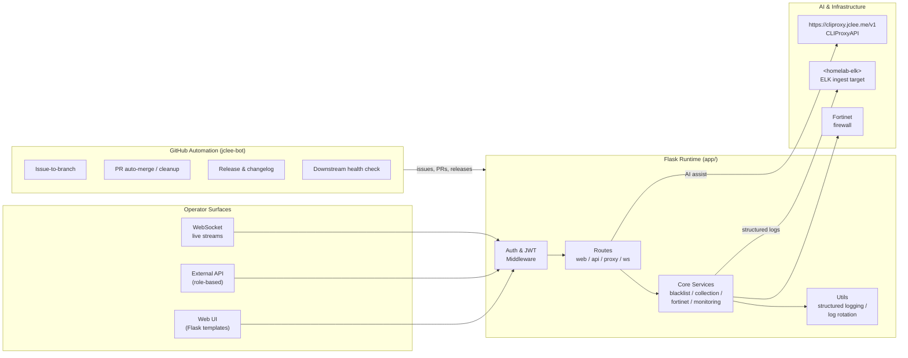
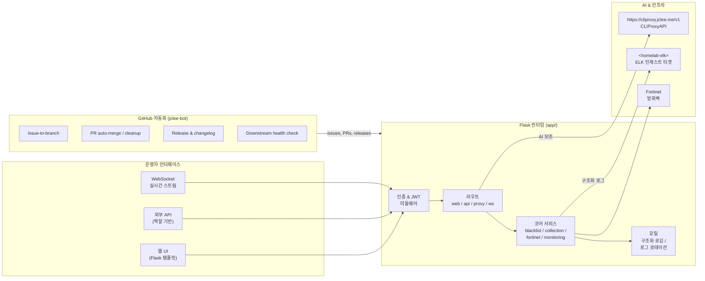

# Blacklist Service Management

[English](#english) · [한국어](#korean)


> A Python 3.11 / Flask-based service that consolidates **blacklist collection**, **operational monitoring**, **role-based API access**, **Fortinet firewall integration**, and **AI-assisted automation** behind a single, observability-first runtime.

---

<a id="english"></a>

## 🇺🇸 English

### 1. Overview

**Blacklist Service Management** is a Python 3.11 web application that centralizes every operational concern of a security-oriented blacklist pipeline into a single Flask runtime. It is purpose-built for homelab and small-team environments where the same operator who collects threat feeds also needs to manage firewall policy, audit sessions, and observe system health without juggling multiple tools.

The runtime under `app/` exposes a layered architecture:

- **Web tier** — Flask templates for operator workflows: `templates/index.html`, `templates/collection.html`, `templates/sessions.html`, `templates/settings.html`, `templates/integrations.html`, `templates/collection_logs.html`, and the dedicated `templates/monitoring/dashboard.html`.
- **API tier** — Versioned API blueprints under `app/core/routes/api/` (analytics, auth, dashboard, database, error metrics, settings, system, migration, IP management helpers, Fortinet registration) plus domain modules for **blacklist**, **collection**, **fortinet**, and **monitoring**.
- **Auth tier** — JWT-based session issuance (`auth_manager.py`, `jwt_service.py`), request-scoped decorators, and middleware-based role enforcement.
- **Monitoring tier** — Cache metrics, error metrics, structured logging, and log-rotation utilities that emit a coherent stream to a downstream ELK ingest target.
- **Proxy tier** — Reverse-proxy routes that bridge the running app to the homelab CLIProxyAPI endpoint for AI-assisted operations.

Everything is shipped as a single container image (`app/Dockerfile`) with an entrypoint (`app/entrypoint.sh`) that runs `app/run_app.py` after deployment validation (`app/deployment_validation.py`).

### 2. Features

- **Blacklist pipeline** — Multi-source feed ingestion, batch operations, historical tracking, and rule-based policy management (`app/core/routes/api/blacklist/`, `app/core/routes/api/collection/`).
- **Fortinet integration** — Direct firewall registration, address-group sync, and policy reconciliation via `fortinet/core.py` and `fortinet_register.py`.
- **Role-based API access** — JWT issuance and verification with per-route decorators and middleware-enforced scopes.
- **Operational monitoring** — First-class cache and error metrics, real-time WebSocket streams, and a dedicated monitoring dashboard template.
- **Structured logging** — JSON logs with automated rotation, written through `utils/structured_logging.py` and `utils/log_rotation_manager.py`.
- **AI-assisted automation** — Internal proxy routes forward selected traffic to `https://cliproxy.jclee.me/v1` (the public edge for the homelab CLIProxyAPI), so the operator can ask natural-language questions about the running system without leaving the web UI.
- **Hardened supply chain** — Ruff + mypy + pytest gates in CI, plus CodeQL, Gitleaks, OpenSSF Scorecard, and PR-Agent review (qodo-ai/pr-agent).

### 3. Architecture



The Flask runtime is the only process the operator must run. The CLIProxyAPI edge (`https://cliproxy.jclee.me/v1`) is reached over the public internet; the ELK ingest target sits on the homelab network. All GitHub-side mutating actions execute under the `jclee-bot` identity.

### 4. Repository Structure

```text
.
├── AGENTS.md
├── CHANGELOG.md
├── CONTRIBUTING.md
├── LICENSE
├── Makefile
├── OWNERS
├── README.md
├── VERSION
├── commitlint.config.js
├── mypy.ini
├── pyproject.toml
└── app/
    ├── AGENTS.md
    ├── Dockerfile
    ├── __init__.py
    ├── deployment_validation.py
    ├── entrypoint.sh
    ├── requirements.txt
    ├── run_app.py
    ├── utils/
    │   ├── log_rotation_manager.py
    │   └── structured_logging.py
    ├── templates/
    │   ├── collection.html
    │   ├── collection_logs.html
    │   ├── index.html
    │   ├── integrations.html
    │   ├── sessions.html
    │   ├── settings.html
    │   └── monitoring/
    │       └── dashboard.html
    └── core/
        ├── AGENTS.md
        ├── __init__.py
        ├── app.py
        ├── auth_manager.py
        ├── config.py
        ├── dashboard.py
        ├── testing_app.py
        ├── auth/
        │   ├── AGENTS.md
        │   ├── __init__.py
        │   ├── decorators.py
        │   ├── jwt_service.py
        │   └── middleware.py
        ├── monitoring/
        │   ├── AGENTS.md
        │   ├── __init__.py
        │   ├── cache_metrics.py
        │   ├── error_metrics.py
        │   └── metrics.py
        └── routes/
            ├── AGENTS.md
            ├── api_routes.py
            ├── collection_routes_simple.py
            ├── proxy_routes.py
            ├── system_routes.py
            ├── web_routes.py
            ├── websocket_routes.py
            └── api/
                ├── AGENTS.md
                ├── __init__.py
                ├── analytics.py
                ├── auth_routes.py
                ├── core_api.py
                ├── dashboard_api.py
                ├── database_api.py
                ├── error_metrics_api.py
                ├── fortinet_register.py
                ├── ip_management_helpers.py
                ├── migration.py
                ├── settings_api.py
                ├── system_api.py
                ├── monitoring/
                │   └── __init__.py
                ├── collection/
                │   ├── AGENTS.md
                │   ├── __init__.py
                │   ├── config.py
                │   ├── credentials.py
                │   ├── history.py
                │   ├── sources.py
                │   ├── status.py
                │   ├── sync.py
                │   ├── trigger.py
                │   └── utils.py
                ├── blacklist/
                │   ├── AGENTS.md
                │   ├── __init__.py
                │   ├── batch.py
                │   ├── collection.py
                │   ├── core.py
                │   ├── management.py
                │   └── system.py
                └── fortinet/
                    ├── AGENTS.md
                    ├── __init__.py
                    └── core.py
```

### 5. jclee-bot Automation Surfaces

All mutating GitHub Actions on this repository run under the **`jclee-bot`** identity. Workflow files are merely trigger sources — the automation surfaces below describe the **behaviors** the bot owns. Repository-level workflow files implement these surfaces; they are intentionally not listed here as a row inventory.

#### 5.1 App-owned automation surfaces (inside the running Flask app)

These surfaces live **inside** `app/` and are reachable over HTTP/WebSocket at runtime:

- **AI-assisted proxy** — `app/core/routes/proxy_routes.py` forwards operator prompts to `https://cliproxy.jclee.me/v1` and streams responses back.
- **Scheduled collection trigger** — `app/core/routes/api/collection/trigger.py` exposes endpoints that the bot can call to refresh feeds on demand.
- **Health & error surfacing** — `app/core/routes/api/error_metrics_api.py` and `app/core/routes/api/system_api.py` expose the signals the bot consumes during a downstream health check.
- **Session audit surface** — `app/core/routes/api/auth_routes.py` and `templates/sessions.html` provide the audit trail the bot references when triaging issues.
- **Settings mutation surface** — `app/core/routes/api/settings_api.py` is the canonical channel through which the bot applies remediations.

#### 5.2 Repo-level jclee-bot automation surfaces

- **Issue-to-branch** — Operator issues are converted into branches automatically.
- **Issue backfill** — Missing context is backfilled on legacy issues.
- **PR review** — Code-level review is performed (PR-Agent / qodo-ai/pr-agent) on every opened pull request.
- **Security PR review** — Security-focused review pass for high-risk PRs.
- **Bot auto-fix** — Lint, type, and trivial correctness fixes are applied directly by the bot.
- **PR auto-merge** — Dependabot and trusted PRs are auto-merged once checks pass.
- **Merged-PR cleanup** — Branches and stale comments are cleaned after merge.
- **Release notes & publishing** — Drafted and published by the bot on tagged releases.
- **Downstream health check** — Periodic probe of `app/` runtime signals and the CLIProxyAPI edge.
- **CI-failure issue creation** — Failing CI is converted into actionable issues.

**Issue automation behavior:** jclee-bot에의해자동화됨 — every newly opened issue is triaged, labeled, branched, and routed without human intervention.

### 6. Go Automation Tools

This repository ships **zero** Go automation tools. All automation logic is implemented as Python modules inside `app/core/routes/api/` or as GitHub Actions workflows under the `jclee-bot` identity. If a future Go tool is added, it must be registered in this section by name.

### 7. Quick Start

```bash
# 1. Clone
git clone https://github.com/<owner>/blacklist-service-management.git
cd blacklist-service-management

# 2. Install git hooks + frontend deps
make setup-hooks

# 3. Prepare env
cp deploy/.env.example deploy/.env   # then edit secrets

# 4. Bring up the dev stack (hot reload)
make dev

# 5. Open the UI
open http://localhost:2542
```

For a production-like run without hot reload, use `make dev-prod` or `make prod`.

### 8. Local Development

- **Python** — 3.11 (see `[tool.ruff] target-version = "py311"` in `pyproject.toml`).
- **Linting** — `make verify-lint` (Ruff, line length 120).
- **Type checking** — `make verify-types` (mypy via `mypy.ini`).
- **Tests** — `make test` runs pytest with markers for `unit`, `integration`, `security`, `db`, and `api` (see `[tool.pytest.ini_options]` in `pyproject.toml`).
- **Secret scanning** — `make verify-secrets` (Gitleaks).
- **Pre-commit** — `make verify-pre-commit`.
- **AI proxy endpoint** — Configured to `https://cliproxy.jclee.me/v1`; do not hardcode homelab IPs into source files.
- **ELK target** — Configure the ELK ingest host via env (placeholder: `<homelab-elk>`).

### 9. Commands Reference

| Command | Purpose |
| --- | --- |
| `make help` | List every Makefile target with a short description. |
| `make setup-hooks` | Install pre-commit + Husky hooks and frontend deps. |
| `make dev` | Start the dev stack with hot reload (rebuilds changed images). |
| `make dev-no-build` | Start the dev stack using existing images (faster). |
| `make dev-prod` | Production-like local run (no hot reload). |
| `make dev-app` | Restart only the app service for quick iteration. |
| `make build` | Build all Docker images. |
| `make up` / `make down` | Bring the stack up / tear it down. |
| `make logs` | Tail logs from running services. |
| `make restart` | Restart the full stack. |
| `make health` | Probe the running app's health endpoint. |
| `make test` | Run the pytest suite. |
| `make deploy` | Deploy via `deploy/docker-compose.yml`. |
| `make prod` | Promote the current build to production. |
| `make release` | Cut a tagged release (driven by jclee-bot). |
| `make release-dry` | Dry-run a release to validate output. |
| `make verify` | Run all verify-* checks. |
| `make verify-lint` | Ruff only. |
| `make verify-types` | mypy only. |
| `make verify-secrets` | Gitleaks only. |
| `make verify-pre-commit` | All pre-commit hooks against the tree. |
| `make verify-quick` | Fast subset of checks for inner loop. |
| `make verify-all` | Full verification gate (CI-parity). |
| `make clean` | Remove build artifacts and dangling containers. |

### 10. Contributing

1. Read `CONTRIBUTING.md` and the per-directory `AGENTS.md` files (root, `app/`, `app/core/`, `app/core/auth/`, `app/core/monitoring/`, `app/core/routes/`, `app/core/routes/api/`, `app/core/routes/api/collection/`, `app/core/routes/api/blacklist/`, `app/core/routes/api/fortinet/`).
2. Follow **Conventional Commits** — enforced by `commitlint.config.js` via the `commit-msg` hook.
3. Open a branch. The bot will convert your issue/PR through the surfaces described in §5.
4. Ensure `make verify-all` passes locally before requesting review.
5. The PR-Agent (qodo-ai/pr-agent) review pass will leave inline suggestions; address or rebut each one.
6. Once checks pass, the bot handles merge, cleanup, and release notes.

---

<a id="korean"></a>

## 🇰🇷 한국어

### 1. 개요

**Blacklist Service Management**는 보안 중심의 블랙리스트 파이프라인 운영 concerns를 단일 Flask 런타임으로 통합한 Python 3.11 웹 애플리케이션입니다. 동질 환경(homelab)과 소규모 팀을 위해 설계되었으며, 위협 인텔리전스 수집부터 방화벽 정책 관리, 세션 감사, 시스템 상태 관찰까지 한 화면에서 처리할 수 있도록 합니다.

`app/` 하위 런타임은 계층화된 아키텍처를 제공합니다.

- **Web 티어** — 운영자 워크플로를 위한 Flask 템플릿: `templates/index.html`, `templates/collection.html`, `templates/sessions.html`, `templates/settings.html`, `templates/integrations.html`, `templates/collection_logs.html`, 그리고 전용 모니터링 대시보드 `templates/monitoring/dashboard.html`.
- **API 티어** — `app/core/routes/api/` 하위의 버전 관리된 API 블루프린트(analytics, auth, dashboard, database, error metrics, settings, system, migration, IP management helpers, Fortinet registration)와 **blacklist / collection / fortinet / monitoring** 도메인 모듈.
- **Auth 티어** — JWT 기반 세션 발급(`auth_manager.py`, `jwt_service.py`), 요청 스코프 데코레이터, 미들웨어 기반 역할 강제.
- **Monitoring 티어** — 캐시/에러 메트릭, 구조화 로깅, 로그 로테이션을 일관된 스트림으로 다운스트림 ELK 인제스트 타겟에 전달.
- **Proxy 티어** — 동질 환경 CLIProxyAPI 엔드포인트로 트래픽을 전달하는 리버스 프록시 라우트.

전체 스택은 단일 컨테이너 이미지(`app/Dockerfile`)로 제공되며, 엔트리포인트(`app/entrypoint.sh`)는 배포 검증(`app/deployment_validation.py`) 후 `app/run_app.py`를 실행합니다.

### 2. 기능

- **블랙리스트 파이프라인** — 다중 소스 피드 인제스트, 배치 작업, 히스토리 추적, 규칙 기반 정책 관리(`app/core/routes/api/blacklist/`, `app/core/routes/api/collection/`).
- **Fortinet 통합** — 방화벽 등록, 주소 그룹 동기화, 정책 정합(`fortinet/core.py`, `fortinet_register.py`).
- **역할 기반 API 접근 제어** — JWT 발급·검증과 라우트별 데코레이터/미들웨어 스코프 강제.
- **운영 모니터링** — 1급 캐시·에러 메트릭, 실시간 WebSocket 스트림, 전용 모니터링 대시보드 템플릿.
- **구조화 로깅** — `utils/structured_logging.py`와 `utils/log_rotation_manager.py`를 통한 JSON 로그와 자동 로테이션.
- **AI 보조 자동화** — 내부 프록시 라우트가 동질 환경 CLIProxyAPI의 퍼블릭 엣지인 `https://cliproxy.jclee.me/v1`로 트래픽을 전달하여, 운영자가 웹 UI를 떠나지 않고 자연어로 시스템 상태를 질의할 수 있도록 합니다.
- **하드닝된 공급망** — Ruff + mypy + pytest 게이트, CodeQL, Gitleaks, OpenSSF Scorecard, PR-Agent(qodo-ai/pr-agent) 리뷰.

### 3. 아키텍처



운영자는 Flask 런타임 하나만 실행하면 됩니다. CLIProxyAPI 엣지(`https://cliproxy.jclee.me/v1`)는 퍼블릭 인터넷을 통해 도달하며, ELK 인제스트 타겟은 동질 환경 네트워크에 위치합니다. GitHub 측의 모든 변경(mutating) 액션은 `jclee-bot` 신원으로 실행됩니다.

### 4. 저장소 구조

```text
.
├── AGENTS.md
├── CHANGELOG.md
├── CONTRIBUTING.md
├── LICENSE
├── Makefile
├── OWNERS
├── README.md
├── VERSION
├── commitlint.config.js
├── mypy.ini
├── pyproject.toml
└── app/
    ├── AGENTS.md
    ├── Dockerfile
    ├── __init__.py
    ├── deployment_validation.py
    ├── entrypoint.sh
    ├── requirements.txt
    ├── run_app.py
    ├── utils/
    │   ├── log_rotation_manager.py
    │   └── structured_logging.py
    ├── templates/
    │   ├── collection.html
    │   ├── collection_logs.html
    │   ├── index.html
    │   ├── integrations.html
    │   ├── sessions.html
    │   ├── settings.html
    │   └── monitoring/
    │       └── dashboard.html
    └── core/
        ├── AGENTS.md
        ├── __init__.py
        ├── app.py
        ├── auth_manager.py
        ├── config.py
        ├── dashboard.py
        ├── testing_app.py
        ├── auth/
        │   ├── AGENTS.md
        │   ├── __init__.py
        │   ├── decorators.py
        │   ├── jwt_service.py
        │   └── middleware.py
        ├── monitoring/
        │   ├── AGENTS.md
        │   ├── __init__.py
        │   ├── cache_metrics.py
        │   ├── error_metrics.py
        │   └── metrics.py
        └── routes/
            ├── AGENTS.md
            ├── api_routes.py
            ├── collection_routes_simple.py
            ├── proxy_routes.py
            ├── system_routes.py
            ├── web_routes.py
            ├── websocket_routes.py
            └── api/
                ├── AGENTS.md
                ├── __init__.py
                ├── analytics.py
                ├── auth_routes.py
                ├── core_api.py
                ├── dashboard_api.py
                ├── database_api.py
                ├── error_metrics_api.py
                ├── fortinet_register.py
                ├── ip_management_helpers.py
                ├── migration.py
                ├── settings_api.py
                ├── system_api.py
                ├── monitoring/
                │   └── __init__.py
                ├── collection/
                │   ├── AGENTS.md
                │   ├── __init__.py
                │   ├── config.py
                │   ├── credentials.py
                │   ├── history.py
                │   ├── sources.py
                │   ├── status.py
                │   ├── sync.py
                │   ├── trigger.py
                │   └── utils.py
                ├── blacklist/
                │   ├── AGENTS.md
                │   ├── __init__.py
                │   ├── batch.py
                │   ├── collection.py
                │   ├── core.py
                │   ├── management.py
                │   └── system.py
                └── fortinet/
                    ├── AGENTS.md
                    ├── __init__.py
                    └── core.py
```

### 5. jclee-bot 자동화 표면

이 저장소의 모든 변경(mutating) GitHub Actions는 **`jclee-bot`** 신원으로 실행됩니다. 워크플로우 파일은 단순한 트리거 소스이며, 아래 표면들은 봇이 소유한 **동작(behavior)** 관점에서 기술됩니다. 저장소의 워크플로우 파일은 이 동작들의 구현체이며, 본 문서에서는 행 단위 인벤토리로 나열하지 않습니다.

#### 5.1 앱 소유 자동화 표면 (Flask 런타임 내부)

이 표면들은 `app/` 내부에 위치하며 런타임에 HTTP/WebSocket으로 도달 가능합니다.

- **AI 보조 프록시** — `app/core/routes/proxy_routes.py`가 운영자 프롬프트를 `https://cliproxy.jclee.me/v1`로 전달하고 응답을 스트리밍합니다.
- **스케줄드 컬렉션 트리거** — `app/core/routes/api/collection/trigger.py`가 봇이 온디맨드로 피드를 새로 고칠 때 호출하는 엔드포인트를 제공합니다.
- **헬스 & 에러 서피싱** — `app/core/routes/api/error_metrics_api.py`와 `app/core/routes/api/system_api.py`가 다운스트림 헬스 체크 동안 봇이 소비하는 시그널을 노출합니다.
- **세션 감사 표면** — `app/core/routes/api/auth_routes.py`와 `templates/sessions.html`이 이슈 분류 시 봇이 참조하는 감사 추적을 제공합니다.
- **설정 변경 표면** — `app/core/routes/api/settings_api.py`가 봇이 자동 수정(리미디에이션)을 적용하는 정식 채널입니다.

#### 5.2 저장소 레벨 jclee-bot 자동화 표면

- **Issue-to-branch** — 운영자 이슈가 자동으로 브랜치로 변환됩니다.
- **Issue backfill** — 레거시 이슈의 누락 컨텍스트가 보강됩니다.
- **PR 리뷰** — 모든 열린 PR에 대해 코드 리뷰(PR-Agent / qodo-ai/pr-agent)가 수행됩니다.
- **보안 PR 리뷰** — 고위험 PR에 대한 보안 중심 리뷰 패스입니다.
- **Bot auto-fix** — 린트, 타입, 사소한 정확성 픽스를 봇이 직접 적용합니다.
- **PR auto-merge** — Dependabot 및 신뢰 PR이 체크 통과 후 자동 머지됩니다.
- **Merged-PR cleanup** — 머지 후 브랜치와 스테일 댓글이 정리됩니다.
- **Release notes & publishing** — 태깅된 릴리스에서 초안 작성과 게시가 봇에 의해 수행됩니다.
- **Downstream health check** — `app/` 런타임 시그널과 CLIProxyAPI 엣지에 대한 주기적 프로브입니다.
- **CI-failure issue 생성** — 실패한 CI가 실행 가능한 이슈로 변환됩니다.

**이슈 자동화 동작:** jclee-bot에의해자동화됨 — 새로 열린 모든 이슈는 사람의 개입 없이 분류, 라벨링, 브랜치 생성, 라우팅됩니다.

### 6. Go 자동화 도구

이 저장소는 **Go 자동화 도구를 0개** 출하합니다. 모든 자동화 로직은 `app/core/routes/api/` 내부의 Python 모듈 또는 `jclee-bot` 신원의 GitHub Actions 워크플로우로 구현됩니다. 향후 Go 도구가 추가될 경우 본 섹션에 이름으로 등록되어야 합니다.

### 7. 빠른 시작

```bash
# 1. 클론
git clone https://github.com/<owner>/blacklist-service-management.git
cd blacklist-service-management

# 2. Git 훅 + 프론트엔드 의존성 설치
make setup-hooks

# 3. 환경 변수 준비
cp deploy/.env.example deploy/.env   # 시크릿 편집

# 4. 개발 스택 기동 (핫 리로드)
make dev

# 5. UI 열기
open http://localhost:2542
```

핫 리로드 없는 프로덕션 유사 실행은 `make dev-prod` 또는 `make prod`를 사용하세요.

### 8. 로컬 개발

- **Python** — 3.11 (`pyproject.toml`의 `[tool.ruff] target-version = "py311"` 참조).
- **린팅** — `make verify-lint` (Ruff, 라인 길이 120).
- **타입 검사** — `make verify-types` (`mypy.ini` 기반 mypy).
- **테스트** — `make test`로 pytest 실행. `unit / integration / security / db / api` 마커 제공 (`pyproject.toml`의 `[tool.pytest.ini_options]` 참조).
- **시크릿 스캐닝** — `make verify-secrets` (Gitleaks).
- **Pre-commit** — `make verify-pre-commit`.
- **AI 프록시 엔드포인트** — `https://cliproxy.jclee.me/v1`로 설정되어 있으며, 동질 환경 IP를 소스에 하드코딩하지 마세요.
- **ELK 타겟** — 환경 변수로 ELK 인제스트 호스트를 설정 (플레이스홀더: `<homelab-elk>`).

### 9. 명령어 레퍼런스

| 명령어 | 목적 |
| --- | --- |
| `make help` | 모든 Makefile 타겟을 짧은 설명과 함께 나열합니다. |
| `make setup-hooks` | pre-commit + Husky 훅 및 프론트엔드 의존성을 설치합니다. |
| `make dev` | 핫 리로드로 개발 스택을 기동합니다(변경 이미지 리빌드). |
| `make dev-no-build` | 기존 이미지를 사용해 개발 스택을 기동합니다(빠름). |
| `make dev-prod` | 로컬에서 프로덕션 유사 실행(핫 리로드 없음). |
| `make dev-app` | 빠른 반복을 위해 app 서비스만 재시작합니다. |
| `make build` | 모든 Docker 이미지를 빌드합니다. |
| `make up` / `make down` | 스택을 올리거나 내립니다. |
| `make logs` | 실행 중인 서비스의 로그를 tail 합니다. |
| `make restart` | 전체 스택을 재시작합니다. |
| `make health` | 실행 중인 앱의 헬스 엔드포인트를 프로브합니다. |
| `make test` | pytest 스위트를 실행합니다. |
| `make deploy` | `deploy/docker-compose.yml`을 통해 배포합니다. |
| `make prod` | 현재 빌드를 프로덕션으로 승격합니다. |
| `make release` | 태깅된 릴리스를 컷합니다(jclee-bot 구동). |
| `make release-dry` | 릴리스 결과 검증을 위한 드라이런입니다. |
| `make verify` | 모든 verify-* 검사를 실행합니다. |
| `make verify-lint` | Ruff만 실행합니다. |
| `make verify-types` | mypy만 실행합니다. |
| `make verify-secrets` | Gitleaks만 실행합니다. |
| `make verify-pre-commit` | 트리에 대한 전체 pre-commit 훅을 실행합니다. |
| `make verify-quick` | 내부 루프용 빠른 검사 서브셋입니다. |
| `make verify-all` | CI와 동등한 전체 검증 게이트입니다. |
| `make clean` | 빌드 산출물과 dangling 컨테이너를 제거합니다. |

### 10. 기여 가이드

1. `CONTRIBUTING.md`와 디렉터리별 `AGENTS.md`(루트, `app/`, `app/core/`, `app/core/auth/`, `app/core/monitoring/`, `app/core/routes/`, `app/core/routes/api/`, `app/core/routes/api/collection/`, `app/core/routes/api/blacklist/`, `app/core/routes/api/fortinet/`)를 읽으세요.
2. **Conventional Commits** 규칙을 따르세요 — `commitlint.config.js`가 `commit-msg` 훅으로 강제합니다.
3. 브랜치를 여세요. 봇이 §5에 설명된 표면을 통해 이슈/PR을 변환합니다.
4. 리뷰 요청 전 로컬에서 `make verify-all`이 통과하는지 확인하세요.
5. PR-Agent(qodo-ai/pr-agent) 리뷰 패스가 인라인 제안을 남기며, 각 항목에 응답하거나 반박해야 합니다.
6. 체크가 통과되면 봇이 머지, 정리, 릴리스 노트를 처리합니다.

---

### Notes

- README-generation primary model: **gpt-5.5** (fallback: **minimax-m3** via CLIProxyAPI).
- This README is a living document; regenerate it whenever automation surfaces change.
- Do not embed RFC1918 addresses or homelab hostnames anywhere in this file — use `<homelab-host>` / `<homelab-elk>` placeholders and the public edge `https://cliproxy.jclee.me/v1`.