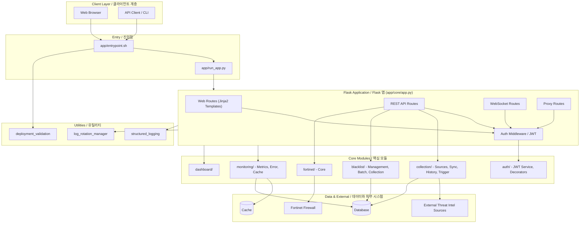
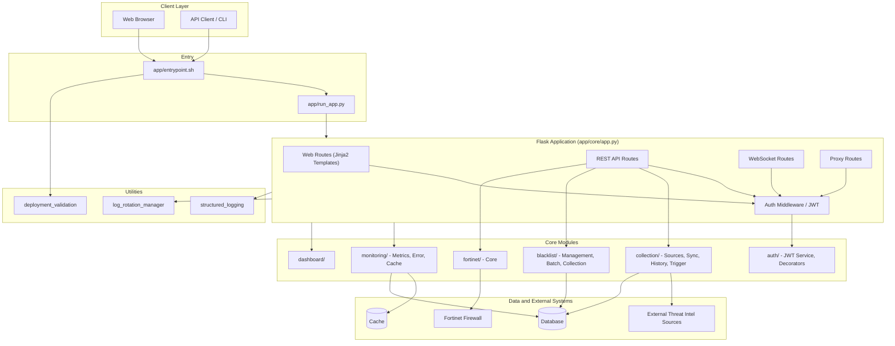

# Blacklist Service Management

> 통합 위협 인텔리전스 수집·동기화·블랙리스트 중앙 관리·Fortinet 자동 배포 플랫폼
> Unified threat-intelligence aggregation, centralized blacklist management, and Fortinet deployment platform.

---

## Table of Contents / 목차

- [한국어](#한국어)
  - [개요](#개요)
  - [주요 기능](#주요-기능)
  - [아키텍처](#아키텍처)
  - [빠른 시작](#빠른-시작)
  - [설정](#설정)
  - [명령어 레퍼런스](#명령어-레퍼런스)
  - [로컬 개발](#로컬-개발)
  - [테스트](#테스트)
  - [기여 가이드](#기여-가이드)
  - [라이선스](#라이선스)
- [English](#english)
  - [Overview](#overview)
  - [Features](#features)
  - [Architecture](#architecture)
  - [Quick Start](#quick-start)
  - [Configuration](#configuration)
  - [Commands Reference](#commands-reference)
  - [Local Development](#local-development)
  - [Testing](#testing)
  - [Contributing](#contributing)
  - [License](#license)
- [Repository Structure](#repository-structure)

---

## 한국어

### 개요

**Blacklist Service Management**는 다양한 외부 위협 인텔리전스 소스(악성 IP, 도메인 등)에서 데이터를 수집·동기화하고, 중앙 집중식 블랙리스트로 통합 관리한 뒤 Fortinet 방화벽 등 외부 보안 장비로 자동 배포하는 Python 기반 통합 관리 플랫폼입니다. 웹 UI(Jinja2), REST API, WebSocket을 통해 실시간 모니터링과 운영 자동화를 제공합니다.

핵심 사용자:

- **보안 운영팀(SOC)** — 위협 인텔리전스 통합·자동 차단
- **네트워크 엔지니어** — Fortinet 등 외부 장비로의 정책 배포
- **플랫폼 운영자** — 단일 콘솔에서 컬렉션·세션·통합·설정 관리

기본 서비스 포트는 `2542`이며(`PORT` 환경 변수로 변경 가능), 기본 실행 환경은 `development`입니다. 진입점은 `app/run_app.py`이며, 컨테이너 환경에서는 `app/entrypoint.sh`가 이를 호출합니다.

### 주요 기능

- **중앙 집중식 블랙리스트 관리** — IP/도메인 블랙리스트 CRUD, 일괄 처리(batch), 외부 컬렉션과 동기화, 변경 이력 추적
- **컬렉션 동기화** — 여러 위협 인텔리전스 소스에서 주기적/수동 데이터 수집, 히스토리 추적, 트리거 실행
- **Fortinet 연동** — Fortinet 장비 등록, 블랙리스트 항목의 정책/주소 객체 자동 배포
- **인증/인가** — JWT 기반 세션, 데코레이터·미들웨어 기반 라우트 보호, 역할 기반 접근 제어
- **모니터링** — 캐시/에러/시스템 메트릭 수집, 대시보드, 구조화 로깅, 로그 로테이션 관리
- **REST API + WebSocket** — 도메인별 모듈화된 API, 실시간 이벤트 스트림
- **프록시 라우트** — 외부 시스템 연동을 위한 중계 엔드포인트
- **웹 UI** — Jinja2 기반 페이지(인덱스, 컬렉션, 세션, 통합, 설정, 모니터링 대시보드)
- **데이터베이스 마이그레이션** — 내장 스키마 진화 및 검증 도구
- **Docker 기반 배포** — 개발/운영 환경 통합, 핫 리로드, 배포 검증 스크립트

### 아키텍처



핵심 설계 포인트:

- **단일 진입점** — `app/run_app.py`가 모든 요청을 받아 라우트/미들웨어로 디스패치
- **모듈형 라우트** — `app/core/routes/api/` 하위에 `collection/`, `blacklist/`, `fortinet/`, `monitoring/` 도메인별 블루프린트
- **계층형 인증** — `auth/jwt_service.py`가 토큰 발급·검증, `auth/decorators.py`가 라우트 단위 보호, `auth/middleware.py`가 글로벌 검사
- **관측 가능성** — `monitoring/` 모듈이 캐시/에러/시스템 메트릭을 수집하고 구조화 로그로 출력

### 빠른 시작

#### 사전 요구 사항

- Python 3.11+
- Docker / Docker Compose (운영 및 통합 실행 시)
- Make

#### 1) 저장소 클론

```bash
git clone <repository-url> blacklist-service
cd blacklist-service
```

#### 2) 환경 변수 준비

`deploy/.env` 파일을 프로젝트 표준에 맞춰 작성합니다. 주요 키는 [설정](#설정) 절을 참고하세요.

#### 3) Docker Compose로 실행

```bash
make setup-hooks
make dev
```

이후 브라우저에서 `http://localhost:2542` 로 접속합니다.

#### 4) 로컬에서 직접 실행

```bash
pip install -r app/requirements.txt
export PORT=2542
export APP_ENV=development
python app/run_app.py
```

### 설정

| 키 | 설명 | 기본값 |
| --- | --- | --- |
| `PORT` | HTTP 리스닝 포트 | `2542` |
| `APP_ENV` | 실행 환경 (`development` / `production`) | `development` |
| `JWT_SECRET` | JWT 서명 비밀키 | (필수) |
| `JWT_EXPIRES_IN` | 액세스 토큰 만료 시간(초) | `3600` |
| `DB_URL` | 데이터베이스 접속 URL | (필수) |
| `CACHE_URL` | 캐시(Redis 등) 접속 URL | (선택) |
| `LOG_LEVEL` | 로그 레벨 (`DEBUG`/`INFO`/`WARNING`/`ERROR`) | `INFO` |
| `LOG_DIR` | 구조화 로그·로테이션 대상 디렉터리 | `./logs` |
| `FORTINET_HOST` | Fortinet 관리 호스트 | (Fortinet 사용 시) |
| `FORTINET_TOKEN` | Fortinet API 토큰 | (Fortinet 사용 시) |

`deploy/.env`는 docker compose의 `--env-file`로 자동 로드되며, 컨테이너 내부에서는 `app/entrypoint.sh`가 필요한 마이그레이션과 헬스 체크를 수행합니다.

### 명령어 레퍼런스

`Makefile`은 개발/배포/검증/릴리스 작업을 단일 진입점으로 제공합니다.

| 명령어 | 설명 |
| --- | --- |
| `make help` | 사용 가능한 타깃과 설명 출력 |
| `make setup-hooks` | pre-commit, commit-msg, husky 훅 설치 |
| `make dev` | 개발 환경 기동(빌드 + 핫 리로드) |
| `make dev-no-build` | 기존 이미지로 빠르게 기동 |
| `make dev-prod` | 운영 유사 환경(오버라이드 없음) |
| `make dev-app` | 앱 서비스만 재기동(빠른 재시작) |
| `make build` | 컨테이너 이미지 빌드 |
| `make up` | 서비스 기동 |
| `make down` | 서비스 종료 |
| `make logs` | 컨테이너 로그 스트림 |
| `make restart` | 서비스 재기동 |
| `make health` | 헬스 체크 |
| `make test` | 테스트 스위트 실행 |
| `make deploy` | 배포 실행 |
| `make prod` | 운영 모드 기동 |
| `make clean` | 빌드 산출물/중간 컨테이너 정리 |
| `make release` | 릴리스 절차 실행 |
| `make release-dry` | 릴리스 드라이런 |
| `make verify` | 기본 검증 |
| `make verify-lint` | 린트(Ruff 등) 검증 |
| `make verify-types` | 타입 검사(mypy) 검증 |
| `make verify-secrets` | 시크릿 누출 검사 |
| `make verify-pre-commit` | pre-commit 훅 실행 |
| `make verify-quick` | 빠른 검증(부분 집합) |
| `make verify-all` | 전체 검증 |

### 로컬 개발

1. **가상환경** — `python -m venv .venv && source .venv/bin/activate`
2. **의존성 설치** — `pip install -r app/requirements.txt`
3. **프런트엔드 훅** — `cd frontend && npm install` (해당 디렉터리가 있을 경우)
4. **코드 스타일** — `ruff`(`pyproject.toml`의 `[tool.ruff]` 참조), `mypy`(`mypy.ini` 참조)
5. **커밋 메시지** — Conventional Commits 강제(`commitlint.config.js`, commit-msg 훅)
6. **핫 리로드** — `make dev`로 기동 시 코드 변경이 볼륨 마운트를 통해 자동 반영

### 테스트

- 프레임워크: **pytest** (`pyproject.toml`의 `[tool.pytest.ini_options]`)
- 테스트 경로: `tests/`
- 마커:
  - `unit` — 외부 의존성 없는 단위 테스트
  - `integration` — 외부 서비스가 필요한 통합 테스트
  - `security` — 보안 관련 테스트
  - `db` — 데이터베이스 테스트
  - `api` — API 엔드포인트 테스트

```bash
# 전체
make test

# 마커 필터
pytest -m unit
pytest -m "security or api"
```

### 기여 가이드

- 커밋 메시지는 Conventional Commits를 따릅니다.
- PR 전 `make verify-all` 통과를 권장합니다(린트/타입/시크릿/pre-commit).
- 이슈/리뷰/PR은 각 도메인 디렉터리의 `AGENTS.md`(있을 경우)와 저장소 루트 `CONTRIBUTING.md`의 정책에 따릅니다.

### 라이선스

저장소 `LICENSE` 파일을 따릅니다.

---

## English

### Overview

**Blacklist Service Management** is a Python-based platform that ingests threat intelligence from multiple external feeds, centralizes the data as a managed blacklist, and pushes the result to perimeter devices such as Fortinet firewalls. It exposes a Jinja2 web UI, a modular REST API, and WebSocket channels for real-time operations.

Primary users:

- **SOC / Security Operations** — unified threat intelligence and automated blocking
- **Network Engineers** — policy push to Fortinet (and similar) devices
- **Platform Operators** — single console for collections, sessions, integrations, and settings

The service listens on port `2542` by default (overridable via `PORT`). The default environment is `development`. The application entry point is `app/run_app.py`; in containers `app/entrypoint.sh` invokes it.

### Features

- **Centralized Blacklist Management** — IP/domain CRUD, batch operations, sync with external collections, change history
- **Collection & Sync** — scheduled and on-demand ingestion from multiple threat intel sources, history tracking, manual triggers
- **Fortinet Integration** — device registration, automatic address-object/policy deployment for blacklist entries
- **Authentication & Authorization** — JWT sessions, decorator/middleware-based route protection, role-based access control
- **Monitoring** — cache/error/system metrics, dashboards, structured logging, log-rotation management
- **REST API + WebSocket** — domain-modular API surface and real-time event stream
- **Proxy Routes** — relay endpoints for upstream integrations
- **Web UI** — Jinja2 pages: index, collection, collection logs, sessions, integrations, settings, monitoring dashboard
- **Database Migrations** — built-in schema evolution and validation
- **Containerized Deployment** — unified dev/prod with hot reload and deployment validation

### Architecture



Key design notes:

- **Single entry point** — `app/run_app.py` dispatches all requests through routes and middleware.
- **Modular routes** — domain-scoped blueprints under `app/core/routes/api/` (`collection/`, `blacklist/`, `fortinet/`, `monitoring/`).
- **Layered auth** — `auth/jwt_service.py` issues/validates tokens, `auth/decorators.py` guards individual routes, `auth/middleware.py` enforces global checks.
- **Observability** — `monitoring/` collects cache/error/system metrics and emits structured logs.

### Quick Start

#### Prerequisites

- Python 3.11+
- Docker / Docker Compose
- Make

#### 1) Clone

```bash
git clone <repository-url> blacklist-service
cd blacklist-service
```

#### 2) Configure environment

Populate `deploy/.env` (see [Configuration](#configuration) for the key list).

#### 3) Run with Docker Compose

```bash
make setup-hooks
make dev
```

Then open `http://localhost:2542`.

#### 4) Run locally without containers

```bash
pip install -r app/requirements.txt
export PORT=2542
export APP_ENV=development
python app/run_app.py
```

### Configuration

| Key | Description | Default |
| --- | --- | --- |
| `PORT` | HTTP listen port | `2542` |
| `APP_ENV` | Runtime environment (`development` / `production`) | `development` |
| `JWT_SECRET` | JWT signing secret | (required) |
| `JWT_EXPIRES_IN` | Access-token TTL (seconds) | `3600` |
| `DB_URL` | Database connection URL | (required) |
| `CACHE_URL` | Cache (e.g. Redis) connection URL | (optional) |
| `LOG_LEVEL` | Log level (`DEBUG` / `INFO` / `WARNING` / `ERROR`) | `INFO` |
| `LOG_DIR` | Directory used by structured logging and rotation | `./logs` |
| `FORTINET_HOST` | Fortinet management host | (required for Fortinet sync) |
| `FORTINET_TOKEN` | Fortinet API token | (required for Fortinet sync) |

`deploy/.env` is loaded by Docker Compose via `--env-file`. Inside the container, `app/entrypoint.sh` runs migrations and health checks before launching the app.

### Commands Reference

The `Makefile` is the single entry point for development, deployment, verification, and release tasks.

| Command | Description |
| --- | --- |
| `make help` | List all available targets with descriptions |
| `make setup-hooks` | Install pre-commit, commit-msg, and husky hooks |
| `make dev` | Start dev environment (build + hot reload) |
| `make dev-no-build` | Start with existing images (faster) |
| `make dev-prod` | Production-like environment (no override) |
| `make dev-app` | Restart only the app service (quick) |
| `make build` | Build container images |
| `make up` | Bring services up |
| `make down` | Bring services down |
| `make logs` | Stream container logs |
| `make restart` | Restart services |
| `make health` | Health check |
| `make test` | Run the test suite |
| `make deploy` | Run deployment |
| `make prod` | Start in production mode |
| `make clean` | Remove build artifacts and intermediate containers |
| `make release` | Execute release procedure |
| `make release-dry` | Dry-run release |
| `make verify` | Default verification |
| `make verify-lint` | Lint verification (Ruff) |
| `make verify-types` | Type-check verification (mypy) |
| `make verify-secrets` | Secret-leak scan |
| `make verify-pre-commit` | Run pre-commit hooks |
| `make verify-quick` | Quick verification (subset) |
| `make verify-all` | Full verification |

### Local Development

1. **Virtualenv** — `python -m venv .venv && source .venv/bin/activate`
2. **Install** — `pip install -r app/requirements.txt`
3. **Frontend hooks** — if a `frontend/` directory exists, run `cd frontend && npm install`
4. **Style** — `ruff` (see `[tool.ruff]` in `pyproject.toml`) and `mypy` (see `mypy.ini`)
5. **Commits** — Conventional Commits enforced by `commitlint.config.js` and the commit-msg hook
6. **Hot reload** — `make dev` mounts the source tree; changes are picked up automatically

### Testing

- Framework: **pytest** (see `[tool.pytest.ini_options]` in `pyproject.toml`)
- Test path: `tests/`
- Markers:
  - `unit` — pure unit tests (no external dependencies)
  - `integration` — requires running services
  - `security` — security-focused tests
  - `db` — database tests
  - `api` — API endpoint tests

```bash
# Full suite
make test

# Filtered
pytest -m unit
pytest -m "security or api"
```

### Contributing

- Commit messages follow Conventional Commits.
- Run `make verify-all` (lint, types, secrets, pre-commit) before opening a PR.
- Follow any domain-specific guidance in per-directory `AGENTS.md` files and the repository-wide `CONTRIBUTING.md`.

### License

See the `LICENSE` file in the repository root.

---

## Repository Structure

The actual top-level layout of this repository:

```
.
├── AGENTS.md                     # Repository-wide agent/contributor notes
├── CHANGELOG.md                  # Release history
├── CONTRIBUTING.md               # Contribution policy
├── LICENSE                       # License file
├── Makefile                      # Unified task runner
├── OWNERS                        # Code ownership
├── README.md                     # This file
├── VERSION                       # Current version
├── commitlint.config.js          # Conventional Commits config
├── mypy.ini                      # Type-checker configuration
├── pyproject.toml                # Python tooling (pytest, ruff)
└── app/                          # Application package
    ├── AGENTS.md
    ├── Dockerfile
    ├── __init__.py
    ├── deployment_validation.py
    ├── entrypoint.sh
    ├── requirements.txt
    ├── run_app.py
    ├── core/                     # Application core
    │   ├── AGENTS.md
    │   ├── __init__.py
    │   ├── app.py
    │   ├── auth_manager.py
    │   ├── config.py
    │   ├── dashboard.py
    │   ├── testing_app.py
    │   ├── auth/                 # JWT and route protection
    │   ├── monitoring/           # Metrics, errors, cache
    │   └── routes/               # Web, API, WebSocket, proxy
    │       └── api/              # Domain APIs
    │           ├── collection/
    │           ├── blacklist/
    │           ├── fortinet/
    │           └── monitoring/
    ├── templates/                # Jinja2 templates (web UI)
    │   ├── collection.html
    │   ├── collection_logs.html
    │   ├── index.html
    │   ├── integrations.html
    │   ├── sessions.html
    │   ├── settings.html
    │   └── monitoring/
    │       └── dashboard.html
    └── utils/                    # Utilities
        ├── log_rotation_manager.py
        └── structured_logging.py
```