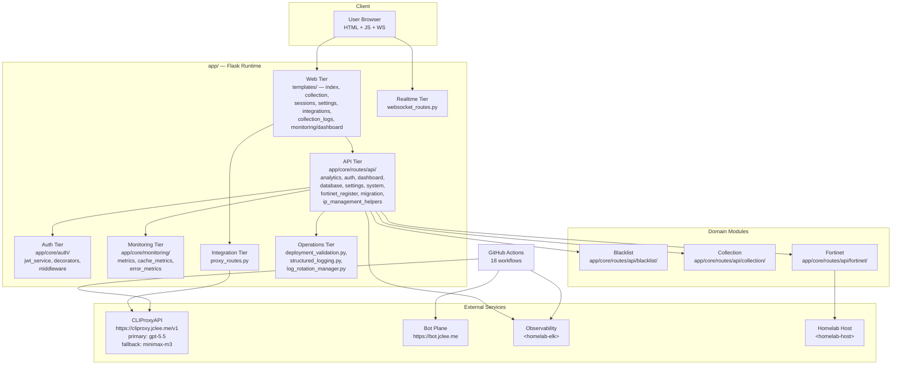
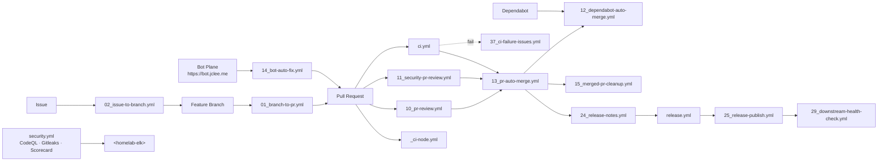
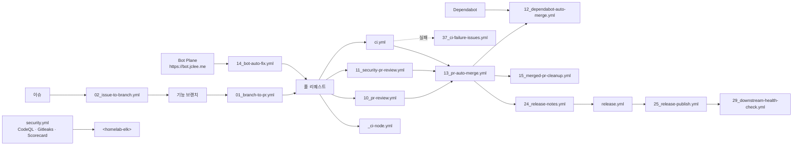

# Blacklist Service Management

[English](#english) | [한국어](#한국어)


> A Python 3.11 / Flask-based service that consolidates **blacklist collection**, **operational monitoring**, **role-based API access**, **Fortinet firewall integration**, and **AI-assisted automation** into a single, observability-first runtime.

---

<a id="english"></a>

## 🇺🇸 English

### 1. Overview

**Blacklist Service Management** is a Python 3.11 web application that consolidates blacklist collection, operational monitoring, role-based API access, Fortinet firewall integration, and AI-assisted automation behind a single Flask-based service.

The runtime under `app/` exposes a layered architecture:

- **Web tier** — Flask templates (`templates/index.html`, `templates/collection.html`, `templates/sessions.html`, `templates/settings.html`, `templates/integrations.html`, `templates/collection_logs.html`, `templates/monitoring/dashboard.html`).
- **API tier** — REST endpoints under `app/core/routes/api/` covering analytics, auth, dashboard, database, error metrics, settings, system, Fortinet registration, blacklist, collection, migration, and IP management helpers.
- **Realtime tier** — WebSocket routes for live dashboard updates (`app/core/routes/websocket_routes.py`).
- **Integration tier** — Proxy routes that bridge the service to **CLIProxyAPI** at `https://cliproxy.jclee.me/v1` for LLM access (primary model `gpt-5.5`, fallback `minimax-m3`).
- **Operations tier** — Structured logging (`app/utils/structured_logging.py`), log rotation (`app/utils/log_rotation_manager.py`), deployment validation (`app/deployment_validation.py`), and Docker packaging (`app/Dockerfile`, `app/entrypoint.sh`).

### 2. Features

| Area | Capability |
|------|-----------|
| Collection | Multi-source blacklist ingestion with history, credentials, scheduling, status, and trigger endpoints (`app/core/routes/api/collection/`). |
| Blacklist | Core, batch, collection, management, and system endpoints (`app/core/routes/api/blacklist/`). |
| Fortinet | Firewall registration and core integration (`app/core/routes/api/fortinet/`, `app/core/routes/api/fortinet_register.py`). |
| Auth | JWT service, decorators, and middleware with role-based API access (`app/core/auth/`). |
| Monitoring | Cache, error, and request metrics with Prometheus-friendly counters and a dedicated dashboard (`app/core/monitoring/`, `templates/monitoring/dashboard.html`). |
| Settings | Configurable system settings exposed via `settings_api.py` and the `settings.html` template. |
| Migrations | Schema migration routes (`migration.py`) and an `ip_management_helpers.py` module. |
| Realtime | WebSocket push for live UI updates. |
| AI | LLM-backed automation via the [qodo-ai/pr-agent](https://github.com/qodo-ai/pr-agent) review workflow and a CLIProxyAPI proxy. |
| Quality | Ruff (lint), mypy (types), pytest (unit / integration / security / db / api markers), pre-commit + Husky hooks. |
| Supply chain | Image builds, release notes, downstream health checks, CodeQL, Gitleaks, OpenSSF Scorecard. |

### 3. Architecture



### 4. Automation Inventory

The repository ships with **18 GitHub Actions workflows** under `.github/workflows/`. They are the canonical automation surface; no Go-based automation tools are vendored in-tree.

#### 4.1 Workflow files (on-disk, with prefixes)

| # | File | Purpose |
|---|------|---------|
| 1 | `01_branch-to-pr.yml` | Convert a feature branch into a pull request automatically. |
| 2 | `02_issue-to-branch.yml` | Convert a tracked issue into a feature branch. |
| 3 | `10_pr-review.yml` | AI-assisted PR review powered by [qodo-ai/pr-agent](https://github.com/qodo-ai/pr-agent). |
| 4 | `11_security-pr-review.yml` | Security-focused PR review (CodeQL, secret detection, dep review). |
| 5 | `12_dependabot-auto-merge.yml` | Auto-merge Dependabot PRs that pass CI and review. |
| 6 | `13_pr-auto-merge.yml` | Auto-merge PRs once checks, review, and labels are satisfied. |
| 7 | `14_bot-auto-fix.yml` | Bot-driven auto-fix commits (Ruff / formatting follow-ups). |
| 8 | `15_merged-pr-cleanup.yml` | Delete merged feature branches. |
| 9 | `19_issue-backfill.yml` | Backfill missing automation metadata on issues. |
| 10 | `24_release-notes.yml` | Draft and update release notes from merged PRs. |
| 11 | `25_release-publish.yml` | Publish the release (GitHub Release + image tags). |
| 12 | `29_downstream-health-check.yml` | Health-check downstream consumers of the service. |
| 13 | `37_ci-failure-issues.yml` | Open an issue automatically when CI fails. |
| 14 | `_ci-node.yml` | Reusable Node.js CI (lint + test, `workflow_call`). |
| 15 | `build-images.yml` | Build and push container images. |
| 16 | `ci.yml` | Primary CI: Ruff, mypy, pytest, Docker build smoke test. |
| 17 | `release.yml` | Release orchestrator (notes + publish + tag). |
| 18 | `security.yml` | CodeQL + Gitleaks + OpenSSF Scorecard scan. |

#### 4.2 Go automation tools

None. All automation is implemented declaratively in GitHub Actions. There are no in-tree Go binaries, no `_bot-scripts/` directory, and no CLI helpers to vendor locally.

#### 4.3 Automation topology



### 5. Quick Start

```bash
# 1. Clone
git clone <repo-url> blacklist-service
cd blacklist-service

# 2. Configure environment
cp deploy/.env.example deploy/.env   # then edit secrets and hostnames

# 3. Install git hooks (pre-commit + husky)
make setup-hooks

# 4. Bring the stack up (rebuilds changed images)
make dev

# 5. Verify
make health
```

The application becomes available at `http://localhost:2542` (override with `PORT`). The Flask app is started by `app/run_app.py` and the container entrypoint is `app/entrypoint.sh`.

### 6. Local Development

| Tool | Version | Role |
|------|---------|------|
| Python | 3.11 | Runtime (per `pyproject.toml` `target-version`). |
| Ruff | latest | Lint (`pyproject.toml` `[tool.ruff]`). |
| mypy | latest | Static types (`mypy.ini`). |
| pytest | latest | Test runner with markers: `unit`, `integration`, `security`, `db`, `api`. |
| pre-commit + Husky | latest | Local quality gate (Python + Frontend). |
| Docker / Compose | 24+ | Local stack via `deploy/docker-compose.yml`. |

#### Verifying your change

```bash
make verify-quick        # lint + types
make verify              # lint + types + secrets + pre-commit
make verify-all          # everything including tests
make test                # pytest with markers
```

### 7. Commands Reference

The `Makefile` exposes a self-documenting help target:

```bash
make help
```

| Command | What it does |
|---------|--------------|
| `make setup-hooks` | Install pre-commit, husky, and commit-msg hooks. |
| `make dev` | Start the dev stack with hot reload (rebuilds changed images). |
| `make dev-no-build` | Start the dev stack using existing images. |
| `make dev-prod` | Production-like stack (no override, no hot reload). |
| `make dev-app` | Restart only the `app` service. |
| `make up` / `make down` | Start / stop the stack. |
| `make logs` | Tail compose logs. |
| `make restart` | Restart the stack. |
| `make health` | Probe the running service. |
| `make test` | Run the pytest suite. |
| `make verify-lint` | Ruff only. |
| `make verify-types` | mypy only. |
| `make verify-secrets` | Gitleaks / secret scan. |
| `make verify-pre-commit` | pre-commit run --all-files. |
| `make verify-quick` | lint + types. |
| `make verify-all` | full verification matrix. |
| `make build` | Build images. |
| `make deploy` | Deploy the stack. |
| `make release` | Create a release (calls `release.yml` expectations). |
| `make release-dry` | Dry-run the release flow. |
| `make clean` | Remove build artifacts and stopped containers. |

### 8. Repository Layout

```text
.
├── AGENTS.md              # Project knowledge base / SSoT
├── CHANGELOG.md
├── CONTRIBUTING.md
├── LICENSE
├── Makefile
├── OWNERS
├── README.md
├── VERSION
├── commitlint.config.js
├── mypy.ini
├── pyproject.toml
└── app/
    ├── AGENTS.md
    ├── Dockerfile
    ├── entrypoint.sh
    ├── run_app.py
    ├── deployment_validation.py
    ├── requirements.txt
    ├── __init__.py
    ├── core/
    │   ├── app.py
    │   ├── auth_manager.py
    │   ├── config.py
    │   ├── dashboard.py
    │   ├── testing_app.py
    │   ├── auth/         (jwt_service, decorators, middleware)
    │   ├── monitoring/   (cache_metrics, error_metrics, metrics)
    │   └── routes/
    │       ├── api_routes.py
    │       ├── collection_routes_simple.py
    │       ├── proxy_routes.py
    │       ├── system_routes.py
    │       ├── web_routes.py
    │       ├── websocket_routes.py
    │       └── api/
    │           ├── analytics.py
    │           ├── auth_routes.py
    │           ├── core_api.py
    │           ├── dashboard_api.py
    │           ├── database_api.py
    │           ├── error_metrics_api.py
    │           ├── fortinet_register.py
    │           ├── ip_management_helpers.py
    │           ├── migration.py
    │           ├── settings_api.py
    │           ├── system_api.py
    │           ├── monitoring/  (metrics.py)
    │           ├── blacklist/   (batch, collection, core, management, system)
    │           ├── collection/  (config, credentials, history, sources, status, sync, trigger, utils)
    │           └── fortinet/    (core)
    ├── templates/
    │   ├── collection.html
    │   ├── collection_logs.html
    │   ├── index.html
    │   ├── integrations.html
    │   ├── sessions.html
    │   ├── settings.html
    │   └── monitoring/dashboard.html
    └── utils/
        ├── log_rotation_manager.py
        └── structured_logging.py
```

### 9. Contributing

1. Read `CONTRIBUTING.md` and `AGENTS.md` (root and per-package) for governance.
2. Create a branch from an issue (`02_issue-to-branch.yml`) or push a feature branch.
3. Use **Conventional Commits** (enforced by `commitlint.config.js` and the commit-msg hook).
4. Run `make verify-all` locally before pushing.
5. Open a PR; the bot will:
   - Label and size it (`10_pr-review.yml`).
   - Run AI + security review (`10_pr-review.yml`, `11_security-pr-review.yml`).
   - Execute CI (`ci.yml`, `_ci-node.yml`).
   - Auto-merge when green (`13_pr-auto-merge.yml`).
   - Auto-fix small issues (`14_bot-auto-fix.yml`).
6. CI failures auto-open an issue (`37_ci-failure-issues.yml`).
7. On merge, branches are cleaned (`15_merged-pr-cleanup.yml`) and the release pipeline runs (`24_release-notes.yml` → `release.yml` → `25_release-publish.yml`).

Code owners are listed in `OWNERS`.

---

<a id="한국어"></a>

## 🇰🇷 한국어

### 1. 개요

**Blacklist Service Management**는 블랙리스트 수집, 운영 모니터링, 역할 기반 API 접근, Fortinet 방화벽 통합, AI 기반 자동화를 단일 Flask 서비스로 통합한 Python 3.11 웹 애플리케이션입니다.

`app/` 하위 런타임은 다음과 같은 계층 구조로 구성됩니다.

- **Web 계층** — Flask 템플릿 (`templates/index.html`, `templates/collection.html`, `templates/sessions.html`, `templates/settings.html`, `templates/integrations.html`, `templates/collection_logs.html`, `templates/monitoring/dashboard.html`).
- **API 계층** — `app/core/routes/api/` 하위의 REST 엔드포인트: 분석, 인증, 대시보드, 데이터베이스, 에러 메트릭, 설정, 시스템, Fortinet 등록, 블랙리스트, 수집, 마이그레이션, IP 관리 헬퍼.
- **Realtime 계층** — 실시간 대시보드 갱신을 위한 WebSocket 라우트 (`app/core/routes/websocket_routes.py`).
- **Integration 계층** — LLM 접근을 위해 **CLIProxyAPI** (`https://cliproxy.jclee.me/v1`)로 브릿지하는 프록시 라우트(주 모델 `gpt-5.5`, 폴백 `minimax-m3`).
- **Operations 계층** — 구조화 로깅(`app/utils/structured_logging.py`), 로그 로테이션(`app/utils/log_rotation_manager.py`), 배포 검증(`app/deployment_validation.py`), Docker 패키징(`app/Dockerfile`, `app/entrypoint.sh`).

### 2. 주요 기능

| 영역 | 기능 |
|------|------|
| 수집(Collection) | 다중 소스 블랙리스트 수집 — history, credentials, scheduling, status, trigger 엔드포인트(`app/core/routes/api/collection/`). |
| 블랙리스트 | core, batch, collection, management, system 엔드포인트(`app/core/routes/api/blacklist/`). |
| Fortinet | 방화벽 등록 및 핵심 통합(`app/core/routes/api/fortinet/`, `app/core/routes/api/fortinet_register.py`). |
| 인증 | JWT 서비스, 데코레이터, 미들웨어 기반의 역할 기반 API 접근(`app/core/auth/`). |
| 모니터링 | 캐시/에러/요청 메트릭과 전용 대시보드(`app/core/monitoring/`, `templates/monitoring/dashboard.html`). |
| 설정 | `settings_api.py`와 `settings.html` 템플릿을 통한 시스템 설정. |
| 마이그레이션 | 스키마 마이그레이션 라우트(`migration.py`) 및 `ip_management_helpers.py`. |
| 실시간 | 라이브 UI 업데이트용 WebSocket 푸시. |
| AI | [qodo-ai/pr-agent](https://github.com/qodo-ai/pr-agent) 리뷰 워크플로 및 CLIProxyAPI 프록시를 통한 LLM 기반 자동화. |
| 품질 | Ruff(린트), mypy(타입), pytest(`unit`/`integration`/`security`/`db`/`api` 마커), pre-commit + Husky 훅. |
| 공급망 | 이미지 빌드, 릴리스 노트, 다운스트림 헬스 체크, CodeQL, Gitleaks, OpenSSF Scorecard. |

### 3. 아키텍처


### 4. 자동화 인벤토리

이 저장소는 `.github/workflows/` 하위에 **18개의 GitHub Actions 워크플로**를 제공합니다. 이는 자동화의 정식 진입점이며, 트리에 베ンダ링된 Go 기반 자동화 도구는 없습니다.

#### 4.1 워크플로 파일 (디스크 상의 실제 이름, 접두사 포함)

| # | 파일 | 목적 |
|---|------|------|
| 1 | `01_branch-to-pr.yml` | 기능 브랜치를 자동으로 PR로 변환합니다. |
| 2 | `02_issue-to-branch.yml` | 추적 중인 이슈를 기능 브랜치로 변환합니다. |
| 3 | `10_pr-review.yml` | [qodo-ai/pr-agent](https://github.com/qodo-ai/pr-agent) 기반의 AI PR 리뷰. |
| 4 | `11_security-pr-review.yml` | 보안 중심 PR 리뷰(CodeQL, 시크릿 검사, 의존성 검토). |
| 5 | `12_dependabot-auto-merge.yml` | CI와 리뷰를 통과한 Dependabot PR 자동 병합. |
| 6 | `13_pr-auto-merge.yml` | 검사, 리뷰, 라벨 조건 충족 시 PR 자동 병합. |
| 7 | `14_bot-auto-fix.yml` | 봇이 수행하는 자동 수정 커밋(Ruff, 포매팅 등). |
| 8 | `15_merged-pr-cleanup.yml` | 병합된 기능 브랜치를 삭제합니다. |
| 9 | `19_issue-backfill.yml` | 이슈에 누락된 자동화 메타데이터를 백필합니다. |
| 10 | `24_release-notes.yml` | 병합된 PR로부터 릴리스 노트를 초안 작성/갱신. |
| 11 | `25_release-publish.yml` | 릴리스 게시(GitHub Release + 이미지 태그). |
| 12 | `29_downstream-health-check.yml` | 서비스의 다운스트림 컨슈머 헬스 체크. |
| 13 | `37_ci-failure-issues.yml` | CI 실패 시 자동으로 이슈를 등록합니다. |
| 14 | `_ci-node.yml` | 재사용 가능한 Node.js CI(린트 + 테스트, `workflow_call`). |
| 15 | `build-images.yml` | 컨테이너 이미지를 빌드/푸시합니다. |
| 16 | `ci.yml` | 메인 CI: Ruff, mypy, pytest, Docker 빌드 스모크 테스트. |
| 17 | `release.yml` | 릴리스 오케스트레이터(노트 + 게시 + 태그). |
| 18 | `security.yml` | CodeQL + Gitleaks + OpenSSF Scorecard 스캔. |

#### 4.2 Go 자동화 도구

없습니다. 모든 자동화는 GitHub Actions로 선언적으로 구현되어 있습니다. 트리 내에 Go 바이너리, `_bot-scripts/` 같은 디렉터리, 로컬에서 베ンダ링할 CLI 헬퍼는 존재하지 않습니다.

#### 4.3 자동화 토폴로지



### 5. 빠른 시작

```bash
# 1. 클론
git clone <repo-url> blacklist-service
cd blacklist-service

# 2. 환경 설정
cp deploy/.env.example deploy/.env   # 시크릿과 호스트명 수정

# 3. Git 훅 설치 (pre-commit + husky)
make setup-hooks

# 4. 스택 기동 (변경된 이미지 재빌드)
make dev

# 5. 상태 확인
make health
```

애플리케이션은 `http://localhost:2542`에서 접근할 수 있습니다(`PORT`로 오버라이드). Flask 앱은 `app/run_app.py`로 기동되며 컨테이너 엔트리포인트는 `app/entrypoint.sh`입니다.

### 6. 로컬 개발

| 도구 | 버전 | 역할 |
|------|------|------|
| Python | 3.11 | 런타임(`pyproject.toml` `target-version`). |
| Ruff | 최신 | 린트(`pyproject.toml` `[tool.ruff]`). |
| mypy | 최신 | 정적 타입(`mypy.ini`). |
| pytest | 최신 | 테스트 러너, 마커: `unit`, `integration`, `security`, `db`, `api`. |
| pre-commit + Husky | 최신 | 로컬 품질 게이트(Python + 프론트엔드). |
| Docker / Compose | 24+ | `deploy/docker-compose.yml` 기반 로컬 스택. |

#### 변경 검증

```bash
make verify-quick        # lint + types
make verify              # lint + types + secrets + pre-commit
make verify-all          # 테스트 포함 전체 검증
make test                # 마커 포함 pytest 실행
```

### 7. 명령어 레퍼런스

`Makefile`은 자체 도움말 타겟을 제공합니다.

```bash
make help
```

| 명령어 | 설명 |
|--------|------|
| `make setup-hooks` | pre-commit, husky, commit-msg 훅 설치. |
| `make dev` | 핫 리로딩 개발 스택 기동(변경 이미지 재빌드). |
| `make dev-no-build` | 기존 이미지로 개발 스택 기동. |
| `make dev-prod` | 운영 유사 스택(오버라이드/핫 리로드 없음). |
| `make dev-app` | `app` 서비스만 재시작. |
| `make up` / `make down` | 스택 시작 / 중지. |
| `make logs` | compose 로그 테일. |
| `make restart` | 스택 재시작. |
| `make health` | 동작 중인 서비스 프로빙. |
| `make test` | pytest 스위트 실행. |
| `make verify-lint` | Ruff만 실행. |
| `make verify-types` | mypy만 실행. |
| `make verify-secrets` | Gitleaks / 시크릿 스캔. |
| `make verify-pre-commit` | `pre-commit run --all-files`. |
| `make verify-quick` | lint + types. |
| `make verify-all` | 전체 검증 매트릭스. |
| `make build` | 이미지 빌드. |
| `make deploy` | 스택 배포. |
| `make release` | 릴리스 생성(`release.yml` 기대치 호출). |
| `make release-dry` | 릴리스 흐름 드라이런. |
| `make clean` | 빌드 산출물 및 정지된 컨테이너 제거. |

### 8. 저장소 레이아웃

```text
.
├── AGENTS.md              # 프로젝트 지식 베이스 / SSoT
├── CHANGELOG.md
├── CONTRIBUTING.md
├── LICENSE
├── Makefile
├── OWNERS
├── README.md
├── VERSION
├── commitlint.config.js
├── mypy.ini
├── pyproject.toml
└── app/
    ├── AGENTS.md
    ├── Dockerfile
    ├── entrypoint.sh
    ├── run_app.py
    ├── deployment_validation.py
    ├── requirements.txt
    ├── __init__.py
    ├── core/
    │   ├── app.py
    │   ├── auth_manager.py
    │   ├── config.py
    │   ├── dashboard.py
    │   ├── testing_app.py
    │   ├── auth/         (jwt_service, decorators, middleware)
    │   ├── monitoring/   (cache_metrics, error_metrics, metrics)
    │   └── routes/
    │       ├── api_routes.py
    │       ├── collection_routes_simple.py
    │       ├── proxy_routes.py
    │       ├── system_routes.py
    │       ├── web_routes.py
    │       ├── websocket_routes.py
    │       └── api/
    │           ├── analytics.py
    │           ├── auth_routes.py
    │           ├── core_api.py
    │           ├── dashboard_api.py
    │           ├── database_api.py
    │           ├── error_metrics_api.py
    │           ├── fortinet_register.py
    │           ├── ip_management_helpers.py
    │           ├── migration.py
    │           ├── settings_api.py
    │           ├── system_api.py
    │           ├── monitoring/  (metrics.py)
    │           ├── blacklist/   (batch, collection, core, management, system)
    │           ├── collection/  (config, credentials, history, sources, status, sync, trigger, utils)
    │           └── fortinet/    (core)
    ├── templates/
    │   ├── collection.html
    │   ├── collection_logs.html
    │   ├── index.html
    │   ├── integrations.html
    │   ├── sessions.html
    │   ├── settings.html
    │   └── monitoring/dashboard.html
    └── utils/
        ├── log_rotation_manager.py
        └── structured_logging.py
```

### 9. 기여 가이드

1. 거버넌스는 루트 및 패키지별 `AGENTS.md`, `CONTRIBUTING.md`를 참고하세요.
2. 이슈에서 브랜치를 만들거나(`02_issue-to-branch.yml`), 기능 브랜치를 푸시합니다.
3. **Conventional Commits** 커밋 메시지를 사용하세요(`commitlint.config.js` 및 commit-msg 훅이 강제).
4. 푸시 전 로컬에서 `make verify-all`을 실행하세요.
5. PR을 열면 봇이 다음을 수행합니다.
   - 라벨링 및 크기 산정(`10_pr-review.yml`).
   - AI + 보안 리뷰(`10_pr-review.yml`, `11_security-pr-review.yml`).
   - CI 실행(`ci.yml`, `_ci-node.yml`).
   - 그린일 때 자동 병합(`13_pr-auto-merge.yml`).
   - 사소한 이슈 자동 수정(`14_bot-auto-fix.yml`).
6. CI 실패는 자동으로 이슈를 엽니다(`37_ci-failure-issues.yml`).
7. 병합 후 브랜치를 정리하고(`15_merged-pr-cleanup.yml`) 릴리스 파이프라인이 실행됩니다(`24_release-notes.yml` → `release.yml` → `25_release-publish.yml`).

코드 오너는 `OWNERS` 파일에 명시되어 있습니다.

---

## License

See [LICENSE](./LICENSE). The README-gen primary model is **gpt-5.5** (fallback: **minimax-m3** via CLIProxyAPI).