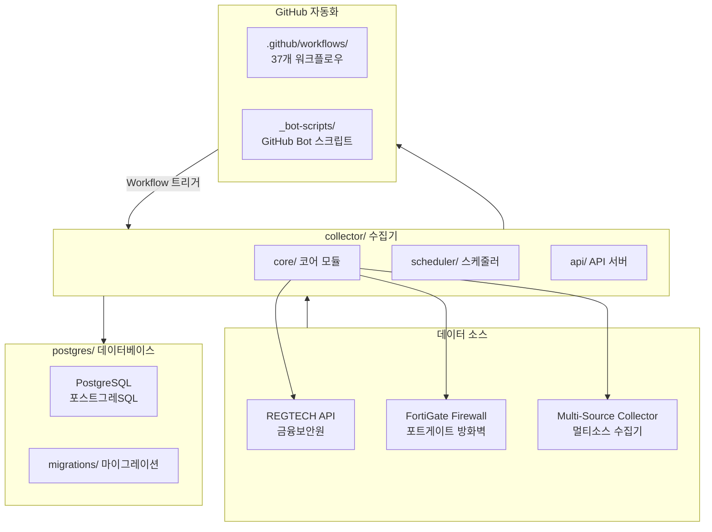
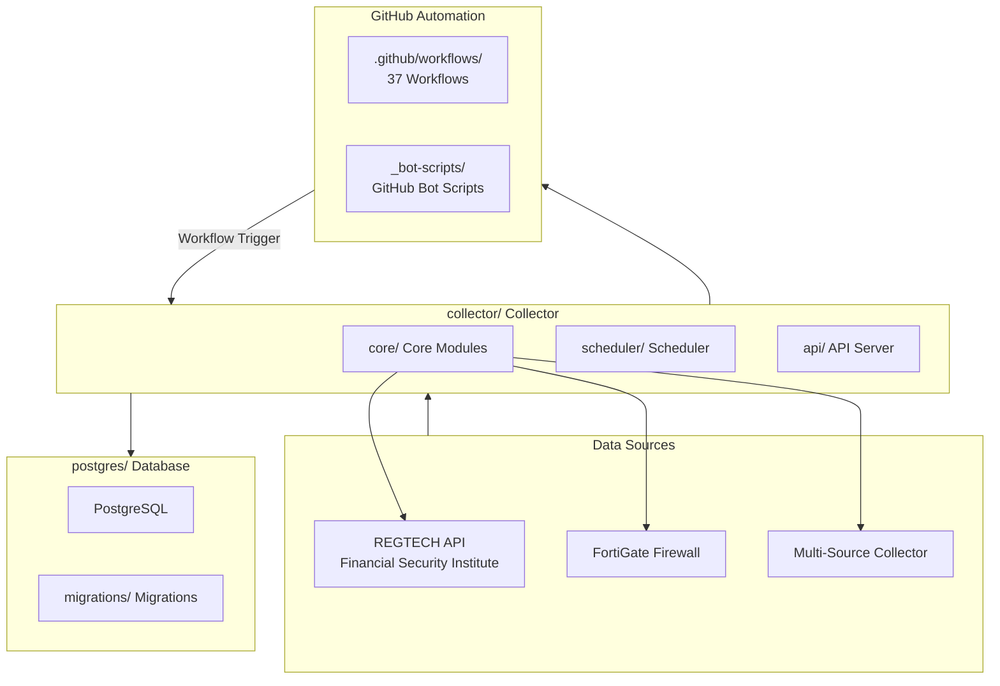

# Blacklist Service Management

Korean | [English](#english)

---

## Korean

### 개요

**Blacklist Service Management**는 금융보안원(REGTECH) 기반 IP 블랙리스트 데이터를 수집, 처리, 분산하는 위협 인텔리igence 플랫폼입니다. FortiGate 방화벽 및 Cloudflare WAF와 연동하여 악성 IP 목록을 자동 수집합니다.

### 주요 기능

- **멀티 소스 수집**: REGTECH, FortiGate, 다중 외부 소스로부터 IP 블랙리스트 자동 수집
- **데이터 품질 관리**: 수집된 데이터의 무결성 검증 및 중복 제거
- **자동 아카이브**: 일별/월별 백업 및 증분 아카이브 지원
- **정책 모니터링**: 블랙리스트 정책 변경 사항 실시간 추적
- **Rate Limiting**: API 호출 제한으로 서비스 안정성 확보
- **데이터베이스 관리**: PostgreSQL 기반 스토리지 및 마이그레이션
- **Docker 배포**: 컨테이너화된 애플리케이션 및 데이터베이스

### 아키텍처



### 프로젝트 구조

```
/
├── collector/              # 메인 데이터 수집기 (Python)
│   ├── core/              # 코어 모듈
│   │   ├── fortigate/     # FortiGate 수집기
│   │   ├── regtech/       # REGTECH 수집기
│   │   ├── multi_source/  # 멀티소스 수집기
│   │   └── database/      # 데이터베이스 레이어
│   ├── scheduler/         # 작업 스케줄러
│   └── api/               # API 서버
├── postgres/              # PostgreSQL 스키마 및 마이그레이션
│   ├── initdb/           # 초기화 스크립트
│   └── migrations/       # 스키마 마이그레이션
├── _bot-scripts/         # GitHub Bot 자동화 스크립트 (CI 체크아웃 경로)
└── Makefile              # 개발/배포 명령어
```

### 자동화 인벤토리

#### GitHub Actions 워크플로우 (37개)

| 카테고리 | 워크플로우 파일 | 설명 |
|---------|---------------|------|
| **PR 자동화** | `01_branch-to-pr.yml`, `02_issue-to-branch.yml`, `13_pr-auto-merge.yml`, `14_bot-auto-fix.yml`, `15_merged-pr-cleanup.yml` | PR 생성, 자동 병합, 정리 |
| **코드 보안** | `05_gitleaks.yml`, `06_codeql.yml`, `07_dependency-review.yml`, `08_scorecard.yml` | 시크릿 스캔, 코드 분석, 의존성 검토 |
| **CI/CD** | `03_pr-checks.yml`, `04_actionlint.yml`, `44_reusable-pr-checks.yml`, `ci.yml`, `standard-ci.yml`, `release.yml` | PR 검사, 린트, 빌드, 릴리스 |
| **자동 수리** | `12_dependabot-auto-merge.yml`, `60_ci-auto-heal.yml` | Dependabot 자동 병합, CI 복구 |
| **릴리스 관리** | `24_release-notes.yml`, `25_release-publish.yml`, `release.yml` | Release 노트 생성 및 게시 |
| **문서 동기화** | `20_readme-gen.yml`, `21_docs-sync.yml`, `42_reusable-docs-sync.yml` | README 자동 생성, 문서 동기화 |
| **이슈 관리** | `18_issue-management.yml`, `19_issue-backfill.yml`, `43_reusable-issue-management.yml` | 이슈 자동 라벨링, 수명 주기 관리 |
| **PR 리뷰** | `10_pr-review.yml`, `security/11_pr-review.yml` | AI-assisted PR 리뷰 (qodo-ai/pr-agent) |
| **배포** | `build-images.yml`, `release.yml` | Docker 이미지 빌드 및 배포 |
| **유지보수** | `09_semantic-pr.yml`, `29_downstream-health-check.yml`, `37_ci-failure-issues.yml` | 커밋 규칙, 헬스 체크, 실패 이슈 |

#### 재사용可能な 워크플로우

| 파일 | 설명 |
|-----|------|
| `_ci-node.yml` | Node.js CI 템플릿 |
| `_ci-notify-failure.yml` | CI 실패 알림 템플릿 |
| `_release-drafter.yml` | Release Drafter 템플릿 |
| `_stale.yml` | Stale 이슈 정리 템플릿 |
| `_welcome.yml` | 신규 기여자 환영 템플릿 |
| `_labeler.yml` | PR 라벨러 템플릿 |
| `_codex-pr-review.yml` | Codex PR 리뷰 템플릿 |

### 빠른 시작

#### 전제 조건

- Docker 및 Docker Compose
- Python 3.11+
- Git

#### 환경 설정

```bash
# 저장소 클론
git clone https://github.com/qws941/blacklist-service.git
cd blacklist-service

# Git hooks 설치
make setup-hooks

# 개발 환경 시작
make dev
```

#### Docker Compose로 실행

```bash
# PostgreSQL만 시작
make up

# 전체 스택 시작 (앱 + DB)
docker compose -f deploy/docker-compose.yml --env-file deploy/.env up -d

# 로그 확인
make logs
```

### 로컬 개발

#### 명령어 참고

| 명령어 | 설명 |
|-------|------|
| `make dev` | 핫 리로드 활성화 개발 환경 시작 |
| `make dev-no-build` | 기존 이미지로 재시작 (빠른 시작) |
| `make dev-prod` | 프로덕션 유사 환경 (핫 리로드 없음) |
| `make dev-app` | 앱 서비스만 재시작 |
| `make test` | 테스트 실행 |
| `make verify` | 전체 검증 (린트, 타입, 시크릿) |
| `make verify-lint` | Ruff 린트 확인 |
| `make verify-types` | Mypy 타입 확인 |
| `make verify-secrets` | Gitleaks 시크릿 스캔 |
| `make health` | 헬스 체크 실행 |
| `make release` | 릴리스 실행 |

#### 테스트 실행

```bash
# 전체 테스트
make test

# 특정 마커 테스트
pytest -m unit
pytest -m integration
pytest -m security

# 커버리지 포함
pytest --cov=collector --cov-report=html
```

### 린트 및 코드 품질

#### Ruff (린트)

```bash
# lint만 실행
ruff check .

# 자동 수정
ruff check --fix .

# 특정 파일
ruff check collector/core/fortigate/
```

#### MyPy (타입 체크)

```bash
# 타입 체크 실행
mypy collector/

# 특정 모듈
mypy collector/core/database/
```

### 배포

#### 환경 변수 설정

```bash
# deploy/.env 파일 생성
POSTGRES_DB=blacklist_service
POSTGRES_USER=admin
POSTGRES_PASSWORD=<your-password>
REGTECH_API_KEY=<your-api-key>
FORTIGATE_HOST=<homelab-host>
FORTIGATE_API_TOKEN=<your-token>
```

#### 프로덕션 배포

```bash
# 프로덕션 빌드
make deploy ENV=production

# 헬스 체크
make health
```

### 기여 가이드

1. **포크 생성**: 저장소를 포크합니다.
2. **브랜치 생성**: `git checkout -b feature/your-feature-name`
3. **커밋**: Conventional Commits 규칙을 따릅니다 (`fix:`, `feat:`, `docs:`, etc.)
4. **테스트**: `make test`로 테스트 실행
5. **검증**: `make verify-all`로 전체 검증
6. **PR 생성**: GitHub Actions 자동화 확인 후 PR 제출

#### 커밋 메시지 규칙

```
<type>(<scope>): <description>

fix(core): resolve rate limiting issue
feat(api): add new collection endpoint
docs(readme): update deployment instructions
```

### 라이선스

本 프로젝트는 MIT 라이선스 하에 배포됩니다. 자세한 내용은 [LICENSE](LICENSE) 파일을 참조하세요.

---

## English

### Overview

**Blacklist Service Management** is a threat intelligence platform built on Korea's Financial Security Institute (REGTECH) that collects, processes, and distributes IP blacklist data. It integrates with FortiGate firewalls and Cloudflare WAF to automatically collect malicious IP lists.

### Key Features

- **Multi-Source Collection**: Automatic IP blacklist collection from REGTECH, FortiGate, and multiple external sources
- **Data Quality Management**: Data integrity validation and deduplication
- **Automatic Archiving**: Daily/monthly backups and incremental archive support
- **Policy Monitoring**: Real-time tracking of blacklist policy changes
- **Rate Limiting**: API call limiting for service stability
- **Database Management**: PostgreSQL-based storage and migrations
- **Docker Deployment**: Containerized application and database

### Architecture



### Project Structure

```
/
├── collector/              # Main data collector (Python)
│   ├── core/              # Core modules
│   │   ├── fortigate/     # FortiGate collector
│   │   ├── regtech/       # REGTECH collector
│   │   ├── multi_source/  # Multi-source collector
│   │   └── database/      # Database layer
│   ├── scheduler/         # Job scheduler
│   └── api/               # API server
├── postgres/              # PostgreSQL schema and migrations
│   ├── initdb/           # Initialization scripts
│   └── migrations/       # Schema migrations
├── _bot-scripts/         # GitHub Bot automation scripts (CI checkout path)
└── Makefile              # Development/deployment commands
```

### Automation Inventory

#### GitHub Actions Workflows (37 total)

| Category | Workflow File | Description |
|---------|---------------|-------------|
| **PR Automation** | `01_branch-to-pr.yml`, `02_issue-to-branch.yml`, `13_pr-auto-merge.yml`, `14_bot-auto-fix.yml`, `15_merged-pr-cleanup.yml` | PR creation, auto-merge, cleanup |
| **Code Security** | `05_gitleaks.yml`, `06_codeql.yml`, `07_dependency-review.yml`, `08_scorecard.yml` | Secret scanning, code analysis, dependency review |
| **CI/CD** | `03_pr-checks.yml`, `04_actionlint.yml`, `44_reusable-pr-checks.yml`, `ci.yml`, `standard-ci.yml`, `release.yml` | PR checks, lint, build, release |
| **Auto Fix** | `12_dependabot-auto-merge.yml`, `60_ci-auto-heal.yml` | Dependabot auto-merge, CI healing |
| **Release Management** | `24_release-notes.yml`, `25_release-publish.yml`, `release.yml` | Release notes generation and publishing |
| **Docs Sync** | `20_readme-gen.yml`, `21_docs-sync.yml`, `42_reusable-docs-sync.yml` | README auto-generation, docs sync |
| **Issue Management** | `18_issue-management.yml`, `19_issue-backfill.yml`, `43_reusable-issue-management.yml` | Issue auto-labeling, lifecycle management |
| **PR Review** | `10_pr-review.yml`, `security/11_pr-review.yml` | AI-assisted PR review (qodo-ai/pr-agent) |
| **Deployment** | `build-images.yml`, `release.yml` | Docker image build and deploy |
| **Maintenance** | `09_semantic-pr.yml`, `29_downstream-health-check.yml`, `37_ci-failure-issues.yml` | Commit rules, health checks, failure issues |

#### Reusable Workflows

| File | Description |
|-----|-------------|
| `_ci-node.yml` | Node.js CI template |
| `_ci-notify-failure.yml` | CI failure notification template |
| `_release-drafter.yml` | Release Drafter template |
| `_stale.yml` | Stale issue cleanup template |
| `_welcome.yml` | New contributor welcome template |
| `_labeler.yml` | PR labeler template |
| `_codex-pr-review.yml` | Codex PR review template |

### Quick Start

#### Prerequisites

- Docker and Docker Compose
- Python 3.11+
- Git

#### Environment Setup

```bash
# Clone repository
git clone https://github.com/qws941/blacklist-service.git
cd blacklist-service

# Setup git hooks
make setup-hooks

# Start development environment
make dev
```

#### Run with Docker Compose

```bash
# Start PostgreSQL only
make up

# Start full stack (app + DB)
docker compose -f deploy/docker-compose.yml --env-file deploy/.env up -d

# View logs
make logs
```

### Local Development

#### Command Reference

| Command | Description |
|---------|-------------|
| `make dev` | Start development environment with hot reload |
| `make dev-no-build` | Restart with existing images (fast start) |
| `make dev-prod` | Production-like environment (no hot reload) |
| `make dev-app` | Restart app service only |
| `make test` | Run tests |
| `make verify` | Full verification (lint, types, secrets) |
| `make verify-lint` | Ruff lint check |
| `make verify-types` | MyPy type check |
| `make verify-secrets` | Gitleaks secret scan |
| `make health` | Run health check |
| `make release` | Execute release |

#### Running Tests

```bash
# All tests
make test

# Specific marker tests
pytest -m unit
pytest -m integration
pytest -m security

# With coverage
pytest --cov=collector --cov-report=html
```

### Lint and Code Quality

#### Ruff (Linting)

```bash
# Run lint only
ruff check .

# Auto-fix
ruff check --fix .

# Specific file
ruff check collector/core/fortigate/
```

#### MyPy (Type Checking)

```bash
# Run type check
mypy collector/

# Specific module
mypy collector/core/database/
```

### Deployment

#### Environment Variables

```bash
# Create deploy/.env file
POSTGRES_DB=blacklist_service
POSTGRES_USER=admin
POSTGRES_PASSWORD=<your-password>
REGTECH_API_KEY=<your-api-key>
FORTIGATE_HOST=<homelab-host>
FORTIGATE_API_TOKEN=<your-token>
```

#### Production Deployment

```bash
# Production build
make deploy ENV=production

# Health check
make health
```

### Contributing Guide

1. **Fork**: Fork the repository.
2. **Branch**: Create `git checkout -b feature/your-feature-name`
3. **Commit**: Follow Conventional Commits (`fix:`, `feat:`, `docs:`, etc.)
4. **Test**: Run `make test`
5. **Verify**: Run `make verify-all`
6. **PR**: Submit PR after GitHub Actions checks pass

#### Commit Message Rules

```
<type>(<scope>): <description>

fix(core): resolve rate limiting issue
feat(api): add new collection endpoint
docs(readme): update deployment instructions
```

### Configuration

#### pyproject.toml Settings

- **Test Framework**: pytest with markers (`unit`, `integration`, `security`, `db`, `api`)
- **Linter**: Ruff (line-length: 120, target-version: py311)
- **Type Checker**: MyPy

#### Test Markers

| Marker | Description |
|--------|-------------|
| `unit` | Unit tests (no external dependencies) |
| `integration` | Integration tests (require services) |
| `security` | Security-related tests |
| `db` | Database tests |
| `api` | API endpoint tests |

### External Integrations

| Service | Endpoint | Purpose |
|---------|----------|---------|
| REGTECH API | Internal | IP blacklist collection |
| FortiGate | `<homelab-host>` | Firewall log collection |
| ELK Stack | `<homelab-elk>` | Log ingestion |
| CLI Proxy API | `https://cliproxy.jclee.me/v1` | AI model routing |
| PR Agent | `bot.jclee.me` | AI-assisted code review |

### License

This project is distributed under the MIT License. See [LICENSE](LICENSE) for more information.

---

Korean | [English](#english)
