# Blacklist Service Management

> 통합 위협 인텔리전스 수집·동기화·블랙리스트 중앙 관리·Fortinet 자동 배포 플랫폼
> Unified threat-intelligence aggregation, centralized blacklist management, and Fortinet deployment platform.

---

## Table of Contents / 목차

- [한국어](#한국어)
  - [개요](#개요)
  - [주요 기능](#주요-기능)
  - [아키텍처](#아키텍처)
  - [빠른 시작](#빠른-시작)
  - [설정](#설정)
  - [명령어 레퍼런스](#명령어-레퍼런스)
  - [로컬 개발](#로컬-개발)
  - [테스트](#테스트)
  - [기여 가이드](#기여-가이드)
  - [라이선스](#라이선스)
- [English](#english)
  - [Overview](#overview)
  - [Features](#features)
  - [Architecture](#architecture)
  - [Quick Start](#quick-start)
  - [Configuration](#configuration)
  - [Commands Reference](#commands-reference)
  - [Local Development](#local-development)
  - [Testing](#testing)
  - [Contributing](#contributing)
  - [License](#license)
- [Repository Structure](#repository-structure)

---

## 한국어

### 개요

**Blacklist Service Management**는 다양한 외부 위협 인텔리전스 소스(악성 IP, 도메인 등)에서 데이터를 수집·동기화하고, 중앙 집중식 블랙리스트로 통합 관리한 뒤 Fortinet 방화벽 등 외부 보안 장비로 자동 배포하는 Python 기반 통합 관리 플랫폼입니다. 웹 UI(Jinja2), REST API, WebSocket을 통해 실시간 모니터링과 운영 자동화를 제공합니다.

핵심 사용자:

- **보안 운영팀(SOC)** — 위협 인텔리전스 통합·자동 차단
- **네트워크 엔지니어** — Fortinet 등 외부 장비로의 정책 배포
- **플랫폼 운영자** — 단일 콘솔에서 컬렉션·세션·통합·설정 관리

기본 서비스 포트는 `2542`이며(`PORT` 환경 변수로 변경 가능), 기본 실행 환경은 `development`입니다. 진입점은 `app/run_app.py`이며, 컨테이너 환경에서는 `app/entrypoint.sh`가 이를 호출합니다.

### 주요 기능

- **중앙 집중식 블랙리스트 관리** — IP/도메인 블랙리스트 CRUD, 일괄 처리(batch), 외부 컬렉션과 동기화, 변경 이력 추적
- **컬렉션 동기화** — 여러 위협 인텔리전스 소스에서 주기적/수동 데이터 수집, 히스토리 추적, 트리거 실행
- **Fortinet 연동** — Fortinet 장비 등록, 블랙리스트 항목의 정책/주소 객체 자동 배포
- **인증/인가** — JWT 기반 세션, 데코레이터·미들웨어 기반 라우트 보호, 역할 기반 접근 제어
- **모니터링** — 캐시/에러/시스템 메트릭 수집, 대시보드, 구조화 로깅, 로그 로테이션 관리
- **REST API + WebSocket** — 도메인별 모듈화된 API, 실시간 이벤트 스트림
- **프록시 라우트** — 외부 시스템 연동을 위한 중계 엔드포인트
- **웹 UI** — Jinja2 기반 페이지(인덱스, 컬렉션, 세션, 통합, 설정, 모니터링 대시보드)
- **데이터베이스 마이그레이션** — 내장 스키마 진화 및 검증 도구
- **Docker 기반 배포** — 개발/운영 환경 통합, 핫 리로드, 배포 검증 스크립트

### 아키텍처



### 빠른 시작

사전 요구사항:

- Python 3.11+
- Docker & Docker Compose (권장)
- Make
- Node.js (프론트엔드 훅 설치 시)

#### Docker Compose로 실행 (권장)

```bash
# 1. 저장소 클론
git clone <repository-url>
cd blacklist-service-management

# 2. 환경 변수 파일 준비
cp deploy/.env.example deploy/.env   # 예시가 없다면 deploy/.env를 직접 작성

# 3. 개발 환경 기동 (핫 리로드)
make dev

# 4. 서비스 확인
make health
```

기본 접속 정보:

- 웹 UI: `http://localhost:2542` (`PORT`로 변경 가능)
- API 베이스: `http://localhost:2542/api`
- WebSocket: `ws://localhost:2542/ws`

#### 로컬 Python으로 실행

```bash
python -m venv .venv
source .venv/bin/activate
pip install -r app/requirements.txt
python app/run_app.py
```

### 설정

주요 환경 변수는 `deploy/.env` 또는 컨테이너 환경에서 주입합니다.

| 변수 | 설명 | 기본값 |
| --- | --- | --- |
| `ENV` | 실행 환경 (`development` / `production`) | `development` |
| `PORT` | 서비스 HTTP 포트 | `2542` |
| `DATABASE_URL` | 데이터베이스 연결 문자열 | 로컬 기본값 사용 |
| `JWT_SECRET` | JWT 서명 키 (필수, 운영 환경) | - |
| `JWT_EXPIRES_IN` | 토큰 만료 시간(초) | 설정 파일 기준 |
| `FORTINET_API_URL` | Fortinet 관리 엔드포인트 | - |
| `FORTINET_API_TOKEN` | Fortinet API 토큰 | - |
| `LOG_LEVEL` | 로깅 레벨 (`DEBUG`/`INFO`/`WARNING`/`ERROR`) | `INFO` |
| `LOG_DIR` | 로그 파일 경로 | 설정 파일 기준 |
| `ALLOWED_ORIGINS` | CORS 허용 오리진(콤마 구분) | `*` (개발) |

> 운영 환경에서는 `JWT_SECRET`과 Fortinet 자격 증명을 반드시 안전한 시크릿 매니저(Vault, AWS Secrets Manager 등)로 주입하고, `ENV=production`으로 명시적으로 설정하세요.

### 명령어 레퍼런스

`make help`로 사용 가능한 전체 타겟을 확인할 수 있습니다. 주요 타겟은 다음과 같습니다.

| 명령어 | 설명 |
| --- | --- |
| `make help` | 사용 가능한 명령어 출력 |
| `make setup-hooks` | pre-commit, commitlint, husky 등 Git 훅 설치 |
| `make dev` | 핫 리로드 포함 개발 환경 기동 (변경 이미지 재빌드) |
| `make dev-no-build` | 기존 이미지로 빠르게 기동 |
| `make dev-prod` | 핫 리로드 없는 운영 유사 환경 |
| `make dev-app` | app 서비스만 재시작 |
| `make up` | docker compose 기동 |
| `make down` | docker compose 종료 |
| `make restart` | 서비스 재시작 |
| `make logs` | 컨테이너 로그 스트림 |
| `make build` | 이미지 빌드 |
| `make clean` | 컨테이너·볼륨·캐시 정리 |
| `make test` | pytest 실행 |
| `make health` | 헬스 체크 |
| `make deploy` | 배포 |
| `make prod` | 프로덕션 모드 기동 |
| `make release` | 릴리스 절차 실행 |
| `make release-dry` | 릴리스 드라이런 |
| `make verify` | 기본 검증 |
| `make verify-lint` | Ruff/ESLint 등 린트 검증 |
| `make verify-types` | mypy 타입 검증 |
| `make verify-secrets` | 시크릿 누출 검사 |
| `make verify-pre-commit` | pre-commit 훅 검증 |
| `make verify-quick` | 빠른 검증 스위트 |
| `make verify-all` | 전체 검증 스위트 |

### 로컬 개발

1. **저장소 클론 및 의존성 설치**

   ```bash
   git clone <repository-url>
   cd blacklist-service-management
   make setup-hooks
   ```

2. **환경 변수 설정**

   `deploy/.env` 파일을 생성하고 데이터베이스/JWT/Fortinet 자격 증명을 채워 넣습니다.

3. **개발 서버 기동**

   ```bash
   make dev   # 핫 리로드 활성화
   ```

4. **코드 스타일 및 타입 검사**

   ```bash
   make verify-lint   # Ruff (Python), ESLint/Prettier (frontend)
   make verify-types  # mypy
   ```

5. **커밋 규약**

   `commitlint.config.js`에 따라 Conventional Commits 규약을 사용합니다. `make setup-hooks`로 설치된 `commit-msg` 훅이 강제합니다.

### 테스트

테스트는 `pyproject.toml`의 pytest 설정에 따라 `tests/` 디렉터리에서 실행됩니다.

```bash
# 전체 테스트
make test

# 마커별 실행
pytest -m unit
pytest -m integration
pytest -m security
pytest -m db
pytest -m api
```

사용 가능한 마커:

- `unit` — 외부 의존성 없는 단위 테스트
- `integration` — 서비스가 필요한 통합 테스트
- `security` — 보안 관련 테스트
- `db` — 데이터베이스 테스트
- `api` — API 엔드포인트 테스트

`app/core/testing_app.py`는 테스트에서 사용할 수 있는 앱 팩토리/헬퍼를 제공합니다.

### 기여 가이드

1. 이슈를 먼저 등록하거나 기존 이슈를 확인합니다.
2. `CONTRIBUTING.md`의 절차와 코드 스타일(Ruff, mypy, Conventional Commits)을 따릅니다.
3. 기능 브랜치에서 작업 후 PR을 생성합니다. PR 설명에 변경 사유·테스트 결과·관련 이슈를 포함합니다.
4. 모든 PR은 `make verify-all`과 관련 테스트를 통과해야 합니다.
5. 리뷰어 지정은 `OWNERS` 파일을 참고합니다.

### 라이선스

본 저장소는 저장소 내 `LICENSE` 파일에 명시된 라이선스를 따릅니다. 자세한 내용은 `LICENSE`를 확인하세요.

---

## English

### Overview

**Blacklist Service Management** is a Python-based unified platform that aggregates threat-intelligence data from multiple external sources, centralizes blacklist management, and automatically deploys entries to external security devices such as Fortinet firewalls. It provides a Jinja2 web UI, a modular REST API, and WebSocket streams for real-time monitoring and operational automation.

Primary users:

- **SOC / Security operations** — unify threat intelligence and automate blocking
- **Network engineers** — deploy policies to Fortinet and similar devices
- **Platform operators** — manage collections, sessions, integrations, and settings from a single console

The default service port is `2542` (overridable via the `PORT` environment variable) and the default environment is `development`. The application entry point is `app/run_app.py`, invoked by `app/entrypoint.sh` inside containers.

### Features

- **Centralized blacklist management** — CRUD for IP/domain blacklists, batch operations, synchronization with external collections, change history tracking
- **Collection synchronization** — scheduled and on-demand ingestion from multiple threat-intel sources with history and trigger support
- **Fortinet integration** — device registration and automatic deployment of blacklist entries as policy/address objects
- **AuthN / AuthZ** — JWT-based sessions, decorator- and middleware-based route protection, role-based access control
- **Monitoring** — cache, error, and system metrics, dashboard, structured logging, log-rotation manager
- **REST API + WebSocket** — domain-modularized APIs with real-time event streams
- **Proxy routes** — relay endpoints for external system integrations
- **Web UI** — Jinja2 pages (index, collection, sessions, integrations, settings, monitoring dashboard)
- **Database migrations** — built-in schema evolution and validation
- **Docker-based deployment** — unified dev/prod environments, hot reload, deployment validation scripts

### Architecture

```mermaid
flowchart TB
    subgraph Client["Client Layer"]
        Browser["Web Browser<br/>(Jinja2 Templates)"]
        API["External API Clients"]
    end

    subgraph Web["Web & Real-time Layer"]
        WebRoutes["Web Routes<br/>(web_routes.py)"]
        ApiRoutes["REST API Routes<br/>(api_routes.py)"]
        WS["WebSocket<br/>(websocket_routes.py)"]
        Proxy["Proxy Routes<br/>(proxy_routes.py)"]
        System["System Routes<br/>(system_routes.py)"]
    end

    subgraph Auth["Auth Layer"]
        JWT["JWT Service<br/>(jwt_service.py)"]
        Decorators["Route Decorators<br/>(decorators.py)"]
        Middleware["Auth Middleware<br/>(middleware.py)"]
    end

    subgraph AppCore["Application Core"]
        AppFactory["App Factory<br/>(app.py)"]
        Config["Config<br/>(config.py)"]
        AuthMgr["Auth Manager<br/>(auth_manager.py)"]
        Dashboard["Dashboard<br/>(dashboard.py)"]
    end

    subgraph Services["Domain Services / API Modules"]
        Collection["Collection<br/>(api/collection/*)"]
        Blacklist["Blacklist<br/>(api/blacklist/*)"]
        Fortinet["Fortinet<br/>(api/fortinet/*)"]
        Settings["Settings &amp; System<br/>(settings_api.py, system_api.py)"]
        Analytics["Analytics &amp; Dashboard API"]
        DBApi["Database &amp; Migration API"]
    end

    subgraph Monitoring["Observability"]
        Metrics["Metrics<br/>(monitoring/metrics.py)"]
        CacheM["Cache Metrics<br/>(cache_metrics.py)"]
        ErrorM["Error Metrics<br/>(error_metrics.py)"]
        Logging["Structured Logging<br/>(utils/structured_logging.py)"]
        Rotation["Log Rotation<br/>(utils/log_rotation_manager.py)"]
    end

    subgraph External["External Systems"]
        DB["Database<br/>(PostgreSQL/SQLite)"]
        Sources["Threat Intel Sources"]
        FortiDev["Fortinet Devices"]
    end

    Browser --> WebRoutes
    API --> ApiRoutes
    API --> WS
    API --> Proxy

    WebRoutes --> AppFactory
    ApiRoutes --> AppFactory
    WS --> AppFactory
    Proxy --> AppFactory
    System --> AppFactory

    AppFactory --> Config
    AppFactory --> AuthMgr
    AuthMgr --> JWT
    AuthMgr --> Decorators
    AuthMgr --> Middleware

    ApiRoutes --> Collection
    ApiRoutes --> Blacklist
    ApiRoutes --> Fortinet
    ApiRoutes --> Settings
    ApiRoutes --> Analytics
    ApiRoutes --> DBApi

    Collection --> Sources
    Blacklist --> DB
    Blacklist --> Fortinet
    Fortinet --> FortiDev

    AppFactory --> Metrics
    Metrics --> CacheM
    Metrics --> ErrorM
    AppFactory --> Logging
    Logging --> Rotation
    Dashboard --> Metrics
    WebRoutes --> Dashboard
```


### Quick Start

Prerequisites:

- Python 3.11+
- Docker & Docker Compose (recommended)
- Make
- Node.js (for installing frontend hooks)

#### Run with Docker Compose (recommended)

```bash
# 1. Clone
git clone <repository-url>
cd blacklist-service-management

# 2. Prepare environment file
cp deploy/.env.example deploy/.env   # create deploy/.env manually if no example is shipped

# 3. Start development environment (hot reload)
make dev

# 4. Health check
make health
```

Default endpoints:

- Web UI: `http://localhost:2542` (port overridable via `PORT`)
- API base: `http://localhost:2542/api`
- WebSocket: `ws://localhost:2542/ws`

#### Run with local Python

```bash
python -m venv .venv
source .venv/bin/activate
pip install -r app/requirements.txt
python app/run_app.py
```

### Configuration

Primary configuration is supplied through `deploy/.env` (or container environment variables).

| Variable | Description | Default |
| --- | --- | --- |
| `ENV` | Runtime environment (`development` / `production`) | `development` |
| `PORT` | HTTP port | `2542` |
| `DATABASE_URL` | Database connection string | Local default |
| `JWT_SECRET` | JWT signing key (required in production) | - |
| `JWT_EXPIRES_IN` | Token expiration in seconds | From config file |
| `FORTINET_API_URL` | Fortinet management endpoint | - |
| `FORTINET_API_TOKEN` | Fortinet API token | - |
| `LOG_LEVEL` | Logging level (`DEBUG`/`INFO`/`WARNING`/`ERROR`) | `INFO` |
| `LOG_DIR` | Log file directory | From config file |
| `ALLOWED_ORIGINS` | Comma-separated CORS origins | `*` (development) |

> In production, inject `JWT_SECRET` and Fortinet credentials through a secret manager (Vault, AWS Secrets Manager, etc.) and set `ENV=production` explicitly.

### Commands Reference

Run `make help` to see all available targets. The most important targets are:

| Command | Description |
| --- | --- |
| `make help` | Show available commands |
| `make setup-hooks` | Install pre-commit, commitlint, and husky hooks |
| `make dev` | Start dev environment with hot reload (rebuilds changed images) |
| `make dev-no-build` | Start using existing images (faster) |
| `make dev-prod` | Production-like environment without hot reload |
| `make dev-app` | Restart only the app service |
| `make up` | Bring up docker compose stack |
| `make down` | Tear down docker compose stack |
| `make restart` | Restart services |
| `make logs` | Stream container logs |
| `make build` | Build images |
| `make clean` | Remove containers, volumes, and caches |
| `make test` | Run pytest |
| `make health` | Run health check |
| `make deploy` | Deploy |
| `make prod` | Start in production mode |
| `make release` | Run release workflow |
| `make release-dry` | Dry-run release |
| `make verify` | Basic verification |
| `make verify-lint` | Lint (Ruff for Python, ESLint/Prettier for frontend) |
| `make verify-types` | Type check (mypy) |
| `make verify-secrets` | Secret leak detection |
| `make verify-pre-commit` | pre-commit hook verification |
| `make verify-quick` | Quick verification suite |
| `make verify-all` | Full verification suite |

### Local Development

1. **Clone and install dependencies**

   ```bash
   git clone <repository-url>
   cd blacklist-service-management
   make setup-hooks
   ```

2. **Configure environment**

   Create `deploy/.env` and populate database, JWT, and Fortinet credentials.

3. **Start dev server**

   ```bash
   make dev   # hot reload enabled
   ```

4. **Code style and type checks**

   ```bash
   make verify-lint   # Ruff (Python), ESLint/Prettier (frontend)
   make verify-types  # mypy
   ```

5. **Commit conventions**

   Commits must follow Conventional Commits as enforced by `commitlint.config.js` and the `commit-msg` hook installed via `make setup-hooks`.

### Testing

Tests live in `tests/` and are executed according to the pytest configuration in `pyproject.toml`.

```bash
# Full suite
make test

# By marker
pytest -m unit
pytest -m integration
pytest -m security
pytest -m db
pytest -m api
```

Available markers:

- `unit` — unit tests with no external dependencies
- `integration` — integration tests requiring services
- `security` — security-related tests
- `db` — database tests
- `api` — API endpoint tests

`app/core/testing_app.py` provides an app factory and helpers for tests.

### Contributing

1. Open or pick an issue to track the work.
2. Follow the workflow and conventions in `CONTRIBUTING.md` (Ruff, mypy, Conventional Commits).
3. Work on a feature branch and open a PR. Include rationale, test results, and related issues in the description.
4. All PRs must pass `make verify-all` and the relevant test suites.
5. See `OWNERS` for review assignments.

### License

This project is licensed under the terms described in the `LICENSE` file at the repository root.

---

## Repository Structure

```text
.
├── AGENTS.md
├── CHANGELOG.md
├── CONTRIBUTING.md
├── LICENSE
├── Makefile
├── OWNERS
├── README.md
├── VERSION
├── commitlint.config.js
├── mypy.ini
├── pyproject.toml
└── app/
    ├── AGENTS.md
    ├── Dockerfile
    ├── __init__.py
    ├── deployment_validation.py
    ├── entrypoint.sh
    ├── requirements.txt
    ├── run_app.py
    ├── core/
    │   ├── AGENTS.md
    │   ├── __init__.py
    │   ├── app.py
    │   ├── auth_manager.py
    │   ├── config.py
    │   ├── dashboard.py
    │   ├── testing_app.py
    │   ├── auth/
    │   │   ├── AGENTS.md
    │   │   ├── __init__.py
    │   │   ├── decorators.py
    │   │   ├── jwt_service.py
    │   │   └── middleware.py
    │   ├── monitoring/
    │   │   ├── AGENTS.md
    │   │   ├── __init__.py
    │   │   ├── cache_metrics.py
    │   │   ├── error_metrics.py
    │   │   └── metrics.py
    │   └── routes/
    │       ├── AGENTS.md
    │       ├── api_routes.py
    │       ├── collection_routes_simple.py
    │       ├── proxy_routes.py
    │       ├── system_routes.py
    │       ├── web_routes.py
    │       ├── websocket_routes.py
    │       └── api/
    │           ├── AGENTS.md
    │           ├── __init__.py
    │           ├── analytics.py
    │           ├── auth_routes.py
    │           ├── core_api.py
    │           ├── dashboard_api.py
    │           ├── database_api.py
    │           ├── error_metrics_api.py
    │           ├── fortinet_register.py
    │           ├── ip_management_helpers.py
    │           ├── migration.py
    │           ├── settings_api.py
    │           ├── system_api.py
    │           ├── blacklist/   (AGENTS.md, __init__.py, batch.py, collection.py, core.py, management.py, system.py)
    │           ├── collection/  (AGENTS.md, __init__.py, config.py, credentials.py, history.py, sources.py, status.py, sync.py, trigger.py, utils.py)
    │           ├── fortinet/    (AGENTS.md, __init__.py, core.py)
    │           └── monitoring/  (__init__.py, metrics.py)
    ├── templates/
    │   ├── collection.html
    │   ├── collection_logs.html
    │   ├── index.html
    │   ├── integrations.html
    │   ├── sessions.html
    │   ├── settings.html
    │   └── monitoring/
    │       └── dashboard.html
    └── utils/
        ├── log_rotation_manager.py
        └── structured_logging.py
```