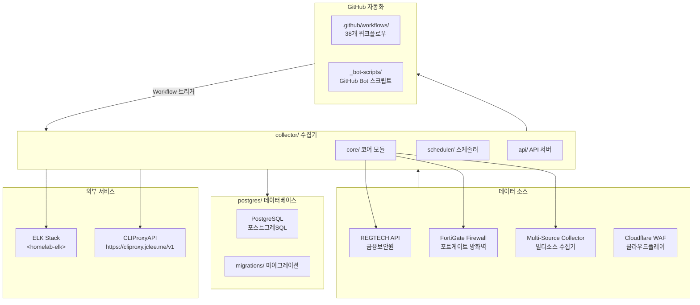
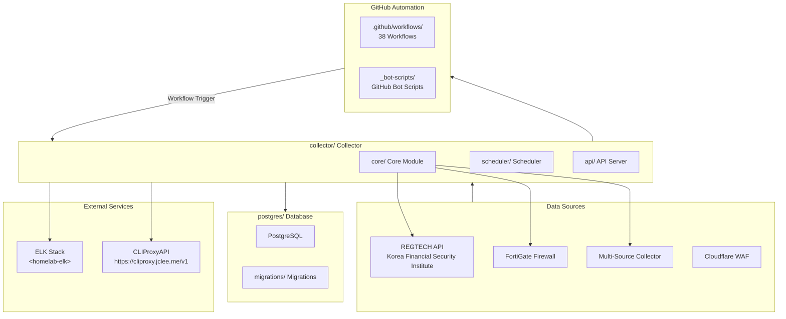

# Blacklist Service Management

Korean | [English](#english)

---

## Korean (한국어)

### 개요

**Blacklist Service Management**는 금융보안원(REGTECH) 기반 IP 블랙리스트 데이터를 수집, 처리, 분산하는 위협 인텔리전스 플랫폼입니다. FortiGate 방화벽 및 Cloudflare WAF와 연동하여 악성 IP 목록을 자동 수집합니다.

### 주요 기능

- **멀티 소스 수집**: REGTECH, FortiGate, 다중 외부 소스로부터 IP 블랙리스트 자동 수집
- **데이터 품질 관리**: 수집된 데이터의 무결성 검증 및 중복 제거
- **자동 아카이브**: 일별/월별 백업 및 증분 아카이브 지원
- **정책 모니터링**: 블랙리스트 정책 변경 사항 실시간 추적
- **Rate Limiting**: API 호출 제한으로 서비스 안정성 확보
- **데이터베이스 관리**: PostgreSQL 기반 스토리지 및 마이그레이션
- **Docker 배포**: 컨테이너화된 애플리케이션 및 데이터베이스

### 아키텍처



### 프로젝트 구조

```
/
├── collector/              # 메인 데이터 수집기 (Python)
│   ├── core/               # 코어 모듈
│   │   ├── fortigate/      # FortiGate 수집기
│   │   ├── regtech/        # REGTECH 수집기
│   │   ├── multi_source/  # 멀티소스 수집기
│   │   └── database/       # 데이터베이스 레이어
│   ├── scheduler/          # 작업 스케줄러
│   ├── api/                # REST API 서버
│   └── postgres/           # PostgreSQL 관련 파일
├── postgres/               # 데이터베이스
│   ├── initdb/             # 초기화 스크립트
│   └── migrations/         # 마이그레이션 파일
├── _bot-scripts/           # GitHub 자동화 봇 스크립트
├── Makefile                # 개발 명령어
├── pyproject.toml          # Python 프로젝트 설정
├── AGENTS.md               # 자동화 인벤토리
└── VERSION                 # 버전 정보
```

### 자동화 인벤토리

#### 워크플로우 (38개)

| 파일명 | 설명 |
|--------|------|
| `01_branch-to-pr.yml` | 브랜치에서 PR로 자동 변환 |
| `02_issue-to-branch.yml` | 이슈에서 브랜치 자동 생성 |
| `03_pr-checks.yml` | PR CI 검사 (재사용 가능) |
| `04_actionlint.yml` | GitHub Actions 워크플로우 검증 |
| `05_gitleaks.yml` | 시크릿 스캔 (재사용 가능) |
| `06_codeql.yml` | 정적 코드 분석 |
| `07_dependency-review.yml` | 취약점 의존성 검토 |
| `08_scorecard.yml` | 보안 점수 카드 |
| `09_semantic-pr.yml` | 시맨틱 PR 검증 |
| `10_pr-review.yml` | AI PR 리뷰 (qodo-ai/pr-agent) |
| `12_dependabot-auto-merge.yml` | Dependabot 자동 병합 |
| `13_pr-auto-merge.yml` | PR 자동 병합 |
| `14_bot-auto-fix.yml` | 봇 자동 수정 |
| `15_merged-pr-cleanup.yml` | 병합 후 정리 |
| `18_issue-management.yml` | 이슈 관리 (재사용 가능) |
| `19_issue-backfill.yml` | 이슈 메타데이터 백필 |
| `20_readme-gen.yml` | README 자동 생성 |
| `21_docs-sync.yml` | 문서 동기화 |
| `24_release-notes.yml` | 릴리스 노트 자동 생성 |
| `25_release-publish.yml` | 릴리스 게시 |
| `29_downstream-health-check.yml` | 하위 프로젝트 건강 상태 검사 |
| `37_ci-failure-issues.yml` | CI 실패 시 이슈 생성 |
| `42_reusable-docs-sync.yml` | 문서 동기화 재사용 워크플로우 |
| `43_reusable-issue-management.yml` | 이슈 관리 재사용 워크플로우 |
| `44_reusable-pr-checks.yml` | PR 검사 재사용 워크플로우 |
| `45_reusable-gitleaks.yml` | Gitleaks 재사용 워크플로우 |
| `60_ci-auto-heal.yml` | CI 자동 복구 |
| `91_issue-classification.yml` | 이슈 자동 분류 |
| `_ci-node.yml` | 공통 CI 노드 설정 |
| `auto-merge.yml` | 자동 병합 |
| `build-images.yml` | Docker 이미지 빌드 |
| `ci.yml` | 일반 CI 워크플로우 |
| `labeler.yml` | PR 라벨러 |
| `release.yml` | 릴리스 워크플로우 |
| `security.yml` | 보안 검사 |
| `standard-ci.yml` | 표준 CI 템플릿 |
| `welcome.yml` | 신규 기여자 환영 |
| `security/11_pr-review.yml` | 보안 PR 리뷰 |

#### 도구

| 도구 | 용도 |
|------|------|
| **qodo-ai/pr-agent** | AI 기반 PR 리뷰 및 자동 수정 |
| **gitleaks** | 시크릿/민감정보 스캔 |
| **actionlint** | GitHub Actions 워크플로우 검증 |
| **Ruff** | Python 린팅 |
| **mypy** | Python 타입 검사 |

### 빠른 시작

#### 필수 조건

- Docker 및 Docker Compose
- Git

#### 설치 및 실행

```bash
# 저장소 복제
git clone <repository-url>
cd <repository-name>

# 개발 환경 시작 (핫 리로드 포함)
make dev

# 서비스 상태 확인
make health
```

#### 개발 환경 옵션

```bash
make dev          # 핫 리로드 포함 개발 환경
make dev-no-build # 빌드 없이 기존 이미지 사용
make dev-prod     # 프로덕션 유사 환경 (핫 리로드 없음)
```

#### 명령어 레퍼런스

| 명령어 | 설명 |
|--------|------|
| `make help` | 사용 가능한 명령어 표시 |
| `make build` | Docker 이미지 빌드 |
| `make up` | 컨테이너 시작 |
| `make down` | 컨테이너 중지 |
| `make logs` | 컨테이너 로그 확인 |
| `make clean` | 리소스 정리 |
| `make test` | 테스트 실행 |
| `make deploy` | 배포 |
| `make health` | 상태 검사 |
| `make release` | 릴리스 실행 |
| `make release-dry` | 릴리스 드라이런 |
| `make verify` | 전체 검증 |
| `make verify-lint` | Ruff 린팅 |
| `make verify-types` | mypy 타입 검사 |
| `make verify-secrets` | Gitleaks 스캔 |
| `make verify-pre-commit` | Pre-commit hooks |
| `make verify-quick` | 빠른 검증 (린트 + 시크릿) |
| `make verify-all` | 전체 검증 실행 |
| `make setup-hooks` | Git hooks 설치 (pre-commit + husky) |
| `make restart` | 컨테이너 재시작 |

### 로컬 개발

#### Docker Compose 직접 사용

```bash
# 환경 설정 파일 편집
cp deploy/.env.example deploy/.env
# deploy/.env 파일의 환경 변수를 편집하세요

# 서비스 시작
docker compose -f deploy/docker-compose.yml --env-file deploy/.env --project-directory . up -d

# 로그 확인
docker compose -f deploy/docker-compose.yml --env-file deploy/.env --project-directory . logs -f

# 컨테이너 접속
docker compose -f deploy/docker-compose.yml --env-file deploy/.env --project-directory . exec collector bash

# Python REPL 접근
docker compose -f deploy/docker-compose.yml --env-file deploy/.env --project-directory . exec collector python

# 데이터베이스 접속
docker compose -f deploy/docker-compose.yml --env-file deploy/.env --project-directory . exec postgres psql -U postgres -d blacklist
```

#### 테스트 실행

```bash
# 전체 테스트
make test

# 특정 마커 테스트
pytest -m unit
pytest -m integration
pytest -m security
pytest -m db
pytest -m api

# 상세 출력
pytest -v --tb=short
```

#### 코드 품질 검증

```bash
# 전체 검증
make verify-all

# 개별 검증
make verify-lint      # Ruff 린팅
make verify-types    # mypy 타입 검사
make verify-secrets  # Gitleaks 시크릿 스캔
```

### 기여 가이드

기여를 환영합니다! 자세한 내용은 [CONTRIBUTING.md](CONTRIBUTING.md)를 참조하세요.

#### 기여 방법

1. 이슈를 생성하여 변경 사항을 논의하세요
2.(feature) 브랜치를 생성하세요
3. 변경 사항을 구현하세요
4. 테스트 및 검증을 실행하세요 (`make verify-all`)
5.conventional commits 규격으로 커밋하세요
6. PR을 제출하세요

#### 커밋 메시지 규격

```
<type>(<scope>): <description>

[optional body]

[optional footer]
```

**유효한 타입**: `feat`, `fix`, `docs`, `style`, `refactor`, `test`, `chore`

### 라이선스

이 프로젝트는 LICENSE 파일을 참조하세요.

---

## English

### Overview

**Blacklist Service Management** is a threat intelligence platform that collects, processes, and distributes IP blacklist data based on Korea's Financial Security Institute (REGTECH). It integrates with FortiGate firewalls and Cloudflare WAF to automatically gather malicious IP lists.

### Key Features

- **Multi-Source Collection**: Automatic IP blacklist collection from REGTECH, FortiGate, and multiple external sources
- **Data Quality Management**: Integrity validation and deduplication of collected data
- **Automatic Archiving**: Daily/monthly backups and incremental archive support
- **Policy Monitoring**: Real-time tracking of blacklist policy changes
- **Rate Limiting**: API call limiting to ensure service stability
- **Database Management**: PostgreSQL-based storage and migrations
- **Docker Deployment**: Containerized application and database

### Architecture



### Project Structure

```
/
├── collector/              # Main data collector (Python)
│   ├── core/               # Core modules
│   │   ├── fortigate/      # FortiGate collector
│   │   ├── regtech/        # REGTECH collector
│   │   ├── multi_source/  # Multi-source collector
│   │   └── database/       # Database layer
│   ├── scheduler/          # Job scheduler
│   ├── api/                # REST API server
│   └── postgres/           # PostgreSQL related files
├── postgres/               # Database
│   ├── initdb/             # Initialization scripts
│   └── migrations/         # Migration files
├── _bot-scripts/           # GitHub automation bot scripts
├── Makefile                # Development commands
├── pyproject.toml          # Python project configuration
├── AGENTS.md               # Automation inventory
└── VERSION                 # Version information
```

### Automation Inventory

#### Workflows (38 total)

| File | Description |
|------|-------------|
| `01_branch-to-pr.yml` | Auto-convert branch to PR |
| `02_issue-to-branch.yml` | Auto-create branch from issue |
| `03_pr-checks.yml` | PR CI checks (reusable) |
| `04_actionlint.yml` | GitHub Actions workflow validation |
| `05_gitleaks.yml` | Secret scanning (reusable) |
| `06_codeql.yml` | Static code analysis |
| `07_dependency-review.yml` | Vulnerable dependency review |
| `08_scorecard.yml` | Security scorecard |
| `09_semantic-pr.yml` | Semantic PR validation |
| `10_pr-review.yml` | AI PR review (qodo-ai/pr-agent) |
| `12_dependabot-auto-merge.yml` | Dependabot auto-merge |
| `13_pr-auto-merge.yml` | PR auto-merge |
| `14_bot-auto-fix.yml` | Bot auto-fix |
| `15_merged-pr-cleanup.yml` | Post-merge cleanup |
| `18_issue-management.yml` | Issue management (reusable) |
| `19_issue-backfill.yml` | Issue metadata backfill |
| `20_readme-gen.yml` | Auto-generate README |
| `21_docs-sync.yml` | Documentation sync |
| `24_release-notes.yml` | Auto-generate release notes |
| `25_release-publish.yml` | Release publishing |
| `29_downstream-health-check.yml` | Downstream project health check |
| `37_ci-failure-issues.yml` | Create issue on CI failure |
| `42_reusable-docs-sync.yml` | Reusable docs sync workflow |
| `43_reusable-issue-management.yml` | Reusable issue management workflow |
| `44_reusable-pr-checks.yml` | Reusable PR checks workflow |
| `45_reusable-gitleaks.yml` | Reusable gitleaks workflow |
| `60_ci-auto-heal.yml` | CI auto-heal |
| `91_issue-classification.yml` | Auto-classify issues |
| `_ci-node.yml` | Common CI node configuration |
| `auto-merge.yml` | Auto-merge |
| `build-images.yml` | Docker image build |
| `ci.yml` | General CI workflow |
| `labeler.yml` | PR labeler |
| `release.yml` | Release workflow |
| `security.yml` | Security scanning |
| `standard-ci.yml` | Standard CI template |
| `welcome.yml` | New contributor welcome |
| `security/11_pr-review.yml` | Security PR review |

#### Tools

| Tool | Purpose |
|------|---------|
| **qodo-ai/pr-agent** | AI-powered PR review and auto-fix |
| **gitleaks** | Secret/sensitive information scanning |
| **actionlint** | GitHub Actions workflow validation |
| **Ruff** | Python linting |
| **mypy** | Python type checking |

### Quick Start

#### Prerequisites

- Docker and Docker Compose
- Git

#### Installation and Running

```bash
# Clone the repository
git clone <repository-url>
cd <repository-name>

# Start development environment (with hot reload)
make dev

# Check service status
make health
```

#### Development Environment Options

```bash
make dev          # Development environment with hot reload
make dev-no-build # Use existing images without rebuilding
make dev-prod     # Production-like environment (no hot reload)
```

#### Commands Reference

| Command | Description |
|---------|-------------|
| `make help` | Show available commands |
| `make build` | Build Docker images |
| `make up` | Start containers |
| `make down` | Stop containers |
| `make logs` | View container logs |
| `make clean` | Clean up resources |
| `make test` | Run tests |
| `make deploy` | Deploy |
| `make health` | Health check |
| `make release` | Execute release |
| `make release-dry` | Dry run release |
| `make verify` | Full verification |
| `make verify-lint` | Ruff linting |
| `make verify-types` | mypy type checking |
| `make verify-secrets` | Gitleaks scanning |
| `make verify-pre-commit` | Pre-commit hooks |
| `make verify-quick` | Quick verification (lint + secrets) |
| `make verify-all` | Run all verifications |
| `make setup-hooks` | Install Git hooks (pre-commit + husky) |
| `make restart` | Restart containers |

### Local Development

#### Using Docker Compose Directly

```bash
# Edit environment configuration
cp deploy/.env.example deploy/.env
# Edit environment variables in deploy/.env

# Start services
docker compose -f deploy/docker-compose.yml --env-file deploy/.env --project-directory . up -d

# View logs
docker compose -f deploy/docker-compose.yml --env-file deploy/.env --project-directory . logs -f

# Access container
docker compose -f deploy/docker-compose.yml --env-file deploy/.env --project-directory . exec collector bash

# Access Python REPL
docker compose -f deploy/docker-compose.yml --env-file deploy/.env --project-directory . exec collector python

# Access database
docker compose -f deploy/docker-compose.yml --env-file deploy/.env --project-directory . exec postgres psql -U postgres -d blacklist
```

#### Running Tests

```bash
# Run all tests
make test

# Run specific marker tests
pytest -m unit
pytest -m integration
pytest -m security
pytest -m db
pytest -m api

# Verbose output
pytest -v --tb=short
```

#### Code Quality Verification

```bash
# Full verification
make verify-all

# Individual checks
make verify-lint      # Ruff linting
make verify-types    # mypy type checking
make verify-secrets  # Gitleaks secret scanning
```

### Contribution Guide

Contributions are welcome! See [CONTRIBUTING.md](CONTRIBUTING.md) for details.

#### How to Contribute

1. Create an issue to discuss the change
2. Create a feature branch
3. Implement your changes
4. Run tests and verifications (`make verify-all`)
5. Commit using conventional commits format
6. Submit a pull request

#### Commit Message Format

```
<type>(<scope>): <description>

[optional body]

[optional footer]
```

**Valid types**: `feat`, `fix`, `docs`, `style`, `refactor`, `test`, `chore`

### License

See LICENSE file for details.
