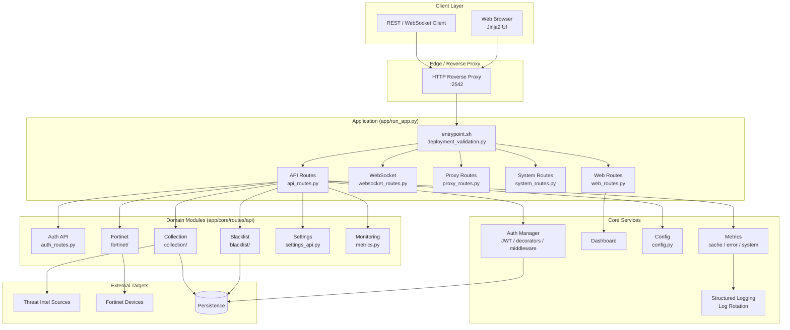

# Blacklist Service Management

> 통합 위협 인텔리전스 수집·동기화·블랙리스트 중앙 관리·Fortinet 자동 배포 플랫폼
> Unified threat-intelligence aggregation, centralized blacklist management, and Fortinet deployment platform.

---

## Table of Contents / 목차

- [한국어](#한국어)
  - [개요](#개요)
  - [주요 기능](#주요-기능)
  - [아키텍처](#아키텍처)
  - [빠른 시작](#빠른-시작)
  - [설정](#설정)
  - [명령어 레퍼런스](#명령어-레퍼런스)
  - [로컬 개발](#로컬-개발)
  - [테스트](#테스트)
  - [기여 가이드](#기여-가이드)
  - [라이선스](#라이선스)
- [English](#english)
  - [Overview](#overview)
  - [Features](#features)
  - [Architecture](#architecture-1)
  - [Quick Start](#quick-start-1)
  - [Configuration](#configuration-1)
  - [Commands Reference](#commands-reference-1)
  - [Local Development](#local-development-1)
  - [Testing](#testing-1)
  - [Contributing](#contributing-1)
  - [License](#license-1)
- [Repository Structure](#repository-structure)

---

## 한국어

### 개요

**Blacklist Service Management**는 다양한 외부 위협 인텔리전스 소스(악성 IP, 도메인, URL 등)에서 데이터를 수집·동기화하고, 중앙 집중식 블랙리스트로 통합 관리한 뒤 Fortinet 방화벽 등 외부 보안 장비로 자동 배포하는 Python 기반 통합 관리 플랫폼입니다. 웹 UI(Jinja2), REST API, WebSocket을 통해 실시간 모니터링과 운영 자동화를 제공합니다.

핵심 사용자:

- **보안 운영팀(SOC)** — 위협 인텔리전스 통합·자동 차단
- **네트워크 엔지니어** — Fortinet 등 외부 장비로의 정책/주소 객체 자동 배포
- **플랫폼 운영자** — 단일 콘솔에서 컬렉션·세션·통합·설정·모니터링 관리

기본 서비스 포트는 `2542`이며(`PORT` 환경 변수로 변경 가능), 기본 실행 환경은 `development`입니다. 진입점은 `app/run_app.py`이며, 컨테이너 환경에서는 `app/entrypoint.sh`가 이를 호출합니다. 배포 전 검증은 `app/deployment_validation.py`로 수행합니다.

### 주요 기능

- **중앙 집중식 블랙리스트 관리** — IP/도메인 블랙리스트 CRUD, 일괄 처리(batch), 외부 컬렉션과 동기화, 변경 이력 추적 (`app/core/routes/api/blacklist/`)
- **컬렉션 동기화** — 여러 위협 인텔리전스 소스에서 주기적/수동 데이터 수집, 히스토리 추적, 트리거 실행 (`app/core/routes/api/collection/`)
- **Fortinet 연동** — Fortinet 장비 등록(`fortinet_register.py`), 블랙리스트 항목의 정책/주소 객체 자동 배포(`fortinet/core.py`)
- **인증/인가** — JWT 기반 세션, 데코레이터·미들웨어 기반 라우트 보호, 역할 기반 접근 제어 (`app/core/auth/`)
- **모니터링/관측** — 캐시/에러/시스템 메트릭 수집, 대시보드, 구조화 로깅, 로그 로테이션 관리 (`app/core/monitoring/`, `app/utils/`)
- **REST API + WebSocket** — 도메인별 모듈화된 API, 실시간 이벤트 스트림 (`app/core/routes/api/`, `app/core/routes/websocket_routes.py`)
- **웹 UI** — Jinja2 기반 페이지(컬렉션/로그/인덱스/통합/세션/설정/모니터링 대시보드) (`app/templates/`)
- **프록시 라우트** — 외부 위협 인텔리전스 소스·API 게이트웨이로의 프록시 (`app/core/routes/proxy_routes.py`)
- **마이그레이션 도구** — DB 스키마 및 데이터 마이그레이션 헬퍼 (`app/core/routes/api/migration.py`)
- **배포 검증** — 컨테이너 기동 전 설정/의존성 사전 검증 (`app/deployment_validation.py`)

### 아키텍처

애플리케이션은 계층형 모놀리식 구조로, 프레젠테이션(Jinja2 템플릿 + WebSocket), API 라우트, 인증/인가 미들웨어, 비즈니스 모듈(컬렉션/블랙리스트/Fortinet), 모니터링, 영속 계층으로 분리됩니다. Docker Compose로 컨테이너화된 통합 환경을 제공하며, `Makefile`이 빌드·기동·테스트·배포·릴리스를 단일 진입점으로 노출합니다.



핵심 디렉터리 책임:

| 경로 | 책임 |
|---|---|
| `app/run_app.py` | FastAPI/애플리케이션 부트스트랩 |
| `app/entrypoint.sh` | 컨테이너 시작 스크립트(검증 → 마이그레이션 → 기동) |
| `app/deployment_validation.py` | 배포 전 사전 검증 |
| `app/core/app.py` | 앱 팩토리/미들웨어 와이어업 |
| `app/core/config.py` | 환경 변수 기반 설정 로더 |
| `app/core/auth/` | JWT 서비스, 데코레이터, 미들웨어 |
| `app/core/monitoring/` | 캐시/에러/시스템 메트릭 수집기 |
| `app/core/routes/` | 웹/API/프록시/WebSocket/시스템 라우트 |
| `app/core/routes/api/` | 도메인별 모듈형 REST API |
| `app/templates/` | Jinja2 HTML 템플릿 |
| `app/utils/` | 구조화 로깅, 로그 로테이션 관리 |

### 빠른 시작

요구 사항:

- Python 3.11+
- Docker / Docker Compose(권장)
- GNU Make

컨테이너 기반(권장):

```bash
# 1) 저장소 클론
git clone <repository-url> blacklist-service
cd blacklist-service

# 2) 환경 변수 파일 준비
cp deploy/.env.example deploy/.env  # 존재하지 않을 경우 deploy/.env 직접 작성

# 3) 개발 환경 기동 (핫 리로드)
make dev

# 4) 브라우저 접속
open http://localhost:2542
```

로컬 Python 실행:

```bash
# 의존성 설치
python -m venv .venv
source .venv/bin/activate
pip install -r app/requirements.txt

# 앱 실행
python app/run_app.py
```

### 설정

애플리케이션은 `deploy/.env` 파일과 다음 환경 변수를 통해 설정합니다.

| 변수 | 설명 | 기본값 |
|---|---|---|
| `ENV` | 실행 환경(`development`/`production`) | `development` |
| `PORT` | 서비스 리슨 포트 | `2542` |
| `COMPOSE_FILE` | Docker Compose 파일 경로 | `deploy/docker-compose.yml` |
| (DB / 인증 / Fortinet 자격증명 등) | 도메인별 환경 변수 | `.env` 참조 |

`pyproject.toml`의 주요 설정:

- Python 타깃: 3.11
- Ruff 라인 길이: 120
- Pytest 경로: `tests/` (Python 경로: `app/`)
- Pytest 마커: `unit`, `integration`, `security`, `db`, `api`

### 명령어 레퍼런스

`Makefile`은 단일 진입점으로 다음 타겟을 제공합니다.

| 명령어 | 설명 |
|---|---|
| `make help` | 사용 가능한 명령어 목록 출력 |
| `make setup-hooks` | Git 훅 설치 (pre-commit, commit-msg, husky) |
| `make dev` | 개발 환경 기동 (이미지 리빌드 + 핫 리로드) |
| `make dev-no-build` | 기존 이미지로 개발 환경 기동 |
| `make dev-prod` | 핫 리로드 없는 프로덕션 유사 환경 기동 |
| `make dev-app` | 앱 서비스만 재시작 |
| `make build` | 컨테이너 이미지 빌드 |
| `make up` | 컨테이너 기동 |
| `make down` | 컨테이너 종료 |
| `make logs` | 컨테이너 로그 스트리밍 |
| `make restart` | 서비스 재시작 |
| `make health` | 컨테이너 헬스체크 |
| `make test` | 테스트 실행 |
| `make deploy` | 배포 수행 |
| `make clean` | 빌드 산출물·컨테이너 정리 |
| `make release` | 릴리스 절차 실행 |
| `make release-dry` | 릴리스 드라이런 |
| `make verify` | 전체 검증 |
| `make verify-lint` | 린트(Ruff) 검증 |
| `make verify-types` | 타입(mypy) 검증 |
| `make verify-secrets` | 시크릿 검사 |
| `make verify-pre-commit` | pre-commit 훅 검증 |
| `make verify-quick` | 빠른 검증 |
| `make verify-all` | 모든 검증 절차 실행 |

### 로컬 개발

1. **가상 환경** — `python -m venv .venv && source .venv/bin/activate`
2. **의존성** — `pip install -r app/requirements.txt`
3. **pre-commit 훅** — `make setup-hooks` (Python: Ruff/mypy/시크릿 검사, Commit-msg: Conventional Commits, Husky: 프런트엔드 ESLint/Prettier)
4. **핫 리로드 개발** — `make dev` (볼륨 마운트로 코드 변경 시 자동 반영)
5. **로그/모니터링** — `app/utils/structured_logging.py`, `app/utils/log_rotation_manager.py` 활용

코딩 컨벤션:

- Ruff 규칙(`E`, `F`, `W`; 무시: `E501`, `W291`, `W293`)
- mypy 정적 타입 검증
- Conventional Commits(`commitlint.config.js`)
- 모듈/패키지별 `AGENTS.md`는 도메인 컨텍스트를 명세 (참고용)

### 테스트

`pyproject.toml`의 pytest 설정을 따릅니다.

```bash
# 전체 테스트
make test

# 또는 직접 pytest 실행
pytest

# 마커 기반 실행 예시
pytest -m unit
pytest -m integration
pytest -m security
pytest -m db
pytest -m api
```

테스트 산출물은 `tests/` 하위에 위치하며, `test_*.py` / `Test*` / `test_*` 명명 규칙을 따릅니다.

### 기여 가이드

1. 이슈 생성 → 변경 범위 합의
2. 기능 브랜치 생성 (`feature/<scope>` 또는 `fix/<scope>`)
3. `CONTRIBUTING.md`의 가이드라인 준수
4. pre-commit 훅 통과 확인: `make verify-all`
5. Conventional Commit 메시지로 커밋
6. PR 생성 → 리뷰어 지정 → CI 통과 → 머지

도메인별 추가 컨텍스트는 각 `AGENTS.md`를 참고하세요.

### 라이선스

저장소 루트의 `LICENSE` 파일을 참고하세요.

---

## English

### Overview

**Blacklist Service Management** is a Python-based unified management platform that aggregates and synchronizes threat intelligence from multiple external sources (malicious IPs, domains, URLs), centralizes blacklist management, and automatically deploys them to external security appliances such as Fortinet firewalls. It provides real-time monitoring and operational automation through a Jinja2 web UI, REST APIs, and WebSocket streams.

Primary users:

- **Security Operations (SOC)** — unified threat intelligence and automated blocking
- **Network Engineers** — automated policy/address-object deployment to Fortinet and other appliances
- **Platform Operators** — single-pane management of collections, sessions, integrations, settings, and monitoring

The default service port is `2542` (overridable via the `PORT` environment variable). The default runtime environment is `development`. The application entry point is `app/run_app.py`; in containerized deployments, `app/entrypoint.sh` invokes it. Pre-deployment checks are performed by `app/deployment_validation.py`.

### Features

- **Centralized Blacklist Management** — IP/domain blacklist CRUD, batch processing, synchronization with external collections, and change-history tracking (`app/core/routes/api/blacklist/`)
- **Collection Synchronization** — scheduled/manual ingestion from multiple threat-intel sources, history tracking, and trigger execution (`app/core/routes/api/collection/`)
- **Fortinet Integration** — device registration (`fortinet_register.py`) and automated deployment of blacklist entries as policy/address objects (`fortinet/core.py`)
- **Authentication / Authorization** — JWT-based sessions, decorator- and middleware-based route protection, role-based access control (`app/core/auth/`)
- **Monitoring / Observability** — cache/error/system metrics, dashboard, structured logging, and log rotation (`app/core/monitoring/`, `app/utils/`)
- **REST API + WebSocket** — modular domain-scoped APIs and real-time event streams (`app/core/routes/api/`, `app/core/routes/websocket_routes.py`)
- **Web UI** — Jinja2 templates for collection, logs, index, integrations, sessions, settings, and monitoring dashboard (`app/templates/`)
- **Proxy Routes** — gateway/proxy layer to external threat-intel sources and APIs (`app/core/routes/proxy_routes.py`)
- **Migration Tools** — schema and data migration helpers (`app/core/routes/api/migration.py`)
- **Deployment Validation** — pre-boot checks for configuration and dependencies (`app/deployment_validation.py`)

### Architecture

The application follows a layered monolith design with clear separation between presentation (Jinja2 templates + WebSocket), API routes, auth middleware, domain modules (collection / blacklist / Fortinet), monitoring, and persistence. Docker Compose provides an integrated containerized runtime, and the `Makefile` exposes a single entry point for build, run, test, deploy, and release workflows.


Directory responsibilities:

| Path | Responsibility |
|---|---|
| `app/run_app.py` | FastAPI / application bootstrap |
| `app/entrypoint.sh` | Container start script (validate → migrate → run) |
| `app/deployment_validation.py` | Pre-deployment validation |
| `app/core/app.py` | App factory and middleware wiring |
| `app/core/config.py` | Environment-variable-based configuration |
| `app/core/auth/` | JWT service, decorators, middleware |
| `app/core/monitoring/` | Cache/error/system metric collectors |
| `app/core/routes/` | Web/API/proxy/WebSocket/system routes |
| `app/core/routes/api/` | Domain-scoped REST API modules |
| `app/templates/` | Jinja2 HTML templates |
| `app/utils/` | Structured logging and log rotation |

### Quick Start

Requirements:

- Python 3.11+
- Docker / Docker Compose (recommended)
- GNU Make

Container-based (recommended):

```bash
# 1) Clone the repository
git clone <repository-url> blacklist-service
cd blacklist-service

# 2) Prepare environment variables
cp deploy/.env.example deploy/.env  # or create deploy/.env directly

# 3) Start the development environment (hot reload)
make dev

# 4) Open in your browser
open http://localhost:2542
```

Local Python run:

```bash
# Install dependencies
python -m venv .venv
source .venv/bin/activate
pip install -r app/requirements.txt

# Run the application
python app/run_app.py
```

### Configuration

The application is configured via the `deploy/.env` file and the following environment variables.

| Variable | Description | Default |
|---|---|---|
| `ENV` | Runtime environment (`development` / `production`) | `development` |
| `PORT` | Service listen port | `2542` |
| `COMPOSE_FILE` | Docker Compose file path | `deploy/docker-compose.yml` |
| (DB / auth / Fortinet credentials, etc.) | Domain-specific environment variables | see `.env` |

Key `pyproject.toml` settings:

- Python target: 3.11
- Ruff line length: 120
- Pytest path: `tests/` (Python path: `app/`)
- Pytest markers: `unit`, `integration`, `security`, `db`, `api`

### Commands Reference

The `Makefile` exposes a single entry point with the following targets.

| Command | Description |
|---|---|
| `make help` | Print available commands |
| `make setup-hooks` | Install git hooks (pre-commit, commit-msg, husky) |
| `make dev` | Start dev environment (rebuild images + hot reload) |
| `make dev-no-build` | Start dev environment with existing images |
| `make dev-prod` | Production-like environment (no hot reload) |
| `make dev-app` | Restart only the app service |
| `make build` | Build container images |
| `make up` | Start containers |
| `make down` | Stop containers |
| `make logs` | Stream container logs |
| `make restart` | Restart services |
| `make health` | Run container health checks |
| `make test` | Run tests |
| `make deploy` | Run deployment |
| `make clean` | Remove build artifacts and containers |
| `make release` | Run the release procedure |
| `make release-dry` | Dry-run release |
| `make verify` | Run all verifications |
| `make verify-lint` | Run lint checks (Ruff) |
| `make verify-types` | Run type checks (mypy) |
| `make verify-secrets` | Run secret scanning |
| `make verify-pre-commit` | Verify pre-commit hooks |
| `make verify-quick` | Run quick verification |
| `make verify-all` | Run all verification steps |

### Local Development

1. **Virtual environment** — `python -m venv .venv && source .venv/bin/activate`
2. **Dependencies** — `pip install -r app/requirements.txt`
3. **pre-commit hooks** — `make setup-hooks` (Python: Ruff/mypy/secret scanning; Commit-msg: Conventional Commits; Husky: frontend ESLint/Prettier)
4. **Hot-reload development** — `make dev` (volume mounts auto-pick up code changes)
5. **Logging / monitoring** — use `app/utils/structured_logging.py` and `app/utils/log_rotation_manager.py`

Coding conventions:

- Ruff rules (`E`, `F`, `W`; ignored: `E501`, `W291`, `W293`)
- mypy static type checking
- Conventional Commits (see `commitlint.config.js`)
- Per-module/per-package `AGENTS.md` files provide domain context (reference only)

### Testing

Tests follow the pytest configuration in `pyproject.toml`.

```bash
# Run all tests
make test

# Or invoke pytest directly
pytest

# Marker-based selections
pytest -m unit
pytest -m integration
pytest -m security
pytest -m db
pytest -m api
```

Test artifacts live under `tests/` and follow the `test_*.py` / `Test*` / `test_*` naming convention.

### Contributing

1. Open an issue to align on scope
2. Create a feature branch (`feature/<scope>` or `fix/<scope>`)
3. Follow the guidelines in `CONTRIBUTING.md`
4. Ensure pre-commit hooks pass: `make verify-all`
5. Use Conventional Commits for messages
6. Open a PR, assign reviewers, pass CI, then merge

For additional domain-specific context, refer to the per-module `AGENTS.md` files.

### License

See the `LICENSE` file at the repository root.

---

## Repository Structure

```
.
├── AGENTS.md
├── CHANGELOG.md
├── CONTRIBUTING.md
├── LICENSE
├── Makefile
├── OWNERS
├── README.md
├── VERSION
├── commitlint.config.js
├── mypy.ini
├── pyproject.toml
└── app/
    ├── AGENTS.md
    ├── Dockerfile
    ├── __init__.py
    ├── deployment_validation.py
    ├── entrypoint.sh
    ├── requirements.txt
    ├── run_app.py
    ├── utils/
    │   ├── log_rotation_manager.py
    │   └── structured_logging.py
    ├── templates/
    │   ├── collection.html
    │   ├── collection_logs.html
    │   ├── index.html
    │   ├── integrations.html
    │   ├── sessions.html
    │   ├── settings.html
    │   └── monitoring/
    │       └── dashboard.html
    └── core/
        ├── AGENTS.md
        ├── __init__.py
        ├── app.py
        ├── auth_manager.py
        ├── config.py
        ├── dashboard.py
        ├── testing_app.py
        ├── auth/
        │   ├── AGENTS.md
        │   ├── __init__.py
        │   ├── decorators.py
        │   ├── jwt_service.py
        │   └── middleware.py
        ├── monitoring/
        │   ├── AGENTS.md
        │   ├── __init__.py
        │   ├── cache_metrics.py
        │   ├── error_metrics.py
        │   └── metrics.py
        └── routes/
            ├── AGENTS.md
            ├── api_routes.py
            ├── collection_routes_simple.py
            ├── proxy_routes.py
            ├── system_routes.py
            ├── web_routes.py
            ├── websocket_routes.py
            ├── api/
            │   ├── AGENTS.md
            │   ├── __init__.py
            │   ├── analytics.py
            │   ├── auth_routes.py
            │   ├── core_api.py
            │   ├── dashboard_api.py
            │   ├── database_api.py
            │   ├── error_metrics_api.py
            │   ├── fortinet_register.py
            │   ├── ip_management_helpers.py
            │   ├── migration.py
            │   ├── settings_api.py
            │   ├── system_api.py
            │   ├── monitoring/
            │   │   └── __init__.py
            │   ├── collection/
            │   │   ├── AGENTS.md
            │   │   ├── __init__.py
            │   │   ├── config.py
            │   │   ├── credentials.py
            │   │   ├── history.py
            │   │   ├── sources.py
            │   │   ├── status.py
            │   │   ├── sync.py
            │   │   ├── trigger.py
            │   │   └── utils.py
            │   ├── blacklist/
            │   │   ├── AGENTS.md
            │   │   ├── __init__.py
            │   │   ├── batch.py
            │   │   ├── collection.py
            │   │   ├── core.py
            │   │   ├── management.py
            │   │   └── system.py
            │   └── fortinet/
            │       ├── AGENTS.md
            │       ├── __init__.py
            │       └── core.py