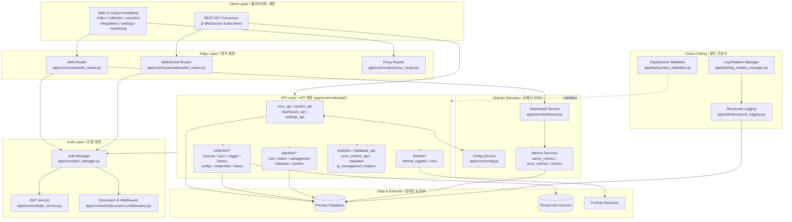
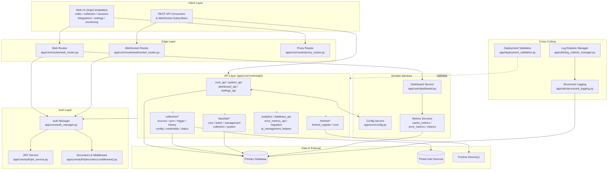

# Blacklist Service Management

> 통합 위협 인텔리전스 수집·동기화·블랙리스트 중앙 관리·Fortinet 자동 배포 플랫폼
> Unified threat-intelligence aggregation, centralized blacklist management, and Fortinet deployment platform.

---

## Table of Contents / 목차

- [한국어](#한국어)
  - [개요](#개요)
  - [주요 기능](#주요-기능)
  - [아키텍처](#아키텍처)
  - [빠른 시작](#빠른-시작)
  - [설정](#설정)
  - [명령어 레퍼런스](#명령어-레퍼런스)
  - [로컬 개발](#로컬-개발)
  - [테스트](#테스트)
  - [기여 가이드](#기여-가이드)
  - [라이선스](#라이선스)
- [English](#english)
  - [Overview](#overview)
  - [Features](#features)
  - [Architecture](#architecture)
  - [Quick Start](#quick-start)
  - [Configuration](#configuration)
  - [Commands Reference](#commands-reference)
  - [Local Development](#local-development)
  - [Testing](#testing)
  - [Contributing](#contributing)
  - [License](#license)
- [Repository Structure](#repository-structure)

---

## 한국어

### 개요

**Blacklist Service Management**는 다양한 외부 위협 인텔리전스 소스(악성 IP, 도메인 등)에서 데이터를 수집·동기화하고, 중앙 집중식 블랙리스트로 통합 관리한 뒤 Fortinet 방화벽 등 외부 보안 장비로 자동 배포하는 Python 기반 통합 관리 플랫폼입니다. 웹 UI(Jinja2), REST API, WebSocket을 통해 실시간 모니터링과 운영 자동화를 제공합니다.

핵심 사용자:

- **보안 운영팀(SOC)** — 위협 인텔리전스 통합·자동 차단
- **네트워크 엔지니어** — Fortinet 등 외부 장비로의 정책 배포
- **플랫폼 운영자** — 단일 콘솔에서 컬렉션·세션·통합·설정 관리

기본 서비스 포트는 `2542`이며(`PORT` 환경 변수로 변경 가능), 기본 실행 환경은 `development`입니다. 진입점은 `app/run_app.py`이며, 컨테이너 환경에서는 `app/entrypoint.sh`가 이를 호출합니다.

### 주요 기능

- **중앙 집중식 블랙리스트 관리** — IP/도메인 블랙리스트 CRUD, 일괄 처리(batch), 외부 컬렉션과 동기화, 변경 이력 추적
- **컬렉션 동기화** — 여러 위협 인텔리전스 소스에서 주기적/수동 데이터 수집, 히스토리 추적, 트리거 실행
- **Fortinet 연동** — Fortinet 장비 등록, 블랙리스트 항목의 정책/주소 객체 자동 배포
- **인증/인가** — JWT 기반 세션, 데코레이터·미들웨어 기반 라우트 보호, 역할 기반 접근 제어
- **모니터링** — 캐시/에러/시스템 메트릭 수집, 대시보드, 구조화 로깅, 로그 로테이션 관리
- **REST API + WebSocket** — 도메인별 모듈화된 API, 실시간 이벤트 스트림
- **프록시 라우트** — 외부 시스템 연동을 위한 중계 엔드포인트
- **웹 UI** — Jinja2 기반 페이지(인덱스, 컬렉션, 세션, 통합, 설정, 모니터링 대시보드)
- **데이터베이스 마이그레이션** — 내장 스키마 진화 및 검증 도구
- **Docker 기반 배포** — 개발/운영 환경 통합, 핫 리로드, 배포 검증 스크립트

### 아키텍처



핵심 모듈 경로:

- 앱 팩토리/구성: `app/core/app.py`, `app/core/config.py`
- 인증: `app/core/auth_manager.py`, `app/core/auth/`
- 라우팅: `app/core/routes/` (웹·API·WebSocket·프록시)
- 도메인 API: `app/core/routes/api/{collection,blacklist,fortinet,...}`
- 모니터링: `app/core/monitoring/`
- 유틸리티: `app/utils/{structured_logging,log_rotation_manager}.py`
- 진입점: `app/run_app.py`, `app/entrypoint.sh`

### 빠른 시작

요구 사항:

- Python 3.11+
- Docker / Docker Compose (운영 및 권장 개발 환경)
- GNU Make
- 사전 정의된 컬렉션 소스 및 Fortinet 대상 크리덴셜(선택)

#### 1) Docker Compose로 실행 (권장)

```bash
# 저장소 루트에서
make setup-hooks   # 선택: Git 훅 설치 (pre-commit, commitlint, frontend husky)
make dev           # 개발 환경 기동 (빌드 + 핫 리로드)
# 접속: http://localhost:2542
```

필요 시 환경 변수 오버라이드:

```bash
ENV=production PORT=8080 make dev-prod
```

#### 2) 로컬 Python으로 실행

```bash
python -m venv .venv && source .venv/bin/activate
pip install -r app/requirements.txt
export PYTHONPATH=app
export PORT=2542
export ENV=development
python app/run_app.py
```

> 일부 기능(DB, 외부 위협 인텔리전스 소스, Fortinet 장비)은 환경 변수와 자격 증명이 설정되어야 동작합니다.

### 설정

환경 변수는 다음 경로에서 읽습니다.

- `deploy/.env` (Docker Compose용; `make`가 자동 주입)
- 프로세스 환경 (`PYTHONPATH`, `PORT`, `ENV`, JWT/DB/Fortinet 크리덴셜 등)

일반적으로 사용되는 키(예시, 실제 키는 배포 환경에 맞춰 정의):

| Key | Description | Default |
| --- | --- | --- |
| `ENV` | 실행 환경 (`development` / `production`) | `development` |
| `PORT` | HTTP 서비스 포트 | `2542` |
| `PYTHONPATH` | Python 모듈 경로 | `app` |
| `JWT_*` | JWT 서명·만료 관련 키 | (필수) |
| `DB_*` | 데이터베이스 접속 정보 | (필수) |
| `FORTINET_*` | Fortinet 장비 호스트/토큰 | (선택) |
| `LOG_LEVEL` | 구조화 로그 레벨 | `INFO` |

민감 정보는 반드시 배포 환경의 시크릿 매니저/`.env` 파일로 관리하고 저장소에 커밋하지 마세요.

### 명령어 레퍼런스

`Makefile`이 노출하는 타겟:

| Target | Description |
| --- | --- |
| `help` | 사용 가능한 명령어와 설명 출력 |
| `setup-hooks` | pre-commit, commitlint, frontend husky 설치 |
| `build` | Docker 이미지 빌드 |
| `up` | Compose 스택 기동 |
| `down` | Compose 스택 종료 |
| `logs` | 서비스 로그 스트리밍 |
| `restart` | 서비스 재기동 |
| `dev` | 개발 환경 (빌드 + 핫 리로드) |
| `dev-no-build` | 기존 이미지로 빠르게 기동 |
| `dev-prod` | 운영-유사 환경 (핫 리로드 없음) |
| `dev-app` | 앱 서비스만 재기동 |
| `prod` | 운영 모드 기동 |
| `test` | 테스트 실행 |
| `deploy` | 배포 |
| `health` | 헬스 체크 |
| `release` | 릴리스 |
| `release-dry` | 릴리스 드라이런 |
| `verify` | 통합 검증 |
| `verify-lint` | 린트 검증 |
| `verify-types` | 타입(mypy) 검증 |
| `verify-secrets` | 시크릿 누출 검증 |
| `verify-pre-commit` | pre-commit 훅 검증 |
| `verify-quick` | 빠른 검증 |
| `verify-all` | 전체 검증 |
| `clean` | 산출물/리소스 정리 |

각 타겟의 상세 설명은 다음 명령으로 확인할 수 있습니다.

```bash
make help
```

### 로컬 개발

- 코드 스타일: `Ruff` (`pyproject.toml`의 `[tool.ruff]` 설정, line-length 120, Python 3.11)
- 타입 검사: `mypy` (`mypy.ini`)
- 커밋 메시지: Conventional Commits (`commitlint.config.js`)
- 시크릿 검사: pre-commit 훅
- 프론트엔드: `frontend/` 디렉터리에서 `npm install` 후 husky 기반 ESLint/Prettier
- 로그: `app/utils/structured_logging.py`의 구조화 로거를 사용하며, `app/utils/log_rotation_manager.py`로 로테이션 정책 관리
- 마이그레이션: `app/core/routes/api/migration.py` 및 `app/deployment_validation.py`를 통한 스키마 진화/검증

### 테스트

테스트 러너는 `pytest`이며, `pyproject.toml`의 `[tool.pytest.ini_options]`로 구성됩니다.

- 테스트 경로: `tests/`
- 마커: `unit`, `integration`, `security`, `db`, `api`
- 옵션: `-v --tb=short`

```bash
# 전체
pytest

# 마커별
pytest -m unit
pytest -m integration
pytest -m security
pytest -m db
pytest -m api
```

Makefile을 통한 실행:

```bash
make test
```

### 기여 가이드

1. 저장소를 포크하고 기능 브랜치를 생성합니다.
2. `make setup-hooks`로 Git 훅을 설치합니다.
3. 코드 변경 후 `make verify` (또는 `make verify-all`)을 통과시킵니다.
4. 커밋 메시지는 Conventional Commits 규칙을 따릅니다.
5. PR 생성 전 `make test`로 테스트를 실행합니다.
6. 자세한 규칙은 `CONTRIBUTING.md`를 참고하세요.

### 라이선스

이 저장소의 라이선스는 `LICENSE` 파일을 참고하세요.

---

## English

### Overview

**Blacklist Service Management** is a Python-based platform that aggregates threat-intelligence feeds (malicious IPs, domains, etc.), normalizes them into a centralized blacklist, and pushes the result to external security appliances such as Fortinet firewalls. It exposes a Jinja2 web UI, a modular REST API, and a WebSocket channel for real-time operations.

Primary users:

- **SOC teams** — unified threat intel and automated blocking
- **Network engineers** — policy distribution to Fortinet (and similar) devices
- **Platform operators** — single console for collections, sessions, integrations, and settings

The default listen port is `2542` (overridable via `PORT`); the default environment is `development`. The process entry point is `app/run_app.py`; in containers, `app/entrypoint.sh` invokes it.

### Features

- **Centralized blacklist management** — IP/domain CRUD, batch operations, sync with external collections, change history
- **Collection synchronization** — scheduled and manual ingestion from multiple threat-intel sources, with history and triggers
- **Fortinet integration** — device registration and automated policy/address-object deployment from blacklist entries
- **AuthN/AuthZ** — JWT sessions, decorator- and middleware-based route protection, role-based access
- **Monitoring** — cache, error, and system metrics, dashboard, structured logging, log rotation
- **REST API + WebSocket** — domain-modularized endpoints, real-time event stream
- **Proxy routes** — relay endpoints for external system integration
- **Web UI** — Jinja2 templates (index, collection, sessions, integrations, settings, monitoring dashboard)
- **Database migration** — in-app schema evolution and validation utilities
- **Docker-based deployment** — unified dev/prod workflows, hot reload, deployment validation

### Architecture



Key module paths:

- App factory/config: `app/core/app.py`, `app/core/config.py`
- Auth: `app/core/auth_manager.py`, `app/core/auth/`
- Routing: `app/core/routes/` (web, API, WebSocket, proxy)
- Domain APIs: `app/core/routes/api/{collection,blacklist,fortinet,...}`
- Monitoring: `app/core/monitoring/`
- Utilities: `app/utils/{structured_logging,log_rotation_manager}.py`
- Entry points: `app/run_app.py`, `app/entrypoint.sh`

### Quick Start

Requirements:

- Python 3.11+
- Docker / Docker Compose (recommended for dev and prod)
- GNU Make
- Pre-provisioned collection sources and Fortinet credentials (optional)

#### 1) Run with Docker Compose (recommended)

```bash
# from the repo root
make setup-hooks   # optional: install Git hooks (pre-commit, commitlint, frontend husky)
make dev           # start dev environment (build + hot reload)
# browse: http://localhost:2542
```

Override variables when needed:

```bash
ENV=production PORT=8080 make dev-prod
```

#### 2) Run locally with Python

```bash
python -m venv .venv && source .venv/bin/activate
pip install -r app/requirements.txt
export PYTHONPATH=app
export PORT=2542
export ENV=development
python app/run_app.py
```

> Features that depend on a database, external threat-intel sources, or Fortinet devices require their respective credentials to be configured.

### Configuration

Configuration is loaded from:

- `deploy/.env` (used by Docker Compose; auto-injected by the Makefile)
- Process environment (`PYTHONPATH`, `PORT`, `ENV`, JWT/DB/Fortinet credentials, etc.)

Common keys (illustrative — define the actual keys in your deployment):

| Key | Description | Default |
| --- | --- | --- |
| `ENV` | Runtime environment (`development` / `production`) | `development` |
| `PORT` | HTTP listen port | `2542` |
| `PYTHONPATH` | Python module path | `app` |
| `JWT_*` | JWT signing/expiry settings | (required) |
| `DB_*` | Database connection | (required) |
| `FORTINET_*` | Fortinet host/token | (optional) |
| `LOG_LEVEL` | Structured log level | `INFO` |

Keep secrets out of source control — use your platform's secret manager or `deploy/.env`.

### Commands Reference

Targets exposed by the `Makefile`:

| Target | Description |
| --- | --- |
| `help` | Print available commands |
| `setup-hooks` | Install pre-commit, commitlint, and frontend husky |
| `build` | Build Docker images |
| `up` | Bring the Compose stack up |
| `down` | Bring the Compose stack down |
| `logs` | Tail service logs |
| `restart` | Restart services |
| `dev` | Dev environment (build + hot reload) |
| `dev-no-build` | Start with existing images |
| `dev-prod` | Production-like (no hot reload) |
| `dev-app` | Restart only the app service |
| `prod` | Production-mode startup |
| `test` | Run tests |
| `deploy` | Deploy |
| `health` | Health check |
| `release` | Release |
| `release-dry` | Dry-run release |
| `verify` | Integrated verification |
| `verify-lint` | Lint verification |
| `verify-types` | Type verification (mypy) |
| `verify-secrets` | Secret-leak verification |
| `verify-pre-commit` | pre-commit hook verification |
| `verify-quick` | Quick verification |
| `verify-all` | Full verification |
| `clean` | Clean artifacts/resources |

See full descriptions with:

```bash
make help
```

### Local Development

- Style: `Ruff` (configured in `pyproject.toml` `[tool.ruff]`, line-length 120, Python 3.11)
- Type checking: `mypy` (`mypy.ini`)
- Commit messages: Conventional Commits (`commitlint.config.js`)
- Secret scanning: pre-commit hooks
- Frontend: `npm install` inside `frontend/` for husky-based ESLint/Prettier
- Logging: structured logger in `app/utils/structured_logging.py`, rotation in `app/utils/log_rotation_manager.py`
- Migrations: `app/core/routes/api/migration.py` and `app/deployment_validation.py` for schema evolution/validation

### Testing

The test runner is `pytest`, configured in `pyproject.toml` `[tool.pytest.ini_options]`.

- Test root: `tests/`
- Markers: `unit`, `integration`, `security`, `db`, `api`
- Default options: `-v --tb=short`

```bash
# full
pytest

# by marker
pytest -m unit
pytest -m integration
pytest -m security
pytest -m db
pytest -m api
```

Or via Make:

```bash
make test
```

### Contributing

1. Fork the repo and create a feature branch.
2. Install Git hooks with `make setup-hooks`.
3. Pass `make verify` (or `make verify-all`) before opening a PR.
4. Follow Conventional Commits for commit messages.
5. Run `make test` before submitting.
6. See `CONTRIBUTING.md` for full guidelines.

### License

See the `LICENSE` file in this repository.

---

## Repository Structure

```
.
├── AGENTS.md
├── CHANGELOG.md
├── CONTRIBUTING.md
├── LICENSE
├── Makefile
├── OWNERS
├── README.md
├── VERSION
├── commitlint.config.js
├── mypy.ini
├── pyproject.toml
└── app/
    ├── AGENTS.md
    ├── Dockerfile
    ├── __init__.py
    ├── deployment_validation.py
    ├── entrypoint.sh
    ├── requirements.txt
    ├── run_app.py
    ├── utils/
    │   ├── log_rotation_manager.py
    │   └── structured_logging.py
    ├── templates/
    │   ├── collection.html
    │   ├── collection_logs.html
    │   ├── index.html
    │   ├── integrations.html
    │   ├── sessions.html
    │   ├── settings.html
    │   └── monitoring/
    │       └── dashboard.html
    └── core/
        ├── AGENTS.md
        ├── __init__.py
        ├── app.py
        ├── auth_manager.py
        ├── config.py
        ├── dashboard.py
        ├── testing_app.py
        ├── auth/
        │   ├── AGENTS.md
        │   ├── __init__.py
        │   ├── decorators.py
        │   ├── jwt_service.py
        │   └── middleware.py
        ├── monitoring/
        │   ├── AGENTS.md
        │   ├── __init__.py
        │   ├── cache_metrics.py
        │   ├── error_metrics.py
        │   └── metrics.py
        └── routes/
            ├── AGENTS.md
            ├── api_routes.py
            ├── collection_routes_simple.py
            ├── proxy_routes.py
            ├── system_routes.py
            ├── web_routes.py
            ├── websocket_routes.py
            └── api/
                ├── AGENTS.md
                ├── __init__.py
                ├── analytics.py
                ├── auth_routes.py
                ├── core_api.py
                ├── dashboard_api.py
                ├── database_api.py
                ├── error_metrics_api.py
                ├── fortinet_register.py
                ├── ip_management_helpers.py
                ├── migration.py
                ├── settings_api.py
                ├── system_api.py
                ├── monitoring/
                │   └── __init__.py
                ├── collection/
                │   ├── AGENTS.md
                │   ├── __init__.py
                │   ├── config.py
                │   ├── credentials.py
                │   ├── history.py
                │   ├── sources.py
                │   ├── status.py
                │   ├── sync.py
                │   ├── trigger.py
                │   └── utils.py
                ├── blacklist/
                │   ├── AGENTS.md
                │   ├── __init__.py
                │   ├── batch.py
                │   ├── collection.py
                │   ├── core.py
                │   ├── management.py
                │   └── system.py
                └── fortinet/
                    ├── AGENTS.md
                    ├── __init__.py
                    └── core.py