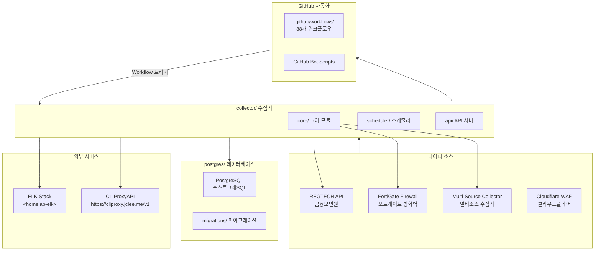
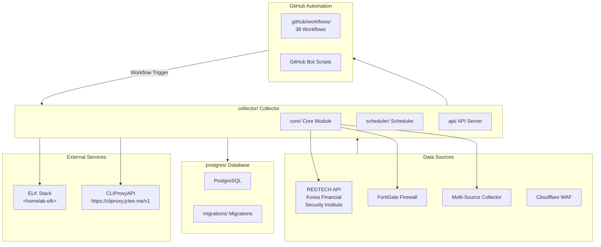

# Blacklist Service Management

## Korean (한국어)

---

### 개요

**Blacklist Service Management**는 금융보안원(REGTECH) 기반 IP 블랙리스트 데이터를 수집, 처리, 분산하는 위협 인텔리전스 플랫폼입니다. FortiGate 방화벽 및 Cloudflare WAF와 연동하여 악성 IP 목록을 자동 수집합니다.

### 주요 기능

- **멀티 소스 수집**: REGTECH, FortiGate, 다중 외부 소스로부터 IP 블랙리스트 자동 수집
- **데이터 품질 관리**: 수집된 데이터의 무결성 검증 및 중복 제거
- **자동 아카이브**: 일별/월별 백업 및 증분 아카이브 지원
- **정책 모니터링**: 블랙리스트 정책 변경 사항 실시간 추적
- **Rate Limiting**: API 호출 제한으로 서비스 안정성 확보
- **데이터베이스 관리**: PostgreSQL 기반 스토리지 및 마이그레이션
- **Docker 배포**: 컨테이너화된 애플리케이션 및 데이터베이스

### 아키텍처



### 프로젝트 구조

```
/
├── collector/              # 메인 데이터 수집기 (Python)
│   ├── core/               # 코어 모듈
│   │   ├── fortigate/      # FortiGate 수집기
│   │   ├── regtech/        # REGTECH 수집기
│   │   ├── multi_source/  # 멀티소스 수집기
│   │   └── database/       # 데이터베이스 레이어
│   ├── scheduler/          # 스케줄러 모듈
│   ├── api/                # API 서버
│   └── utils/              # 유틸리티 함수
├── postgres/               # PostgreSQL 데이터베이스
│   ├── initdb/             # 초기화 스크립트
│   └── migrations/         # 마이그레이션 파일
├── .github/                # GitHub 설정
│   └── workflows/          # 38개 워크플로우
├── Makefile                # 개발 명령어
├── pyproject.toml          # Python 프로젝트 설정
└── AGENTS.md              # AI 에이전트 문서
```

---

## English

---

### Overview

**Blacklist Service Management** is a threat intelligence platform for collecting, processing, and distributing IP blacklist data based on Korea Financial Security Institute (REGTECH). It automatically collects malicious IP lists by integrating with FortiGate firewalls and Cloudflare WAF.

### Key Features

- **Multi-Source Collection**: Automated IP blacklist collection from REGTECH, FortiGate, and multiple external sources
- **Data Quality Management**: Integrity validation and deduplication of collected data
- **Automatic Archiving**: Daily/monthly backup and incremental archive support
- **Policy Monitoring**: Real-time tracking of blacklist policy changes
- **Rate Limiting**: API call limiting for service stability
- **Database Management**: PostgreSQL-based storage and migrations
- **Docker Deployment**: Containerized application and database

### Architecture



### Project Structure

```
/
├── collector/              # Main data collector (Python)
│   ├── core/               # Core modules
│   │   ├── fortigate/      # FortiGate collector
│   │   ├── regtech/        # REGTECH collector
│   │   ├── multi_source/  # Multi-source collector
│   │   └── database/       # Database layer
│   ├── scheduler/          # Scheduler module
│   ├── api/                # API server
│   └── utils/              # Utility functions
├── postgres/               # PostgreSQL database
│   ├── initdb/             # Initialization scripts
│   └── migrations/         # Migration files
├── .github/                # GitHub configuration
│   └── workflows/          # 38 workflow files
├── Makefile                # Development commands
├── pyproject.toml          # Python project configuration
└── AGENTS.md              # AI agent documentation
```

---

## Automation Inventory

### GitHub Workflows (38 Total)

#### Pull Request Automation

| Workflow File | Purpose |
|---------------|---------|
| `01_branch-to-pr.yml` | Branch to PR automation |
| `03_pr-checks.yml` | PR validation checks |
| `09_semantic-pr.yml` | Semantic PR enforcement |
| `10_pr-review.yml` | Automated PR review |
| `13_pr-auto-merge.yml` | Automatic PR merging |
| `14_bot-auto-fix.yml` | Bot-based auto-fix |
| `15_merged-pr-cleanup.yml` | Post-merge cleanup |
| `44_reusable-pr-checks.yml` | Reusable PR checks |
| `security/11_pr-review.yml` | Security-focused PR review |

#### Issue Management

| Workflow File | Purpose |
|---------------|---------|
| `02_issue-to-branch.yml` | Issue to branch automation |
| `18_issue-management.yml` | Issue lifecycle management |
| `19_issue-backfill.yml` | Issue data backfill |
| `37_ci-failure-issues.yml` | CI failure issue creation |
| `43_reusable-issue-management.yml` | Reusable issue management |
| `91_issue-classification.yml` | Issue classification |

#### Security & Compliance

| Workflow File | Purpose |
|---------------|---------|
| `04_actionlint.yml` | Action linting |
| `05_gitleaks.yml` | Secret detection |
| `06_codeql.yml` | CodeQL security analysis |
| `07_dependency-review.yml` | Dependency vulnerability review |
| `08_scorecard.yml` | OpenSSF Scorecard |
| `45_reusable-gitleaks.yml` | Reusable secret detection |
| `security.yml` | Security workflow |

#### Documentation & Release

| Workflow File | Purpose |
|---------------|---------|
| `20_readme-gen.yml` | README generation |
| `21_docs-sync.yml` | Documentation sync |
| `24_release-notes.yml` | Release notes generation |
| `25_release-publish.yml` | Release publishing |
| `42_reusable-docs-sync.yml` | Reusable docs sync |
| `release.yml` | Release workflow |

#### Dependency Management

| Workflow File | Purpose |
|---------------|---------|
| `12_dependabot-auto-merge.yml` | Dependabot auto-merge |
| `auto-merge.yml` | General auto-merge |

#### CI/CD & Health Monitoring

| Workflow File | Purpose |
|---------------|---------|
| `_ci-node.yml` | Node.js CI reusable workflow |
| `auto-merge.yml` | Auto-merge workflow |
| `build-images.yml` | Docker image building |
| `ci.yml` | Continuous integration |
| `labeler.yml` | PR labeler |
| `standard-ci.yml` | Standard CI workflow |
| `welcome.yml` | Welcome message |
| `29_downstream-health-check.yml` | Downstream health monitoring |
| `60_ci-auto-heal.yml` | CI self-healing |

### GitHub Bot Scripts (`_bot-scripts/`)

The `_bot-scripts/` directory contains bot automation infrastructure (managed as a separate module):

- **Docker Support**: `Dockerfile.github_action`, `Dockerfile.github_app`
- **Configuration**: `docker-compose.github_app.yml`
- **Logging**: `filebeat.yml` for ELK integration

### Tools & Technologies

| Category | Technology |
|----------|------------|
| Language | Python 3.11+ |
| Database | PostgreSQL |
| Container | Docker, Docker Compose |
| CI/CD | GitHub Actions |
| Linting | Ruff, mypy |
| Testing | pytest |
| Secret Detection | Gitleaks |
| Security Analysis | CodeQL, OpenSSF Scorecard |

---

## Quick Start

### Prerequisites

- Docker 20.10+
- Docker Compose 2.0+
- Python 3.11+ (for local development)

### 1. Clone the Repository

```bash
git clone <repository-url>
cd blacklist-service
```

### 2. Environment Setup

```bash
# Copy environment file
cp deploy/.env.example deploy/.env

# Edit configuration
vim deploy/.env
```

### 3. Start Services

```bash
# Development with hot reload
make dev

# Production-like (no hot reload)
make dev-prod

# Start without rebuild (use existing images)
make dev-no-build
```

### 4. Verify Health

```bash
make health
```

---

## Local Development

### Git Hooks Setup

```bash
make setup-hooks
```

This installs:

- **Pre-commit**: Python linting (Ruff, mypy), secret detection
- **Commit-msg**: Conventional commits enforcement
- **Husky**: Frontend linting (ESLint, Prettier)

### Available Commands

| Command | Description |
|---------|-------------|
| `make help` | Show all available commands |
| `make setup-hooks` | Install git hooks |
| `make build` | Build Docker images |
| `make up` | Start all services |
| `make down` | Stop all services |
| `make logs` | View service logs |
| `make clean` | Clean up containers and volumes |
| `make test` | Run tests |
| `make dev` | Start development environment |
| `make dev-no-build` | Start without rebuild |
| `make dev-prod` | Start production-like environment |
| `make dev-app` | Restart only app service |
| `make restart` | Restart all services |
| `make health` | Check service health |
| `make release` | Create release |
| `make release-dry` | Dry run release |
| `make verify` | Run all verification |
| `make verify-lint` | Verify linting |
| `make verify-types` | Verify type checking |
| `make verify-secrets` | Verify secret detection |
| `make verify-pre-commit` | Verify pre-commit hooks |
| `make verify-quick` | Quick verification |
| `make verify-all` | Full verification suite |

### Testing

```bash
# Run all tests
make test

# Run with verbose output
pytest -v

# Run specific test types
pytest -m "unit"
pytest -m "integration"
pytest -m "security"
pytest -m "db"
pytest -m "api"
```

### Code Quality

```bash
# Lint with Ruff
ruff check .

# Format with Ruff
ruff format .

# Type check with mypy
mypy .

# All checks
make verify-all
```

---

## Project Configuration

### Python Configuration (`pyproject.toml`)

- **Test Framework**: pytest with markers (unit, integration, security, db, api)
- **Linter**: Ruff (line-length: 120, target: Python 3.11)
- **Test Paths**: `tests/`
- **Python Path**: `app/`

### Database Migrations

Migrations are located in `postgres/migrations/`:

- `001_add_data_source_column.sql`
- `002_add_missing_columns.sql`
- `003_add_display_order.sql`
- `004_update_active_blacklist_view.sql`
- `005_add_composite_indexes.sql`
- `006_fix_is_active_inconsistency.sql`

---

## Contributing

Contributions are welcome! Please see [CONTRIBUTING.md](./CONTRIBUTING.md) for guidelines.

### Commit Message Format

This project uses [Conventional Commits](https://www.conventionalcommits.org/):

```
<type>(<scope>): <description>

[optional body]

[optional footer]
```

Types: `feat`, `fix`, `docs`, `style`, `refactor`, `test`, `chore`

### Development Workflow

1. Create a feature branch from `master`
2. Make changes with proper tests
3. Ensure all checks pass (`make verify-all`)
4. Submit a pull request
5. Automated workflows will review and merge

### Code of Conduct

See [CODE_OF_CONDUCT.md](./_bot-scripts/CODE_OF_CONDUCT.md) for our code of conduct.

---

## License

This project is licensed under the terms in [LICENSE](./LICENSE).

---

## Related Documentation

- [AGENTS.md](./AGENTS.md) - AI Agent documentation
- [collector/AGENTS.md](./collector/AGENTS.md) - Collector module agents
- [collector/RATE-LIMITING.md](./collector/RATE-LIMITING.md) - Rate limiting details
- [collector/core/AGENTS.md](./collector/core/AGENTS.md) - Core module agents
- [collector/regtech/AGENTS.md](./collector/regtech/AGENTS.md) - REGTECH agents
- [collector/multi_source/AGENTS.md](./collector/multi_source/AGENTS.md) - Multi-source agents
- [postgres/AGENTS.md](./postgres/AGENTS.md) - Database agents
- [_bot-scripts/AGENTS.md](./_bot-scripts/AGENTS.md) - Bot scripts agents
- [CHANGELOG.md](./CHANGELOG.md) - Release history
- [CONTRIBUTING.md](./CONTRIBUTING.md) - Contributing guidelines
