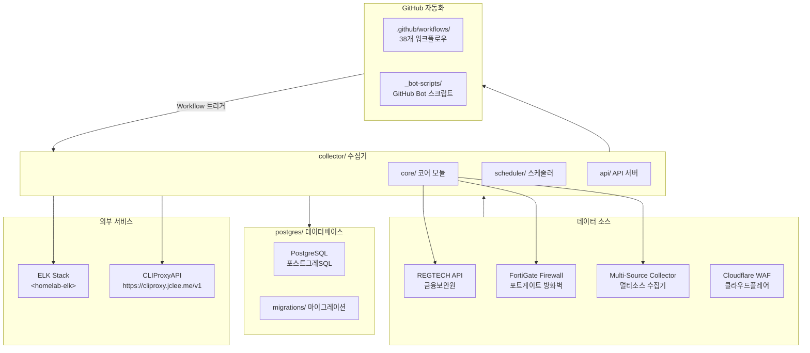
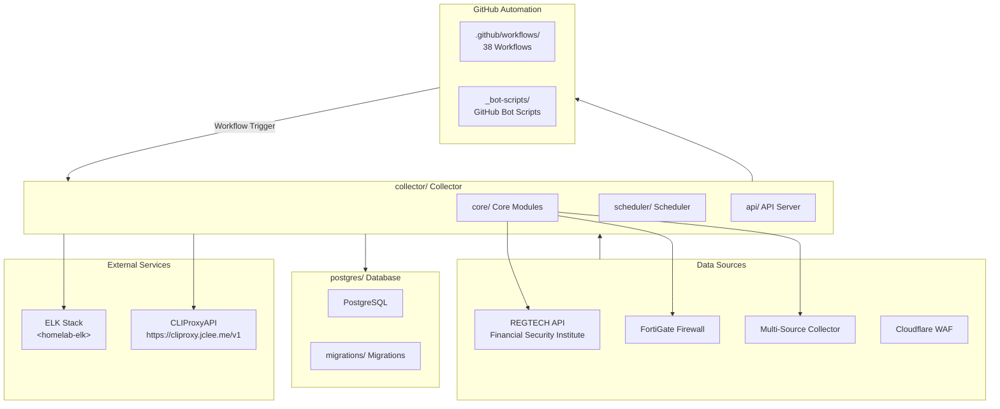

# Blacklist Service Management

Korean | [English](#english)

---

## Korean (한국어)

### 개요

**Blacklist Service Management**는 금융보안원(REGTECH) 기반 IP 블랙리스트 데이터를 수집, 처리, 분산하는 위협 인텔리전스 플랫폼입니다. FortiGate 방화벽 및 Cloudflare WAF와 연동하여 악성 IP 목록을 자동 수집합니다.

### 주요 기능

- **멀티 소스 수집**: REGTECH, FortiGate, 다중 외부 소스로부터 IP 블랙리스트 자동 수집
- **데이터 품질 관리**: 수집된 데이터의 무결성 검증 및 중복 제거
- **자동 아카이브**: 일별/월별 백업 및 증분 아카이브 지원
- **정책 모니터링**: 블랙리스트 정책 변경 사항 실시간 추적
- **Rate Limiting**: API 호출 제한으로 서비스 안정성 확보
- **데이터베이스 관리**: PostgreSQL 기반 스토리지 및 마이그레이션
- **Docker 배포**: 컨테이너화된 애플리케이션 및 데이터베이스

### 아키텍처



### 프로젝트 구조

```
/
├── collector/              # 메인 데이터 수집기 (Python)
│   ├── core/               # 코어 모듈
│   │   ├── fortigate/      # FortiGate 수집기
│   │   ├── regtech/        # REGTECH 수집기
│   │   ├── multi_source/  # 멀티소스 수집기
│   │   └── database/       # 데이터베이스 레이어
│   ├── scheduler/          # 작업 스케줄러
│   ├── api/                # API 서버
│   └── health_server.py   # 헬스 체크 서버
├── postgres/               # PostgreSQL 데이터베이스
│   ├── initdb/             # 초기화 스크립트
│   └── migrations/         # 스키마 마이그레이션
├── .github/                # GitHub 설정
│   └── workflows/          # 38개 워크플로우
├── Makefile                # 관리 명령어
├── pyproject.toml          # Python 프로젝트 설정
├── mypy.ini                # mypy 설정
└── commitlint.config.js    # 커밋 린트 설정
```

### 자동화 인벤토리 (Automation Inventory)

#### GitHub Actions 워크플로우 (38개)

| 워크플로우 파일 | 설명 |
|-----------------|------|
| `01_branch-to-pr.yml` | 브랜치에서 PR로 자동 전환 |
| `02_issue-to-branch.yml` | 이슈から 브랜치 자동 생성 |
| `03_pr-checks.yml` | PR 검사 (러프, 마이피, 테스트) |
| `04_actionlint.yml` | 워크플로우 lint 검사 |
| `05_gitleaks.yml` | 시크릿/민감정보 스캐닝 |
| `06_codeql.yml` | CodeQL 코드 분석 |
| `07_dependency-review.yml` | 의존성 보안 검토 |
| `08_scorecard.yml` | OpenSSF 점수카드 |
| `09_semantic-pr.yml` | 시맨틱 PR 검증 |
| `10_pr-review.yml` | PR 자동 리뷰 |
| `12_dependabot-auto-merge.yml` | Dependabot 자동 머지 |
| `13_pr-auto-merge.yml` | PR 자동 머지 |
| `14_bot-auto-fix.yml` | Bot 자동 수정 |
| `15_merged-pr-cleanup.yml` | 머지 후 브랜치 정리 |
| `18_issue-management.yml` | 이슈 관리 |
| `19_issue-backfill.yml` | 이슈 백필 |
| `20_readme-gen.yml` | README 생성 |
| `21_docs-sync.yml` | 문서 동기화 |
| `24_release-notes.yml` | 릴리스 노트 생성 |
| `25_release-publish.yml` | 릴리스 게시 |
| `29_downstream-health-check.yml` | 다운스트림 헬스 체크 |
| `37_ci-failure-issues.yml` | CI 실패 시 이슈 생성 |
| `42_reusable-docs-sync.yml` | 재사용可能な 문서 동기화 (reusable) |
| `43_reusable-issue-management.yml` | 재사용 가능한 이슈 관리 (reusable) |
| `44_reusable-pr-checks.yml` | 재사용 가능한 PR 검사 (reusable) |
| `45_reusable-gitleaks.yml` | 재사용 가능한 Gitleaks (reusable) |
| `60_ci-auto-heal.yml` | CI 자동 복구 |
| `91_issue-classification.yml` | 이슈 분류 |
| `_ci-node.yml` | Node.js CI 템플릿 |
| `auto-merge.yml` | 자동 머지 |
| `build-images.yml` | Docker 이미지 빌드 |
| `ci.yml` | 기본 CI |
| `labeler.yml` | PR 라벨러 |
| `release.yml` | 릴리스 워크플로우 |
| `security.yml` | 보안 검사 |
| `standard-ci.yml` | 표준 CI |
| `welcome.yml` | 신규 기여자 환영 |
| `security/11_pr-review.yml` | 보안 PR 리뷰 |

#### 재사용 가능한 워크플로우 (Reusable Workflows)

| 워크플로우 파일 | 설명 |
|----------------|------|
| `42_reusable-docs-sync.yml` | 문서 동기화 재사용 워크플로우 |
| `43_reusable-issue-management.yml` | 이슈 관리 재사용 워크플로우 |
| `44_reusable-pr-checks.yml` | PR 검사 재사용 워크플로우 |
| `45_reusable-gitleaks.yml` | Gitleaks 재사용 워크플로우 |

### 빠른 시작 (Quick Start)

#### 전제 조건

- Docker 및 Docker Compose
- Python 3.11+
- PostgreSQL 15+

#### 설치 및 실행

```bash
# 1. 레포지토리 클론
git clone <repository-url>
cd <repository-name>

# 2. 개발 환경 설정
make setup-hooks

# 3. 개발 환경 실행
make dev

# 4. 헬스 체크
make health
```

### 로컬 개발

#### 환경 변수 설정

```bash
# deploy/.env 파일 생성
cp deploy/.env.example deploy/.env
#필요한 환경 변수 설정
```

#### Docker Compose 실행

```bash
# 개발 환경 (핫 리로드)
make dev

# 프로덕션 환경
make dev-prod

# 로그 확인
make logs

# 서비스 중지
make down
```

### 명령어 레퍼런스 (Commands Reference)

```bash
# 개발 환경
make dev              # 핫 리로드로 개발 환경 시작
make dev-no-build     # 빌드 없이 시작
make dev-prod         # 프로덕션 환경으로 시작

# 테스트 및 검증
make test             # 전체 테스트 실행
make verify           # 전체 검증 (린트, 타입, 시크릿)
make verify-lint      # Ruff 린트 검사
make verify-types     # mypy 타입 검사
make verify-secrets   # Gitleaks 시크릿 검사
make verify-quick     # 빠른 검증

# 배포
make deploy           # 배포
make release          # 릴리스
make release-dry      # 릴리스 미리보기

# 유틸리티
make health           # 헬스 체크
make logs             # 로그 확인
make clean            # 정리
make restart          # 재시작
```

### 테스트

```bash
# 전체 테스트
make test

# 특정 마커 테스트
pytest -m unit        # 유닛 테스트
pytest -m integration # 통합 테스트
pytest -m security    # 보안 테스트
pytest -m db          # 데이터베이스 테스트
pytest -m api         # API 테스트
```

### 기여 가이드 (Contribution Guide)

1. **브랜치 생성**: `git checkout -b feature/your-feature-name`
2. **커밋**: Conventional Commits 형식 사용
   - `feat:`, `fix:`, `docs:`, `style:`, `refactor:`, `test:`, `chore:`
3. **PR 생성**: `main` 브랜치로 머지
4. **CI 검사**: 모든 검사 통과 필요
5. **리뷰**: 최소 1명 이상의 리뷰어 승인

#### 커밋 메시지 규칙

```
<type>(<scope>): <subject>

<body>

<footer>
```

예시:

```
feat(collector): add multi-source IP collection support

- Implement parallel fetching from multiple sources
- Add data validation and deduplication
- Update rate limiting for concurrent requests

Closes #123
```

### 라이선스

이 프로젝트는 MIT 라이선스 하에 배포됩니다. 자세한 내용은 [LICENSE](LICENSE) 파일을 참조하세요.

---

## English

### Overview

**Blacklist Service Management** is a threat intelligence platform that collects, processes, and distributes IP blacklist data based on Korea Financial Security Institute (REGTECH). It integrates with FortiGate firewalls and Cloudflare WAF to automatically collect malicious IP lists.

### Key Features

- **Multi-Source Collection**: Automatic IP blacklist collection from REGTECH, FortiGate, multiple external sources
- **Data Quality Management**: Data integrity validation and deduplication
- **Automatic Archiving**: Daily/monthly backup and incremental archive support
- **Policy Monitoring**: Real-time tracking of blacklist policy changes
- **Rate Limiting**: API call limiting for service stability
- **Database Management**: PostgreSQL-based storage and migration
- **Docker Deployment**: Containerized application and database

### Architecture



### Project Structure

```
/
├── collector/              # Main data collector (Python)
│   ├── core/               # Core modules
│   │   ├── fortigate/      # FortiGate collector
│   │   ├── regtech/        # REGTECH collector
│   │   ├── multi_source/  # Multi-source collector
│   │   └── database/       # Database layer
│   ├── scheduler/          # Job scheduler
│   ├── api/                # API server
│   └── health_server.py   # Health check server
├── postgres/               # PostgreSQL database
│   ├── initdb/             # Initialization scripts
│   └── migrations/         # Schema migrations
├── .github/                # GitHub configuration
│   └── workflows/          # 38 workflows
├── Makefile                # Management commands
├── pyproject.toml          # Python project configuration
├── mypy.ini                # mypy configuration
└── commitlint.config.js    # Commit lint configuration
```

### Automation Inventory

#### GitHub Actions Workflows (38 total)

| Workflow File | Description |
|---------------|-------------|
| `01_branch-to-pr.yml` | Auto-convert branch to PR |
| `02_issue-to-branch.yml` | Auto-create branch from issue |
| `03_pr-checks.yml` | PR checks (ruff, mypy, tests) |
| `04_actionlint.yml` | Workflow lint check |
| `05_gitleaks.yml` | Secret/sensitive data scanning |
| `06_codeql.yml` | CodeQL analysis |
| `07_dependency-review.yml` | Dependency security review |
| `08_scorecard.yml` | OpenSSF scorecard |
| `09_semantic-pr.yml` | Semantic PR validation |
| `10_pr-review.yml` | PR auto-review |
| `12_dependabot-auto-merge.yml` | Dependabot auto-merge |
| `13_pr-auto-merge.yml` | PR auto-merge |
| `14_bot-auto-fix.yml` | Bot auto-fix |
| `15_merged-pr-cleanup.yml` | Post-merge branch cleanup |
| `18_issue-management.yml` | Issue management |
| `19_issue-backfill.yml` | Issue backfill |
| `20_readme-gen.yml` | README generation |
| `21_docs-sync.yml` | Documentation sync |
| `24_release-notes.yml` | Release notes generation |
| `25_release-publish.yml` | Release publishing |
| `29_downstream-health-check.yml` | Downstream health check |
| `37_ci-failure-issues.yml` | CI failure issue creation |
| `42_reusable-docs-sync.yml` | Reusable docs sync workflow |
| `43_reusable-issue-management.yml` | Reusable issue management workflow |
| `44_reusable-pr-checks.yml` | Reusable PR checks workflow |
| `45_reusable-gitleaks.yml` | Reusable Gitleaks workflow |
| `60_ci-auto-heal.yml` | CI auto-heal |
| `91_issue-classification.yml` | Issue classification |
| `_ci-node.yml` | Node.js CI template |
| `auto-merge.yml` | Auto-merge |
| `build-images.yml` | Docker image build |
| `ci.yml` | Base CI |
| `labeler.yml` | PR labeler |
| `release.yml` | Release workflow |
| `security.yml` | Security checks |
| `standard-ci.yml` | Standard CI |
| `welcome.yml` | New contributor welcome |
| `security/11_pr-review.yml` | Security PR review |

#### Reusable Workflows

| Workflow File | Description |
|---------------|-------------|
| `42_reusable-docs-sync.yml` | Reusable documentation sync workflow |
| `43_reusable-issue-management.yml` | Reusable issue management workflow |
| `44_reusable-pr-checks.yml` | Reusable PR checks workflow |
| `45_reusable-gitleaks.yml` | Reusable Gitleaks workflow |

### Quick Start

#### Prerequisites

- Docker and Docker Compose
- Python 3.11+
- PostgreSQL 15+

#### Installation and Execution

```bash
# 1. Clone repository
git clone <repository-url>
cd <repository-name>

# 2. Setup development environment
make setup-hooks

# 3. Start development environment
make dev

# 4. Health check
make health
```

### Local Development

#### Environment Variables

```bash
# Create deploy/.env file
cp deploy/.env.example deploy/.env
# Configure required environment variables
```

#### Docker Compose Commands

```bash
# Development environment (hot reload)
make dev

# Production environment
make dev-prod

# View logs
make logs

# Stop services
make down
```

### Commands Reference

```bash
# Development
make dev              # Start dev environment with hot reload
make dev-no-build     # Start without rebuild
make dev-prod         # Start production-like environment

# Testing and Verification
make test             # Run all tests
make verify           # Full verification (lint, types, secrets)
make verify-lint      # Ruff lint check
make verify-types     # mypy type check
make verify-secrets   # Gitleaks secret check
make verify-quick     # Quick verification

# Deployment
make deploy           # Deploy
make release          # Release
make release-dry      # Dry run release

# Utilities
make health           # Health check
make logs             # View logs
make clean            # Clean up
make restart           # Restart
```

### Testing

```bash
# Run all tests
make test

# Run specific marker tests
pytest -m unit        # Unit tests
pytest -m integration # Integration tests
pytest -m security    # Security tests
pytest -m db          # Database tests
pytest -m api         # API tests
```

### Contribution Guide

1. **Create Branch**: `git checkout -b feature/your-feature-name`
2. **Commit**: Use Conventional Commits format
   - `feat:`, `fix:`, `docs:`, `style:`, `refactor:`, `test:`, `chore:`
3. **Create PR**: Merge to `main` branch
4. **CI Checks**: All checks must pass
5. **Review**: At least one reviewer approval required

#### Commit Message Rules

```
<type>(<scope>): <subject>

<body>

<footer>
```

Example:

```
feat(collector): add multi-source IP collection support

- Implement parallel fetching from multiple sources
- Add data validation and deduplication
- Update rate limiting for concurrent requests

Closes #123
```

### License

This project is distributed under the MIT License. See the [LICENSE](LICENSE) file for more information.

---

## Badges


**Generated by:** minimax-m2.7 (via CLIProxyAPI)  
**Last Updated:** _(auto-updated on push)_
