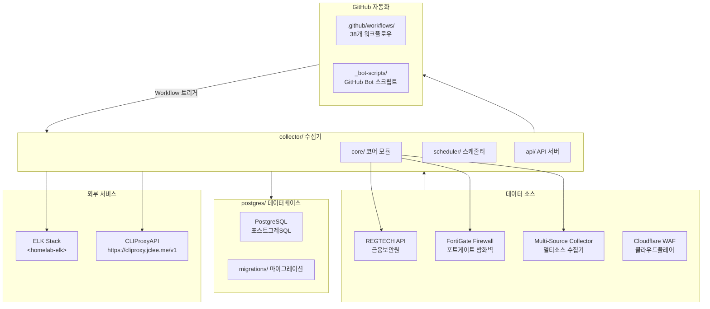
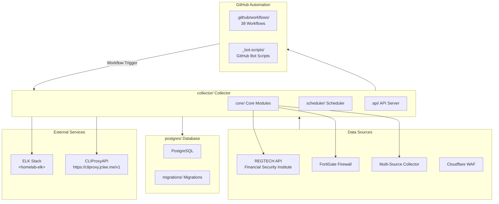

# Blacklist Service Management

Korean | [English](#english)

---

## Korean (한국어)

### 개요

**Blacklist Service Management**는 금융보안원(REGTECH) 기반 IP 블랙리스트 데이터를 수집, 처리, 분산하는 위협 인텔리전스 플랫폼입니다. FortiGate 방화벽 및 Cloudflare WAF와 연동하여 악성 IP 목록을 자동 수집합니다.

### 주요 기능

- **멀티 소스 수집**: REGTECH, FortiGate, 다중 외부 소스로부터 IP 블랙리스트 자동 수집
- **데이터 품질 관리**: 수집된 데이터의 무결성 검증 및 중복 제거
- **자동 아카이브**: 일별/월별 백업 및 증분 아카이브 지원
- **정책 모니터링**: 블랙리스트 정책 변경 사항 실시간 추적
- **Rate Limiting**: API 호출 제한으로 서비스 안정성 확보
- **데이터베이스 관리**: PostgreSQL 기반 스토리지 및 마이그레이션
- **Docker 배포**: 컨테이너화된 애플리케이션 및 데이터베이스

### 아키텍처



### 프로젝트 구조

```
/
├── collector/              # 메인 데이터 수집기 (Python)
│   ├── core/               # 코어 모듈
│   │   ├── fortigate/      # FortiGate 수집기
│   │   ├── regtech/        # REGTECH 수집기
│   │   ├── multi_source/  # 멀티소스 수집기
│   │   └── database/       # 데이터베이스 레이어
│   ├── scheduler/          # 작업 스케줄러
│   └── api/                # REST API 서버
├── postgres/               # PostgreSQL 데이터베이스
│   ├── initdb/             # 초기화 SQL
│   └── migrations/         # 스키마 마이그레이션
├── _bot-scripts/           # GitHub Bot 자동화 스크립트
├── security/               # 보안 워크플로우
└── .github/workflows/      # GitHub Actions 워크플로우 (38개)
```

### 자동화 인벤토리

#### GitHub Actions 워크플로우 (38개)

| 워크플로우 파일 | 설명 |
|----------------|------|
| `01_branch-to-pr.yml` | 브랜치에서 PR로 자동 전환 |
| `02_issue-to-branch.yml` | 이슈 기반 브랜치 자동 생성 |
| `03_pr-checks.yml` | PR 필수 검사 (lint, test, build) |
| `04_actionlint.yml` | GitHub Actions YAML lint |
| `05_gitleaks.yml` | 시크릿 스캐닝 |
| `06_codeql.yml` | CodeQL 정적 분석 |
| `07_dependency-review.yml` | 의존성 보안 검토 |
| `08_scorecard.yml` | OpenSSF Scorecard |
| `09_semantic-pr.yml` | 시맨틱 PR 검증 |
| `10_pr-review.yml` | AI 기반 PR 리뷰 (qodo-ai/pr-agent) |
| `12_dependabot-auto-merge.yml` | Dependabot 자동 병합 |
| `13_pr-auto-merge.yml` | 자동 병합 규칙 |
| `14_bot-auto-fix.yml` | Bot 자동 수정 |
| `15_merged-pr-cleanup.yml` | 병합 후 브랜치 정리 |
| `18_issue-management.yml` | 이슈 수명 주기 관리 |
| `19_issue-backfill.yml` | 이슈 백필自动化 |
| `20_readme-gen.yml` | README 자동 생성 |
| `21_docs-sync.yml` | 문서 동기화 |
| `24_release-notes.yml` |Release Notes 초안 작성 |
| `25_release-publish.yml` | Release 게시 |
| `29_downstream-health-check.yml` |_downstream 저장소 상태 확인 |
| `37_ci-failure-issues.yml` | CI 실패 시 이슈 자동 생성 |
| `42_reusable-docs-sync.yml` | 재사용 가능 문서 동기화 |
| `43_reusable-issue-management.yml` | 재사용 가능 이슈 관리 |
| `44_reusable-pr-checks.yml` | 재사용 가능 PR 검사 |
| `45_reusable-gitleaks.yml` | 재사용 가능 시크릿 스캔 |
| `60_ci-auto-heal.yml` | CI 자동 복구 |
| `91_issue-classification.yml` | 이슈 분류 |
| `_ci-node.yml` | Node.js CI 템플릿 |
| `auto-merge.yml` | 자동 병합 |
| `build-images.yml` | Docker 이미지 빌드 |
| `ci.yml` | 기본 CI |
| `labeler.yml` | PR 라벨러 |
| `release.yml` | Release 워크플로우 |
| `security.yml` | 보안 검사 |
| `standard-ci.yml` | 표준 CI |
| `welcome.yml` | 신규 기여자 환영 메시지 |
| `security/11_pr-review.yml` | 보안 PR 리뷰 |

#### Python Bot 스크립트 (`_bot-scripts/`)

| 도구 | 설명 |
|------|------|
| `Dockerfile.github_action` | GitHub Actions용 Bot Docker 이미지 |
| `Dockerfile.github_app` | GitHub App용 Bot Docker 이미지 |
| `docker-compose.github_app.yml` | GitHub App Docker Compose |
| `requirements.txt` | Python dependencies |
| `requirements-dev.txt` | 개발용 dependencies |

### 빠른 시작

#### prerequisites

- Docker & Docker Compose
- Python 3.11+
- PostgreSQL 15+

#### 설치

```bash
# 리포지토리 클론
git clone https://github.com/qws941/CLIProxyAPI.git
cd CLIProxyAPI

# Git hooks 설치
make setup-hooks

# 개발 환경 시작
make dev
```

#### Docker Compose로 실행

```bash
# 환경 변수 설정
cp deploy/.env.example deploy/.env
# 编辑 deploy/.env 设置 필요한 환경 변수

# 전체 스택 시작
docker compose -f deploy/docker-compose.yml --env-file deploy/.env up -d

# 로그 확인
docker compose -f deploy/docker-compose.yml logs -f
```

### 로컬 개발

```bash
# Python 의존성 설치
pip install -r collector/requirements.txt

# 타입 검사
make verify-types

# Lint 검사
make verify-lint

# 단위 테스트
make verify-quick

# 전체 검증
make verify-all
```

### 명령어 레퍼런스

| 명령어 | 설명 |
|--------|------|
| `make help` | 사용 가능한 명령어 목록 |
| `make setup-hooks` | Git hooks 및 pre-commit 설치 |
| `make dev` | 개발 환경 시작 (hot reload) |
| `make dev-no-build` | 기존 이미지로 시작 |
| `make dev-prod` | 프로덕션 환경 시작 |
| `make dev-app` | 앱 서비스만 재시작 |
| `make up` | 전체 스택 시작 |
| `make down` | 전체 스택 중지 |
| `make logs` | 로그 확인 |
| `make clean` | 리소스 정리 |
| `make test` | 테스트 실행 |
| `make verify` | 전체 검증 |
| `make verify-lint` | Ruff lint 검사 |
| `make verify-types` | mypy 타입 검사 |
| `make verify-secrets` | 시크릿 검사 |
| `make verify-pre-commit` | pre-commit 검사 |
| `make verify-quick` | 빠른 검증 (lint + types) |
| `make verify-all` | 전체 검증 |
| `make health` | 헬스 체크 |
| `make release` | Release 실행 |
| `make release-dry` | Release dry-run |

### 기여하기

CONTRIBUTING.md를 참조하세요. 주요 가이드라인:

1. **커밋 메시지**: Conventional Commits 규칙 준수 (`feat:`, `fix:`, `docs:`, etc.)
2. **브랜치 전략**: `main` → feature branches → PR
3. **PR 리뷰**: 모든 PR은 최소 1개의 리뷰 필요
4. **테스트**: 새로운 기능에는 테스트 포함
5. **Lint**: `make verify-quick` 통과 필수

### 외부 연동

| 서비스 | 엔드포인트 | 용도 |
|--------|-----------|------|
| CLIProxy API | <https://cliproxy.jclee.me/v1> | CLI 프록시 서비스 |
| Bot Service | <https://bot.jclee.me> | GitHub Bot 서비스 |
| ELK Stack | `<homelab-elk>` | 로깅 및 모니터링 |
| PR Agent | qodo-ai/pr-agent | AI PR 리뷰 |

---

## English

### Overview

**Blacklist Service Management** is a threat intelligence platform that collects, processes, and distributes IP blacklist data based on Korea Financial Security Institute (REGTECH). It integrates with FortiGate firewalls and Cloudflare WAF to automatically collect malicious IP lists.

### Key Features

- **Multi-Source Collection**: Automatic IP blacklist collection from REGTECH, FortiGate, and multiple external sources
- **Data Quality Management**: Data integrity validation and deduplication
- **Automatic Archiving**: Daily/monthly backups and incremental archive support
- **Policy Monitoring**: Real-time tracking of blacklist policy changes
- **Rate Limiting**: API call limiting for service stability
- **Database Management**: PostgreSQL-based storage and migrations
- **Docker Deployment**: Containerized application and database

### Architecture



### Project Structure

```
/
├── collector/              # Main data collector (Python)
│   ├── core/               # Core modules
│   │   ├── fortigate/      # FortiGate collector
│   │   ├── regtech/        # REGTECH collector
│   │   ├── multi_source/  # Multi-source collector
│   │   └── database/       # Database layer
│   ├── scheduler/          # Job scheduler
│   └── api/                # REST API server
├── postgres/               # PostgreSQL database
│   ├── initdb/             # Initialization SQL
│   └── migrations/         # Schema migrations
├── _bot-scripts/           # GitHub Bot automation scripts
├── security/               # Security workflows
└── .github/workflows/      # GitHub Actions workflows (38)
```

### Automation Inventory

#### GitHub Actions Workflows (38 total)

| Workflow File | Description |
|---------------|-------------|
| `01_branch-to-pr.yml` | Auto-convert branch to PR |
| `02_issue-to-branch.yml` | Auto-create branch from issue |
| `03_pr-checks.yml` | PR required checks (lint, test, build) |
| `04_actionlint.yml` | GitHub Actions YAML lint |
| `05_gitleaks.yml` | Secret scanning |
| `06_codeql.yml` | CodeQL static analysis |
| `07_dependency-review.yml` | Dependency security review |
| `08_scorecard.yml` | OpenSSF Scorecard |
| `09_semantic-pr.yml` | Semantic PR validation |
| `10_pr-review.yml` | AI-powered PR review (qodo-ai/pr-agent) |
| `12_dependabot-auto-merge.yml` | Dependabot auto-merge |
| `13_pr-auto-merge.yml` | Auto-merge rules |
| `14_bot-auto-fix.yml` | Bot auto-fix |
| `15_merged-pr-cleanup.yml` | Post-merge branch cleanup |
| `18_issue-management.yml` | Issue lifecycle management |
| `19_issue-backfill.yml` | Issue backfill automation |
| `20_readme-gen.yml` | Auto-generate README |
| `21_docs-sync.yml` | Document synchronization |
| `24_release-notes.yml` | Release notes drafting |
| `25_release-publish.yml` | Release publishing |
| `29_downstream-health-check.yml` | Downstream repository health check |
| `37_ci-failure-issues.yml` | Auto-create issue on CI failure |
| `42_reusable-docs-sync.yml` | Reusable document sync |
| `43_reusable-issue-management.yml` | Reusable issue management |
| `44_reusable-pr-checks.yml` | Reusable PR checks |
| `45_reusable-gitleaks.yml` | Reusable secret scan |
| `60_ci-auto-heal.yml` | CI auto-heal |
| `91_issue-classification.yml` | Issue classification |
| `_ci-node.yml` | Node.js CI template |
| `auto-merge.yml` | Auto-merge |
| `build-images.yml` | Docker image build |
| `ci.yml` | Base CI |
| `labeler.yml` | PR labeler |
| `release.yml` | Release workflow |
| `security.yml` | Security checks |
| `standard-ci.yml` | Standard CI |
| `welcome.yml` | New contributor welcome message |
| `security/11_pr-review.yml` | Security PR review |

#### Python Bot Scripts (`_bot-scripts/`)

| Tool | Description |
|------|-------------|
| `Dockerfile.github_action` | GitHub Actions Bot Docker image |
| `Dockerfile.github_app` | GitHub App Bot Docker image |
| `docker-compose.github_app.yml` | GitHub App Docker Compose |
| `requirements.txt` | Python dependencies |
| `requirements-dev.txt` | Development dependencies |

### Quick Start

#### Prerequisites

- Docker & Docker Compose
- Python 3.11+
- PostgreSQL 15+

#### Installation

```bash
# Clone repository
git clone https://github.com/qws941/CLIProxyAPI.git
cd CLIProxyAPI

# Install Git hooks
make setup-hooks

# Start development environment
make dev
```

#### Run with Docker Compose

```bash
# Setup environment variables
cp deploy/.env.example deploy/.env
# Edit deploy/.env with required environment variables

# Start full stack
docker compose -f deploy/docker-compose.yml --env-file deploy/.env up -d

# View logs
docker compose -f deploy/docker-compose.yml logs -f
```

### Local Development

```bash
# Install Python dependencies
pip install -r collector/requirements.txt

# Type checking
make verify-types

# Lint checking
make verify-lint

# Unit tests
make verify-quick

# Full verification
make verify-all
```

### Commands Reference

| Command | Description |
|---------|-------------|
| `make help` | Show available commands |
| `make setup-hooks` | Install Git hooks and pre-commit |
| `make dev` | Start development environment (hot reload) |
| `make dev-no-build` | Start with existing images |
| `make dev-prod` | Start production environment |
| `make dev-app` | Restart only app service |
| `make up` | Start full stack |
| `make down` | Stop full stack |
| `make logs` | View logs |
| `make clean` | Clean up resources |
| `make test` | Run tests |
| `make verify` | Full verification |
| `make verify-lint` | Ruff lint check |
| `make verify-types` | mypy type check |
| `make verify-secrets` | Secret check |
| `make verify-pre-commit` | Pre-commit check |
| `make verify-quick` | Quick verification (lint + types) |
| `make verify-all` | Full verification |
| `make health` | Health check |
| `make release` | Execute release |
| `make release-dry` | Release dry-run |

### Contributing

See CONTRIBUTING.md for guidelines. Key points:

1. **Commit Messages**: Follow Conventional Commits (`feat:`, `fix:`, `docs:`, etc.)
2. **Branch Strategy**: `main` → feature branches → PR
3. **PR Review**: At least 1 reviewer required
4. **Tests**: Include tests for new features
5. **Lint**: Must pass `make verify-quick`

### External Integrations

| Service | Endpoint | Purpose |
|---------|----------|---------|
| CLIProxy API | <https://cliproxy.jclee.me/v1> | CLI proxy service |
| Bot Service | <https://bot.jclee.me> | GitHub Bot service |
| ELK Stack | `<homelab-elk>` | Logging and monitoring |
| PR Agent | qodo-ai/pr-agent | AI PR review |

---

## License

See LICENSE file for details.
