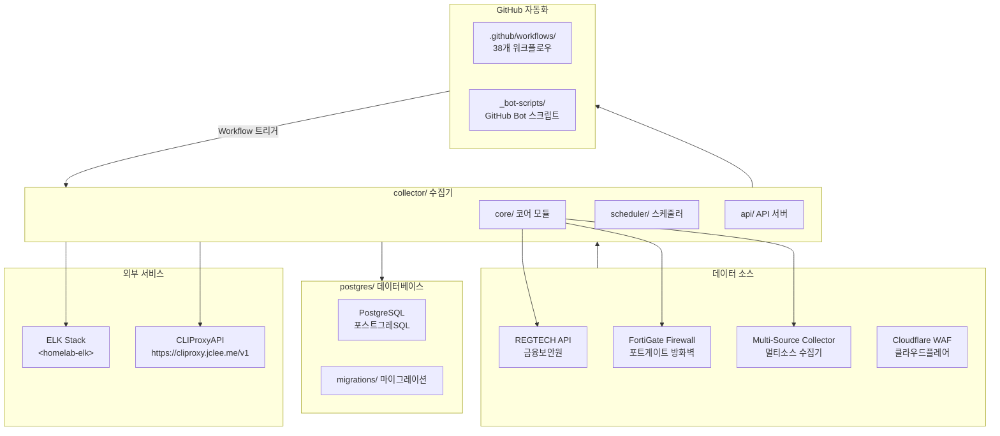
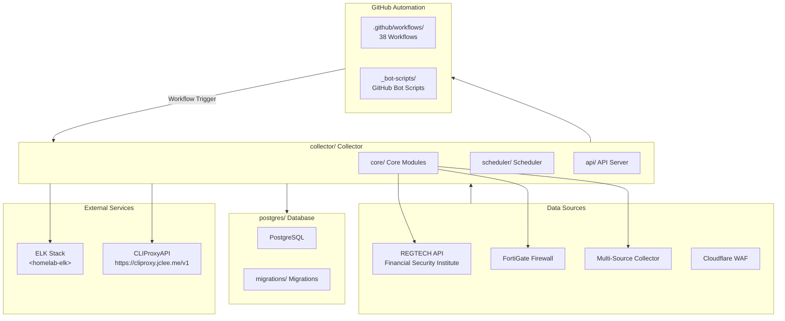

# Blacklist Service Management

Korean | [English](#english)

---

## Korean (한국어)

### 개요

**Blacklist Service Management**는 금융보안원(REGTECH) 기반 IP 블랙리스트 데이터를 수집, 처리, 분산하는 위협 인텔리전스 플랫폼입니다. FortiGate 방화벽 및 Cloudflare WAF와 연동하여 악성 IP 목록을 자동 수집합니다.

### 주요 기능

- **멀티 소스 수집**: REGTECH, FortiGate, 다중 외부 소스로부터 IP 블랙리스트 자동 수집
- **데이터 품질 관리**: 수집된 데이터의 무결성 검증 및 중복 제거
- **자동 아카이브**: 일별/월별 백업 및 증분 아카이브 지원
- **정책 모니터링**: 블랙리스트 정책 변경 사항 실시간 추적
- **Rate Limiting**: API 호출 제한으로 서비스 안정성 확보
- **데이터베이스 관리**: PostgreSQL 기반 스토리지 및 마이그레이션
- **Docker 배포**: 컨테이너화된 애플리케이션 및 데이터베이스

### 아키텍처



### 프로젝트 구조

```
/
├── collector/              # 메인 데이터 수집기 (Python)
│   ├── core/               # 코어 모듈
│   │   ├── fortigate/      # FortiGate 수집기
│   │   ├── regtech/        # REGTECH 수집기
│   │   ├── multi_source/  # 멀티소스 수집기
│   │   └── database/       # 데이터베이스 레이어
│   ├── scheduler/          # 작업 스케줄러
│   ├── api/                # REST API 서버
│   └── utils/              # 유틸리티 함수
├── postgres/               # PostgreSQL 데이터베이스
│   ├── initdb/             # 초기화 스크립트
│   └── migrations/         # 마이그레이션 파일
├── _bot-scripts/           # GitHub Bot 스크립트 및 자동화
├── .github/
│   └── workflows/          # GitHub Actions 워크플로우 (38개)
├── Makefile                # 개발 명령어
├── pyproject.toml          # Python 프로젝트 설정
└── mypy.ini                # 타입 검사 설정
```

### 자동화 인벤토리 (Automation Inventory)

#### GitHub Actions 워크플로우 (38개)

| 워크플로우 파일 | 설명 |
|----------------|------|
| `01_branch-to-pr.yml` | 브랜치에서 PR로 자동 변환 |
| `02_issue-to-branch.yml` | 이슈からブランチ自動作成 |
| `03_pr-checks.yml` | PR 검사 파이프라인 |
| `04_actionlint.yml` | GitHub Actions lint 검사 |
| `05_gitleaks.yml` | 시크릿 스캔 |
| `06_codeql.yml` | 코드 품질 분석 |
| `07_dependency-review.yml` | 의존성 보안 검토 |
| `08_scorecard.yml` | OpenSSF 보안 점수 |
| `09_semantic-pr.yml` | 시맨틱 PR 유효성 검사 |
| `10_pr-review.yml` | 자동 PR 리뷰 |
| `12_dependabot-auto-merge.yml` | Dependabot 자동 병합 |
| `13_pr-auto-merge.yml` | PR 자동 병합 |
| `14_bot-auto-fix.yml` | Bot 자동 수정 |
| `15_merged-pr-cleanup.yml` | 병합 후 브랜치 정리 |
| `18_issue-management.yml` | 이슈 관리 |
| `19_issue-backfill.yml` | 이슈 백필 |
| `20_readme-gen.yml` | README 생성 |
| `21_docs-sync.yml` | 문서 동기화 |
| `24_release-notes.yml` | 릴리스 노트 생성 |
| `25_release-publish.yml` | 릴리스 게시 |
| `29_downstream-health-check.yml` | 다운스트림 헬스 체크 |
| `37_ci-failure-issues.yml` | CI 실패 이슈 생성 |
| `42_reusable-docs-sync.yml` | 재사용 가능한 문서 동기화 |
| `43_reusable-issue-management.yml` | 재사용 가능한 이슈 관리 |
| `44_reusable-pr-checks.yml` | 재사용 가능한 PR 검사 |
| `45_reusable-gitleaks.yml` | 재사용 가능한 시크릿 스캔 |
| `60_ci-auto-heal.yml` | CI 자동 복구 |
| `91_issue-classification.yml` | 이슈 분류 |
| `_ci-node.yml` | Node.js CI 템플릿 |
| `auto-merge.yml` | 자동 병합 |
| `build-images.yml` | Docker 이미지 빌드 |
| `ci.yml` | 일반 CI |
| `labeler.yml` | PR 라벨러 |
| `release.yml` | 릴리스 워크플로우 |
| `security.yml` | 보안 검사 |
| `standard-ci.yml` | 표준 CI |
| `welcome.yml` | 환영 메시지 |
| `security/11_pr-review.yml` | 보안 PR 리뷰 |

#### 외부 통합 도구

| 도구 | 용도 |
|------|------|
| **qodo-ai/pr-agent** | AI 기반 PR 리뷰 및 자동화 |
| **CLIProxyAPI** | <https://cliproxy.jclee.me/v1> - 외부 API 프록시 |
| **ELK Stack** | &lt;homelab-elk&gt; - 로깅 및 모니터링 |

### 빠른 시작 (Quick Start)

#### 전제 조건

- Docker 및 Docker Compose
- Python 3.11+
- PostgreSQL 15+

#### 환경 설정

```bash
# 레포지토리 클론
git clone <repository-url>
cd <repository-name>

# 개발 환경 시작
make dev

# 또는 빌드 없이 시작
make dev-no-build
```

#### 환경 변수 설정

`deploy/.env` 파일 생성:

```env
PORT=2542
POSTGRES_DB=blacklist_db
POSTGRES_USER=admin
POSTGRES_PASSWORD=your_password
REGTECH_API_KEY=your_regtech_key
FORTIGATE_HOST=<homelab-host>
FORTIGATE_USER=admin
```

### 로컬 개발

#### 개발 명령어

```bash
# 개발 환경 시작 (핫 리로드)
make dev

# 프로덕션 유사 환경
make dev-prod

# 로그 확인
make logs

# 서비스 재시작
make restart

# 리소스 정리
make clean
```

#### 검증 명령어

```bash
# 전체 검증
make verify-all

# 린트 검사
make verify-lint

# 타입 검사
make verify-types

# 시크릿 검사
make verify-secrets

# 단위 테스트
make verify-quick

# Pre-commit 훅
make verify-pre-commit
```

#### 테스트 실행

```bash
# pytest 실행
pytest tests/

# 특정 마커로 테스트
pytest -m unit
pytest -m integration
pytest -m security
pytest -m db
pytest -m api
```

### 명령어 참조 (Commands Reference)

| 명령어 | 설명 |
|--------|------|
| `make help` | 도움말 표시 |
| `make setup-hooks` | Git 훅 설치 |
| `make build` | Docker 이미지 빌드 |
| `make up` | 서비스 시작 |
| `make down` | 서비스 중지 |
| `make logs` | 로그 확인 |
| `make clean` | 리소스 정리 |
| `make test` | 테스트 실행 |
| `make deploy` | 배포 |
| `make dev` | 개발 모드 (핫 리로드) |
| `make prod` | 프로덕션 모드 |
| `make restart` | 서비스 재시작 |
| `make health` | 헬스 체크 |
| `make release` | 릴리스 실행 |
| `make verify` | 전체 검증 |
| `make verify-lint` | 린트 검사 |
| `make verify-types` | 타입 검사 |
| `make verify-secrets` | 시크릿 검사 |
| `make verify-pre-commit` | Pre-commit 검사 |
| `make verify-quick` | 빠른 검증 |
| `make verify-all` | 전체 검증 |

### 기여 가이드 (Contribution Guide)

#### 커밋 메시지 규칙

Conventional Commits 규칙을 따릅니다:

```
<type>(<scope>): <description>

[optional body]

[optional footer]
```

**类型 (Types):**

- `feat`: 새 기능
- `fix`: 버그 수정
- `docs`: 문서 변경
- `style`: 코드 스타일 변경
- `refactor`: 리팩토링
- `perf`: 성능 개선
- `test`: 테스트 추가/수정
- `chore`: 빌드/보조 도구 변경

#### 개발 워크플로우

1. **기능 개발**

   ```bash
   # 이슈 생성 또는 기존 이슈 선택
   # 브랜치 생성
   git checkout -b feature/your-feature-name
   
   # 코드 작성 및 테스트
   # 커밋 (conventional commits)
   git commit -m "feat(core): add new collector"
   
   # 푸시 및 PR 생성
   git push origin feature/your-feature-name
   ```

2. **코드 검증**

   ```bash
   make verify-all
   ```

3. **Pull Request 리뷰**
   - 자동 CI 검사 통과 필요
   - 최소 1명 이상의 리뷰어 승인
   - 시맨틱 PR 제목 사용

#### 테스트 마커

| 마커 | 설명 |
|------|------|
| `unit` | 단위 테스트 (외부 의존성 없음) |
| `integration` | 통합 테스트 (서비스 필요) |
| `security` | 보안 관련 테스트 |
| `db` | 데이터베이스 테스트 |
| `api` | API 엔드포인트 테스트 |

#### 빌드 및 배포

```bash
# Docker 이미지 빌드
make build

# 이미지 푸시
docker push <registry>/blacklist-collector:latest

# 배포
make deploy
```

---

## English

### Overview

**Blacklist Service Management** is a threat intelligence platform that collects, processes, and distributes IP blacklist data based on Korea Financial Security Institute (REGTECH). It integrates with FortiGate firewalls and Cloudflare WAF to automatically collect malicious IP lists.

### Key Features

- **Multi-Source Collection**: Automatic IP blacklist collection from REGTECH, FortiGate, multiple external sources
- **Data Quality Management**: Integrity validation and deduplication of collected data
- **Automatic Archive**: Daily/monthly backups and incremental archive support
- **Policy Monitoring**: Real-time tracking of blacklist policy changes
- **Rate Limiting**: API call limiting for service stability
- **Database Management**: PostgreSQL-based storage and migrations
- **Docker Deployment**: Containerized application and database

### Architecture



### Project Structure

```
/
├── collector/              # Main data collector (Python)
│   ├── core/               # Core modules
│   │   ├── fortigate/      # FortiGate collector
│   │   ├── regtech/        # REGTECH collector
│   │   ├── multi_source/  # Multi-source collector
│   │   └── database/       # Database layer
│   ├── scheduler/          # Job scheduler
│   ├── api/                # REST API server
│   └── utils/              # Utility functions
├── postgres/               # PostgreSQL database
│   ├── initdb/             # Initialization scripts
│   └── migrations/         # Migration files
├── _bot-scripts/           # GitHub Bot scripts and automation
├── .github/
│   └── workflows/          # GitHub Actions workflows (38)
├── Makefile                # Development commands
├── pyproject.toml          # Python project configuration
└── mypy.ini                # Type checking configuration
```

### Automation Inventory

#### GitHub Actions Workflows (38)

| Workflow File | Description |
|---------------|-------------|
| `01_branch-to-pr.yml` | Auto-convert branch to PR |
| `02_issue-to-branch.yml` | Create branch from issue |
| `03_pr-checks.yml` | PR check pipeline |
| `04_actionlint.yml` | GitHub Actions lint check |
| `05_gitleaks.yml` | Secret scanning |
| `06_codeql.yml` | Code quality analysis |
| `07_dependency-review.yml` | Dependency security review |
| `08_scorecard.yml` | OpenSSF security score |
| `09_semantic-pr.yml` | Semantic PR validation |
| `10_pr-review.yml` | Auto PR review |
| `12_dependabot-auto-merge.yml` | Dependabot auto-merge |
| `13_pr-auto-merge.yml` | PR auto-merge |
| `14_bot-auto-fix.yml` | Bot auto-fix |
| `15_merged-pr-cleanup.yml` | Post-merge branch cleanup |
| `18_issue-management.yml` | Issue management |
| `19_issue-backfill.yml` | Issue backfill |
| `20_readme-gen.yml` | README generation |
| `21_docs-sync.yml` | Documentation sync |
| `24_release-notes.yml` | Release notes generation |
| `25_release-publish.yml` | Release publishing |
| `29_downstream-health-check.yml` | Downstream health check |
| `37_ci-failure-issues.yml` | CI failure issue creation |
| `42_reusable-docs-sync.yml` | Reusable docs sync |
| `43_reusable-issue-management.yml` | Reusable issue management |
| `44_reusable-pr-checks.yml` | Reusable PR checks |
| `45_reusable-gitleaks.yml` | Reusable secret scanning |
| `60_ci-auto-heal.yml` | CI auto-heal |
| `91_issue-classification.yml` | Issue classification |
| `_ci-node.yml` | Node.js CI template |
| `auto-merge.yml` | Auto-merge |
| `build-images.yml` | Docker image build |
| `ci.yml` | General CI |
| `labeler.yml` | PR labeler |
| `release.yml` | Release workflow |
| `security.yml` | Security checks |
| `standard-ci.yml` | Standard CI |
| `welcome.yml` | Welcome message |
| `security/11_pr-review.yml` | Security PR review |

#### External Integration Tools

| Tool | Purpose |
|------|---------|
| **qodo-ai/pr-agent** | AI-powered PR review and automation |
| **CLIProxyAPI** | <https://cliproxy.jclee.me/v1> - External API proxy |
| **ELK Stack** | &lt;homelab-elk&gt; - Logging and monitoring |

### Quick Start

#### Prerequisites

- Docker and Docker Compose
- Python 3.11+
- PostgreSQL 15+

#### Environment Setup

```bash
# Clone repository
git clone <repository-url>
cd <repository-name>

# Start development environment
make dev

# Or start without build
make dev-no-build
```

#### Environment Variables

Create `deploy/.env` file:

```env
PORT=2542
POSTGRES_DB=blacklist_db
POSTGRES_USER=admin
POSTGRES_PASSWORD=your_password
REGTECH_API_KEY=your_regtech_key
FORTIGATE_HOST=<homelab-host>
FORTIGATE_USER=admin
```

### Local Development

#### Development Commands

```bash
# Start development environment (hot reload)
make dev

# Production-like environment
make dev-prod

# View logs
make logs

# Restart services
make restart

# Clean resources
make clean
```

#### Verification Commands

```bash
# Full verification
make verify-all

# Lint check
make verify-lint

# Type check
make verify-types

# Secret scan
make verify-secrets

# Unit tests
make verify-quick

# Pre-commit hooks
make verify-pre-commit
```

#### Running Tests

```bash
# Run pytest
pytest tests/

# Run with specific marker
pytest -m unit
pytest -m integration
pytest -m security
pytest -m db
pytest -m api
```

### Commands Reference

| Command | Description |
|---------|-------------|
| `make help` | Show help message |
| `make setup-hooks` | Install git hooks |
| `make build` | Build Docker images |
| `make up` | Start services |
| `make down` | Stop services |
| `make logs` | View logs |
| `make clean` | Clean resources |
| `make test` | Run tests |
| `make deploy` | Deploy |
| `make dev` | Development mode (hot reload) |
| `make prod` | Production mode |
| `make restart` | Restart services |
| `make health` | Health check |
| `make release` | Run release |
| `make verify` | Full verification |
| `make verify-lint` | Lint check |
| `make verify-types` | Type check |
| `make verify-secrets` | Secret scan |
| `make verify-pre-commit` | Pre-commit check |
| `make verify-quick` | Quick verification |
| `make verify-all` | Full verification |

### Contribution Guide

#### Commit Message Rules

Follow Conventional Commits:

```
<type>(<scope>): <description>

[optional body]

[optional footer]
```

**Types:**

- `feat`: New feature
- `fix`: Bug fix
- `docs`: Documentation changes
- `style`: Code style changes
- `refactor`: Refactoring
- `perf`: Performance improvement
- `test`: Test addition/modification
- `chore`: Build/tooling changes

#### Development Workflow

1. **Feature Development**

   ```bash
   # Create or select an issue
   # Create branch
   git checkout -b feature/your-feature-name
   
   # Write code and tests
   # Commit (conventional commits)
   git commit -m "feat(core): add new collector"
   
   # Push and create PR
   git push origin feature/your-feature-name
   ```

2. **Code Verification**

   ```bash
   make verify-all
   ```

3. **Pull Request Review**
   - Must pass all automated CI checks
   - At least one reviewer approval
   - Use semantic PR titles

#### Test Markers

| Marker | Description |
|--------|-------------|
| `unit` | Unit tests (no external dependencies) |
| `integration` | Integration tests (requires services) |
| `security` | Security-related tests |
| `db` | Database tests |
| `api` | API endpoint tests |

#### Build and Deployment

```bash
# Build Docker images
make build

# Push images
docker push <registry>/blacklist-collector:latest

# Deploy
make deploy
```

---

## License

This project is licensed under the terms included in the `LICENSE` file.

## Changelog

See `CHANGELOG.md` for detailed version history.
