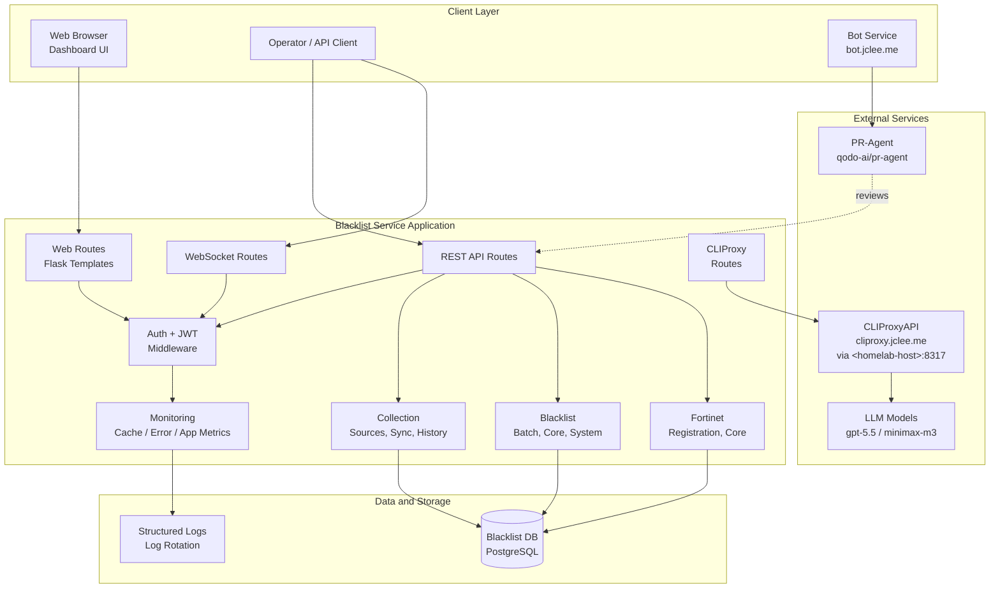
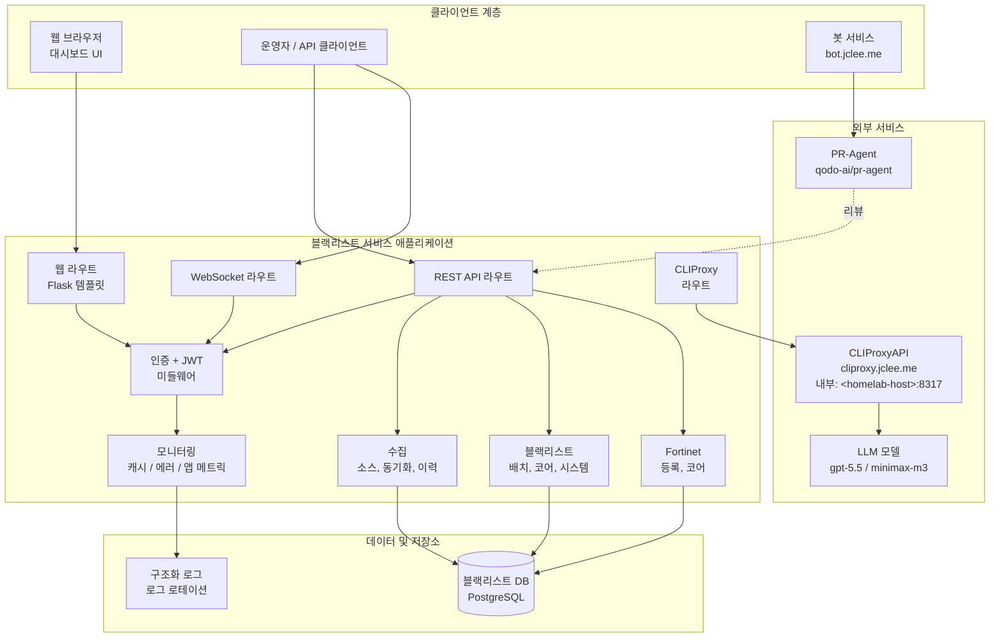

# Blacklist Service Management

[English](#english) | [한국어](#한국어)


---

<a id="english"></a>

# English

## Overview

**Blacklist Service Management** is a Python 3.11 web application that consolidates blacklist collection, operational monitoring, role-based API access, Fortinet firewall integration, and AI-assisted automation behind a single Flask-based service.

The runtime under `app/` exposes a layered architecture:

- **Web tier** — Flask templates (`templates/index.html`, `templates/collection.html`, `templates/sessions.html`, `templates/settings.html`, `templates/integrations.html`, `templates/collection_logs.html`, `templates/monitoring/dashboard.html`).
- **API tier** — REST endpoints under `app/core/routes/api/` covering analytics, auth, dashboard, database, error metrics, settings, system, Fortinet registration, blacklist, collection, migration, and IP management.
- **Realtime tier** — WebSocket routes for live dashboard updates.
- **Integration tier** — Proxy routes that bridge the service to **CLIProxyAPI** (`https://cliproxy.jclee.me/v1`) for LLM access (primary `gpt-5.5`, fallback `minimax-m3`).
- **Operations tier** — Structured logging, log rotation, deployment validation, and Docker packaging.

Automation is first-class: the repository carries **20 GitHub Actions workflows** that govern branches, pull requests, security scanning, dependency review, AI-assisted review, auto-merge, release notes, release publishing, CI self-healing, issue classification, and downstream health checks. The bot service at `https://bot.jclee.me` is the externally-hosted orchestrator that consumes these workflows.

## Features

- **Collection management** — sources, credentials, history, status, sync, trigger, and config endpoints under `app/core/routes/api/collection/`.
- **Blacklist engine** — batch, core, management, system, and collection modules under `app/core/routes/api/blacklist/`.
- **Fortinet integration** — registration and Fortinet-specific core logic under `app/core/routes/api/fortinet/`.
- **Authentication** — auth manager, JWT service, decorators, and middleware (`app/core/auth/`).
- **Monitoring** — cache metrics, error metrics, and general metrics modules (`app/core/monitoring/`).
- **System & proxy routes** — system health, proxy bridge, and web entrypoints (`app/core/routes/`).
- **Realtime dashboard** — WebSocket routes feeding the monitoring dashboard.
- **Structured logging** — JSON logs with rotation handled by `app/utils/structured_logging.py` and `app/utils/log_rotation_manager.py`.
- **Deployment validation** — pre-flight checks via `app/deployment_validation.py` and `app/entrypoint.sh`.
- **Containerized delivery** — production Dockerfile and Docker Compose stack under `deploy/`.
- **Code quality gates** — Ruff lint, mypy type-check, pytest suites (unit / integration / security / db / api markers), pre-commit hooks, Husky + commitlint for conventional commits.

## Architecture



## Automation Inventory

The repository ships **20 GitHub Actions workflows**. They are grouped below by responsibility. All names retain their on-disk numeric prefix.

### Issue and Triage

- `02_issue-to-branch.yml` — converts accepted issues into working branches.
- `19_issue-backfill.yml` — backfills missing metadata on legacy issues.
- `37_ci-failure-issues.yml` — opens issues from CI failure signals.
- `91_issue-classification.yml` — auto-classifies and labels incoming issues.

### Branch and Pull Request

- `01_branch-to-pr.yml` — promotes branches into pull requests.
- `10_pr-review.yml` — AI-assisted semantic PR review (PR-Agent from `qodo-ai/pr-agent`).
- `11_security-pr-review.yml` — security-focused PR review.
- `12_dependabot-auto-merge.yml` — auto-merges trusted Dependabot updates.
- `13_pr-auto-merge.yml` — auto-merge for qualifying PRs.
- `14_bot-auto-fix.yml` — bot-driven fixups on PR feedback.
- `15_merged-pr-cleanup.yml` — branch and label cleanup after merge.

### Release and Publishing

- `24_release-notes.yml` — generates release notes.
- `25_release-publish.yml` — publishes artifacts on release.
- `release.yml` — release orchestrator.

### CI, Build, and Self-Heal

- `ci.yml` — primary CI pipeline.
- `build-images.yml` — container image build.
- `_ci-node.yml` — reusable Node.js CI helper.
- `60_ci-auto-heal.yml` — automated CI remediation.

### Security

- `security.yml` — CodeQL, dependency review, secret scanning, OpenSSF Scorecard.

### Downstream

- `29_downstream-health-check.yml` — verifies health of downstream consumers / related services.

### Go Automation Tools

No Go-based automation tools are shipped from this repository. All automation is implemented as GitHub Actions workflows above.

## Quick Start

```bash
# 1. Clone
git clone <repository-url> blacklist-service
cd blacklist-service

# 2. Install git hooks (pre-commit + commitlint + Husky)
make setup-hooks

# 3. Prepare environment file
cp deploy/.env.example deploy/.env
# Edit deploy/.env — set CLIPROXY_PUBLIC_BASE_URL=https://cliproxy.jclee.me/v1
#                     set homelab hostnames (<homelab-host>, <homelab-elk>) etc.

# 4. Bring up the stack
make dev
```

The dashboard becomes available at `http://localhost:2542` (default `PORT`).

## Local Development

### Prerequisites

- Python 3.11
- Docker + Docker Compose v2
- Node.js 20+ (for the frontend Husky hooks)
- `pre-commit`

### Workflow

1. Create a branch: `git checkout -b feat/<short-description>`.
2. Make changes; pre-commit runs Ruff, mypy, Gitleaks, and conventional-commit validation.
3. Run unit tests: `pytest -m unit`.
4. Push and open a PR — `01_branch-to-pr.yml` and `10_pr-review.yml` activate.
5. After approvals, `13_pr-auto-merge.yml` handles the merge; `15_merged-pr-cleanup.yml` cleans up.

### Frontend Hooks

The `setup-hooks` target also installs Husky for ESLint and Prettier in `frontend/`.

## Commands Reference

The `Makefile` is the entry point for every operational task.

### Setup

| Command | Description |
| --- | --- |
| `make setup-hooks` | Install pre-commit + commitlint + Husky hooks. |
| `make help` | Print the full command catalog with descriptions. |

### Lifecycle

| Command | Description |
| --- | --- |
| `make build` | Build all container images. |
| `make up` | Start the stack in the foreground-detached mode. |
| `make down` | Stop and remove containers. |
| `make restart` | Restart services. |
| `make logs` | Tail service logs. |
| `make health` | Print container health status. |
| `make clean` | Remove containers, volumes, and build artifacts. |

### Development Modes

| Command | Description |
| --- | --- |
| `make dev` | Development stack with hot reload (rebuilds changed images). |
| `make dev-no-build` | Start with existing images (fastest iteration). |
| `make dev-prod` | Production-like stack, no hot reload. |
| `make dev-app` | Restart only the `app` service. |

### Quality Gates

| Command | Description |
| --- | --- |
| `make test` | Run the pytest suite (markers: `unit`, `integration`, `security`, `db`, `api`). |
| `make verify` | Run the default verification bundle. |
| `make verify-lint` | Ruff only. |
| `make verify-types` | mypy only. |
| `make verify-secrets` | Gitleaks secret scan. |
| `make verify-pre-commit` | Full pre-commit run. |
| `make verify-quick` | Fast lint + types. |
| `make verify-all` | Lint, types, secrets, pre-commit, and tests. |

### Release

| Command | Description |
| --- | --- |
| `make release` | Tag and publish a release. |
| `make release-dry` | Dry-run the release pipeline. |

### Deployment

| Command | Description |
| --- | --- |
| `make deploy` | Deploy via `deploy/docker-compose.yml`. |
| `make prod` | Bring up the production profile. |

## Contribution Guide

1. Read `CONTRIBUTING.md` and `AGENTS.md` (root and per-package) for repository conventions.
2. Follow [Conventional Commits](https://www.conventionalcommits.org/) — enforced by `commitlint.config.js`.
3. Keep type annotations accurate — mypy runs in `verify-types`.
4. Add or update tests for any behavior change; mark with the appropriate pytest marker.
5. Open a PR; the automation chain (`10_pr-review.yml`, `11_security-pr-review.yml`, `13_pr-auto-merge.yml`) will handle review and merge once checks pass.
6. Security issues: follow the disclosure process in `SECURITY` policy / `security.yml`.

## External Services

- **CLIProxyAPI** — LLM proxy endpoint at `https://cliproxy.jclee.me/v1` (reached internally via `<homelab-host>:8317`).
- **PR-Agent** — AI PR review from `https://github.com/qodo-ai/pr-agent`.
- **Bot Service** — companion automation hub at `https://bot.jclee.me`.

---

<a id="한국어"></a>

# 한국어

## 개요

**Blacklist Service Management**는 블랙리스트 수집, 운영 모니터링, 역할 기반 API 접근, Fortinet 방화벽 연동, AI 기반 자동화를 단일 Flask 서비스로 통합한 Python 3.11 웹 애플리케이션입니다.

`app/` 디렉터리 하위의 런타임은 다음과 같은 계층 구조로 구성됩니다.

- **웹 계층** — Flask 템플릿(`templates/index.html`, `templates/collection.html`, `templates/sessions.html`, `templates/settings.html`, `templates/integrations.html`, `templates/collection_logs.html`, `templates/monitoring/dashboard.html`).
- **API 계층** — `app/core/routes/api/` 하위의 REST 엔드포인트(분석, 인증, 대시보드, 데이터베이스, 에러 메트릭, 설정, 시스템, Fortinet 등록, 블랙리스트, 수집, 마이그레이션, IP 관리).
- **실시간 계층** — 대시보드 라이브 업데이트용 WebSocket 라우트.
- **연동 계층** — LLM 접근을 위해 **CLIProxyAPI**(`https://cliproxy.jclee.me/v1`)로 연결되는 프록시 라우트(주 모델 `gpt-5.5`, 폴백 `minimax-m3`).
- **운영 계층** — 구조화 로깅, 로그 로테이션, 배포 사전 검증, Docker 패키징.

자동화는 1급 시민입니다. 본 저장소는 **20개의 GitHub Actions 워크플로**를 통해 브랜치, PR, 보안 스캔, 의존성 검토, AI 리뷰, 자동 머지, 릴리스 노트, 릴리스 배포, CI 자가 치유, 이슈 분류, 다운스트림 헬스 체크를 관리합니다. `https://bot.jclee.me`의 외부 봇 서비스가 이러한 워크플로를 호출하는 오케스트레이터입니다.

## 주요 기능

- **수집 관리** — `app/core/routes/api/collection/`의 소스, 자격 증명, 이력, 상태, 동기화, 트리거, 설정 엔드포인트.
- **블랙리스트 엔진** — `app/core/routes/api/blacklist/`의 배치, 코어, 관리, 시스템, 수집 모듈.
- **Fortinet 연동** — `app/core/routes/api/fortinet/`의 등록 및 Fortinet 전용 코어 로직.
- **인증** — `app/core/auth/`의 인증 매니저, JWT 서비스, 데코레이터, 미들웨어.
- **모니터링** — `app/core/monitoring/`의 캐시, 에러, 일반 메트릭 모듈.
- **시스템/프록시 라우트** — 시스템 헬스, 프록시 브리지, 웹 진입점(`app/core/routes/`).
- **실시간 대시보드** — 모니터링 대시보드를 위한 WebSocket 라우트.
- **구조화 로깅** — `app/utils/structured_logging.py` 및 `app/utils/log_rotation_manager.py` 기반 JSON 로그 + 로테이션.
- **배포 사전 검증** — `app/deployment_validation.py` 및 `app/entrypoint.sh`를 통한 사전 점검.
- **컨테이너 기반 배포** — 프로덕션 Dockerfile 및 `deploy/` 하위의 Docker Compose 스택.
- **코드 품질 게이트** — Ruff 린트, mypy 타입 체크, pytest 스위트(unit / integration / security / db / api 마커), pre-commit 훅, Husky + commitlint.

## 아키텍처



## 자동화 인벤토리

저장소에는 **20개의 GitHub Actions 워크플로**가 포함되어 있습니다. 책임 영역별로 그룹화했으며, 모든 파일명은 디스크 상의 숫자 접두사를 그대로 유지합니다.

### 이슈 및 분류

- `02_issue-to-branch.yml` — 승인된 이슈를 작업 브랜치로 전환.
- `19_issue-backfill.yml` — 레거시 이슈의 누락 메타데이터 보강.
- `37_ci-failure-issues.yml` — CI 실패 신호로부터 이슈 자동 생성.
- `91_issue-classification.yml` — 유입 이슈의 자동 분류 및 라벨링.

### 브랜치 및 Pull Request

- `01_branch-to-pr.yml` — 브랜치를 PR로 승격.
- `10_pr-review.yml` — PR-Agent(`qodo-ai/pr-agent`) 기반 시맨틱 PR 리뷰.
- `11_security-pr-review.yml` — 보안 중심 PR 리뷰.
- `12_dependabot-auto-merge.yml` — 신뢰 가능한 Dependabot 업데이트 자동 머지.
- `13_pr-auto-merge.yml` — 조건 충족 PR 자동 머지.
- `14_bot-auto-fix.yml` — PR 피드백 기반 봇 자동 수정.
- `15_merged-pr-cleanup.yml` — 머지 후 브랜치/라벨 정리.

### 릴리스 및 배포

- `24_release-notes.yml` — 릴리스 노트 생성.
- `25_release-publish.yml` — 릴리스 시 아티팩트 게시.
- `release.yml` — 릴리스 오케스트레이터.

### CI, 빌드, 자가 치유

- `ci.yml` — 메인 CI 파이프라인.
- `build-images.yml` — 컨테이너 이미지 빌드.
- `_ci-node.yml` — 재사용 가능한 Node.js CI 헬퍼.
- `60_ci-auto-heal.yml` — CI 자동 복구.

### 보안

- `security.yml` — CodeQL, 의존성 검토, 시크릿 스캔, OpenSSF Scorecard.

### 다운스트림

- `29_downstream-health-check.yml` — 다운스트림 소비자/연계 서비스 헬스 검증.

### Go 자동화 도구

본 저장소에서 제공하는 Go 기반 자동화 도구는 없습니다. 모든 자동화는 위의 GitHub Actions 워크플로로 구현됩니다.

## 빠른 시작

```bash
# 1. 클론
git clone <repository-url> blacklist-service
cd blacklist-service

# 2. Git 훅 설치 (pre-commit + commitlint + Husky)
make setup-hooks

# 3. 환경 파일 준비
cp deploy/.env.example deploy/.env
# deploy/.env 편집 — CLIPROXY_PUBLIC_BASE_URL=https://cliproxy.jclee.me/v1
#                     homelab 호스트명(<homelab-host>, <homelab-elk>) 설정 등

# 4. 스택 기동
make dev
```

대시보드는 기본적으로 `http://localhost:2542`에서 접속할 수 있습니다.

## 로컬 개발

### 사전 요구 사항

- Python 3.11
- Docker + Docker Compose v2
- Node.js 20+(프론트엔드 Husky 훅)
- `pre-commit`

### 작업 흐름

1. 브랜치 생성: `git checkout -b feat/<간단한-설명>`.
2. 코드 변경 — pre-commit이 Ruff, mypy, Gitleaks, 컨벤셔널 커밋 검증을 실행합니다.
3. 단위 테스트 실행: `pytest -m unit`.
4. 푸시 후 PR을 열면 `01_branch-to-pr.yml`과 `10_pr-review.yml`이 활성화됩니다.
5. 승인이 끝나면 `13_pr-auto-merge.yml`이 머지를 처리하고 `15_merged-pr-cleanup.yml`이 정리합니다.

### 프론트엔드 훅

`setup-hooks` 타깃은 `frontend/` 디렉터리에 Husky(ESLint, Prettier)를 함께 설치합니다.

## 명령어 레퍼런스

`Makefile`은 모든 운영 작업의 진입점입니다.

### 설치

| 명령어 | 설명 |
| --- | --- |
| `make setup-hooks` | pre-commit + commitlint + Husky 훅 설치. |
| `make help` | 전체 명령어 카탈로그와 설명 출력. |

### 라이프사이클

| 명령어 | 설명 |
| --- | --- |
| `make build` | 모든 컨테이너 이미지 빌드. |
| `make up` | 스택을 데몬 모드로 기동. |
| `make down` | 컨테이너 정지 및 제거. |
| `make restart` | 서비스 재시작. |
| `make logs` | 서비스 로그 테일. |
| `make health` | 컨테이너 헬스 상태 출력. |
| `make clean` | 컨테이너, 볼륨, 빌드 산출물 정리. |

### 개발 모드

| 명령어 | 설명 |
| --- | --- |
| `make dev` | 핫 리로드 개발 스택(변경 이미지 재빌드). |
| `make dev-no-build` | 기존 이미지로 기동(최고 속도). |
| `make dev-prod` | 프로덕션 유사 스택, 핫 리로드 없음. |
| `make dev-app` | `app` 서비스만 재시작. |

### 품질 게이트

| 명령어 | 설명 |
| --- | --- |
| `make test` | pytest 스위트 실행(markers: `unit`, `integration`, `security`, `db`, `api`). |
| `make verify` | 기본 검증 번들 실행. |
| `make verify-lint` | Ruff만. |
| `make verify-types` | mypy만. |
| `make verify-secrets` | Gitleaks 시크릿 스캔. |
| `make verify-pre-commit` | 전체 pre-commit 실행. |
| `make verify-quick` | 빠른 린트 + 타입. |
| `make verify-all` | 린트, 타입, 시크릿, pre-commit, 테스트. |

### 릴리스

| 명령어 | 설명 |
| --- | --- |
| `make release` | 태그 생성 및 릴리스 게시. |
| `make release-dry` | 릴리스 파이프라인 드라이런. |

### 배포

| 명령어 | 설명 |
| --- | --- |
| `make deploy` | `deploy/docker-compose.yml`을 통한 배포. |
| `make prod` | 프로덕션 프로파일 기동. |

## 기여 가이드

1. 저장소 규약은 루트 및 패키지별 `AGENTS.md`, `CONTRIBUTING.md` 참고.
2. [Conventional Commits](https://www.conventionalcommits.org/) 준수 — `commitlint.config.js`가 강제.
3. 타입 어노테이션을 정확히 유지 — mypy는 `verify-types`에서 실행됩니다.
4. 동작 변경 시 적절한 pytest 마커로 테스트 추가/갱신.
5. PR을 열면 자동화 체인(`10_pr-review.yml`, `11_security-pr-review.yml`, `13_pr-auto-merge.yml`)이 체크 통과 후 리뷰/머지를 처리합니다.
6. 보안 이슈는 `SECURITY` 정책 / `security.yml`의 공개 절차에 따라 신고.

## 외부 서비스

- **CLIProxyAPI** — LLM 프록시 엔드포인트 `https://cliproxy.jclee.me/v1`(내부 접근: `<homelab-host>:8317`).
- **PR-Agent** — `https://github.com/qodo-ai/pr-agent` 기반 AI PR 리뷰.
- **봇 서비스** — `https://bot.jclee.me`의 동반 자동화 허브.

---

© Blacklist Service Management — see [`LICENSE`](./LICENSE) for licensing terms.