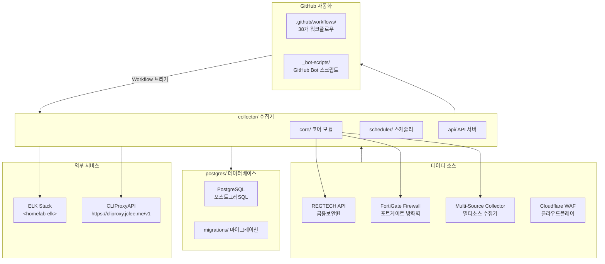
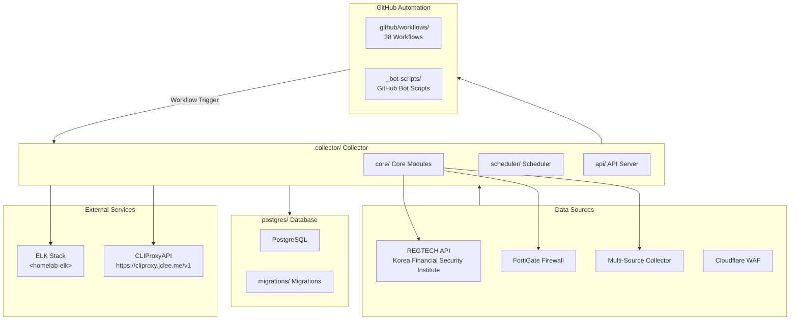

# Blacklist Service Management

Korean | [English](#english)

---

## Korean (한국어)

### 개요

**Blacklist Service Management**는 금융보안원(REGTECH) 기반 IP 블랙리스트 데이터를 수집, 처리, 분산하는 위협 인텔리전스 플랫폼입니다. FortiGate 방화벽 및 Cloudflare WAF와 연동하여 악성 IP 목록을 자동 수집합니다.

### 주요 기능

- **멀티 소스 수집**: REGTECH, FortiGate, 다중 외부 소스로부터 IP 블랙리스트 자동 수집
- **데이터 품질 관리**: 수집된 데이터의 무결성 검증 및 중복 제거
- **자동 아카이브**: 일별/월별 백업 및 증분 아카이브 지원
- **정책 모니터링**: 블랙리스트 정책 변경 사항 실시간 추적
- **Rate Limiting**: API 호출 제한으로 서비스 안정성 확보
- **데이터베이스 관리**: PostgreSQL 기반 스토리지 및 마이그레이션
- **Docker 배포**: 컨테이너화된 애플리케이션 및 데이터베이스

### 아키텍처



### 프로젝트 구조

```
/
├── collector/              # 메인 데이터 수집기 (Python)
│   ├── core/              # 코어 모듈
│   │   ├── fortigate/     # FortiGate 수집기
│   │   ├── regtech/       # REGTECH 수집기
│   │   ├── multi_source/  # 멀티소스 수집기
│   │   └── database/      # 데이터베이스 레이어
│   ├── scheduler/         # 작업 스케줄러
│   ├── api/               # API 서버
│   ├── health_server.py   # 헬스 체크 서버
│   ├── run_collector.py   # 수집기 진입점
│   ├── config.py          # 설정 관리
│   └── requirements.txt   # Python 의존성
├── postgres/              # PostgreSQL 데이터베이스
│   ├── initdb/            # 초기화 스크립트
│   │   ├── 01-extensions.sql
│   │   ├── 02-schema.sql
│   │   └── 03-migrations.sql
│   ├── migrations/        # 스키마 마이그레이션
│   │   ├── 001_add_data_source_column.sql
│   │   ├── 002_add_missing_columns.sql
│   │   ├── 003_add_display_order.sql
│   │   ├── 004_update_active_blacklist_view.sql
│   │   ├── 005_add_composite_indexes.sql
│   │   └── 006_fix_is_active_inconsistency.sql
│   └── Dockerfile
├── _bot-scripts/          # GitHub 자동화 봇 스크립트
│   ├── pyproject.toml
│   ├── requirements.txt
│   ├── requirements-dev.txt
│   ├── docker-compose.github_app.yml
│   ├── Dockerfile.github_action
│   └── Dockerfile.github_app
├── Makefile               # 개발 명령어 집합
├── pyproject.toml         # Python 프로젝트 설정
├── mypy.ini               # mypy 타입 체크 설정
├── commitlint.config.js   # 커밋 메시지lint 설정
├── AGENTS.md              # 프로젝트 지식 베이스
├── CHANGELOG.md           # 변경 로그
├── CONTRIBUTING.md        # 기여 가이드
├── VERSION                # 버전 파일
├── LICENSE                # 라이선스
└── OWNERS                 # 소유자 설정
```

### 자동화 인벤토리

#### GitHub Actions 워크플로우 (38개)

| 파일명 | 설명 |
|--------|------|
| `01_branch-to-pr.yml` | 브랜치에서 PR로 자동 전환 |
| `02_issue-to-branch.yml` | 이슈 기반 브랜치 생성 |
| `03_pr-checks.yml` | PR 체크 실행 (lint, test, build) |
| `04_actionlint.yml` | 워크플로우 YAMLLint |
| `05_gitleaks.yml` | 시크릿/민감정보 스캔 |
| `06_codeql.yml` | CodeQL 보안 분석 |
| `07_dependency-review.yml` | 의존성 보안 검토 |
| `08_scorecard.yml` | OpenSSF Scorecard 분석 |
| `09_semantic-pr.yml` | 시맨틱 PR 검증 |
| `10_pr-review.yml` | 자동 PR 리뷰 (PR Agent) |
| `12_dependabot-auto-merge.yml` | Dependabot 자동 머지 |
| `13_pr-auto-merge.yml` | PR 자동 머지 |
| `14_bot-auto-fix.yml` | 봇 자동 수정 |
| `15_merged-pr-cleanup.yml` | 머지 후 브랜치 정리 |
| `18_issue-management.yml` | 이슈 관리 자동화 |
| `19_issue-backfill.yml` | 이슈 백필 자동화 |
| `20_readme-gen.yml` | README 자동 생성 |
| `21_docs-sync.yml` | 문서 동기화 |
| `24_release-notes.yml` | Release Notes 생성 |
| `25_release-publish.yml` | Release 게시 |
| `29_downstream-health-check.yml` | 다운스트림 헬스 체크 |
| `37_ci-failure-issues.yml` | CI 실패 시 이슈 생성 |
| `42_reusable-docs-sync.yml` | 재사용 가능한 문서 동기화 |
| `43_reusable-issue-management.yml` | 재사용 가능한 이슈 관리 |
| `44_reusable-pr-checks.yml` | 재사용 가능한 PR 체크 |
| `45_reusable-gitleaks.yml` | 재사용 가능한 Gitleaks |
| `60_ci-auto-heal.yml` | CI 자동 복구 |
| `91_issue-classification.yml` | 이슈 분류 |
| `_ci-node.yml` | Node.js CI 템플릿 |
| `auto-merge.yml` | 자동 머지 |
| `build-images.yml` | Docker 이미지 빌드 |
| `ci.yml` | 기본 CI |
| `labeler.yml` | PR 라벨러 |
| `release.yml` | 릴리스 워크플로우 |
| `security.yml` | 보안 스캔 |
| `standard-ci.yml` | 표준 CI |
| `welcome.yml` | 신규 기여자 환영 |
| `security/11_pr-review.yml` | 보안 PR 리뷰 |

#### 재사용 가능한 워크플로우 템플릿

| 템플릿 | 설명 |
|--------|------|
| `_auto-approve-runs.yml` | 실행 자동 승인 |
| `_auto-merge.yml` | 자동 머지 |
| `_branch-cleanup.yml` | 브랜치 정리 |
| `_ci-python.yml` | Python CI |
| `_commitlint.yml` | 커밋lint |
| `_dependabot-auto-fix.yml` | Dependabot 자동 수정 |
| `_elk-ingest.yml` | ELK 인제스트 |
| `_issue-label.yml` | 이슈 자동 라벨링 |
| `_issue-lifecycle.yml` | 이슈 수명 주기 |
| `_labeler.yml` | PR 라벨러 |
| `_lock-threads.yml` | 스레드 잠금 |
| `_pr-size.yml` | PR 크기 라벨러 |
| `_release-drafter.yml` | Release 드래프터 |
| `_stale.yml` |陳舊 이슈 정리 |
| `_welcome.yml` | 신규 기여자 환영 |

### 외부 서비스 연동

| 서비스 | 엔드포인트 | 용도 |
|--------|-----------|------|
| CLIProxy API | `https://cliproxy.jclee.me/v1` | AI 모델 라우팅 (README-gen) |
| ELK Stack | `<homelab-elk>` | 로그 수집 및 모니터링 |

### 빠른 시작

#### 전제 조건

- Docker 및 Docker Compose
- Python 3.11+
- Git

#### 환경 설정

```bash
# 저장소 클론
git clone <repository-url>
cd <repository-name>

# Docker Compose로 실행
docker compose -f deploy/docker-compose.yml --env-file deploy/.env up -d

# 또는 Makefile 사용
make dev
```

#### 개발 환경 실행

```bash
# git hooks 설정
make setup-hooks

# 개발 환경 시작 (핫 리로드)
make dev

# 빠른 시작 (재빌드 없음)
make dev-no-build
```

### 로컬 개발

#### Python 환경 설정

```bash
# 가상환경 생성
python -m venv venv
source venv/bin/activate  # Linux/macOS
# or
.\venv\Scripts\activate   # Windows

# 의존성 설치
pip install -r collector/requirements.txt

# 타입 체크
mypy collector/

# 린트 체크
ruff check collector/

# 테스트 실행
pytest tests/ -m "unit"
```

#### 데이터베이스 마이그레이션

```bash
# 마이그레이션 실행
docker compose -f deploy/docker-compose.yml exec postgres psql -U postgres -d blacklist -f /docker-entrypoint-initdb.d/01-extensions.sql

# 또는 직접 실행
psql -h localhost -U postgres -d blacklist -f postgres/initdb/01-extensions.sql
psql -h localhost -U postgres -d blacklist -f postgres/initdb/02-schema.sql
psql -h localhost -U postgres -d blacklist -f postgres/initdb/03-migrations.sql
```

### 명령어 참조

| 명령어 | 설명 |
|--------|------|
| `make help` | 사용 가능한 명령어 목록 |
| `make setup-hooks` | Git hooks 설치 |
| `make dev` | 개발 환경 시작 (핫 리로드) |
| `make dev-no-build` | 기존 이미지로 개발 환경 시작 |
| `make dev-prod` | 프로덕션 유사 환경 시작 |
| `make dev-app` | 앱 서비스만 재시작 |
| `make up` | Docker 서비스 시작 |
| `make down` | Docker 서비스 중지 |
| `make logs` | Docker 로그 보기 |
| `make clean` | Docker 리소스 정리 |
| `make test` | 테스트 실행 |
| `make verify` | 전체 검증 (lint, types, secrets) |
| `make verify-lint` | Ruff 린트 체크 |
| `make verify-types` | mypy 타입 체크 |
| `make verify-secrets` | Gitleaks 시크릿 스캔 |
| `make verify-pre-commit` | Pre-commit 체크 |
| `make verify-quick` | 빠른 검증 |
| `make verify-all` | 전체 검증 실행 |
| `make health` | 헬스 체크 |
| `make release` | 릴리스 실행 |
| `make release-dry` | 릴리스 드라이런 |
| `make restart` | 모든 서비스 재시작 |

### 기여 가이드

기여를 환영합니다! 자세한 내용은 [CONTRIBUTING.md](CONTRIBUTING.md)를 참고하세요.

#### 커밋 메시지 규칙

이 프로젝트는 **Conventional Commits** 규칙을 사용합니다:

```
<type>(<scope>): <subject>

[optional body]

[optional footer]
```

**유형:**

- `feat`: 새 기능
- `fix`: 버그 수정
- `docs`: 문서 변경
- `style`: 코드 스타일 변경 (기능에 영향 없음)
- `refactor`: 코드 리팩토링
- `perf`: 성능 개선
- `test`: 테스트 추가/수정
- `chore`: 빌드 프로세스 또는 보조 도구 변경

#### 개발 워크플로우

1. **이슈 생성**: 작업 전에 이슈를 생성하세요
2. **브랜치 생성**: `02_issue-to-branch.yml`이 자동 생성하거나 수동으로作成
3. **변경 작성**: 코드를 작성하고 테스트를 추가하세요
4. **PR 제출**: `03_pr-checks.yml`이 자동으로 체크를 실행합니다
5. **리뷰**: `10_pr-review.yml`이 자동 PR 리뷰를 수행합니다
6. **머지**: 요구사항 충족 시 자동 또는 수동 머지

### 라이선스

이 프로젝트는 해당 라이선스 하에 배포됩니다. 자세한 내용은 [LICENSE](LICENSE) 파일을 참고하세요.

---

## English

### Overview

**Blacklist Service Management** is a threat intelligence platform that collects, processes, and distributes IP blacklist data based on Korea Financial Security Institute (REGTECH). It integrates with FortiGate firewalls and Cloudflare WAF to automatically collect malicious IP lists.

### Key Features

- **Multi-Source Collection**: Automatic IP blacklist collection from REGTECH, FortiGate, and multiple external sources
- **Data Quality Management**: Data integrity validation and deduplication
- **Automatic Archiving**: Daily/monthly backups and incremental archive support
- **Policy Monitoring**: Real-time tracking of blacklist policy changes
- **Rate Limiting**: API call limiting for service stability
- **Database Management**: PostgreSQL-based storage and migrations
- **Docker Deployment**: Containerized application and database

### Architecture



### Project Structure

```
/
├── collector/              # Main data collector (Python)
│   ├── core/              # Core modules
│   │   ├── fortigate/     # FortiGate collector
│   │   ├── regtech/       # REGTECH collector
│   │   ├── multi_source/  # Multi-source collector
│   │   └── database/      # Database layer
│   ├── scheduler/         # Job scheduler
│   ├── api/               # API server
│   ├── health_server.py   # Health check server
│   ├── run_collector.py   # Collector entrypoint
│   ├── config.py          # Configuration management
│   └── requirements.txt   # Python dependencies
├── postgres/              # PostgreSQL database
│   ├── initdb/            # Initialization scripts
│   │   ├── 01-extensions.sql
│   │   ├── 02-schema.sql
│   │   └── 03-migrations.sql
│   ├── migrations/        # Schema migrations
│   │   ├── 001_add_data_source_column.sql
│   │   ├── 002_add_missing_columns.sql
│   │   ├── 003_add_display_order.sql
│   │   ├── 004_update_active_blacklist_view.sql
│   │   ├── 005_add_composite_indexes.sql
│   │   └── 006_fix_is_active_inconsistency.sql
│   └── Dockerfile
├── _bot-scripts/          # GitHub automation bot scripts
│   ├── pyproject.toml
│   ├── requirements.txt
│   ├── requirements-dev.txt
│   ├── docker-compose.github_app.yml
│   ├── Dockerfile.github_action
│   └── Dockerfile.github_app
├── Makefile               # Development commands
├── pyproject.toml         # Python project configuration
├── mypy.ini               # mypy type checking configuration
├── commitlint.config.js   # Commit message lint configuration
├── AGENTS.md              # Project knowledge base
├── CHANGELOG.md           # Change log
├── CONTRIBUTING.md        # Contribution guide
├── VERSION                # Version file
├── LICENSE                # License
└── OWNERS                 # Owners configuration
```

### Automation Inventory

#### GitHub Actions Workflows (38 total)

| Filename | Description |
|----------|-------------|
| `01_branch-to-pr.yml` | Auto-convert branch to PR |
| `02_issue-to-branch.yml` | Create branch from issue |
| `03_pr-checks.yml` | PR checks (lint, test, build) |
| `04_actionlint.yml` | Workflow YAML lint |
| `05_gitleaks.yml` | Secret/sensitive data scan |
| `06_codeql.yml` | CodeQL security analysis |
| `07_dependency-review.yml` | Dependency security review |
| `08_scorecard.yml` | OpenSSF Scorecard analysis |
| `09_semantic-pr.yml` | Semantic PR validation |
| `10_pr-review.yml` | Auto PR review (PR Agent) |
| `12_dependabot-auto-merge.yml` | Dependabot auto-merge |
| `13_pr-auto-merge.yml` | PR auto-merge |
| `14_bot-auto-fix.yml` | Bot auto-fix |
| `15_merged-pr-cleanup.yml` | Post-merge branch cleanup |
| `18_issue-management.yml` | Issue management automation |
| `19_issue-backfill.yml` | Issue backfill automation |
| `20_readme-gen.yml` | Auto README generation |
| `21_docs-sync.yml` | Documentation sync |
| `24_release-notes.yml` | Release notes generation |
| `25_release-publish.yml` | Release publishing |
| `29_downstream-health-check.yml` | Downstream health check |
| `37_ci-failure-issues.yml` | Create issue on CI failure |
| `42_reusable-docs-sync.yml` | Reusable docs sync |
| `43_reusable-issue-management.yml` | Reusable issue management |
| `44_reusable-pr-checks.yml` | Reusable PR checks |
| `45_reusable-gitleaks.yml` | Reusable Gitleaks |
| `60_ci-auto-heal.yml` | CI auto-heal |
| `91_issue-classification.yml` | Issue classification |
| `_ci-node.yml` | Node.js CI template |
| `auto-merge.yml` | Auto merge |
| `build-images.yml` | Docker image build |
| `ci.yml` | Base CI |
| `labeler.yml` | PR labeler |
| `release.yml` | Release workflow |
| `security.yml` | Security scan |
| `standard-ci.yml` | Standard CI |
| `welcome.yml` | New contributor welcome |
| `security/11_pr-review.yml` | Security PR review |

#### Reusable Workflow Templates

| Template | Description |
|----------|-------------|
| `_auto-approve-runs.yml` | Auto approve runs |
| `_auto-merge.yml` | Auto merge |
| `_branch-cleanup.yml` | Branch cleanup |
| `_ci-python.yml` | Python CI |
| `_commitlint.yml` | Commit lint |
| `_dependabot-auto-fix.yml` | Dependabot auto-fix |
| `_elk-ingest.yml` | ELK ingest |
| `_issue-label.yml` | Issue auto-label |
| `_issue-lifecycle.yml` | Issue lifecycle |
| `_labeler.yml` | PR labeler |
| `_lock-threads.yml` | Thread lock |
| `_pr-size.yml` | PR size labeler |
| `_release-drafter.yml` | Release drafter |
| `_stale.yml` | Stale issue cleanup |
| `_welcome.yml` | New contributor welcome |

### External Service Integrations

| Service | Endpoint | Purpose |
|---------|----------|---------|
| CLIProxy API | `https://cliproxy.jclee.me/v1` | AI model routing (README-gen) |
| ELK Stack | `<homelab-elk>` | Log collection and monitoring |

### Quick Start

#### Prerequisites

- Docker and Docker Compose
- Python 3.11+
- Git

#### Setup

```bash
# Clone repository
git clone <repository-url>
cd <repository-name>

# Run with Docker Compose
docker compose -f deploy/docker-compose.yml --env-file deploy/.env up -d

# Or use Makefile
make dev
```

#### Development Environment

```bash
# Setup git hooks
make setup-hooks

# Start development (hot reload)
make dev

# Quick start (no rebuild)
make dev-no-build
```

### Local Development

#### Python Environment Setup

```bash
# Create virtual environment
python -m venv venv
source venv/bin/activate  # Linux/macOS
# or
.\venv\Scripts\activate   # Windows

# Install dependencies
pip install -r collector/requirements.txt

# Type checking
mypy collector/

# Lint checking
ruff check collector/

# Run tests
pytest tests/ -m "unit"
```

#### Database Migration

```bash
# Run migrations
docker compose -f deploy/docker-compose.yml exec postgres psql -U postgres -d blacklist -f /docker-entrypoint-initdb.d/01-extensions.sql

# Or run directly
psql -h localhost -U postgres -d blacklist -f postgres/initdb/01-extensions.sql
psql -h localhost -U postgres -d blacklist -f postgres/initdb/02-schema.sql
psql -h localhost -U postgres -d blacklist -f postgres/initdb/03-migrations.sql
```

### Commands Reference

| Command | Description |
|---------|-------------|
| `make help` | List available commands |
| `make setup-hooks` | Install Git hooks |
| `make dev` | Start development (hot reload) |
| `make dev-no-build` | Start with existing images |
| `make dev-prod` | Start production-like environment |
| `make dev-app` | Restart app service only |
| `make up` | Start Docker services |
| `make down` | Stop Docker services |
| `make logs` | View Docker logs |
| `make clean` | Clean Docker resources |
| `make test` | Run tests |
| `make verify` | Full verification (lint, types, secrets) |
| `make verify-lint` | Ruff lint check |
| `make verify-types` | mypy type check |
| `make verify-secrets` | Gitleaks secret scan |
| `make verify-pre-commit` | Pre-commit checks |
| `make verify-quick` | Quick verification |
| `make verify-all` | Run all verifications |
| `make health` | Health check |
| `make release` | Run release |
| `make release-dry` | Dry run release |
| `make restart` | Restart all services |

### Contributing

Contributions are welcome! Please see [CONTRIBUTING.md](CONTRIBUTING.md) for details.

#### Commit Message Convention

This project uses **Conventional Commits**:

```
<type>(<scope>): <subject>

[optional body]

[optional footer]
```

**Types:**

- `feat`: New feature
- `fix`: Bug fix
- `docs`: Documentation changes
- `style`: Code style changes (no functional change)
- `refactor`: Code refactoring
- `perf`: Performance improvement
- `test`: Test addition/modification
- `chore`: Build process or auxiliary tool changes

#### Development Workflow

1. **Create Issue**: Create an issue before starting work
2. **Create Branch**: `02_issue-to-branch.yml` auto-creates or manually create
3. **Write Changes**: Write code and add tests
4. **Submit PR**: `03_pr-checks.yml` automatically runs checks
5. **Review**: `10_pr-review.yml` performs automatic PR review
6. **Merge**: Auto or manual merge when requirements are met

### License

This project is distributed under its respective license. See [LICENSE](LICENSE) file for details.

---

Korean | [English](#english)
