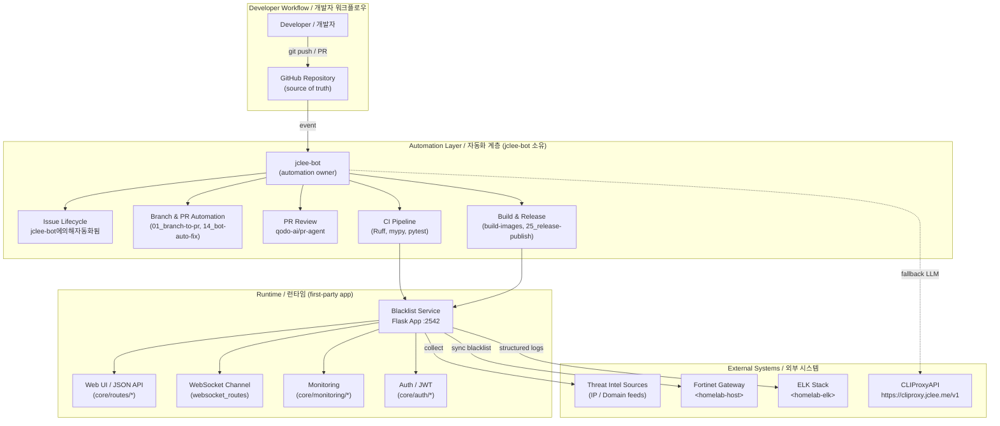

# Blacklist Service / 블랙리스트 서비스

[](#jclee-bot-automation-surfaces--jclee-bot-자동화-영역)
[](#local-development--로컬-개발)
[](#quick-start--빠른-시작)
[](pyproject.toml)
[](mypy.ini)
[](commitlint.config.js)
[](https://github.com/qodo-ai/pr-agent)
[](https://cliproxy.jclee.me/v1)
[](https://bot.jclee.me)
[](LICENSE)

> **TL;DR / 요약**
> A self-hosted Python (Flask) web service that centralises **blacklist management**, **source collection**, and **Fortinet gateway push**, with JWT-based access control, structured logging, and a real-time WebSocket monitoring dashboard. All mutating repository automation is owned by the **jclee-bot** account.
>
> Fortinet 게이트웨이 푸시, JWT 기반 접근 제어, 구조화된 로깅, 실시간 WebSocket 모니터링 대시보드를 갖춘 셀프 호스팅 Python(Flask) 웹 서비스로, **블랙리스트 관리**와 **소스 수집**을 중앙 집중화합니다. 모든 저장소 변형(mutating) 자동화는 **jclee-bot** 계정이 소유합니다.

---

## Overview / 개요

Blacklist Service is a Flask-based application that ingests IP / domain threat intelligence from external sources, normalises and stores it, and pushes curated entries to a Fortinet gateway on demand or on schedule. It ships with:

- a server-rendered **Web UI** (Jinja templates, sessions, settings, monitoring dashboard)
- a **JSON API** with a per-area module layout (`auth`, `monitoring`, `collection`, `blacklist`, `fortinet`, `settings`, `system`, `analytics`, …)
- a **WebSocket channel** for live metrics and cache/error observability
- a **deployment validation pipeline** (`app/deployment_validation.py`) executed on container startup
- **structured logging** with a log-rotation manager that ships to an external aggregator

Blacklist Service는 외부 소스에서 IP/도메인 위협 인텔리전스를 수집·정규화·저장하고, 필요 시 또는 스케줄에 따라 Fortinet 게이트웨이로 푸시하는 Flask 기반 애플리케이션입니다. 다음을 함께 제공합니다.

- 서버 렌더링 **Web UI** (Jinja 템플릿, 세션, 설정, 모니터링 대시보드)
- 영역별 모듈 구조의 **JSON API** (`auth`, `monitoring`, `collection`, `blacklist`, `fortinet`, `settings`, `system`, `analytics` 등)
- 실시간 메트릭 및 캐시/에러 관측성을 위한 **WebSocket 채널**
- 컨테이너 시작 시 실행되는 **배포 검증 파이프라인** (`app/deployment_validation.py`)
- 외부 집계기로 전송하는 **구조화 로깅** 및 로그 로테이션 매니저

The repository is **app-first**: the Python service is the only first-party runtime, while **jclee-bot** is the single account that owns every mutating automation surface (issues, branches, PRs, releases, Dependabot, security follow-ups). Workflow files under `.github/workflows/` are **implementation triggers**, not the source of truth — they wire jclee-bot intents to GitHub events.

이 저장소는 **앱 우선(app-first)** 입니다. Python 서비스가 유일한 1급 런타임이며, **jclee-bot** 은 모든 변형(mutating) 자동화 영역(이슈, 브랜치, PR, 릴리스, Dependabot, 보안 후속조치)을 단독으로 소유하는 계정입니다. `.github/workflows/` 의 워크플로 파일은 **구현 트리거**일 뿐 진실의 원천은 아닙니다 — jclee-bot 의 의도를 GitHub 이벤트에 연결하는 배선에 불과합니다.

---

## Features / 주요 기능

- **Blacklist curation / 블랙리스트 큐레이션** — import, dedupe, tag, expire, and version-control malicious IP / domain entries.
- **Source collection / 소스 수집** — pull-based collectors (cron / trigger) that normalise heterogeneous feeds into a unified schema.
- **Fortinet push / Fortinet 푸시** — register / sync curated entries against a Fortinet gateway exposed at `<homelab-host>`.
- **JWT auth / JWT 인증** — token issuance, decorators, middleware, and session-aware web routes.
- **Monitoring & metrics / 모니터링·메트릭** — `cache_metrics`, `error_metrics`, Prometheus-style metrics, plus a live WebSocket dashboard.
- **Settings & integrations / 설정·통합** — UI for integrations, credentials, and per-source toggles.
- **Deployment validation / 배포 검증** — startup hook that fails-fast on misconfiguration before serving traffic.
- **Structured logging / 구조화 로깅** — JSON logs with rotation (`utils/log_rotation_manager.py`, `utils/structured_logging.py`).
- **CI-as-policy / 정책을 코드로 표현한 CI** — Ruff, mypy, commitlint, and conventional-commits enforced on every push.

---

## Architecture / 아키텍처



> Read this top-to-bottom: developers push to GitHub → jclee-bot reacts to events (issues, PRs, Dependabot, security advisories) → CI / build / release artifacts are produced → the Flask app serves the UI, API, and WebSocket → it pulls from threat sources, pushes to Fortinet, and ships logs to ELK. The CLIProxyAPI endpoint is used as a **fallback LLM gateway** for automation that needs model calls.
>
> 위에서 아래로 읽으세요: 개발자가 GitHub 에 푸시 → jclee-bot 이 이벤트(issues, PRs, Dependabot, 보안 권고)에 반응 → CI / 빌드 / 릴리스 산출물 생성 → Flask 앱이 UI·API·WebSocket 제공 → 위협 소스 수집, Fortinet 푸시, ELK 로그 전송. CLIProxyAPI 엔드포인트는 모델 호출이 필요한 자동화의 **폴백 LLM 게이트웨이** 로 사용됩니다.

---

## Repository Structure / 저장소 구조

The tree below reflects the **actual** top-level layout of this repository. Workflow files are deliberately **not** listed as rows — they are described in [jclee-bot Automation Surfaces](#jclee-bot-automation-surfaces--jclee-bot-자동화-영역).

아래 트리는 이 저장소의 **실제** 최상위 레이아웃을 반영합니다. 워크플로 파일은 의도적으로 행으로 나열하지 않으며, [jclee-bot 자동화 영역](#jclee-bot-automation-surfaces--jclee-bot-자동화-영역) 에서 설명합니다.

```text
.
├── AGENTS.md
├── CHANGELOG.md
├── CONTRIBUTING.md
├── LICENSE
├── Makefile
├── OWNERS
├── README.md
├── VERSION
├── commitlint.config.js
├── mypy.ini
├── pyproject.toml
└── app/
    ├── AGENTS.md
    ├── Dockerfile
    ├── __init__.py
    ├── deployment_validation.py
    ├── entrypoint.sh
    ├── requirements.txt
    ├── run_app.py
    ├── core/
    │   ├── AGENTS.md
    │   ├── app.py
    │   ├── auth_manager.py
    │   ├── config.py
    │   ├── dashboard.py
    │   ├── testing_app.py
    │   ├── auth/
    │   │   ├── decorators.py
    │   │   ├── jwt_service.py
    │   │   └── middleware.py
    │   ├── monitoring/
    │   │   ├── cache_metrics.py
    │   │   ├── error_metrics.py
    │   │   └── metrics.py
    │   └── routes/
    │       ├── api_routes.py
    │       ├── proxy_routes.py
    │       ├── system_routes.py
    │       ├── web_routes.py
    │       ├── websocket_routes.py
    │       ├── api/
    │       │   ├── analytics.py
    │       │   ├── auth_routes.py
    │       │   ├── core_api.py
    │       │   ├── dashboard_api.py
    │       │   ├── database_api.py
    │       │   ├── error_metrics_api.py
    │       │   ├── fortinet_register.py
    │       │   ├── ip_management_helpers.py
    │       │   ├── migration.py
    │       │   ├── settings_api.py
    │       │   ├── system_api.py
    │       │   ├── collection/
    │       │   ├── blacklist/
    │       │   └── fortinet/
    │       └── collection_routes_simple.py
    ├── templates/
    │   ├── collection.html
    │   ├── collection_logs.html
    │   ├── index.html
    │   ├── integrations.html
    │   ├── sessions.html
    │   ├── settings.html
    │   └── monitoring/
    │       └── dashboard.html
    └── utils/
        ├── log_rotation_manager.py
        └── structured_logging.py
```

---

## jclee-bot Automation Surfaces / jclee-bot 자동화 영역

All **mutating** automation on this repository — opening branches, drafting issues, normalising PRs, merging Dependabot, drafting release notes, and triaging CI failures — is owned by the **jclee-bot** account. The 18 workflow files under `.github/workflows/` exist only to wire jclee-bot intents to GitHub events; they are **not** the source of truth and are intentionally **not** enumerated as a table here.

이 저장소의 모든 **변형(mutating) 자동화** — 브랜치 생성, 이슈 작성, PR 정규화, Dependabot 머지, 릴리스 노트 초안, CI 실패 분류 — 는 **jclee-bot** 계정이 단독 소유합니다. `.github/workflows/` 의 18 개 워크플로 파일은 jclee-bot 의 의도를 GitHub 이벤트에 연결하는 배선일 뿐이며, 진실의 원천이 아니므로 의도적으로 표로 열거하지 않습니다.

### Issue automation behavior / 이슈 자동화 동작

- The jclee-bot bot account is the **only** identity that opens, labels, transfers, or closes automation-driven issues.
- Behaviour label on automation-driven issues: **`jclee-bot에의해자동화됨`**.
- Bot-authored issues are typically mirrored to downstream consumers (e.g. `bot.jclee.me`) so triage and SLA are observable end-to-end.

- jclee-bot 은 자동화로 생성된 이슈를 **오직 이 계정만** 열고, 라벨링하고, 이전하고, 닫습니다.
- 자동화 기반 이슈의 동작 라벨: **`jclee-bot에의해자동화됨`**.
- 봇이 작성한 이슈는 일반적으로 다운스트림 컨슈머(예: `bot.jclee.me`)에 미러링되어 분류와 SLA 가 종단간에 관측됩니다.

### Surface groups (descriptive, not exhaustive) / 영역 그룹 (서술형, 전수 나열 아님)

- **Branch / PR / 브랜치·PR** — `01_branch-to-pr.yml`, `02_issue-to-branch.yml`, `14_bot-auto-fix.yml`, `15_merged-pr-cleanup.yml`.
- **PR review / PR 리뷰** — `10_pr-review.yml` (qodo-ai/pr-agent), `11_security-pr-review.yml`.
- **Dependency & merge automation / 의존성·머지 자동화** — `12_dependabot-auto-merge.yml`, `13_pr-auto-merge.yml`.
- **Backfill & release / 백필·릴리스** — `19_issue-backfill.yml`, `24_release-notes.yml`, `25_release-publish.yml`, `release.yml`.
- **Build & CI / 빌드·CI** — `ci.yml`, `_ci-node.yml`, `build-images.yml`, `security.yml`.
- **Health & failure triage / 헬스·실패 분류** — `29_downstream-health-check.yml`, `37_ci-failure-issues.yml`.

> The list above is **intentionally descriptive, not a row-by-row inventory**. Adding, renaming, or refactoring a workflow file does not change ownership: jclee-bot is and remains the only mutating actor. If you want to disable a specific surface, change the owning workflow's trigger / condition, not the bot identity.
>
> 위 목록은 **의도적으로 서술형이며, 행 단위 전수 목록이 아닙니다.** 워크플로 파일을 추가·이름변경·리팩터링해도 소유권은 변하지 않습니다 — jclee-bot 이 변형 행위자의 유일한 주체입니다. 특정 영역을 비활성화하려면 소유 워크플로의 트리거/조건을 바꾸고, 봇 정체성을 바꾸지 마세요.

---

## Go Tools / Go 도구

This repository does **not** ship any first-party Go automation tools. The automation layer is entirely GitHub Actions workflows driven by jclee-bot; no `cmd/`, `internal/`, or Go binary is checked in. If a Go tool is needed for a future surface, it should live in a dedicated repository and be invoked as a release artifact, not vendored here.

이 저장소는 **1 급 Go 자동화 도구를 제공하지 않습니다.** 자동화 계층은 전적으로 jclee-bot 이 구동하는 GitHub Actions 워크플로이며, 커밋된 Go 바이너리나 `cmd/`, `internal/` 디렉터리는 없습니다. 향후 Go 도구가 필요하다면 전용 저장소에서 릴리스 산출물로 호출되어야 하며, 이 저장소에 vendoring 되지 않습니다.

---

## Quick Start / 빠른 시작

The fastest way to run Blacklist Service is via the bundled Docker Compose stack.

가장 빠르게 Blacklist Service 를 실행하는 번들된 Docker Compose 스택입니다.

```bash
# 1. Clone
git clone <your-fork-url> blacklist-service
cd blacklist-service

# 2. Prepare env (compose file expects deploy/.env)
cp deploy/.env.example deploy/.env   # edit secrets/host placeholders

# 3. Build & start in the background
make dev

# 4. Verify
make health
```

After `make dev` succeeds, the Flask app is reachable on `http://localhost:2542` (override with `PORT` in `deploy/.env`).

`make dev` 가 성공하면 Flask 앱은 `http://localhost:2542` 에서 접근할 수 있습니다 (`deploy/.env` 의 `PORT` 로 오버라이드).

For an existing-image, no-rebuild start:

이미 빌드된 이미지로 재빌드 없이 시작하려면:

```bash
make dev-no-build
```

For a production-like, no-hot-reload run:

프로덕션과 유사한, 핫 리로드 없는 실행:

```bash
make dev-prod
```

---

## Local Development / 로컬 개발

Local development targets **Python 3.11+** and uses **pre-commit** for Python-side hooks. The `Makefile` target `setup-hooks` installs everything you need.

로컬 개발은 **Python 3.11+** 을 대상으로 하며 Python 측은 **pre-commit** 으로 훅을 관리합니다. `Makefile` 의 `setup-hooks` 타겟이 필요한 모든 것을 설치합니다.

```bash
# One-time setup
make setup-hooks

# Run the verification matrix the CI runs locally
make verify-all
```

`make verify-all` chains `verify-lint`, `verify-types`, `verify-secrets`, and `verify-pre-commit`. A faster smoke run is available as `make verify-quick`.

`make verify-all` 은 `verify-lint`, `verify-types`, `verify-secrets`, `verify-pre-commit` 을 차례로 실행합니다. 더 빠른 스모크 검증은 `make verify-quick` 으로 실행할 수 있습니다.

### Per-area notes / 영역별 노트

- **Auth / 인증** — `app/core/auth/` houses `jwt_service.py`, `decorators.py`, and `middleware.py`. Routes that require a session cookie or bearer token compose these directly.
- **Monitoring / 모니터링** — `app/core/monitoring/` exposes `cache_metrics`, `error_metrics`, and `metrics.py` aggregators; the WebSocket channel streams snapshots to `templates/monitoring/dashboard.html`.
- **Collection / 수집** — `app/core/routes/api/collection/` splits collectors into `config`, `credentials`, `history`, `sources`, `status`, `sync`, `trigger`, and `utils`.
- **Blacklist / 블랙리스트** — `app/core/routes/api/blacklist/` separates `batch`, `collection`, `core`, `management`, and `system` concerns.
- **Fortinet / Fortinet** — `app/core/routes/api/fortinet/core.py` and `fortinet_register.py` push curated entries to the Fortinet gateway at `<homelab-host>`.
- **Logging / 로깅** — `app/utils/structured_logging.py` emits JSON; `app/utils/log_rotation_manager.py` handles retention. The container ships them to the ELK stack at `<homelab-elk>`.

---

## Commands Reference / 명령어 참조

Run `make help` at any time to regenerate the list below from the `Makefile`.

아래 목록은 `Makefile` 에서 생성되며, 언제든지 `make help` 로 재생성할 수 있습니다.

| Command / 명령어 | Purpose / 용도 |
| --- | --- |
| `make setup-hooks` | Install pre-commit + commit-msg hooks (Python Ruff, mypy, secrets). |
| `make dev` | Start dev stack with hot reload (rebuilds changed images). |
| `make dev-no-build` | Start dev stack with existing images (fastest). |
| `make dev-prod` | Start production-like stack, no hot reload. |
| `make dev-app` | Restart only the `app` service (quick iteration). |
| `make build` | Build images defined in `deploy/docker-compose.yml`. |
| `make up` | Bring the stack up (no rebuild). |
| `make down` | Tear the stack down. |
| `make restart` | Restart all services. |
| `make logs` | Tail logs from all services. |
| `make health` | Hit the app's health endpoint. |
| `make test` | Run the pytest matrix (`unit`, `integration`, `security`, `db`, `api` markers). |
| `make deploy` | Deploy the stack (uses `deploy/` overlay). |
| `make release` | Cut a release (drives `25_release-publish.yml` via jclee-bot). |
| `make release-dry` | Dry-run a release. |
| `make verify-lint` | Run Ruff against `app/`. |
| `make verify-types` | Run mypy against `app/`. |
| `make verify-secrets` | Run secret-detection (pre-commit). |
| `make verify-pre-commit` | Run the full pre-commit matrix. |
| `make verify-quick` | Fast smoke verification (subset of the above). |
| `make verify-all` | Run every verification step (lint + types + secrets + pre-commit). |
| `make clean` | Remove build artefacts, dangling images, and volumes (irreversible). |

> **Note / 참고**: `make release` and `make deploy` coordinate with jclee-bot. They do not bypass the bot; they queue the intent that the bot then executes via the appropriate workflow.
>
> `make release` 와 `make deploy` 는 jclee-bot 과 협력합니다. 봇을 우회하지 않으며, 봇이 적절한 워크플로를 통해 실행할 의도를 큐잉합니다.

---

## Contribution Guide / 기여 가이드

We welcome issues and pull requests. The flow is designed so that **jclee-bot** handles routine mutation and humans focus on intent and review.

이슈와 풀 리퀘스트를 환영합니다. 워크플로는 **jclee-bot** 이 일상적인 변형을 처리하고, 사람은 의도와 리뷰에 집중하도록 설계되어 있습니다.

### Commit style / 커밋 스타일

- All commit messages **must** follow the **Conventional Commits** spec, enforced by `commitlint.config.js`.
- All commits **must** pass the pre-commit matrix (Ruff, mypy, secret-detection).
- A single commit should address a single concern; squash noise commits before review.

- 모든 커밋 메시지는 `commitlint.config.js` 가 강제하는 **Conventional Commits** 스펙을 따라야 합니다.
- 모든 커밋은 pre-commit 매트릭스(Ruff, mypy, secret-detection)를 통과해야 합니다.
- 한 커밋은 한 가지 사안만 다루어야 합니다. 리뷰 전에 노이즈 커밋은 스쿼시하세요.

### Branch & PR / 브랜치·PR

- Branches are typically auto-created by jclee-bot from issues (`02_issue-to-branch.yml`).
- PRs are auto-opened and normalised by jclee-bot (`01_branch-to-pr.yml`, `14_bot-auto-fix.yml`).
- PR review is automated via [qodo-ai/pr-agent](https://github.com/qodo-ai/pr-agent); human reviewers are listed in `OWNERS`.
- `13_pr-auto-merge.yml` will merge once CI is green, reviews are approved, and the PR is labeled appropriately — this is intentional, not an accident.

- 브랜치는 일반적으로 jclee-bot 이 이슈로부터 자동 생성합니다 (`02_issue-to-branch.yml`).
- PR 은 jclee-bot 이 자동 개설·정규화합니다 (`01_branch-to-pr.yml`, `14_bot-auto-fix.yml`).
- PR 리뷰는 [qodo-ai/pr-agent](https://github.com/qodo-ai/pr-agent) 로 자동화되며, 사람 리뷰어는 `OWNERS` 에 기재되어 있습니다.
- `13_pr-auto-merge.yml` 은 CI 가 통과되고 리뷰가 승인되며 적절한 라벨이 붙으면 자동 머지합니다 — 이는 의도된 동작이며 사고가 아닙니다.

### Issue reporting / 이슈 보고

- Use the appropriate issue template; jclee-bot will triage, label, and (where appropriate) auto-convert it to a branch.
- Bot-driven issues are marked with the `jclee-bot에의해자동화됨` label so contributors can distinguish automation from human intent.

- 적절한 이슈 템플릿을 사용하세요. jclee-bot 이 분류·라벨링 및 (필요 시) 브랜치로 자동 전환합니다.
- 봇이 작성한 이슈는 `jclee-bot에의해자동화됨` 라벨로 표시되어, 기여자가 자동화와 사람의 의도를 구분할 수 있습니다.

### Code style / 코드 스타일

- **Linting**: Ruff (`tool.ruff` in `pyproject.toml`); line length 120, target Python 3.11.
- **Types**: mypy (`mypy.ini`) is enforced for the `app/` package; `app/core/routes/api/*/__init__.py` and `app/core/services/*.py` are relaxed only for known re-export patterns (see per-file ignores).
- **Tests**: pytest with markers `unit`, `integration`, `security`, `db`, `api`. Default options: `-v --tb=short`.
- **Templates**: keep Jinja templates free of business logic; surface behaviour through routes or services.

- **린팅**: Ruff (`pyproject.toml` 의 `tool.ruff`); 줄 길이 120, 대상 Python 3.11.
- **타입**: mypy (`mypy.ini`) 가 `app/` 패키지에 강제됩니다. `app/core/routes/api/*/__init__.py` 및 `app/core/services/*.py` 는 알려진 re-export 패턴에 한해 완화됩니다 (per-file ignore 참조).
- **테스트**: pytest, 마커 `unit`, `integration`, `security`, `db`, `api`. 기본 옵션: `-v --tb=short`.
- **템플릿**: Jinja 템플릿에 비즈니스 로직을 두지 말고, 동작은 라우트·서비스에 위임하세요.

### Security / 보안

- Security-sensitive PRs go through `11_security-pr-review.yml`; do not bypass review by force-pushing past the bot.
- Vulnerabilities are tracked as issues; Dependabot PRs are auto-merged via `12_dependabot-auto-merge.yml` once CI is green.

- 보안 민감 PR 은 `11_security-pr-review.yml` 을 거칩니다. 봇을 force-push 로 우회하지 마세요.
- 취약점은 이슈로 추적되며, Dependabot PR 은 CI 가 통과되면 `12_dependabot-auto-merge.yml` 로 자동 머지됩니다.

### Out of scope / 범위 밖

- **Do not** add Go binaries, `_bot-scripts/`, or other transient CI checkout paths to this repository. They are not first-party code.
- **Do not** invent or link to non-existent GitHub repositories. Use the references below for any external link.

- 이 저장소에 Go 바이너리, `_bot-scripts/` 등 일시적 CI 체크아웃 경로를 추가하지 마세요. 1 급 코드가 아닙니다.
- 존재하지 않는 GitHub 저장소를 만들어 링크하지 마세요. 외부 링크는 아래 참조만 사용하세요.

---

## References / 참고

- PR review tool / PR 리뷰 도구: [qodo-ai/pr-agent](https://github.com/qodo-ai/pr-agent)
- Automation LLM fallback / 자동화 LLM 폴백: [https://cliproxy.jclee.me/v1](https://cliproxy.jclee.me/v1)
- Bot mirror / 봇 미러: [https://bot.jclee.me](https://bot.jclee.me)

---

<sub>README generated by gpt-5.5 (fallback: minimax-m3 via CLIProxyAPI). The source of truth for automation behaviour is the jclee-bot account; this document is descriptive, not normative.</sub>