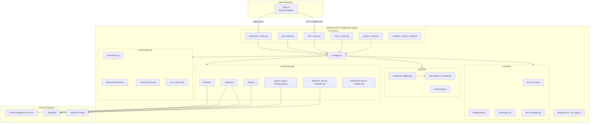

# Blacklist Service Management

> **통합 위협 인텔리전스 수집 · 동기화 · 블랙리스트 중앙 관리 · Fortinet 자동 배포 플랫폼**
> **Unified threat-intelligence aggregation, centralized blacklist management, and Fortinet deployment platform.**

---

## 목차 / Table of Contents

- [한국어](#한국어)
  - [개요](#개요)
  - [주요 기능](#주요-기능)
  - [아키텍처](#아키텍처)
  - [빠른 시작](#빠른-시작)
  - [설정](#설정)
  - [명령어 레퍼런스](#명령어-레퍼런스)
  - [로컬 개발](#로컬-개발)
  - [테스트](#테스트)
  - [기여 가이드](#기여-가이드)
  - [라이선스](#라이선스)
- [English](#english)
  - [Overview](#overview)
  - [Features](#features)
  - [Architecture](#architecture-1)
  - [Quick Start](#quick-start-1)
  - [Configuration](#configuration-1)
  - [Commands Reference](#commands-reference-1)
  - [Local Development](#local-development-1)
  - [Testing](#testing-1)
  - [Contributing](#contributing-1)
  - [License](#license-1)
- [Repository Structure](#repository-structure)

---

## 한국어

### 개요

**Blacklist Service Management**는 다양한 외부 위협 인텔리전스(Threat Intelligence) 소스로부터 악성 IP·도메인·URL 데이터를 수집·동기화하고, 중앙 블랙리스트로 통합 관리한 뒤 **Fortinet 방화벽 등 외부 보안 장비로 자동 배포**하는 Python 기반 통합 관리 플랫폼입니다. Jinja2 기반 웹 UI, REST API, WebSocket을 통해 실시간 모니터링과 운영 자동화를 제공합니다.

**핵심 사용자**

- **보안 운영팀(SOC)** — 위협 인텔리전스 통합 조회 및 자동 차단 정책 검증
- **네트워크 엔지니어** — Fortinet 등 외부 장비로의 정책/주소 객체 자동 배포
- **플랫폼 운영자** — 컬렉션·세션·통합·설정·모니터링을 단일 콘솔에서 관리

**기본 정보**

| 항목 | 값 |
| --- | --- |
| 기본 포트 | `2542` (`PORT` 환경 변수로 변경 가능) |
| 기본 실행 환경 | `development` (`ENV`) |
| Python 버전 | 3.11+ (`target-version = "py311"`) |
| 로컬 진입점 | `app/run_app.py` |
| 컨테이너 진입점 | `app/entrypoint.sh` |
| 배포 전 검증 스크립트 | `app/deployment_validation.py` |
| 컨테이너 정의 | `app/Dockerfile` |
| 의존성 | `app/requirements.txt` |
| Docker Compose | `deploy/docker-compose.yml` |
| 환경 변수 파일 | `deploy/.env` |

### 주요 기능

- **중앙 집중식 블랙리스트 관리** — IP/도메인 항목의 CRUD, 일괄 처리(`batch.py`), 외부 컬렉션과의 양방향 동기화, 변경 이력 추적 (`app/core/routes/api/blacklist/`)
- **컬렉션 동기화** — 여러 TI 소스에서 주기·수동 데이터 수집(`sources.py`), 자격 증명 관리(`credentials.py`), 동기화 트리거(`sync.py`, `trigger.py`), 실행 이력(`history.py`), 상태 모니터링(`status.py`)
- **Fortinet 자동 배포** — Fortinet 장비 등록(`fortinet_register.py`), 정책/주소 객체 자동 배포(`fortinet/core.py`)
- **인증/인가** — JWT 기반 세션 발급, 데코레이터/미들웨어 기반 라우트 보호, 역할 기반 접근 제어 (`auth/jwt_service.py`, `auth/middleware.py`, `auth/decorators.py`)
- **실시간 모니터링** — 메트릭 수집·집계(`metrics.py`, `cache_metrics.py`), 오류 지표(`error_metrics.py`), Prometheus/WebSocket 기반 대시보드 (`monitoring/dashboard.html`)
- **웹 콘솔** — Jinja2 템플릿 기반 페이지(인덱스, 컬렉션, 통합, 세션, 설정, 모니터링) 제공
- **프록시 라우트** — 외부 시스템 연동을 위한 프록시 엔드포인트(`proxy_routes.py`)
- **시스템 운영 API** — 시스템 정보, 헬스체크, 데이터베이스 관리, 설정, 분석, 마이그레이션 API
- **구조화 로깅 & 로그 로테이션** — `app/utils/structured_logging.py`, `app/utils/log_rotation_manager.py`
- **코드 품질 자동화** — Ruff(린팅), mypy(타입 체크), pytest(마커 기반 테스트), pre-commit, commitlint, Husky

### 아키텍처

애플리케이션은 `app/core/app.py`에서 부트스트랩되며, 라우터는 기능 도메인별로 분리되어 있습니다. 인증은 `app/core/auth/`의 JWT 서비스·미들웨어·데코레이터 체인으로 처리되고, 도메인 로직은 `app/core/routes/api/{blacklist,collection,fortinet}/` 하위 모듈에 캡슐화되어 있습니다. 모니터링은 `app/core/monitoring/`에서 메트릭과 캐시·오류 지표를 수집합니다.



핵심 데이터 흐름:

1. TI 소스에서 `collection/sources.py`가 데이터를 가져와 정규화·저장합니다.
2. `blacklist/core.py`가 중앙 블랙리스트를 단일 진실 공급원(Source of Truth)으로 유지합니다.
3. `fortinet/core.py`가 변경분을 Fortinet 장비 정책/주소 객체로 배포합니다.
4. `monitoring/metrics.py`가 캐시/오류/요청 메트릭을 수집하고 `monitoring/dashboard.html`로 시각화합니다.

### 빠른 시작

요구 사항: Docker, Docker Compose, GNU Make, (선택) Python 3.11+

```bash
# 1) 저장소 클론
git clone <repository-url> blacklist-service
cd blacklist-service

# 2) 환경 변수 파일 준비 (deploy/.env)
cp deploy/.env.example deploy/.env  # 파일이 제공된 경우
# 필요 시 PORT, ENV, 자격 증명 등을 편집

# 3) Git 훅 설치 (선택이지만 권장)
make setup-hooks

# 4) 개발 환경 기동 (핫 리로드 활성화, 변경 이미지 재빌드)
make dev
# 또는 재빌드 없이 빠르게 시작
make dev-no-build
```

기동 후 브라우저에서 다음 주소로 접속합니다.

- 웹 UI: `http://localhost:2542/` (`PORT` 환경 변수로 변경 가능)
- API: `http://localhost:2542/api/...`
- WebSocket: `ws://localhost:2542/ws/...`

운영 환경에 가까운 형태로 띄우려면 핫 리로드 없이 `make dev-prod`를 사용합니다.

### 설정

설정은 다음 두 경로로 주입됩니다.

1. **환경 변수 (`deploy/.env`)** — Docker Compose가 자동으로 로드
2. **`app/core/config.py`** — 애플리케이션 내부 설정 모듈

주요 환경 변수:

| 변수 | 기본값 | 설명 |
| --- | --- | --- |
| `ENV` | `development` | 실행 환경 (`development` / `production`) |
| `PORT` | `2542` | 웹 서버 리스닝 포트 |
| DB 관련 변수 | — | 데이터베이스 연결 정보 (호스트·포트·자격 증명) |
| Fortinet 자격 증명 | — | Fortinet 장비 API 토큰/키 |
| TI 소스 자격 증명 | — | 외부 위협 인텔리전스 소스 인증 정보 (`collection/credentials.py`) |

### 명령어 레퍼런스

`Makefile`은 Docker Compose 기반의 통합 명령을 제공합니다. 모든 명령은 `ENV` 및 `deploy/.env`를 사용합니다.

```bash
make help                # 사용 가능한 명령과 설명 출력
make setup-hooks         # Git 훅 설치 (pre-commit, commitlint, Husky)
make dev                 # 개발 환경 (볼륨 마운트, 핫 리로드)
make dev-no-build        # 기존 이미지로 빠르게 시작
make dev-prod            # 운영 유사 환경 (핫 리로드 없음)
make dev-app             # 앱 서비스만 재시작 (빠른 반복)
make build               # 이미지 빌드
make up                  # 컨테이너 기동
make down                # 컨테이너 정지
make logs                # 로그 스트림
make restart             # 재시작
make health              # 헬스체크
make clean               # 정리
make test                # 테스트 실행
make deploy              # 배포
make prod                # 운영 환경 명령
make verify              # 전체 검증
make verify-lint         # Ruff 린트
make verify-types        # mypy 타입 체크
make verify-secrets      # 시크릿 검출
make verify-pre-commit   # pre-commit 훅 실행
make verify-quick        # 빠른 검증 (lint + types)
make verify-all          # 전체 검증 모음
make release             # 릴리스
make release-dry         # 릴리스 드라이런
```

### 로컬 개발

1. **컨테이너 기반 개발** — `make dev`로 기동하면 코드 변경이 볼륨 마운트를 통해 컨테이너에 즉시 반영됩니다.
2. **호스트에서 직접 실행** — Python 3.11+ 환경에서 다음 명령으로 부트스트랩합니다.

   ```bash
   pip install -r app/requirements.txt
   python app/run_app.py
   ```

3. **코드 구조**

   - 진입점: `app/run_app.py` (로컬), `app/entrypoint.sh` (컨테이너)
   - 핵심 앱: `app/core/app.py`
   - 라우터: `app/core/routes/` (웹, API, WebSocket, 프록시, 시스템)
   - 도메인 API: `app/core/routes/api/{blacklist,collection,fortinet}/`
   - 인증: `app/core/auth/`
   - 모니터링: `app/core/monitoring/`
   - 유틸리티: `app/utils/`
   - 템플릿: `app/templates/`

4. **린팅 & 타입 체크**

   ```bash
   make verify-lint   # Ruff (pyproject.toml의 [tool.ruff] 설정)
   make verify-types  # mypy (mypy.ini)
   ```

5. **커밋 메시지 규칙** — `commitlint.config.js` 기반 Conventional Commits 규칙이 commit-msg 훅에서 강제됩니다.

### 테스트

테스트는 pytest 기반으로 실행되며, 마커를 통해 종류를 구분합니다.

```bash
# 전체 테스트
make test
# 또는 직접 실행
pytest
```

마커 정의 (`pyproject.toml`):

- `unit` — 외부 의존성 없는 단위 테스트
- `integration` — 외부 서비스가 필요한 통합 테스트
- `security` — 보안 관련 테스트
- `db` — 데이터베이스 테스트
- `api` — API 엔드포인트 테스트

```bash
# 예시: 단위 테스트만 실행
pytest -m unit

# 예시: API 테스트만 실행
pytest -m api
```

테스트 경로, 파일 패턴, 클래/함수 명명 규칙, 기본 옵션(`-v --tb=short`)은 모두 `pyproject.toml`의 `[tool.pytest.ini_options]`에 정의되어 있습니다.

### 기여 가이드

기여 절차는 [`CONTRIBUTING.md`](CONTRIBUTING.md)를 따릅니다. 일반적인 흐름:

1. 이슈를 먼저 등록하거나 기존 이슈를 참조합니다.
2. 기능 브랜치를 생성합니다.
3. 코드 변경 후 `make verify-all`을 통과시킵니다.
4. Conventional Commits 규칙(`commitlint.config.js`)에 따라 커밋합니다.
5. Pull Request를 생성하고 리뷰를 요청합니다.

코드 스타일은 `pyproject.toml`의 `[tool.ruff]` 설정을 따르며, 라인 길이 120, Python 3.11 타겟입니다. 모듈별 무시 규칙(예: `app/core/routes/api/__init__.py`의 `E402`, `F401`)은 동일 파일에 정의되어 있습니다.

### 라이선스

본 저장소는 [`LICENSE`](LICENSE) 파일에 명시된 라이선스를 따릅니다.

---

## English

### Overview

**Blacklist Service Management** is a Python-based platform that aggregates threat-intelligence (malicious IP / domain / URL) feeds from multiple external sources, normalizes them into a central blacklist, and **automatically deploys the curated entries to Fortinet firewalls (and other security appliances)**. It ships with a Jinja2 web console, REST API, and WebSocket channels for real-time monitoring and operations automation.

**Primary users**

- **SOC operators** — unified query of threat intelligence and validation of automated blocking.
- **Network engineers** — automated deployment of policies / address objects to external appliances such as Fortinet.
- **Platform operators** — manage collections, sessions, integrations, settings, and monitoring from a single console.

**At a glance**

| Item | Value |
| --- | --- |
| Default port | `2542` (override via `PORT`) |
| Default environment | `development` (`ENV`) |
| Python version | 3.11+ (`target-version = "py311"`) |
| Local entry point | `app/run_app.py` |
| Container entry point | `app/entrypoint.sh` |
| Pre-deploy validation | `app/deployment_validation.py` |
| Container build | `app/Dockerfile` |
| Dependencies | `app/requirements.txt` |
| Docker Compose | `deploy/docker-compose.yml` |
| Env file | `deploy/.env` |

### Features

- **Centralized blacklist management** — CRUD, batch operations (`batch.py`), two-way sync with external collections, change history (`app/core/routes/api/blacklist/`).
- **Collection synchronization** — periodic / on-demand ingest from TI sources (`sources.py`), credential management (`credentials.py`), sync triggers (`sync.py`, `trigger.py`), run history (`history.py`), status (`status.py`).
- **Fortinet auto-deployment** — Fortinet device registration (`fortinet_register.py`) and automated deployment of policies / address objects (`fortinet/core.py`).
- **Authentication / authorization** — JWT sessions, decorator- and middleware-based route protection, role-based access control (`auth/jwt_service.py`, `auth/middleware.py`, `auth/decorators.py`).
- **Real-time monitoring** — metrics aggregation (`metrics.py`, `cache_metrics.py`), error metrics (`error_metrics.py`), dashboard (`monitoring/dashboard.html`).
- **Web console** — Jinja2 templates for index, collection, integrations, sessions, settings, and monitoring.
- **Proxy routes** — endpoints for upstream integration (`proxy_routes.py`).
- **Operations API** — system, health, database, settings, analytics, and migration APIs.
- **Structured logging & rotation** — `app/utils/structured_logging.py`, `app/utils/log_rotation_manager.py`.
- **Quality automation** — Ruff (lint), mypy (types), pytest (marker-based tests), pre-commit, commitlint, Husky.

### Architecture

The app is bootstrapped by `app/core/app.py`. Routers are split by functional domain, authentication is enforced by the JWT/middleware/decorator chain in `app/core/auth/`, and domain logic is encapsulated under `app/core/routes/api/{blacklist,collection,fortinet}/`. Monitoring is collected by `app/core/monitoring/`.


Data flow:

1. `collection/sources.py` pulls, normalizes, and persists data from TI sources.
2. `blacklist/core.py` keeps the central blacklist as the single source of truth.
3. `fortinet/core.py` deploys diffs to Fortinet policies / address objects.
4. `monitoring/metrics.py` aggregates request, cache, and error metrics and feeds `monitoring/dashboard.html`.

### Quick Start

Requirements: Docker, Docker Compose, GNU Make, and optionally Python 3.11+ for host runs.

```bash
# 1) Clone
git clone <repository-url> blacklist-service
cd blacklist-service

# 2) Prepare env file
cp deploy/.env.example deploy/.env  # if provided
# edit PORT, ENV, credentials as needed

# 3) Install git hooks (recommended)
make setup-hooks

# 4) Start development (hot reload, rebuilds changed images)
make dev
# or faster start without rebuild
make dev-no-build
```

After startup:

- Web UI: `http://localhost:2542/` (override via `PORT`)
- API: `http://localhost:2542/api/...`
- WebSocket: `ws://localhost:2542/ws/...`

For a production-like run without hot reload use `make dev-prod`.

### Configuration

Configuration is injected through two channels:

1. **Environment variables (`deploy/.env`)** — loaded automatically by Docker Compose.
2. **`app/core/config.py`** — internal application configuration.

Key environment variables:

| Variable | Default | Description |
| --- | --- | --- |
| `ENV` | `development` | Runtime environment (`development` / `production`) |
| `PORT` | `2542` | Web server listening port |
| DB variables | — | Database host, port, credentials |
| Fortinet credentials | — | API token / key for Fortinet devices |
| TI source credentials | — | Auth info for external TI sources (`collection/credentials.py`) |

### Commands Reference

The `Makefile` provides Docker Compose-driven convenience targets. All targets consume `ENV` and `deploy/.env`.

```bash
make help                # Print available commands
make setup-hooks         # Install git hooks (pre-commit, commitlint, Husky)
make dev                 # Development (volume mount, hot reload)
make dev-no-build        # Fast start using existing images
make dev-prod            # Production-like (no hot reload)
make dev-app             # Restart only the app service
make build               # Build images
make up                  # Start containers
make down                # Stop containers
make logs                # Stream logs
make restart             # Restart
make health              # Health check
make clean               # Cleanup
make test                # Run tests
make deploy              # Deploy
make prod                # Production command
make verify              # Full verification
make verify-lint         # Ruff lint
make verify-types        # mypy type check
make verify-secrets      # Secret detection
make verify-pre-commit   # Run pre-commit hooks
make verify-quick        # Quick verification (lint + types)
make verify-all          # Aggregate verification
make release             # Release
make release-dry         # Release dry run
```

### Local Development

1. **Container-based development** — `make dev` mounts source code into the container for instant reload.
2. **Host execution** — install dependencies and run the entry point directly:

   ```bash
   pip install -r app/requirements.txt
   python app/run_app.py
   ```

3. **Code layout**

   - Entry points: `app/run_app.py` (local), `app/entrypoint.sh` (container)
   - Core app: `app/core/app.py`
   - Routers: `app/core/routes/` (web, API, WebSocket, proxy, system)
   - Domain APIs: `app/core/routes/api/{blacklist,collection,fortinet}/`
   - Auth: `app/core/auth/`
   - Monitoring: `app/core/monitoring/`
   - Utilities: `app/utils/`
   - Templates: `app/templates/`

4. **Lint & type check**

   ```bash
   make verify-lint   # Ruff, configured in pyproject.toml [tool.ruff]
   make verify-types  # mypy, configured in mypy.ini
   ```

5. **Commit conventions** — Conventional Commits are enforced via `commitlint.config.js` on the commit-msg hook.

### Testing

Tests are pytest-based and organized by markers.

```bash
make test
# or directly
pytest
```

Marker catalog (`pyproject.toml`):

- `unit` — unit tests without external dependencies
- `integration` — tests requiring external services
- `security` — security-related tests
- `db` — database tests
- `api` — API endpoint tests

```bash
# Examples
pytest -m unit
pytest -m api
```

Test paths, file/class/function naming conventions, and default options (`-v --tb=short`) are defined in `[tool.pytest.ini_options]` of `pyproject.toml`.

### Contributing

The contribution workflow is documented in [`CONTRIBUTING.md`](CONTRIBUTING.md). General flow:

1. Open or reference an issue.
2. Create a feature branch.
3. Make changes and ensure `make verify-all` passes.
4. Commit using Conventional Commits (enforced by `commitlint.config.js`).
5. Open a Pull Request and request review.

Code style follows `[tool.ruff]` in `pyproject.toml` (line length 120, Python 3.11 target). Per-file ignores (e.g. `E402`, `F401` for `app/core/routes/api/__init__.py`) are defined in the same file.

### License

This repository is licensed under the terms specified in [`LICENSE`](LICENSE).

---

## Repository Structure

```text
/
├── AGENTS.md
├── CHANGELOG.md
├── CONTRIBUTING.md
├── LICENSE
├── Makefile
├── OWNERS
├── README.md
├── VERSION
├── commitlint.config.js
├── mypy.ini
├── pyproject.toml
└── app/
    ├── AGENTS.md
    ├── Dockerfile
    ├── __init__.py
    ├── deployment_validation.py
    ├── entrypoint.sh
    ├── requirements.txt
    ├── run_app.py
    ├── utils/
    │   ├── log_rotation_manager.py
    │   └── structured_logging.py
    ├── templates/
    │   ├── collection.html
    │   ├── collection_logs.html
    │   ├── index.html
    │   ├── integrations.html
    │   ├── sessions.html
    │   ├── settings.html
    │   └── monitoring/
    │       └── dashboard.html
    └── core/
        ├── AGENTS.md
        ├── __init__.py
        ├── app.py
        ├── auth_manager.py
        ├── config.py
        ├── dashboard.py
        ├── testing_app.py
        ├── auth/
        │   ├── AGENTS.md
        │   ├── __init__.py
        │   ├── decorators.py
        │   ├── jwt_service.py
        │   └── middleware.py
        ├── monitoring/
        │   ├── AGENTS.md
        │   ├── __init__.py
        │   ├── cache_metrics.py
        │   ├── error_metrics.py
        │   └── metrics.py
        └── routes/
            ├── AGENTS.md
            ├── api_routes.py
            ├── collection_routes_simple.py
            ├── proxy_routes.py
            ├── system_routes.py
            ├── web_routes.py
            ├── websocket_routes.py
            ├── api/
            │   ├── AGENTS.md
            │   ├── __init__.py
            │   ├── analytics.py
            │   ├── auth_routes.py
            │   ├── core_api.py
            │   ├── dashboard_api.py
            │   ├── database_api.py
            │   ├── error_metrics_api.py
            │   ├── fortinet_register.py
            │   ├── ip_management_helpers.py
            │   ├── migration.py
            │   ├── settings_api.py
            │   ├── system_api.py
            │   ├── monitoring/
            │   │   └── __init__.py
            │   ├── collection/
            │   │   ├── AGENTS.md
            │   │   ├── __init__.py
            │   │   ├── config.py
            │   │   ├── credentials.py
            │   │   ├── history.py
            │   │   ├── sources.py
            │   │   ├── status.py
            │   │   ├── sync.py
            │   │   ├── trigger.py
            │   │   └── utils.py
            │   ├── blacklist/
            │   │   ├── AGENTS.md
            │   │   ├── __init__.py
            │   │   ├── batch.py
            │   │   ├── collection.py
            │   │   ├── core.py
            │   │   ├── management.py
            │   │   └── system.py
            │   └── fortinet/
            │       ├── AGENTS.md
            │       ├── __init__.py
            │       └── core.py