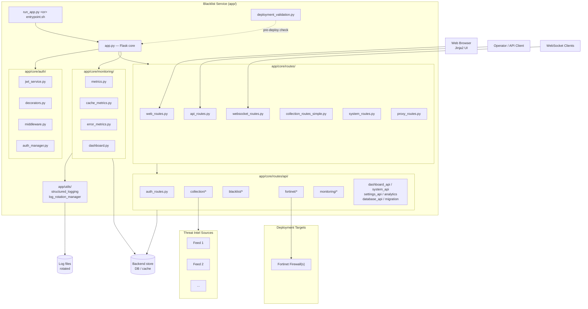

# Blacklist Service Management

> **통합 위협 인텔리전스 수집 · 동기화 · 블랙리스트 중앙 관리 · Fortinet 자동 배포 플랫폼**
> **Unified threat-intelligence aggregation, centralized blacklist management, and Fortinet deployment platform.**

---

## 목차 / Table of Contents

- [한국어](#한국어)
  - [개요](#개요)
  - [주요 기능](#주요-기능)
  - [아키텍처](#아키텍처)
  - [빠른 시작](#빠른-시작)
  - [설정](#설정)
  - [명령어 레퍼런스](#명령어-레퍼런스)
  - [로컬 개발](#로컬-개발)
  - [테스트](#테스트)
  - [기여 가이드](#기여-가이드)
  - [라이선스](#라이선스)
- [English](#english)
  - [Overview](#overview)
  - [Features](#features)
  - [Architecture](#architecture-1)
  - [Quick Start](#quick-start-1)
  - [Configuration](#configuration-1)
  - [Commands Reference](#commands-reference-1)
  - [Local Development](#local-development-1)
  - [Testing](#testing-1)
  - [Contributing](#contributing-1)
  - [License](#license-1)
- [Repository Structure](#repository-structure)

---

## 한국어

### 개요

**Blacklist Service Management**는 다양한 외부 위협 인텔리전스(TI) 소스에서 악성 IP·도메인·URL 데이터를 수집·동기화하고, 중앙 블랙리스트로 통합 관리한 뒤 **Fortinet 방화벽 등 외부 보안 장비로 자동 배포**하는 Python 기반 통합 관리 플랫폼입니다. Jinja2 기반 웹 UI, REST API, WebSocket을 통해 실시간 모니터링과 운영 자동화를 제공합니다.

**핵심 사용자**

- **보안 운영팀(SOC)** — 위협 인텔리전스 통합 조회 및 자동 차단
- **네트워크 엔지니어** — Fortinet 등 외부 장비로의 정책/주소 객체 자동 배포
- **플랫폼 운영자** — 컬렉션·세션·통합·설정·모니터링을 단일 콘솔에서 관리

**기본 정보**

| 항목 | 값 |
| --- | --- |
| 기본 포트 | `2542` (`PORT` 환경 변수로 변경) |
| 기본 실행 환경 | `development` (`ENV`) |
| Python 버전 | 3.11+ (`target-version = "py311"`) |
| 진입점 (로컬) | `app/run_app.py` |
| 진입점 (컨테이너) | `app/entrypoint.sh` |
| 배포 전 검증 | `app/deployment_validation.py` |

### 주요 기능

- **중앙 집중식 블랙리스트 관리** — IP/도메인 항목의 CRUD, 일괄 처리(batch), 외부 컬렉션과의 양방향 동기화, 변경 이력 추적 (`app/core/routes/api/blacklist/`)
- **컬렉션 동기화** — 여러 TI 소스에서 주기/수동 데이터 수집(`sources.py`), 자격 증명 관리(`credentials.py`), 동기화 트리거(`sync.py`, `trigger.py`), 실행 이력(`history.py`), 상태 모니터링(`status.py`)
- **Fortinet 자동 배포** — Fortinet 장비 등록(`fortinet_register.py`), 블랙리스트 항목의 정책/주소 객체 자동 배포(`fortinet/core.py`)
- **인증/인가** — JWT 기반 세션, 데코레이터/미들웨어 기반 라우트 보호, 역할 기반 접근 제어 (`app/core/auth/`)
- **관측/모니터링** — 캐시·에러·시스템 메트릭 수집, 대시보드, 구조화 로깅(`structured_logging.py`), 로그 로테이션(`log_rotation_manager.py`) (`app/core/monitoring/`, `app/utils/`)
- **REST API + WebSocket** — 도메인별 모듈화된 API, 실시간 이벤트 스트림 (`app/core/routes/`)
- **프록시/시스템 라우트** — L7 프록시 엔드포인트, 시스템 헬스/메트릭/설정 라우트 (`proxy_routes.py`, `system_routes.py`)
- **마이그레이션 도구** — 데이터/스키마 마이그레이션 엔드포인트(`migration.py`), IP 관리 헬퍼(`ip_management_helpers.py`)
- **프런트엔드 템플릿** — Jinja2 기반 페이지(컬렉션/로그/세션/통합/설정/모니터링 대시보드) (`app/templates/`)

### 아키텍처



**모듈 책임 요약**

| 영역 | 위치 | 역할 |
| --- | --- | --- |
| 진입점 | `app/run_app.py`, `app/entrypoint.sh` | 로컬/컨테이너 부트스트랩 |
| 코어 | `app/core/app.py`, `app/core/config.py` | Flask 앱 팩토리, 환경설정 |
| 인증 | `app/core/auth/` | JWT 발급/검증, 라우트 보호, 미들웨어 |
| 라우팅 | `app/core/routes/` | 웹/API/WS/프록시/시스템 라우트 |
| API 도메인 | `app/core/routes/api/{auth,collection,blacklist,fortinet,monitoring}` | 도메인별 비즈니스 로직 |
| 모니터링 | `app/core/monitoring/`, `app/utils/` | 메트릭·대시보드·로깅 |
| 템플릿 | `app/templates/` | Jinja2 페이지 (collection, sessions, integrations, monitoring 등) |
| 배포 검증 | `app/deployment_validation.py` | 컨테이너 기동 전 사전 점검 |

### 빠른 시작

**사전 요구사항**

- Python 3.11+
- Docker / Docker Compose (권장)
- `make` (GNU Make)

**저장소 클론 및 부트스트랩**

```bash
git clone <your-fork-url> blacklist-service
cd blacklist-service
make setup-hooks   # pre-commit, commitlint 훅 설치
```

**개발 환경 실행 (Docker Compose, 핫 리로드)**

```bash
make dev           # 변경 이미지 자동 재빌드 + 볼륨 마운트
# 또는
make dev-no-build  # 기존 이미지로 빠르게 기동
```

브라우저에서 `http://localhost:2542` (기본 포트)로 접속하세요.

### 설정

환경 변수는 `deploy/.env` (또는 컨테이너 환경) 에서 로드되며, `Makefile`은 `deploy/.env`를 자동으로 사용합니다.

| 변수 | 설명 | 기본값 |
| --- | --- | --- |
| `ENV` | 실행 환경 | `development` |
| `PORT` | 서비스 포트 | `2542` |
| `COMPOSE_FILE` | Compose 파일 경로 | `deploy/docker-compose.yml` |

추가 설정은 `app/core/config.py`에서 환경별 분기로 로드됩니다. 인증 정보, TI 소스 자격 증명, Fortinet 엔드포인트 등 민감 값은 반드시 시크릿 관리 시스템 또는 환경 변수로 주입하세요.

### 명령어 레퍼런스

`make help`로 전체 목록을 확인할 수 있습니다.

| 명령어 | 용도 |
| --- | --- |
| `make help` | 사용 가능한 명령어 목록 출력 |
| `make setup-hooks` | pre-commit / commitlint 훅 설치 |
| `make dev` | 개발 환경 기동 (이미지 재빌드 + 핫 리로드) |
| `make dev-no-build` | 기존 이미지로 개발 환경 기동 |
| `make dev-prod` | 프로덕션 유사 모드 (오버라이드/핫 리로드 없음) |
| `make dev-app` | app 서비스만 재시작 |
| `make build` | 이미지 빌드 |
| `make up` | Compose 스택 기동 |
| `make down` | Compose 스택 종료 |
| `make logs` | 로그 스트림 확인 |
| `make restart` | 스택 재시작 |
| `make health` | 헬스 체크 |
| `make test` | 테스트 실행 |
| `make deploy` | 배포 |
| `make prod` | 프로덕션 모드 기동 |
| `make release` | 릴리스 절차 수행 |
| `make release-dry` | 릴리스 드라이런 |
| `make verify` | 전체 검증 실행 (`verify-all`) |
| `make verify-lint` | Ruff 린트 |
| `make verify-types` | mypy 타입 검사 |
| `make verify-secrets` | 시크릿 검사 |
| `make verify-pre-commit` | pre-commit 훅 검사 |
| `make verify-quick` | 빠른 검증 (lint + types) |
| `make verify-all` | 모든 검증 단계 수행 |
| `make clean` | 빌드 산출물/캐시 정리 |

### 로컬 개발

**Python 환경 직접 실행 (Compose 없이)**

```bash
python -m venv .venv
source .venv/bin/activate
pip install -r app/requirements.txt
ENV=development PORT=2542 python app/run_app.py
```

**코드 품질**

- 린터: **Ruff** (`line-length = 120`, `target-version = "py311"`)
  - 선택 규칙: `E`, `F`, `W` (일부 규칙은 파일별 ignore 적용)
- 타입 체커: **mypy** (`mypy.ini`)
- 커밋 메시지: **Conventional Commits** (`commitlint.config.js` + commit-msg 훅)
- 시크릿 검사: pre-commit 훅으로 자동 수행

**권장 워크플로**

1. 기능 브랜치 생성
2. 변경 → `make verify-quick` → `make test`
3. 커밋 (커밋 메시지 규칙 자동 검사)
4. 푸시 → PR 생성

### 테스트

`pyproject.toml`의 pytest 설정 (`pythonpath = ["app"]`, `testpaths = ["tests"]`)을 따릅니다.

```bash
pytest                # 전체
pytest -m unit        # 단위 테스트만
pytest -m integration # 통합 테스트 (외부 서비스 필요)
pytest -m security    # 보안 테스트
pytest -m db          # DB 테스트
pytest -m api         # API 엔드포인트 테스트
```

**마커 정의**

| 마커 | 의미 |
| --- | --- |
| `unit` | 외부 의존성 없는 단위 테스트 |
| `integration` | 실제 서비스가 필요한 통합 테스트 |
| `security` | 보안 관련 검증 |
| `db` | 데이터베이스 테스트 |
| `api` | API 엔드포인트 테스트 |

기본 옵션: `-v --tb=short`

### 기여 가이드

`CONTRIBUTING.md`를 참조하세요. 핵심 규칙:

- Conventional Commits 형식의 커밋 메시지
- PR 전 `make verify-quick && make test` 통과
- 새 코드는 가능한 한 `app/core/routes/api/<domain>/` 하위에 모듈화
- API 변경 시 마크다운/주석 동시 갱신
- 시크릿/내부 호스트는 코드에 하드코딩 금지 (플레이스홀더 사용)

### 라이선스

저장소 루트의 [`LICENSE`](./LICENSE) 파일을 참조하세요.

---

## English

### Overview

**Blacklist Service Management** is a Python-based platform that aggregates threat-intelligence data from multiple external sources, normalizes it into a centralized blacklist, and **automatically deploys it to security appliances such as Fortinet firewalls**. It provides a Jinja2 web UI, a modular REST API, and a WebSocket channel for real-time monitoring and operations.

**Primary users**

- **SOC operators** — unified view over threat intelligence and automated blocking
- **Network engineers** — push blacklist objects/policies to Fortinet appliances
- **Platform operators** — manage collections, sessions, integrations, settings, and monitoring from a single console

**Defaults**

| Item | Value |
| --- | --- |
| Default port | `2542` (override via `PORT`) |
| Default environment | `development` (`ENV`) |
| Python | 3.11+ (`target-version = "py311"`) |
| Local entry point | `app/run_app.py` |
| Container entry point | `app/entrypoint.sh` |
| Pre-deploy check | `app/deployment_validation.py` |

### Features

- **Centralized blacklist management** — CRUD for IP/domain entries, batch operations, two-way sync with external collections, change history (`app/core/routes/api/blacklist/`)
- **Collection & sync** — periodic/manual ingestion from TI sources (`sources.py`), credential management (`credentials.py`), triggers (`sync.py`, `trigger.py`), history (`history.py`), status (`status.py`)
- **Fortinet automation** — appliance registration (`fortinet_register.py`), policy/address-object deployment (`fortinet/core.py`)
- **Authentication & authorization** — JWT sessions, decorator/middleware-based route protection, role-based access control (`app/core/auth/`)
- **Observability** — cache/error/system metrics, dashboard, structured logging (`structured_logging.py`), log rotation (`log_rotation_manager.py`) under `app/core/monitoring/` and `app/utils/`
- **REST API + WebSocket** — domain-modular API surface and real-time event stream (`app/core/routes/`)
- **Proxy & system routes** — L7 proxy endpoints, system health/metrics/settings (`proxy_routes.py`, `system_routes.py`)
- **Migration tooling** — data/schema migrations (`migration.py`), IP management helpers (`ip_management_helpers.py`)
- **Frontend templates** — Jinja2 pages for collection, sessions, integrations, settings, and monitoring dashboard (`app/templates/`)

### Architecture


**Module responsibilities**

| Area | Path | Responsibility |
| --- | --- | --- |
| Entry points | `app/run_app.py`, `app/entrypoint.sh` | Local / container bootstrap |
| Core | `app/core/app.py`, `app/core/config.py` | Flask app factory, environment config |
| Auth | `app/core/auth/` | JWT issuance/verification, route protection, middleware |
| Routing | `app/core/routes/` | Web / API / WS / proxy / system routes |
| API domains | `app/core/routes/api/{auth,collection,blacklist,fortinet,monitoring}` | Domain-level business logic |
| Monitoring | `app/core/monitoring/`, `app/utils/` | Metrics, dashboard, structured logging, log rotation |
| Templates | `app/templates/` | Jinja2 pages (collection, sessions, integrations, monitoring dashboard, ...) |
| Deployment | `app/deployment_validation.py` | Pre-boot sanity checks |

### Quick Start

**Prerequisites**

- Python 3.11+
- Docker / Docker Compose (recommended)
- `make` (GNU Make)

**Clone & bootstrap**

```bash
git clone <your-fork-url> blacklist-service
cd blacklist-service
make setup-hooks   # installs pre-commit + commitlint hooks
```

**Start the development environment (Docker Compose, hot reload)**

```bash
make dev           # rebuilds changed images + volume mounts
# or
make dev-no-build  # uses existing images (faster)
```

Open `http://localhost:2542` (default port) in your browser.

### Configuration

Environment variables are loaded from `deploy/.env` (or your container environment). The `Makefile` passes `deploy/.env` to Compose automatically.

| Variable | Description | Default |
| --- | --- | --- |
| `ENV` | Runtime environment | `development` |
| `PORT` | Service port | `2542` |
| `COMPOSE_FILE` | Compose file path | `deploy/docker-compose.yml` |

Additional settings are loaded by `app/core/config.py` per environment. Secrets such as TI credentials and Fortinet endpoints **must** be supplied via your secret manager or environment variables — never commit them.

### Commands Reference

Run `make help` for the full list.

| Command | Purpose |
| --- | --- |
| `make help` | List available commands |
| `make setup-hooks` | Install pre-commit / commitlint hooks |
| `make dev` | Start dev env (rebuild + hot reload) |
| `make dev-no-build` | Start dev env with existing images |
| `make dev-prod` | Production-like mode (no override / hot reload) |
| `make dev-app` | Restart only the app service |
| `make build` | Build images |
| `make up` | Bring up the Compose stack |
| `make down` | Tear down the Compose stack |
| `make logs` | Stream logs |
| `make restart` | Restart the stack |
| `make health` | Health check |
| `make test` | Run tests |
| `make deploy` | Deploy |
| `make prod` | Start in production mode |
| `make release` | Run release flow |
| `make release-dry` | Dry-run release |
| `make verify` | Run all verifications (`verify-all`) |
| `make verify-lint` | Ruff lint |
| `make verify-types` | mypy type check |
| `make verify-secrets` | Secret scan |
| `make verify-pre-commit` | Run pre-commit hooks |
| `make verify-quick` | Quick check (lint + types) |
| `make verify-all` | Run all verification steps |
| `make clean` | Remove build artifacts and caches |

### Local Development

**Run without Compose**

```bash
python -m venv .venv
source .venv/bin/activate
pip install -r app/requirements.txt
ENV=development PORT=2542 python app/run_app.py
```

**Code quality**

- **Ruff** — `line-length = 120`, `target-version = "py311"`, rule sets `E`, `F`, `W` (with per-file ignores)
- **mypy** — type checking via `mypy.ini`
- **commitlint** — Conventional Commits enforcement on `commit-msg`
- **pre-commit** — secret scanning, lint, and format hooks

**Suggested workflow**

1. Create a feature branch.
2. Make changes → `make verify-quick` → `make test`.
3. Commit (commit message conventions enforced automatically).
4. Push and open a PR.

### Testing

pytest configuration lives in `pyproject.toml` (`pythonpath = ["app"]`, `testpaths = ["tests"]`).

```bash
pytest                # run everything
pytest -m unit        # unit tests only
pytest -m integration # requires running services
pytest -m security    # security-related tests
pytest -m db          # database tests
pytest -m api         # API endpoint tests
```

**Markers**

| Marker | Meaning |
| --- | --- |
| `unit` | Pure unit tests (no external dependencies) |
| `integration` | Requires live services |
| `security` | Security-related checks |
| `db` | Database-backed tests |
| `api` | API endpoint tests |

Default options: `-v --tb=short`

### Contributing

See [`CONTRIBUTING.md`](./CONTRIBUTING.md). Highlights:

- Conventional Commits for all commit messages
- Pass `make verify-quick && make test` before opening a PR
- Add new logic under the appropriate domain module in `app/core/routes/api/<domain>/`
- Keep docs and inline comments in sync with code changes
- Never hardcode secrets or private network addresses — use placeholders and inject via config

### License

See [`LICENSE`](./LICENSE) at the repository root.

---

## Repository Structure

```text
.
├── AGENTS.md                 # Project knowledge base (context for AI agents)
├── CHANGELOG.md
├── CONTRIBUTING.md
├── LICENSE
├── Makefile
├── OWNERS
├── README.md
├── VERSION
├── commitlint.config.js
├── mypy.ini
├── pyproject.toml            # pytest + ruff configuration
└── app/
    ├── AGENTS.md
    ├── Dockerfile
    ├── __init__.py
    ├── deployment_validation.py
    ├── entrypoint.sh         # container bootstrap
    ├── requirements.txt
    ├── run_app.py            # local entry point
    ├── utils/
    │   ├── log_rotation_manager.py
    │   └── structured_logging.py
    ├── templates/
    │   ├── collection.html
    │   ├── collection_logs.html
    │   ├── index.html
    │   ├── integrations.html
    │   ├── sessions.html
    │   ├── settings.html
    │   └── monitoring/
    │       └── dashboard.html
    └── core/
        ├── AGENTS.md
        ├── __init__.py
        ├── app.py            # Flask application factory
        ├── auth_manager.py
        ├── config.py
        ├── dashboard.py
        ├── testing_app.py
        ├── auth/
        │   ├── AGENTS.md
        │   ├── __init__.py
        │   ├── decorators.py
        │   ├── jwt_service.py
        │   └── middleware.py
        ├── monitoring/
        │   ├── AGENTS.md
        │   ├── __init__.py
        │   ├── cache_metrics.py
        │   ├── error_metrics.py
        │   └── metrics.py
        └── routes/
            ├── AGENTS.md
            ├── api_routes.py
            ├── collection_routes_simple.py
            ├── proxy_routes.py
            ├── system_routes.py
            ├── web_routes.py
            ├── websocket_routes.py
            └── api/
                ├── AGENTS.md
                ├── __init__.py
                ├── analytics.py
                ├── auth_routes.py
                ├── core_api.py
                ├── dashboard_api.py
                ├── database_api.py
                ├── error_metrics_api.py
                ├── fortinet_register.py
                ├── ip_management_helpers.py
                ├── migration.py
                ├── settings_api.py
                ├── system_api.py
                ├── monitoring/
                │   └── __init__.py
                ├── collection/
                │   ├── AGENTS.md
                │   ├── __init__.py
                │   ├── config.py
                │   ├── credentials.py
                │   ├── history.py
                │   ├── sources.py
                │   ├── status.py
                │   ├── sync.py
                │   ├── trigger.py
                │   └── utils.py
                ├── blacklist/
                │   ├── AGENTS.md
                │   ├── __init__.py
                │   ├── batch.py
                │   ├── collection.py
                │   ├── core.py
                │   ├── management.py
                │   └── system.py
                └── fortinet/
                    ├── AGENTS.md
                    ├── __init__.py
                    └── core.py
```