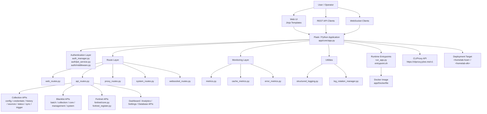

# Blacklist Service Management

[English](#english) | [한국어](#한국어)


---

# English

## Overview

Blacklist Service Management is a Python-based web application for managing blacklist collection, operational monitoring, API access, and security integrations.

The repository contains the application runtime under `app/`, route modules for web/API/WebSocket traffic, authentication and JWT middleware, monitoring metrics, collection management APIs, Fortinet integration endpoints, and operational templates for the dashboard UI.

The project is heavily automated through GitHub Actions. Automation covers pull request validation, security scanning, CodeQL analysis, dependency review, semantic PR checks, AI-assisted review, auto-merge, release notes, documentation synchronization, CI failure handling, issue classification, and downstream health checks.

## Features

- Blacklist collection management APIs
- Collection source, credential, history, status, sync, and trigger endpoints
- Fortinet registration and Fortinet-specific API modules
- Authentication manager and JWT service
- API, web, system, proxy, and WebSocket routes
- Monitoring dashboard and metrics APIs
- Cache, error, and application metrics modules
- Structured logging utilities
- Log rotation management
- Deployment validation entrypoint
- Docker-ready application packaging
- Python 3.11 linting, typing, and testing configuration
- Comprehensive GitHub Actions automation for CI, security, release, and repository operations

## Architecture



## Repository Structure

```text
/
├── AGENTS.md
├── CHANGELOG.md
├── CONTRIBUTING.md
├── LICENSE
├── Makefile
├── OWNERS
├── README.md
├── VERSION
├── commitlint.config.js
├── mypy.ini
├── pyproject.toml
└── app/
    ├── AGENTS.md
    ├── Dockerfile
    ├── __init__.py
    ├── deployment_validation.py
    ├── entrypoint.sh
    ├── requirements.txt
    ├── run_app.py
    ├── utils/
    │   ├── log_rotation_manager.py
    │   └── structured_logging.py
    ├── templates/
    │   ├── collection.html
    │   ├── collection_logs.html
    │   ├── index.html
    │   ├── integrations.html
    │   ├── sessions.html
    │   ├── settings.html
    │   └── monitoring/
    │       └── dashboard.html
    └── core/
        ├── app.py
        ├── auth_manager.py
        ├── config.py
        ├── dashboard.py
        ├── testing_app.py
        ├── auth/
        ├── monitoring/
        └── routes/
```

## Automation Inventory

### GitHub Actions Workflows

This repository contains 36 workflow files.

| Workflow file | Purpose |
|---|---|
| `01_branch-to-pr.yml` | Creates or manages pull requests from branches. |
| `02_issue-to-branch.yml` | Creates development branches from issues. |
| `03_pr-checks.yml` | Pull request validation and CI checks. |
| `04_actionlint.yml` | GitHub Actions workflow linting. |
| `05_gitleaks.yml` | Secret scanning with Gitleaks. |
| `06_codeql.yml` | CodeQL static security analysis. |
| `07_dependency-review.yml` | Dependency review for pull requests. |
| `08_scorecard.yml` | OpenSSF Scorecard supply-chain checks. |
| `09_semantic-pr.yml` | Semantic pull request title validation. |
| `10_pr-review.yml` | Automated pull request review. |
| `11_security-pr-review.yml` | Security-focused pull request review. |
| `12_dependabot-auto-merge.yml` | Dependabot auto-merge handling. |
| `13_pr-auto-merge.yml` | Pull request auto-merge orchestration. |
| `14_bot-auto-fix.yml` | Bot-assisted automated fixes. |
| `15_merged-pr-cleanup.yml` | Cleanup after pull requests are merged. |
| `19_issue-backfill.yml` | Issue metadata backfill automation. |
| `20_readme-gen.yml` | README generation automation. |
| `21_docs-sync.yml` | Documentation synchronization. |
| `24_release-notes.yml` | Release notes generation. |
| `25_release-publish.yml` | Release publishing automation. |
| `29_downstream-health-check.yml` | Downstream repository or service health checks. |
| `37_ci-failure-issues.yml` | Opens or updates issues for CI failures. |
| `42_reusable-docs-sync.yml` | Reusable documentation sync workflow. |
| `44_reusable-pr-checks.yml` | Reusable pull request checks workflow. |
| `45_reusable-gitleaks.yml` | Reusable Gitleaks secret scanning workflow. |
| `60_ci-auto-heal.yml` | CI auto-healing automation. |
| `91_issue-classification.yml` | Automated issue classification. |
| `_ci-node.yml` | Reusable Node.js CI workflow. |
| `auto-merge.yml` | Auto-merge workflow. |
| `build-images.yml` | Container image build workflow. |
| `ci.yml` | General CI workflow. |
| `labeler.yml` | Pull request or issue labeling automation. |
| `release.yml` | Release workflow. |
| `security.yml` | Security workflow. |
| `standard-ci.yml` | Standard CI workflow. |
| `welcome.yml` | First-time contributor welcome automation. |

### Automation Tools

| Tool | Usage |
|---|---|
| `pytest` | Test runner configured through `pyproject.toml`. |
| `ruff` | Python linting with Python 3.11 target and 120-character line length. |
| `mypy` | Static type checking configured through `mypy.ini`. |
| `pre-commit` | Local Git hook orchestration. |
| `commitlint` | Conventional commit message validation through `commitlint.config.js`. |
| `husky` | Frontend Git hook integration referenced by `make setup-hooks`. |
| `Docker` | Application containerization through `app/Dockerfile`. |
| `Docker Compose` | Local and deployment service orchestration through Makefile commands. |
| `Gitleaks` | Secret detection in CI. |
| `CodeQL` | Static application security testing. |
| `OpenSSF Scorecard` | Repository supply-chain posture checks. |
| `Dependency Review` | Pull request dependency risk review. |
| `actionlint` | GitHub Actions workflow validation. |
| `qodo-ai/pr-agent` | AI-assisted pull request review automation. |
| `CLIProxyAPI` | Model gateway through `https://cliproxy.jclee.me/v1`. |

### Go Automation Tools

No Go automation tools are present in this repository.

### README Generation Model

The primary README generation model is `gpt-5.5`.

Fallback model: `minimax-m3` via `CLIProxyAPI`.

## Quick Start

### Prerequisites

- Python 3.11
- Docker
- Docker Compose
- Make
- Git
- Node.js and npm, if using hooks that install frontend tooling
- `pre-commit`, installed automatically by `make setup-hooks`

### Clone and Set Up

```bash
git clone <repository-url>
cd BlacklistService
```

Create or update your environment file according to your deployment conventions. The Makefile expects Docker Compose environment values from:

```text
deploy/.env
```

Start the development environment:

```bash
make dev
```

The application is expected to be available locally at:

```text
http://localhost:${PORT:-2542}
```

### Run Tests

```bash
make test
```

Or run pytest directly:

```bash
python -m pytest
```

### Run Linting

```bash
ruff check app
```

### Run Type Checking

```bash
mypy app
```

## Local Development

### Python Environment

Create and activate a virtual environment:

```bash
python3.11 -m venv .venv
source .venv/bin/activate
```

Install application dependencies:

```bash
pip install -r app/requirements.txt
```

Install development tools as needed:

```bash
pip install pytest ruff mypy pre-commit
```

### Git Hooks

Install local hooks:

```bash
make setup-hooks
```

This installs:

- pre-commit hooks
- commit message hooks
- Conventional Commit validation
- Python linting hooks
- type-checking hooks
- secret detection hooks
- Husky-based frontend hooks, if the expected frontend workspace exists

### Application Entrypoints

| File | Purpose |
|---|---|
| `app/run_app.py` | Main Python runtime entrypoint. |
| `app/entrypoint.sh` | Container entrypoint script. |
| `app/deployment_validation.py` | Deployment validation logic. |
| `app/core/testing_app.py` | Test application factory or testing entrypoint. |

### Testing Configuration

Pytest is configured in `pyproject.toml`.

Configured test discovery:

```toml
testpaths = ["tests"]
python_files = ["test_*.py"]
python_classes = ["Test*"]
python_functions = ["test_*"]
```

Configured markers:

| Marker | Meaning |
|---|---|
| `unit` | Unit tests with no external dependencies. |
| `integration` | Integration tests that require services. |
| `security` | Security-related tests. |
| `db` | Database tests. |
| `api` | API endpoint tests. |

Default pytest options:

```text
-v --tb=short
```

### Ruff Configuration

Ruff is configured in `pyproject.toml`.

Key settings:

| Setting | Value |
|---|---|
| Target Python | `py311` |
| Line length | `120` |
| Selected rules | `E`, `F`, `W` |
| Ignored rules | `E501`, `W291`, `W293` |

## Commands Reference

The Makefile is the primary local command interface.

Show all available commands:

```bash
make help
```

### Visible Make Targets

| Command | Description |
|---|---|
| `make help` | Show available Makefile commands. |
| `make setup-hooks` | Install pre-commit and commit-msg hooks. |
| `make dev` | Start the development environment with rebuild and hot reload. |
| `make dev-no-build` | Start the development environment without rebuilding images. |
| `make dev-prod` | Start a production-like environment. |

### Declared Make Targets

The Makefile also declares the following targets:

```text
build
up
down
logs
clean
test
deploy
prod
restart
health
release
release-dry
verify
verify-lint
verify-types
verify-secrets
verify-pre-commit
verify-quick
verify-all
```

Use `make help` to confirm the currently implemented command descriptions in your checkout.

### Direct Tool Commands

```bash
# Run tests
python -m pytest

# Run linting
ruff check app

# Run type checking
mypy app

# Install pre-commit hooks
pre-commit install --install-hooks
pre-commit install --hook-type commit-msg
```

## Contribution Guide

### Branching

Use issue-linked branches when possible. The repository includes automation for issue-to-branch and branch-to-PR workflows:

- `02_issue-to-branch.yml`
- `01_branch-to-pr.yml`

Recommended branch naming examples:

```text
feature/<issue-number>-short-description
fix/<issue-number>-short-description
docs/<issue-number>-short-description
chore/<issue-number>-short-description
```

### Commit Messages

Use Conventional Commits.

Examples:

```text
feat(api): add collection trigger endpoint
fix(auth): handle expired JWT token
docs(readme): update local development guide
chore(ci): adjust reusable workflow inputs
```

Commit messages are validated by `commitlint.config.js` and hook automation.

### Pull Requests

Before opening a pull request:

```bash
make verify
```

If `make verify` is not available in your checkout, run the core checks directly:

```bash
ruff check app
mypy app
python -m pytest
```

Pull requests are checked by multiple workflows, including:

- `03_pr-checks.yml`
- `04_actionlint.yml`
- `05_gitleaks.yml`
- `06_codeql.yml`
- `07_dependency-review.yml`
- `08_scorecard.yml`
- `09_semantic-pr.yml`
- `10_pr-review.yml`
- `11_security-pr-review.yml`

### Security

Do not commit secrets, tokens, private keys, credentials, internal addresses, or environment files.

Use placeholders in documentation and examples:

```text
<homelab-host>
<homelab-elk>
```

Use the public CLIProxy endpoint when documenting model gateway access:

```text
https://cliproxy.jclee.me/v1
```

### Ownership

Repository ownership and review expectations are defined in:

```text
OWNERS
```

General contribution rules are defined in:

```text
CONTRIBUTING.md
```

---

# 한국어

## 개요

Blacklist Service Management는 블랙리스트 수집, 운영 모니터링, API 접근, 보안 연동을 관리하기 위한 Python 기반 웹 애플리케이션입니다.

이 저장소는 `app/` 아래에 애플리케이션 런타임을 포함하며, 웹/API/WebSocket 라우트, 인증 및 JWT 미들웨어, 모니터링 메트릭, 수집 관리 API, Fortinet 연동 엔드포인트, 운영 대시보드 템플릿을 제공합니다.

또한 GitHub Actions 기반 자동화가 매우 풍부하게 구성되어 있습니다. PR 검증, 보안 스캔, CodeQL 분석, 의존성 검토, Semantic PR 검사, AI 기반 리뷰, 자동 병합, 릴리스 노트, 문서 동기화, CI 실패 이슈화, 이슈 분류, 다운스트림 상태 점검 등을 자동화합니다.

## 주요 기능

- 블랙리스트 수집 관리 API
- 수집 소스, 자격 증명, 이력, 상태, 동기화, 트리거 엔드포인트
- Fortinet 등록 및 Fortinet 전용 API 모듈
- 인증 관리자 및 JWT 서비스
- API, 웹, 시스템, 프록시, WebSocket 라우트
- 모니터링 대시보드 및 메트릭 API
- 캐시, 오류, 애플리케이션 메트릭 모듈
- 구조화 로깅 유틸리티
- 로그 로테이션 관리
- 배포 검증 엔트리포인트
- Docker 기반 애플리케이션 패키징
- Python 3.11 기준 린팅, 타입 검사, 테스트 설정
- CI, 보안, 릴리스, 저장소 운영을 위한 포괄적인 GitHub Actions 자동화

## 아키텍처


## 저장소 구조

```text
/
├── AGENTS.md
├── CHANGELOG.md
├── CONTRIBUTING.md
├── LICENSE
├── Makefile
├── OWNERS
├── README.md
├── VERSION
├── commitlint.config.js
├── mypy.ini
├── pyproject.toml
└── app/
    ├── AGENTS.md
    ├── Dockerfile
    ├── __init__.py
    ├── deployment_validation.py
    ├── entrypoint.sh
    ├── requirements.txt
    ├── run_app.py
    ├── utils/
    │   ├── log_rotation_manager.py
    │   └── structured_logging.py
    ├── templates/
    │   ├── collection.html
    │   ├── collection_logs.html
    │   ├── index.html
    │   ├── integrations.html
    │   ├── sessions.html
    │   ├── settings.html
    │   └── monitoring/
    │       └── dashboard.html
    └── core/
        ├── app.py
        ├── auth_manager.py
        ├── config.py
        ├── dashboard.py
        ├── testing_app.py
        ├── auth/
        ├── monitoring/
        └── routes/
```

## 자동화 인벤토리

### GitHub Actions 워크플로

이 저장소에는 총 36개의 워크플로 파일이 있습니다.

| 워크플로 파일 | 목적 |
|---|---|
| `01_branch-to-pr.yml` | 브랜치에서 PR 생성 또는 관리를 자동화합니다. |
| `02_issue-to-branch.yml` | 이슈 기반 개발 브랜치를 생성합니다. |
| `03_pr-checks.yml` | PR 검증 및 CI 체크를 수행합니다. |
| `04_actionlint.yml` | GitHub Actions 워크플로 문법을 검사합니다. |
| `05_gitleaks.yml` | Gitleaks로 시크릿을 스캔합니다. |
| `06_codeql.yml` | CodeQL 정적 보안 분석을 수행합니다. |
| `07_dependency-review.yml` | PR 의존성 변경 위험을 검토합니다. |
| `08_scorecard.yml` | OpenSSF Scorecard 공급망 보안 검사를 수행합니다. |
| `09_semantic-pr.yml` | PR 제목의 Semantic 규칙을 검증합니다. |
| `10_pr-review.yml` | 자동 PR 리뷰를 수행합니다. |
| `11_security-pr-review.yml` | 보안 관점의 PR 리뷰를 수행합니다. |
| `12_dependabot-auto-merge.yml` | Dependabot PR 자동 병합을 처리합니다. |
| `13_pr-auto-merge.yml` | PR 자동 병합을 오케스트레이션합니다. |
| `14_bot-auto-fix.yml` | 봇 기반 자동 수정을 수행합니다. |
| `15_merged-pr-cleanup.yml` | 병합된 PR 이후 정리 작업을 수행합니다. |
| `19_issue-backfill.yml` | 이슈 메타데이터를 보정합니다. |
| `20_readme-gen.yml` | README 생성을 자동화합니다. |
| `21_docs-sync.yml` | 문서 동기화를 수행합니다. |
| `24_release-notes.yml` | 릴리스 노트를 생성합니다. |
| `25_release-publish.yml` | 릴리스 게시를 자동화합니다. |
| `29_downstream-health-check.yml` | 다운스트림 저장소 또는 서비스 상태를 점검합니다. |
| `37_ci-failure-issues.yml` | CI 실패에 대한 이슈를 생성 또는 갱신합니다. |
| `42_reusable-docs-sync.yml` | 재사용 가능한 문서 동기화 워크플로입니다. |
| `44_reusable-pr-checks.yml` | 재사용 가능한 PR 체크 워크플로입니다. |
| `45_reusable-gitleaks.yml` | 재사용 가능한 Gitleaks 스캔 워크플로입니다. |
| `60_ci-auto-heal.yml` | CI 자동 복구 작업을 수행합니다. |
| `91_issue-classification.yml` | 이슈 자동 분류를 수행합니다. |
| `_ci-node.yml` | 재사용 가능한 Node.js CI 워크플로입니다. |
| `auto-merge.yml` | 자동 병합 워크플로입니다. |
| `build-images.yml` | 컨테이너 이미지 빌드 워크플로입니다. |
| `ci.yml` | 일반 CI 워크플로입니다. |
| `labeler.yml` | PR 또는 이슈 라벨링 자동화입니다. |
| `release.yml` | 릴리스 워크플로입니다. |
| `security.yml` | 보안 워크플로입니다. |
| `standard-ci.yml` | 표준 CI 워크플로입니다. |
| `welcome.yml` | 신규 기여자 환영 자동화입니다. |

### 자동화 도구

| 도구 | 용도 |
|---|---|
| `pytest` | `pyproject.toml`로 설정된 테스트 실행기입니다. |
| `ruff` | Python 3.11 및 120자 라인 길이 기준의 Python 린터입니다. |
| `mypy` | `mypy.ini` 기반 정적 타입 검사 도구입니다. |
| `pre-commit` | 로컬 Git 훅 오케스트레이션 도구입니다. |
| `commitlint` | `commitlint.config.js` 기반 Conventional Commit 검증 도구입니다. |
| `husky` | `make setup-hooks`에서 참조되는 프론트엔드 Git 훅 도구입니다. |
| `Docker` | `app/Dockerfile` 기반 애플리케이션 컨테이너화에 사용됩니다. |
| `Docker Compose` | Makefile 기반 로컬 및 배포 서비스 오케스트레이션에 사용됩니다. |
| `Gitleaks` | CI 시크릿 탐지에 사용됩니다. |
| `CodeQL` | 정적 애플리케이션 보안 분석에 사용됩니다. |
| `OpenSSF Scorecard` | 저장소 공급망 보안 상태 점검에 사용됩니다. |
| `Dependency Review` | PR 의존성 변경 위험 검토에 사용됩니다. |
| `actionlint` | GitHub Actions 워크플로 검증에 사용됩니다. |
| `qodo-ai/pr-agent` | AI 기반 PR 리뷰 자동화에 사용됩니다. |
| `CLIProxyAPI` | `https://cliproxy.jclee.me/v1` 기반 모델 게이트웨이입니다. |

### Go 자동화 도구

이 저장소에는 Go 자동화 도구가 없습니다.

### README 생성 모델

README 생성 기본 모델은 `gpt-5.5`입니다.

대체 모델은 `CLIProxyAPI`를 통한 `minimax-m3`입니다.

## 빠른 시작

### 사전 요구 사항

- Python 3.11
- Docker
- Docker Compose
- Make
- Git
- Node.js 및 npm
- `pre-commit`, `make setup-hooks` 실행 시 자동 설치 가능

### 클론 및 설정

```bash
git clone <repository-url>
cd BlacklistService
```

배포 방식에 맞게 환경 파일을 생성하거나 갱신합니다. Makefile은 Docker Compose 환경 값을 다음 파일에서 읽도록 구성되어 있습니다.

```text
deploy/.env
```

개발 환경을 시작합니다.

```bash
make dev
```

로컬 애플리케이션 기본 접근 주소는 다음과 같습니다.

```text
http://localhost:${PORT:-2542}
```

### 테스트 실행

```bash
make test
```

또는 pytest를 직접 실행합니다.

```bash
python -m pytest
```

### 린트 실행

```bash
ruff check app
```

### 타입 검사 실행

```bash
mypy app
```

## 로컬 개발

### Python 환경

가상환경을 생성하고 활성화합니다.

```bash
python3.11 -m venv .venv
source .venv/bin/activate
```

애플리케이션 의존성을 설치합니다.

```bash
pip install -r app/requirements.txt
```

개발 도구를 설치합니다.

```bash
pip install pytest ruff mypy pre-commit
```

### Git 훅

로컬 훅을 설치합니다.

```bash
make setup-hooks
```

이 명령은 다음 항목을 설정합니다.

- pre-commit 훅
- commit-msg 훅
- Conventional Commit 검증
- Python 린팅 훅
- 타입 검사 훅
- 시크릿 탐지 훅
- 예상 프론트엔드 작업 공간이 존재하는 경우 Husky 기반 프론트엔드 훅

### 애플리케이션 엔트리포인트

| 파일 | 목적 |
|---|---|
| `app/run_app.py` | 기본 Python 런타임 엔트리포인트입니다. |
| `app/entrypoint.sh` | 컨테이너 엔트리포인트 스크립트입니다. |
| `app/deployment_validation.py` | 배포 검증 로직입니다. |
| `app/core/testing_app.py` | 테스트 애플리케이션 팩토리 또는 테스트용 엔트리포인트입니다. |

### 테스트 설정

pytest 설정은 `pyproject.toml`에 정의되어 있습니다.

테스트 탐색 설정:

```toml
testpaths = ["tests"]
python_files = ["test_*.py"]
python_classes = ["Test*"]
python_functions = ["test_*"]
```

마커 설정:

| 마커 | 의미 |
|---|---|
| `unit` | 외부 의존성이 없는 단위 테스트입니다. |
| `integration` | 서비스 의존성이 필요한 통합 테스트입니다. |
| `security` | 보안 관련 테스트입니다. |
| `db` | 데이터베이스 테스트입니다. |
| `api` | API 엔드포인트 테스트입니다. |

기본 pytest 옵션:

```text
-v --tb=short
```

### Ruff 설정

Ruff 설정은 `pyproject.toml`에 정의되어 있습니다.

주요 설정:

| 설정 | 값 |
|---|---|
| 대상 Python | `py311` |
| 라인 길이 | `120` |
| 선택 규칙 | `E`, `F`, `W` |
| 무시 규칙 | `E501`, `W291`, `W293` |

## 명령어 참조

Makefile은 로컬 작업을 위한 기본 명령 인터페이스입니다.

사용 가능한 명령을 확인합니다.

```bash
make help
```

### 확인 가능한 Make 타깃

| 명령 | 설명 |
|---|---|
| `make help` | 사용 가능한 Makefile 명령을 출력합니다. |
| `make setup-hooks` | pre-commit 및 commit-msg 훅을 설치합니다. |
| `make dev` | 이미지를 다시 빌드하고 핫 리로드 개발 환경을 시작합니다. |
| `make dev-no-build` | 이미지 재빌드 없이 개발 환경을 시작합니다. |
| `make dev-prod` | 프로덕션과 유사한 환경을 시작합니다. |

### 선언된 Make 타깃

Makefile에는 다음 타깃도 선언되어 있습니다.

```text
build
up
down
logs
clean
test
deploy
prod
restart
health
release
release-dry
verify
verify-lint
verify-types
verify-secrets
verify-pre-commit
verify-quick
verify-all
```

현재 체크아웃에서 구현된 명령 설명은 `make help`로 확인하세요.

### 직접 실행 명령

```bash
# 테스트 실행
python -m pytest

# 린트 실행
ruff check app

# 타입 검사 실행
mypy app

# pre-commit 훅 설치
pre-commit install --install-hooks
pre-commit install --hook-type commit-msg
```

## 기여 가이드

### 브랜치 전략

가능하면 이슈와 연결된 브랜치를 사용하세요. 저장소에는 이슈-브랜치 및 브랜치-PR 자동화가 포함되어 있습니다.

- `02_issue-to-branch.yml`
- `01_branch-to-pr.yml`

권장 브랜치 이름 예시:

```text
feature/<issue-number>-short-description
fix/<issue-number>-short-description
docs/<issue-number>-short-description
chore/<issue-number>-short-description
```

### 커밋 메시지

Conventional Commits 형식을 사용하세요.

예시:

```text
feat(api): add collection trigger endpoint
fix(auth): handle expired JWT token
docs(readme): update local development guide
chore(ci): adjust reusable workflow inputs
```

커밋 메시지는 `commitlint.config.js` 및 훅 자동화를 통해 검증됩니다.

### Pull Request

PR을 열기 전에 다음 명령을 실행하세요.

```bash
make verify
```

현재 체크아웃에서 `make verify`를 사용할 수 없다면 핵심 검사를 직접 실행하세요.

```bash
ruff check app
mypy app
python -m pytest
```

PR은 다음을 포함한 여러 워크플로로 검증됩니다.

- `03_pr-checks.yml`
- `04_actionlint.yml`
- `05_gitleaks.yml`
- `06_codeql.yml`
- `07_dependency-review.yml`
- `08_scorecard.yml`
- `09_semantic-pr.yml`
- `10_pr-review.yml`
- `11_security-pr-review.yml`

### 보안

시크릿, 토큰, 개인 키, 자격 증명, 내부 주소, 환경 파일을 커밋하지 마세요.

문서와 예시에는 다음과 같은 플레이스홀더를 사용하세요.

```text
<homelab-host>
<homelab-elk>
```

모델 게이트웨이를 문서화할 때는 공개 CLIProxy 엔드포인트를 사용하세요.

```text
https://cliproxy.jclee.me/v1
```

### 소유권

저장소 소유권 및 리뷰 기준은 다음 파일에 정의되어 있습니다.

```text
OWNERS
```

일반 기여 규칙은 다음 파일에 정의되어 있습니다.

```text
CONTRIBUTING.md