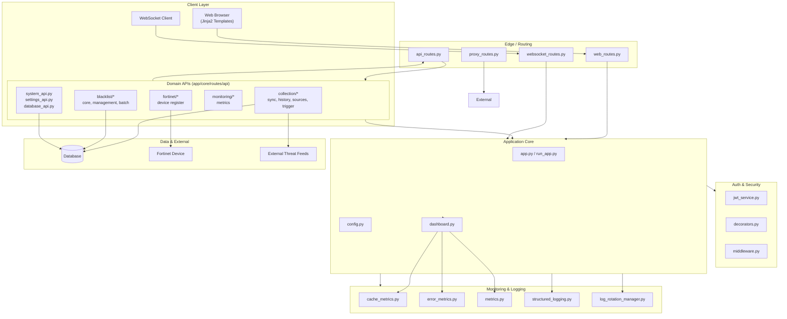

# Blacklist Service Management

## 한국어

### 개요

**Blacklist Service Management**는 다양한 소스에서 위협 인텔리전스(악성 IP, 도메인 등)를 수집·동기화하고, 중앙 집중식 블랙리스트로 관리하며, Fortinet 방화벽 등 외부 보안 장비로 자동 배포하는 통합 관리 플랫폼입니다. 웹 UI, REST API, WebSocket을 통해 실시간 모니터링과 운영 자동화를 제공합니다.

### 주요 기능

- **중앙 집중식 블랙리스트 관리** — IP/도메인 블랙리스트의 CRUD, 일괄 처리(batch), 외부 컬렉션과 동기화, 이력 관리
- **컬렉션 동기화** — 여러 외부 위협 인텔리전스 소스로부터 주기적/수동 데이터 수집, 히스토리 추적, 트리거 실행
- **Fortinet 연동** — Fortinet 장비 등록, 블랙리스트 항목의 정책/주소 객체 배포
- **인증/인가** — JWT 기반 세션, 데코레이터·미들웨어 기반 보호, 역할 기반 접근 제어
- **모니터링** — 캐시/에러/시스템 메트릭 수집, 대시보드, 구조화 로깅, 로그 로테이션
- **REST API + WebSocket** — 도메인별 모듈화된 API, 실시간 이벤트 스트림
- **프록시 라우트** — 외부 시스템 연동을 위한 중계 기능
- **웹 UI** — Jinja2 기반 페이지(인덱스, 컬렉션, 세션, 통합, 설정, 모니터링 대시보드)
- **데이터베이스 마이그레이션** — 스키마 진화 및 검증 도구 내장
- **Docker 기반 배포** — 개발/운영 환경 통합, 핫 리로드, 배포 검증 스크립트

### 아키텍처



핵심 모듈 책임:

| 영역 | 경로 | 책임 |
|---|---|---|
| Entry Point | `app/run_app.py`, `app/entrypoint.sh` | 프로세스 부트스트랩, 컨테이너 초기화 |
| App Factory | `app/core/app.py` | Flask/WSGI 앱 팩토리, 라우트 등록 |
| Auth | `app/core/auth/` | JWT 발급·검증, 데코레이터, 미들웨어 |
| Web Routes | `app/core/routes/web_routes.py` | 서버 렌더 페이지 |
| API Routes | `app/core/routes/api_routes.py` + `api/` | 도메인별 REST API |
| WebSocket | `app/core/routes/websocket_routes.py` | 실시간 푸시 |
| Proxy | `app/core/routes/proxy_routes.py` | 외부 시스템 프록시 |
| Monitoring | `app/core/monitoring/` | 메트릭 수집/노출 |
| Templates | `app/templates/` | Jinja2 UI |
| Utils | `app/utils/` | 로깅, 로테이션 |

### 빠른 시작

#### 사전 요구사항

- Python 3.11+
- Docker & Docker Compose v2
- Node.js 18+ (프론트엔드 husky 훅 설치 시)
- Make

#### 1) 리포지토리 클론 및 훅 설치

```bash
git clone <repo-url> blacklist-service
cd blacklist-service
make setup-hooks
```

#### 2) 환경 변수 준비

`deploy/.env` 파일을 환경에 맞게 생성합니다. 주요 키:

```env
# Server
PORT=2542
FLASK_ENV=development

# Database
DATABASE_URL=postgresql://user:password@db:5432/blacklist

# Auth
JWT_SECRET=change-me
JWT_EXPIRES_MIN=60

# Fortinet
FORTINET_HOST=fortinet.example.local
FORTINET_API_TOKEN=xxxxxxxx

# Collection
COLLECTION_INTERVAL_SEC=300
```

#### 3) 개발 환경 기동 (핫 리로드)

```bash
make dev
# 웹: http://localhost:2542
```

이미지를 재빌드하지 않고 빠르게 띄우려면:

```bash
make dev-no-build
```

운영과 유사한 환경(오버라이드 미적용, 핫 리로드 없음)은:

```bash
make dev-prod
```

#### 4) 종료

```bash
make down
```

### 설정

| 항목 | 설명 | 기본 위치 |
|---|---|---|
| `PORT` | 애플리케이션 리스닝 포트 | `2542` |
| `DATABASE_URL` | 데이터베이스 연결 문자열 | 환경변수 |
| `JWT_SECRET` | JWT 서명 키 (필수) | 환경변수 |
| `FORTINET_HOST` / `FORTINET_API_TOKEN` | Fortinet 장비 정보 | 환경변수 |
| `COLLECTION_INTERVAL_SEC` | 자동 컬렉션 주기 | `300` |
| 로그 정책 | 로테이션 정책 | `app/utils/log_rotation_manager.py` |
| 인증 정책 | 데코레이터, 미들웨어 동작 | `app/core/auth/` |

### 명령어 레퍼런스 (Make)

| 명령 | 설명 |
|---|---|
| `make help` | 사용 가능한 타깃 목록 출력 |
| `make setup-hooks` | pre-commit, husky 훅 설치 |
| `make dev` | 개발 환경(빌드 + 핫 리로드) 기동 |
| `make dev-no-build` | 기존 이미지로 빠르게 기동 |
| `make dev-prod` | 운영 유사 환경 기동 |
| `make dev-app` | 앱 서비스만 재시작 |
| `make up` / `make down` | 컨테이너 기동/종료 |
| `make build` | 이미지 빌드 |
| `make logs` | 컨테이너 로그 스트림 |
| `make restart` | 재시작 |
| `make health` | 헬스 체크 |
| `make test` | 테스트 실행 |
| `make verify` | 린트/타입/시크릿 검증 |
| `make verify-lint` | Ruff 린트 |
| `make verify-types` | mypy 타입 체크 |
| `make verify-secrets` | 시크릿 누출 스캔 |
| `make verify-pre-commit` | pre-commit 훅 실행 |
| `make verify-quick` | 빠른 검증 |
| `make verify-all` | 전체 검증 |
| `make release` | 릴리스 절차 |
| `make release-dry` | 릴리스 드라이런 |
| `make clean` | 정리 |

### 로컬 개발

- 코드는 컨테이너에 볼륨 마운트되어 자동 반영됩니다 (`make dev`).
- 백엔드 단독 실행이 필요할 경우:

```bash
cd app
python -m venv .venv && source .venv/bin/activate
pip install -r requirements.txt
export FLASK_APP=run_app.py
flask run --host=0.0.0.0 --port=2542
```

- 로깅은 `app/utils/structured_logging.py`를 통해 JSON 형식으로 출력되며, `log_rotation_manager.py`가 회전 정책을 관리합니다.

### 테스트

테스트는 `tests/` 디렉터리에서 실행하며, `pyproject.toml`의 마커로 구분합니다.

```bash
# 전체
make test

# 마커별
pytest -m unit
pytest -m integration
pytest -m security
pytest -m db
pytest -m api
```

설정 요약 (`pyproject.toml`):

- `pythonpath = ["app"]`
- `testpaths = ["tests"]`
- `addopts = "-v --tb=short"`
- 마커: `unit`, `integration`, `security`, `db`, `api`

### 기여 가이드

1. 이슈를 등록하여 변경 범위를 합의합니다.
2. 브랜치를 생성합니다 (`feature/<name>`, `fix/<name>`).
3. Conventional Commits 규칙(`commitlint.config.js`)을 따릅니다.
4. `make verify-all`이 통과해야 푸시가 가능합니다.
5. PR 제출 시 OWNERS 명단의 리뷰어를 지정합니다.

자세한 절차는 `CONTRIBUTING.md`를 참고하십시오.

### 라이선스

본 프로젝트는 `LICENSE` 파일에 명시된 라이선스를 따릅니다.

---

## English

### Overview

**Blacklist Service Management** is an integrated platform for ingesting threat intelligence from multiple sources, consolidating it into a centralized blacklist, and automatically distributing it to perimeter devices such as Fortinet firewalls. It exposes a web UI, REST APIs, and WebSocket streams for real-time monitoring and operational automation.

### Features

- **Centralized blacklist management** — CRUD, batch operations, sync with external collections, history
- **Collection synchronization** — periodic and on-demand ingestion from multiple threat feeds, history tracking, manual triggers
- **Fortinet integration** — device registration and policy/address-object deployment
- **Authentication & authorization** — JWT-based sessions, decorator/middleware enforcement, role-based access
- **Observability** — cache, error, and system metrics; dashboard; structured logging with rotation
- **REST API + WebSocket** — domain-grouped APIs and real-time event streaming
- **Proxy routes** — gatewaying to upstream systems
- **Web UI** — Jinja2 templates (index, collections, sessions, integrations, settings, monitoring dashboard)
- **Database migrations** — schema evolution utilities included
- **Docker-based deployment** — unified dev/ops workflows with hot reload and validation

### Architecture


Module responsibilities:

| Area | Path | Responsibility |
|---|---|---|
| Entry point | `app/run_app.py`, `app/entrypoint.sh` | process bootstrap, container init |
| App factory | `app/core/app.py` | WSGI app factory, route registration |
| Auth | `app/core/auth/` | JWT issuance/verification, decorators, middleware |
| Web routes | `app/core/routes/web_routes.py` | server-rendered pages |
| API routes | `app/core/routes/api_routes.py` + `api/` | domain-grouped REST APIs |
| WebSocket | `app/core/routes/websocket_routes.py` | real-time push |
| Proxy | `app/core/routes/proxy_routes.py` | upstream system gateway |
| Monitoring | `app/core/monitoring/` | metrics collection/exposure |
| Templates | `app/templates/` | Jinja2 UI |
| Utils | `app/utils/` | logging, log rotation |

### Quick Start

#### Prerequisites

- Python 3.11+
- Docker & Docker Compose v2
- Node.js 18+ (for frontend husky hooks)
- Make

#### 1) Clone and install hooks

```bash
git clone <repo-url> blacklist-service
cd blacklist-service
make setup-hooks
```

#### 2) Prepare environment

Create `deploy/.env`. Key variables:

```env
# Server
PORT=2542
FLASK_ENV=development

# Database
DATABASE_URL=postgresql://user:password@db:5432/blacklist

# Auth
JWT_SECRET=change-me
JWT_EXPIRES_MIN=60

# Fortinet
FORTINET_HOST=fortinet.example.local
FORTINET_API_TOKEN=xxxxxxxx

# Collection
COLLECTION_INTERVAL_SEC=300
```

#### 3) Start the dev environment (hot reload)

```bash
make dev
# Web UI: http://localhost:2542
```

Fast start without rebuild:

```bash
make dev-no-build
```

Production-like (no override, no hot reload):

```bash
make dev-prod
```

#### 4) Stop

```bash
make down
```

### Configuration

| Item | Description | Default location |
|---|---|---|
| `PORT` | application listen port | `2542` |
| `DATABASE_URL` | database connection string | env var |
| `JWT_SECRET` | JWT signing key (required) | env var |
| `FORTINET_HOST` / `FORTINET_API_TOKEN` | Fortinet device info | env var |
| `COLLECTION_INTERVAL_SEC` | auto-collection interval | `300` |
| Log policy | rotation rules | `app/utils/log_rotation_manager.py` |
| Auth policy | decorator/middleware behavior | `app/core/auth/` |

### Commands Reference (Make)

| Command | Description |
|---|---|
| `make help` | list available targets |
| `make setup-hooks` | install pre-commit and husky hooks |
| `make dev` | start dev environment (build + hot reload) |
| `make dev-no-build` | fast start with existing images |
| `make dev-prod` | production-like start |
| `make dev-app` | restart only the app service |
| `make up` / `make down` | start/stop containers |
| `make build` | build images |
| `make logs` | tail container logs |
| `make restart` | restart |
| `make health` | health check |
| `make test` | run tests |
| `make verify` | run linter, type, and secret checks |
| `make verify-lint` | Ruff lint |
| `make verify-types` | mypy type check |
| `make verify-secrets` | secret scan |
| `make verify-pre-commit` | run pre-commit hooks |
| `make verify-quick` | quick verification |
| `make verify-all` | full verification |
| `make release` | release workflow |
| `make release-dry` | release dry-run |
| `make clean` | cleanup |

### Local Development

- Source is mounted into the container and reloaded automatically (`make dev`).
- To run the backend without Docker:

```bash
cd app
python -m venv .venv && source .venv/bin/activate
pip install -r requirements.txt
export FLASK_APP=run_app.py
flask run --host=0.0.0.0 --port=2542
```

- Logs are emitted as JSON via `app/utils/structured_logging.py` and rotated by `app/utils/log_rotation_manager.py`.

### Testing

Tests live under `tests/` and are organized with markers defined in `pyproject.toml`.

```bash
# All
make test

# By marker
pytest -m unit
pytest -m integration
pytest -m security
pytest -m db
pytest -m api
```

Key settings (`pyproject.toml`):

- `pythonpath = ["app"]`
- `testpaths = ["tests"]`
- `addopts = "-v --tb=short"`
- Markers: `unit`, `integration`, `security`, `db`, `api`

### Contributing

1. Open an issue to align on the change scope.
2. Create a branch (`feature/<name>`, `fix/<name>`).
3. Follow the Conventional Commits convention (`commitlint.config.js`).
4. `make verify-all` must pass before pushing.
5. Request a review from a reviewer listed in `OWNERS`.

See `CONTRIBUTING.md` for full details.

### License

This project is licensed under the terms described in the `LICENSE` file.