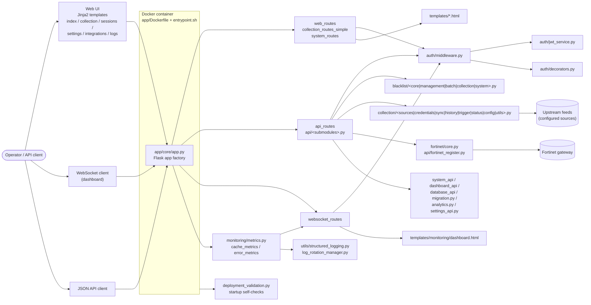

# Blacklist Service / 블랙리스트 서비스

[](#jclee-bot-automation-surfaces--jclee-bot-자동화-영역)
[](#local-development--로컬-개발)
[](#quick-start--빠른-시작)
[](pyproject.toml)
[](mypy.ini)
[](commitlint.config.js)
[](LICENSE)

> **TL;DR / 요약**
> A self-hosted Python web service that centralises **blacklist management**, **source collection**, and **Fortinet gateway** push, with JWT-based access control, structured logging, and a real-time WebSocket monitoring dashboard. / Fortinet 게이트웨이 푸시, JWT 기반 접근 제어, 구조화된 로깅, 실시간 WebSocket 모니터링 대시보드를 갖춘 셀프 호스팅 Python 웹 서비스로, **블랙리스트 관리**와 **소스 수집**을 중앙 집중화합니다.

---

## Overview / 개요

This repository hosts the **Blacklist Service** — a Python 3.11+ web application built on a Flask-class app factory pattern. It provides both a human-facing HTML UI (Jinja2 templates under `app/templates/`) and a JSON/WebSocket API for programmatic and live monitoring use cases.

이 저장소는 **블랙리스트 서비스**를 호스팅합니다. Flask 계열 앱 팩토리 패턴으로 구축된 Python 3.11+ 웹 애플리케이션으로, 사람용 HTML UI(`app/templates/` 아래의 Jinja2 템플리오)와 프로그래매틱/실시간 모니터링용 JSON·WebSocket API를 함께 제공합니다.

The service composes four functional surfaces:

서비스는 네 가지 기능 영역으로 구성됩니다:

1. **Blacklist plane / 블랙리스트 영역** — CRUD + batch operations, address-object lifecycle, push to Fortinet.
2. **Collection plane / 수집 영역** — external feed discovery, sync orchestration, history, and triggers.
3. **Auth & access plane / 인증·접근 영역** — JWT issuance, decorator/middleware enforcement, session views.
4. **Observability plane / 관측 영역** — structured logs with rotation, cache/error metrics, WebSocket dashboard, analytics, system health.

### At a glance / 한눈에 보기

| Aspect / 항목 | Detail / 세부 사항 |
| --- | --- |
| Runtime / 런타임 | Python 3.11+, Docker |
| Web framework / 웹 프레임워크 | Flask-style app factory (`app/core/app.py`) |
| Auth / 인증 | JWT (`auth/jwt_service.py`), decorators, middleware |
| Real-time / 실시간 | WebSocket routes + monitoring dashboard |
| Integrations / 통합 | Fortinet firewall, IP management, collection sources |
| Storage / 저장소 | Migrations exposed through `database_api` / `migration.py` |
| Observability / 관측성 | Structured logs (rotation), cache/error metrics, analytics |
| Automation owner / 자동화 소유자 | **jclee-bot** (external runtime) |

---

## Features / 기능

### Blacklist management / 블랙리스트 관리
- **CRUD + batch** operations on blacklist entries (`app/core/routes/api/blacklist/`)
- **System-level** helpers for global list state (`blacklist/system.py`)
- **Core** blacklist engine + **management** layer (`blacklist/core.py`, `blacklist/management.py`)
- **Collection** pipeline (selectors, grouping) feeding the blacklist engine

### Source collection / 소스 수집
- **Source registry** with credentials and status (`collection/sources.py`, `collection/credentials.py`, `collection/status.py`)
- **Sync orchestration** with **history** and **trigger** endpoints (`collection/sync.py`, `collection/history.py`, `collection/trigger.py`)
- **Config** module for per-source behaviour and **utils** for shared logic

### Fortinet integration / Fortinet 통합
- **Register / push** address-objects to Fortinet gateways (`fortinet/core.py`, `api/fortinet_register.py`)
- **IP management helpers** for address-object lifecycle (`api/ip_management_helpers.py`)

### Auth & access control / 인증 및 접근 제어
- **JWT issuance / verification** service (`auth/jwt_service.py`)
- **Decorator-based** route protection (`auth/decorators.py`)
- **Request middleware** for auth context propagation (`auth/middleware.py`)
- **Top-level auth manager** wiring the above (`auth_manager.py`)

### Observability & live dashboard / 관측성 및 실시간 대시보드
- **Structured logging** with log rotation (`utils/structured_logging.py`, `utils/log_rotation_manager.py`)
- **Cache metrics + error metrics** collectors (`monitoring/cache_metrics.py`, `monitoring/error_metrics.py`, `monitoring/metrics.py`)
- **WebSocket** push channel for live updates (`websocket_routes.py`)
- **HTML dashboard** rendered from `templates/monitoring/dashboard.html`

### Operations / 운영
- **Container entrypoint** — `app/entrypoint.sh`
- **Startup self-checks** — `app/deployment_validation.py`
- **Migrations** — exposed via `api/migration.py` and `database_api.py`
- **Web pages** — index, collection, collection logs, sessions, settings, integrations, monitoring

### API surface / API 영역
- `analytics.py`, `auth_routes.py`, `core_api.py`, `dashboard_api.py`, `database_api.py`, `error_metrics_api.py`, `fortinet_register.py`, `ip_management_helpers.py`, `migration.py`, `settings_api.py`, `system_api.py`
- API monitoring exposed under `api/monitoring/`
- Simplified collection routes for browser consumption (`collection_routes_simple.py`)

---

## Architecture / 아키텍처

The diagram below shows the runtime topology: a single Dockerised Flask app factory fans out to web routes, API routes, and a WebSocket channel; the auth plane is applied at the boundary; the integration plane (collection + Fortinet) and the observability plane (metrics + logs + WS dashboard) sit alongside.

아래 다이어그램은 런타임 토폴로지를 보여줍니다. 단일 Docker화된 Flask 앱 팩토리가 웹 라우트, API 라우트, WebSocket 채널로 분기하며, 인증 영역이 경계에서 적용됩니다. 통합 영역(수집 + Fortinet)과 관측 영역(메트릭 + 로그 + WS 대시보드)이 나란히 위치합니다.



Key boundaries / 주요 경계:

- **Ingress / 인그레스** — Web UI, WebSocket, and JSON API all funnel through `app/core/app.py`; auth middleware sits at the boundary, so any unauthenticated request short-circuits before reaching route logic.
- **Route fan-out / 라우트 분기** — `web_routes.py` for HTML, `api_routes.py` + `api/*.py` for JSON, `websocket_routes.py` for live metrics, `system_routes.py` for ops.
- **Integration fan-out / 통합 분기** — Collection sources feed the Blacklist engine; the engine pushes to Fortinet via `fortinet/core.py`.
- **Observability fan-out / 관측 분기** — The metrics collectors feed the WebSocket channel; the channel renders to `templates/monitoring/dashboard.html`. Structured logs are emitted from the same root app and rotated by the dedicated manager.

---

## jclee-bot Automation Surfaces / jclee-bot 자동화 영역

All mutating GitHub automation in this repository is owned by **jclee-bot**. The repository's workflow files (under `.github/workflows/`) are **implementation triggers**, not the source of truth — the source of truth is the jclee-bot runtime itself, and the YAML files may be regenerated on sync.

이 저장소의 모든 변경 작업을 수행하는 GitHub 자동화는 **jclee-bot**이 소유합니다. `.github/workflows/` 아래의 워크플로우 파일은 **구현 트리거**일 뿐 진실의 원천은 아닙니다. 진실의 원천은 jclee-bot 런타임 자체이며, YAML 파일은 동기화 시 재생성될 수 있습니다.

### Issue lifecycle / 이슈 라이프사이클
- **Triage & labelling** — bot applies labels and classifies new issues. Behaviour marker: `jclee-bot에의해자동화됨`.
- **Backfill** — historical issues are processed to bring them under current policy.
- **Branch creation from issue** — when policy permits, the bot opens a working branch for human follow-up.
- **Welcome / first interaction** — bot posts the welcome message on the first contributor interaction.
- **Lock / stale** — bot locks inactive threads and applies the stale policy.

### Pull request automation / 풀 리퀘스트 자동화
- **PR review** — bot runs an automated review pass using the [qodo-ai/pr-agent](https://github.com/qodo-ai/pr-agent) review surface.
- **Security PR review** — separate, focused security review pass for sensitive areas.
- **Dependabot auto-merge** — bot evaluates and merges low-risk Dependabot PRs.
- **Auto-merge** — bot auto-merges PRs that pass policy gates.
- **Bot auto-fix** — bot pushes follow-up commits to address its own review findings.
- **Branch → PR** — bot promotes branches into PRs once checks pass.
- **Merged PR cleanup** — bot deletes branches after merge.

### Release & delivery / 릴리스 및 배포
- **Release notes drafting** — bot aggregates merged PRs into a release draft.
- **Release publishing** — bot tags and publishes the release.
- **Build images** — bot triggers image builds on tag.
- **Downstream health check** — bot probes downstream consumers after publish.
- **CI failure issues** — bot opens an issue when CI fails in a way that requires human attention.

### CI surface (implementation triggers only) / CI 영역 (구현 트리거)
The workflows under `.github/workflows/` (e.g. `ci.yml`, `security.yml`, `build-images.yml`, `release.yml`, `_ci-node.yml`) are entry points the bot invokes. Do not treat them as the automation policy — they may be regenerated on the next sync. To request a workflow change, open an issue (the bot's issue lifecycle above will route it appropriately).

`.github/workflows/` 아래의 워크플로우 파일(예: `ci.yml`, `security.yml`, `build-images.yml`, `release.yml`, `_ci-node.yml` 등)은 봇이 호출하는 진입점입니다. 자동화 정책의 진실로 간주하지 마세요. 다음 동기화 시 재생성될 수 있습니다. 워크플로우 변경을 요청하려면 이슈를 열어 주세요(위의 이슈 라이프사이클이 적절히 라우팅합니다).

> **Operational note / 운영 메모** — jclee-bot's coordination surface for this repo is reachable at `https://bot.jclee.me`. Use it for bot policy questions, not for editing the workflow YAML directly.

---

## Go Tools / Go 도구

This repository contains **0 Go-based automation tools** in the current inventory. All automation is implemented in the jclee-bot runtime (external to this repo) and invoked through GitHub workflow triggers. The Go-tool slot is intentionally reserved for future migration of any heavy CI helpers (e.g. policy-gate evaluation) if single-binary distribution or performance becomes a need.

현재 인벤토리에는 **Go 기반 자동화 도구가 0개** 있습니다. 모든 자동화는 jclee-bot 런타임(이 저장소 외부)에서 구현되며 GitHub 워크플로우 트리거를 통해 호출됩니다. Go 도구 슬롯은 향후 정책 게이트 평가 등 무거운 CI 헬퍼를 단일 바이너리로 배포할 필요가 생길 경우를 위해 의도적으로 비워두었습니다.

---

## Quick Start / 빠른 시작

### Prerequisites / 사전 요구사항
- Docker + Docker Compose v2
- Python 3.11+ (only needed for local dev without Docker)
- A reachable **Fortinet** endpoint if you plan to exercise the firewall integration
- `make` (GNU Make)

### Run with Docker Compose / Docker Compose로 실행
```bash
make setup-hooks   # one-time: pre-commit + commit-msg + (frontend) husky
make dev           # build + start with hot reload (rebuilds changed images)
# alternatives
make dev-no-build  # start with existing images
make dev-prod      # production-like (no hot reload)
make dev-app       # restart only the app service (quick iteration)
```

The app listens on `http://localhost:2542` by default. Override the port via the `PORT` variable in `deploy/.env`.

### Verify the deployment / 배포 검증
```bash
make health         # container health
make verify         # full verification suite
make verify-lint    # ruff
make verify-types   # mypy
make verify-secrets # secret detection
make verify-pre-commit
make verify-quick   # fast subset
make verify-all
```

---

## Local Development / 로컬 개발

### Repository layout / 저장소 구조

```text
.
├── AGENTS.md
├── CHANGELOG.md
├── CONTRIBUTING.md
├── LICENSE
├── Makefile
├── OWNERS
├── README.md
├── VERSION
├── commitlint.config.js
├── mypy.ini
├── pyproject.toml
└── app/
    ├── AGENTS.md
    ├── Dockerfile
    ├── entrypoint.sh
    ├── run_app.py
    ├── deployment_validation.py
    ├── requirements.txt
    ├── core/
    │   ├── AGENTS.md
    │   ├── app.py
    │   ├── auth_manager.py
    │   ├── config.py
    │   ├── dashboard.py
    │   ├── testing_app.py
    │   ├── auth/
    │   │   ├── AGENTS.md
    │   │   ├── decorators.py
    │   │   ├── jwt_service.py
    │   │   └── middleware.py
    │   ├── monitoring/
    │   │   ├── AGENTS.md
    │   │   ├── cache_metrics.py
    │   │   ├── error_metrics.py
    │   │   └── metrics.py
    │   └── routes/
    │       ├── api_routes.py
    │       ├── collection_routes_simple.py
    │       ├── proxy_routes.py
    │       ├── system_routes.py
    │       ├── web_routes.py
    │       ├── websocket_routes.py
    │       └── api/
    │           ├── analytics.py
    │           ├── auth_routes.py
    │           ├── core_api.py
    │           ├── dashboard_api.py
    │           ├── database_api.py
    │           ├── error_metrics_api.py
    │           ├── fortinet_register.py
    │           ├── ip_management_helpers.py
    │           ├── migration.py
    │           ├── settings_api.py
    │           ├── system_api.py
    │           ├── monitoring/metrics.py
    │           ├── blacklist/   (core / management / batch / collection / system)
    │           ├── collection/  (sources / credentials / sync / history / trigger / status / config / utils)
    │           └── fortinet/    (core)
    ├── templates/
    │   ├── collection.html
    │   ├── collection_logs.html
    │   ├── index.html
    │   ├── integrations.html
    │   ├── sessions.html
    │   ├── settings.html
    │   └── monitoring/dashboard.html
    └── utils/
        ├── log_rotation_manager.py
        └── structured_logging.py
```

### Run without Docker / Docker 없이 실행
```bash
cd app
python -m venv .venv && source .venv/bin/activate
pip install -r requirements.txt
python run_app.py
```

### Hooks & commit policy / 훅 및 커밋 정책
- **Pre-commit** — runs Ruff, mypy, and secret detection.
- **commit-msg** — enforces Conventional Commits via commitlint (`commitlint.config.js`).
- **Husky** (frontend) — installed by `make setup-hooks` if a frontend workspace is present in the same monorepo.

### Testing / 테스트
- Framework: **pytest** (see `[tool.pytest.ini_options]` in `pyproject.toml`).
- `pythonpath = ["app"]`, `testpaths = ["tests"]`.
- Markers: `unit`, `integration`, `security`, `db`, `api`.
- Default addopts: `-v --tb=short`.

---

## Commands Reference / 명령어 레퍼런스

All commands are exposed through the `Makefile`. Run `make help` for the live catalog.

| Command / 명령어 | Purpose / 용도 |
| --- | --- |
| `make help` | Print the full command catalog |
| `make setup-hooks` | Install pre-commit, commit-msg, and husky hooks |
| `make dev` | Start dev with hot reload (rebuilds changed images) |
| `make dev-no-build` | Start dev with existing images (faster) |
| `make dev-prod` | Production-like dev (no hot reload) |
| `make dev-app` | Restart only the app service |
| `make build` | Build all images |
| `make up` / `make down` | Start / stop the stack |
| `make logs` | Tail container logs |
| `make restart` | Restart services |
| `make health` | Container health check |
| `make test` | Run pytest (unit + integration markers) |
| `make deploy` | Deploy the stack |
| `make prod` | Switch to production compose profile |
| `make release` | Cut a release (delegates to jclee-bot) |
| `make release-dry` | Dry-run release notes |
| `make verify` | Full verification suite |
| `make verify-lint` | Ruff lint |
| `make verify-types` | mypy type checks |
| `make verify-secrets` | Secret detection |
| `make verify-pre-commit` | Pre-commit hooks |
| `make verify-quick` | Fast subset of verification |
| `make verify-all` | Everything |
| `make clean` | Remove local build artefacts |

The Docker Compose entry point is `deploy/docker-compose.yml` with `deploy/.env` (driven from the `Makefile`'s `COMPOSE_FILE` and `COMPOSE_CMD` variables).

---

## Contribution Guide / 기여 가이드

We welcome PRs and issues. The repository is co-managed by humans and **jclee-bot**; please read the following before contributing.

PR과 이슈를 환영합니다. 이 저장소는 인간과 **jclee-bot**이 공동으로 관리합니다. 기여 전에 다음을 읽어 주세요.

### Issues / 이슈
- New issues are triaged and labelled by the bot. The `jclee-bot에의해자동화됨` marker indicates bot-applied lifecycle behaviour (label, stale, lock, branch-from-issue, etc.).
- If you need a workflow change, file an issue — the bot's issue lifecycle will route it appropriately. Do **not** edit `.github/workflows/*.yml` directly; those files are regenerated.
- For bugs, please include: reproduction steps, expected vs. actual, image tag / compose profile, and any relevant logs.

### Pull requests / 풀 리퀘스트
- Branch from `master` using the format suggested by jclee-bot (typically `<issue-number>-<slug>`).
- Commits must follow **Conventional Commits** (enforced by `commitlint.config.js`).
- Run `make verify` locally before pushing; the bot will re-run CI and may push follow-up commits via the bot auto-fix path.
- Expect a bot review pass via the [qodo-ai/pr-agent](https://github.com/qodo-ai/pr-agent) review surface, plus an additional security pass for sensitive areas.
- Once checks pass, the bot evaluates auto-merge eligibility based on repo policy.

### Coding style / 코딩 스타일
- **Python 3.11+**, line length **120** (Ruff config in `pyproject.toml`).
- Lint rules: `E, F, W`; ignores: `E501, W291, W293`.
- Per-file ignores are listed under `[tool.ruff.lint.per-file-ignores]` in `pyproject.toml`.
- Type checks: **mypy** with `mypy.ini`.
- Tests: **pytest** (see `[tool.pytest.ini_options]`); markers: `unit`, `integration`, `security`, `db`, `api`.

### Releases / 릴리스
- Releases are drafted and published by jclee-bot. Human release captains review the draft and add context, but the publication step is bot-owned.
- See `VERSION` and `CHANGELOG.md` for the current state.

### Security / 보안
- Security scanning is owned by the bot and runs via the `security.yml` workflow trigger.
- For sensitive disclosures, follow the security policy referenced in the repo (if any) rather than opening a public issue.

---

## License / 라이선스

See [`LICENSE`](LICENSE).

## Maintainers / 메인테이너

See [`OWNERS`](OWNERS).

---

<sub>Documentation generated with the README-gen pipeline (primary model: <code>gpt-5.5</code>; fallback: <code>minimax-m3</code> via <a href="https://cliproxy.jclee.me/v1">CLIProxyAPI</a>). Automation policy is owned by <a href="https://bot.jclee.me">jclee-bot</a>; PR review surface is <a href="https://github.com/qodo-ai/pr-agent">qodo-ai/pr-agent</a>.</sub>