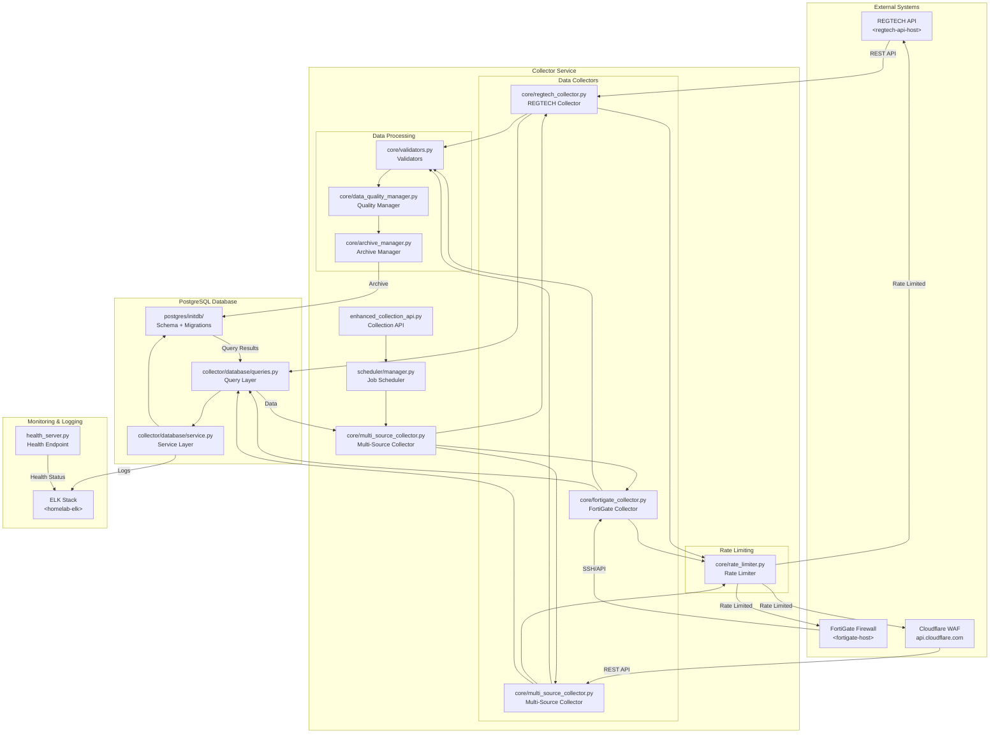
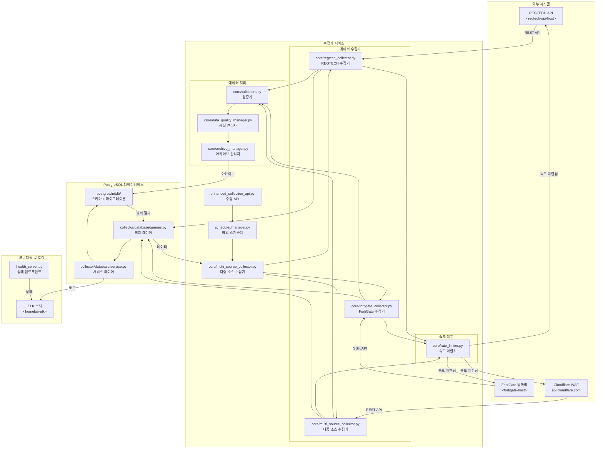

# Blacklist Service Management

## English | [한국어](#한국어)

---

[](https://github.com/qws941/BlacklistService/actions/workflows/03_pr-checks.yml)
[](https://github.com/qws941/BlacklistService/actions/workflows/release.yml)
[](https://github.com/qws941/BlacklistService/actions/workflows/06_codeql.yml)
[](https://github.com/qws941/BlacklistService/actions/workflows/08_scorecard.yml)
[](https://github.com/qws941/BlacklistService/security)

[](https://www.python.org/downloads/)
[](https://www.docker.com/)
[](LICENSE)

---

## Overview

**Blacklist Service Management** is a threat intelligence platform that collects, processes, and distributes IP blacklist data from the Korea Financial Security Institute (REGTECH). It integrates with FortiGate firewalls and Cloudflare WAF to automatically gather malicious IP lists.

### Key Components

| Component | Description |
|-----------|-------------|
| `collector/` | Main Python data collector with modular architecture |
| `postgres/` | PostgreSQL database with schema and migration management |
| `_bot-scripts/` | GitHub automation scripts (internal CI use only) |

---

## Features

- **Multi-Source Collection**: Automatic IP blacklist collection from REGTECH, FortiGate, and multiple external sources
- **Data Quality Management**: Integrity validation and deduplication with comprehensive logging
- **Automated Distribution**: Seamless integration with FortiGate firewalls and Cloudflare WAF
- **Rate Limiting & Throttling**: Built-in protection against API rate limits with exponential backoff
- **Health Monitoring**: Real-time health endpoints for service monitoring
- **Policy-Based Processing**: Flexible policy rules for data filtering and transformation
- **Database Versioning**: PostgreSQL with migration-based schema management

---

## Architecture



---

## Automation Inventory

### Workflow Files

This repository uses the following GitHub Actions workflows for automation:

| Workflow File | Description |
|--------------|-------------|
| `01_branch-to-pr.yml` | Convert feature branches to pull requests |
| `02_issue-to-branch.yml` | Create branch from issue |
| `03_pr-checks.yml` | PR validation checks (lint, test, type-check) |
| `04_actionlint.yml` | Workflow syntax validation |
| `05_gitleaks.yml` | Secret detection scanning |
| `06_codeql.yml` | Code quality and security analysis |
| `07_dependency-review.yml` | Dependency vulnerability review |
| `08_scorecard.yml` | Security scorecard assessment |
| `09_semantic-pr.yml` | Semantic PR title validation |
| `10_pr-review.yml` | Automated PR review |
| `12_dependabot-auto-merge.yml` | Auto-merge Dependabot PRs |
| `13_pr-auto-merge.yml` | Automated PR merging |
| `14_bot-auto-fix.yml` | Bot-assisted auto-fixing |
| `15_merged-pr-cleanup.yml` | Cleanup after PR merge |
| `18_issue-management.yml` | Issue management automation |
| `19_issue-backfill.yml` | Issue backfill operations |
| `20_readme-gen.yml` | README generation |
| `21_docs-sync.yml` | Documentation synchronization |
| `24_release-notes.yml` | Release notes generation |
| `25_release-publish.yml` | Release publishing |
| `29_downstream-health-check.yml` | Downstream service health checks |
| `37_ci-failure-issues.yml` | CI failure issue creation |
| `42_reusable-docs-sync.yml` | Reusable docs sync workflow |
| `43_reusable-issue-management.yml` | Reusable issue management |
| `44_reusable-pr-checks.yml` | Reusable PR checks |
| `45_reusable-gitleaks.yml` | Reusable gitleaks workflow |
| `60_ci-auto-heal.yml` | CI auto-healing |
| `91_issue-classification.yml` | Issue classification |
| `_ci-node.yml` | Node.js CI reusable workflow |
| `auto-merge.yml` | Auto-merge orchestration |
| `build-images.yml` | Docker image building |
| `ci.yml` | Main CI workflow |
| `labeler.yml` | PR labeler |
| `release.yml` | Release workflow |
| `security.yml` | Security workflow |
| `standard-ci.yml` | Standard CI workflow |
| `welcome.yml` | Welcome message workflow |
| `security/11_pr-review.yml` | Security-focused PR review |

### Automation Tools

| Tool | Purpose |
|------|---------|
| **qodo-ai/pr-agent** | AI-powered PR review and automation |
| **Dependabot** | Automated dependency updates |
| **Gitleaks** | Secret detection |
| **CodeQL** | Security analysis |
| **Ruff** | Python linting |
| **mypy** | Type checking |

---

## Quick Start

### Prerequisites

- Docker & Docker Compose
- Python 3.11+
- PostgreSQL 15+

### Installation

```bash
# Clone repository
git clone https://github.com/qws941/BlacklistService.git
cd BlacklistService

# Setup environment
cp deploy/.env.example deploy/.env
# Edit deploy/.env with your configuration

# Start services
docker compose -f deploy/docker-compose.yml --env-file deploy/.env up -d
```

### Configuration

Create `deploy/.env` with the following variables:

```env
# Database
POSTGRES_DB=blacklist_service
POSTGRES_USER=postgres
POSTGRES_PASSWORD=your_secure_password
POSTGRES_HOST=localhost
POSTGRES_PORT=5432

# Collector
COLLECTOR_API_PORT=2542
REGTECH_API_KEY=your_regtech_api_key
REGTECH_API_URL=https://api.regtech.go.kr

# FortiGate
FORTIGATE_HOST=<fortigate-host>
FORTIGATE_USER=admin
FORTIGATE_API_KEY=your_fortigate_api_key

# Cloudflare
CLOUDFLARE_API_KEY=your_cloudflare_api_key
CLOUDFLARE_ZONE_ID=your_zone_id

# ELK Integration
ELK_ENDPOINT=https://cliproxy.jclee.me/v1
```

---

## Local Development

### Development Environment

```bash
# Full development setup with hot reload
make dev

# Start without rebuilding
make dev-no-build

# Production-like environment
make dev-prod
```

### Running Tests

```bash
# All tests
make test

# Unit tests only
make verify-quick

# Full verification (lint, types, secrets)
make verify-all
```

### Code Quality

```bash
# Install pre-commit hooks
make setup-hooks

# Linting
make verify-lint

# Type checking
make verify-types

# Secret detection
make verify-secrets
```

---

## Commands Reference

| Command | Description |
|---------|-------------|
| `make help` | Show all available commands |
| `make setup-hooks` | Install git hooks (pre-commit, commit-msg) |
| `make dev` | Start development with hot reload |
| `make dev-no-build` | Start without rebuilding |
| `make dev-prod` | Start production-like environment |
| `make dev-app` | Restart app service only |
| `make build` | Build Docker images |
| `make up` | Start services |
| `make down` | Stop services |
| `make logs` | View logs |
| `make clean` | Clean up containers and volumes |
| `make test` | Run tests |
| `make verify` | Run all verifications |
| `make verify-lint` | Run linting (Ruff) |
| `make verify-types` | Run type checking (mypy) |
| `make verify-secrets` | Run secret detection (Gitleaks) |
| `make verify-pre-commit` | Run pre-commit checks |
| `make verify-quick` | Quick verification |
| `make verify-all` | Full verification suite |
| `make health` | Check service health |
| `make release` | Create release |
| `make release-dry` | Dry-run release |

---

## Contributing

Please read [CONTRIBUTING.md](CONTRIBUTING.md) for details on our development workflow and coding standards.

### Commit Convention

This project follows **Conventional Commits** specification:

```
<type>(<scope>): <description>

[optional body]

[optional footer]
```

**Types:**

- `feat`: New feature
- `fix`: Bug fix
- `docs`: Documentation
- `style`: Formatting
- `refactor`: Code refactoring
- `test`: Testing
- `chore`: Maintenance

### Branch Strategy

- `master`: Production-ready code
- `develop`: Development integration
- `feature/*`: Feature development
- `fix/*`: Bug fixes
- `release/*`: Release preparation

### Pull Request Process

1. Fork the repository
2. Create a feature branch (`git checkout -b feature/amazing-feature`)
3. Commit changes following conventional commits
4. Push to branch and open a PR
5. Ensure all CI checks pass
6. Request review from maintainers

---

## License

Proprietary - All rights reserved. See [LICENSE](LICENSE) for details.

---

## 한국어

# 블랙리스트 서비스 관리

## [English](#english) | 한국어

---

## 개요

**블랙리스트 서비스 관리**는 한국금융보안원(REGTECH)에서 IP 블랙리스트 데이터를 수집, 처리, 분산하는 위협 인텔리전스 플랫폼입니다. FortiGate 방화벽 및 Cloudflare WAF와 연동하여 악성 IP 목록을 자동으로 수집합니다.

### 주요 구성 요소

| 구성 요소 | 설명 |
|-----------|-------------|
| `collector/` | 모듈식 아키텍처의 주요 Python 데이터 수집기 |
| `postgres/` | 스키마 및 마이그레이션 관리 기능이 포함된 PostgreSQL 데이터베이스 |
| `_bot-scripts/` | GitHub 자동화 스크립트 (내부 CI 전용) |

---

## 주요 기능

- **다중 소스 수집**: REGTECH, FortiGate 및 여러 외부 소스에서 자동 IP 블랙리스트 수집
- **데이터 품질 관리**: 종합적인 로깅이 포함된 무결성 검증 및 중복 제거
- **자동화된 배포**: FortiGate 방화벽 및 Cloudflare WAF와의 원활한 통합
- **속도 제한 및 스로틀링**:了指數적 백오프를 통한 API 속도 제한 내장 보호
- **상태 모니터링**: 서비스 모니터를 위한 실시간 상태 엔드포인트
- **정책 기반 처리**: 데이터 필터링 및 변환을 위한 유연한 정책 규칙
- **데이터베이스 버전 관리**: 마이그레이션 기반 스키마 관리가 포함된 PostgreSQL

---

## 아키텍처



---

## 자동화 인벤토리

### 워크플로 파일

이 저장소는 다음 GitHub Actions 워크플로를 사용하여 자동화됩니다:

| 워크플로 파일 | 설명 |
|--------------|-------------|
| `01_branch-to-pr.yml` | 기능 브랜치를 Pull Request로 변환 |
| `02_issue-to-branch.yml` | 이슈에서 브랜치 생성 |
| `03_pr-checks.yml` | PR 검증 체크 (린트, 테스트, 타입 검사) |
| `04_actionlint.yml` | 워크플로 구문 검증 |
| `05_gitleaks.yml` | 시크릿 탐지 스캐닝 |
| `06_codeql.yml` | 코드 품질 및 보안 분석 |
| `07_dependency-review.yml` | 의존성 취약점 검토 |
| `08_scorecard.yml` | 보안 점수 평가 |
| `09_semantic-pr.yml` | 시맨틱 PR 제목 검증 |
| `10_pr-review.yml` | 자동화된 PR 리뷰 |
| `12_dependabot-auto-merge.yml` | Dependabot PR 자동 병합 |
| `13_pr-auto-merge.yml` | 자동 PR 병합 |
| `14_bot-auto-fix.yml` | 봇-assisted 자동 수정 |
| `15_merged-pr-cleanup.yml` | PR 병합 후 정리 |
| `18_issue-management.yml` | 이슈 관리 자동화 |
| `19_issue-backfill.yml` | 이슈 백필 작업 |
| `20_readme-gen.yml` | README 생성 |
| `21_docs-sync.yml` | 문서 동기화 |
| `24_release-notes.yml` | 릴리스 노트 생성 |
| `25_release-publish.yml` | 릴리스 게시 |
| `29_downstream-health-check.yml` | 다운스트림 서비스 상태 확인 |
| `37_ci-failure-issues.yml` | CI 실패 이슈 생성 |
| `42_reusable-docs-sync.yml` | 재사용 가능 문서 동기화 |
| `43_reusable-issue-management.yml` | 재사용 가능 이슈 관리 |
| `44_reusable-pr-checks.yml` | 재사용 가능 PR 체크 |
| `45_reusable-gitleaks.yml` | 재사용 가능 Gitleaks 워크플로 |
| `60_ci-auto-heal.yml` | CI 자동 복구 |
| `91_issue-classification.yml` | 이슈 분류 |
| `_ci-node.yml` | Node.js CI 재사용 워크플로 |
| `auto-merge.yml` | 자동 병합 오케스트레이션 |
| `build-images.yml` | Docker 이미지 빌딩 |
| `ci.yml` | 주요 CI 워크플로 |
| `labeler.yml` | PR 라벨러 |
| `release.yml` | 릴리스 워크플로 |
| `security.yml` | 보안 워크플로 |
| `standard-ci.yml` | 표준 CI 워크플로 |
| `welcome.yml` | 환영 메시지 워크플로 |
| `security/11_pr-review.yml` | 보안 중심 PR 리뷰 |

### 자동화 도구

| 도구 | 용도 |
|------|---------|
| **qodo-ai/pr-agent** | AI 기반 PR 리뷰 및 자동화 |
| **Dependabot** | 자동화된 의존성 업데이트 |
| **Gitleaks** | 시크릿 탐지 |
| **CodeQL** | 보안 분석 |
| **Ruff** | Python 린팅 |
| **mypy** | 타입 검사 |

---

## 빠른 시작

### 전제 조건

- Docker 및 Docker Compose
- Python 3.11+
- PostgreSQL 15+

### 설치

```bash
# 저장소 클론
git clone https://github.com/qws941/BlacklistService.git
cd BlacklistService

# 환경 설정
cp deploy/.env.example deploy/.env
# deploy/.env를 편집하여 구성

# 서비스 시작
docker compose -f deploy/docker-compose.yml --env-file deploy/.env up -d
```

### 구성

다음 변수로 `deploy/.env`를 생성합니다:

```env
# 데이터베이스
POSTGRES_DB=blacklist_service
POSTGRES_USER=postgres
POSTGRES_PASSWORD=your_secure_password
POSTGRES_HOST=localhost
POSTGRES_PORT=5432

# 수집기
COLLECTOR_API_PORT=2542
REGTECH_API_KEY=your_regtech_api_key
REGTECH_API_URL=https://api.regtech.go.kr

# FortiGate
FORTIGATE_HOST=<fortigate-host>
FORTIGATE_USER=admin
FORTIGATE_API_KEY=your_fortigate_api_key

# Cloudflare
CLOUDFLARE_API_KEY=your_cloudflare_api_key
CLOUDFLARE_ZONE_ID=your_zone_id

# ELK 통합
ELK_ENDPOINT=https://cliproxy.jclee.me/v1
```

---

## 로컬 개발

### 개발 환경

```bash
# 핫 리로드로 전체 개발 설정
make dev

# 재빌딩 없이 시작
make dev-no-build

# 프로덕션 유사 환경
make dev-prod
```

### 테스트 실행

```bash
# 모든 테스트
make test

# 유닛 테스트만
make verify-quick

# 전체 검증 (린트, 타입, 시크릿)
make verify-all
```

### 코드 품질

```bash
# pre-commit 훅 설치
make setup-hooks

# 린팅
make verify-lint

# 타입 검사
make verify-types

# 시크릿 탐지
make verify-secrets
```

---

## 명령어 참고

| 명령어 | 설명 |
|---------|-------------|
| `make help` | 사용 가능한 모든 명령어 표시 |
| `make setup-hooks` | git 훅 설치 (pre-commit, commit-msg) |
| `make dev` | 핫 리로드로 개발 시작 |
| `make dev-no-build` | 재빌딩 없이 시작 |
| `make dev-prod` | 프로덕션 유사 환경 시작 |
| `make dev-app` | 앱 서비스만 재시작 |
| `make build` | Docker 이미지 빌드 |
| `make up` | 서비스 시작 |
| `make down` | 서비스 중지 |
| `make logs` | 로그 보기 |
| `make clean` | 컨테이너 및 볼륨 정리 |
| `make test` | 테스트 실행 |
| `make verify` | 모든 검증 실행 |
| `make verify-lint` | 린팅 실행 (Ruff) |
| `make verify-types` | 타입 검사 실행 (mypy) |
| `make verify-secrets` | 시크릿 탐지 실행 (Gitleaks) |
| `make verify-pre-commit` | pre-commit 체크 실행 |
| `make verify-quick` | 빠른 검증 |
| `make verify-all` | 전체 검증 스위트 |
| `make health` | 서비스 상태 확인 |
| `make release` | 릴리스 생성 |
| `make release-dry` | 드라이런 릴리스 |

---

## 기여하기

개발 워크플로우 및 코딩 표준에 대한 자세한 내용은 [CONTRIBUTING.md](CONTRIBUTING.md)를 읽으세요.

### 커밋 규칙

이 프로젝트는 **Conventional Commits** 사양을 따릅니다:

```
<type>(<scope>): <description>

[optional body]

[optional footer]
```

**유형:**

- `feat`: 새 기능
- `fix`: 버그 수정
- `docs`: 문서
- `style`: 서식
- `refactor`: 코드 리팩토링
- `test`: 테스트
- `chore`: 유지보수

### 브랜치 전략

- `master`: 프로덕션 준비 완료 코드
- `develop`: 개발 통합
- `feature/*`: 기능 개발
- `fix/*`: 버그 수정
- `release/*`: 릴리스 준비

### Pull Request 프로세스

1. 저장소를 포크합니다
2. 기능 브랜치를 생성합니다 (`git checkout -b feature/amazing-feature`)
3. conventional commits를 따라 변경사항을 커밋합니다
4. 브랜치에 푸시하고 PR을 엽니다
5. 모든 CI 체크가 통과하는지 확인합니다
6. 유지보수자에게 리뷰를 요청합니다

---

## 라이선스

전용 - 모든 권리 보유. 자세한 내용은 [LICENSE](LICENSE)를 참조하세요.
