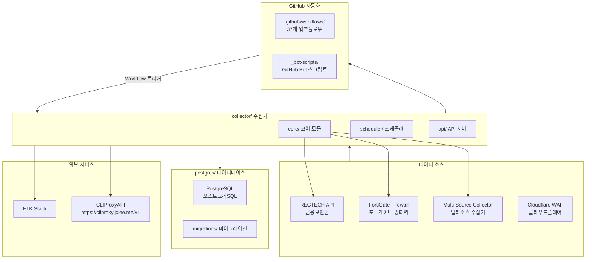
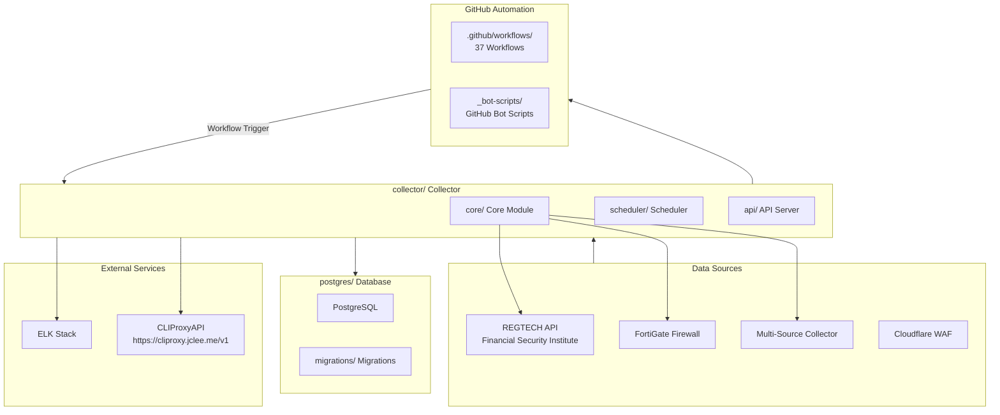

# Blacklist Service Management

Korean | [English](#english)

---

## Korean

### 개요

**Blacklist Service Management**는 금융보안원(REGTECH) 기반 IP 블랙리스트 데이터를 수집, 처리, 분산하는 위협 인텔리전스 플랫폼입니다. FortiGate 방화벽 및 Cloudflare WAF와 연동하여 악성 IP 목록을 자동 수집합니다.

### 주요 기능

- **멀티 소스 수집**: REGTECH, FortiGate, 다중 외부 소스로부터 IP 블랙리스트 자동 수집
- **데이터 품질 관리**: 수집된 데이터의 무결성 검증 및 중복 제거
- **자동 아카이브**: 일별/월별 백업 및 증분 아카이브 지원
- **정책 모니터링**: 블랙리스트 정책 변경 사항 실시간 추적
- **Rate Limiting**: API 호출 제한으로 서비스 안정성 확보
- **데이터베이스 관리**: PostgreSQL 기반 스토리지 및 마이그레이션
- **Docker 배포**: 컨테이너화된 애플리케이션 및 데이터베이스

### 아키텍처



### 프로젝트 구조

```
/
├── collector/              # 메인 데이터 수집기 (Python)
│   ├── core/              # 코어 모듈
│   │   ├── fortigate/     # FortiGate 수집기
│   │   ├── regtech/       # REGTECH 수집기
│   │   ├── multi_source/  # 멀티소스 수집기
│   │   └── database/      # 데이터베이스 레이어
│   ├── scheduler/         # 작업 스케줄러
│   └── api/               # API 서버
├── postgres/               # PostgreSQL 스키마 및 마이그레이션
│   ├── initdb/            # 초기화 스크립트
│   └── migrations/        # 스키마 마이그레이션
├── _bot-scripts/           # GitHub Bot 자동화 스크립트 (CI 체크아웃 경로)
└── Makefile
```

### 자동화 인벤토리

#### GitHub Workflows (37개)

| 카테고리 | 워크플로우 파일 | 설명 |
|---------|---------------|------|
| **PR/브랜치 관리** | `01_branch-to-pr.yml` | 브랜치에서 PR로 자동 전환 |
| | `02_issue-to-branch.yml` | 이슈에서 브랜치 자동 생성 |
| | `13_pr-auto-merge.yml` | PR 자동 병합 |
| | `15_merged-pr-cleanup.yml` | 병합 후 브랜치 정리 |
| **코드 품질** | `03_pr-checks.yml` | PR 체크스 ( Ruff, mypy, pytest) |
| | `04_actionlint.yml` | GitHub Actions 문법 검사 |
| | `05_gitleaks.yml` | 시크릿 스캔 |
| | `06_codeql.yml` | 코드 분석 |
| | `09_semantic-pr.yml` | 시맨틱 PR 검증 |
| **보안** | `07_dependency-review.yml` | 의존성 보안 검토 |
| | `08_scorecard.yml` | 보안 점수 카드 |
| | `security.yml` | 보안 스캔 파이프라인 |
| | `security/11_pr-review.yml` | 보안 PR 리뷰 |
| **자동화 & Bot** | `10_pr-review.yml` | AI PR 리뷰 (qodo-ai/pr-agent) |
| | `14_bot-auto-fix.yml` | Bot 자동 수정 |
| | `44_reusable-pr-checks.yml` | 재사용 가능 PR 체크 |
| | `45_reusable-gitleaks.yml` | 재사용 가능 시크릿 스캔 |
| **의존성 관리** | `12_dependabot-auto-merge.yml` | Dependabot 자동 병합 |
| **이슈 관리** | `18_issue-management.yml` | 이슈 수명 주기 관리 |
| | `19_issue-backfill.yml` | 이슈 백필 자동화 |
| | `43_reusable-issue-management.yml` | 재사용 가능 이슈 관리 |
| **문서화** | `20_readme-gen.yml` | README 자동 생성 |
| | `21_docs-sync.yml` | 문서 동기화 |
| | `42_reusable-docs-sync.yml` | 재사용 가능 문서 동기화 |
| **릴리스** | `24_release-notes.yml` | 릴리스 노트 생성 |
| | `25_release-publish.yml` | 릴리스 게시 |
| | `release.yml` | 릴리스 파이프라인 |
| **운영** | `29_downstream-health-check.yml` | 다운스트림 상태 확인 |
| | `37_ci-failure-issues.yml` | CI 실패 시 이슈 생성 |
| | `60_ci-auto-heal.yml` | CI 자동 복구 |
| **기타** | `auto-merge.yml` | 자동 병합 |
| | `build-images.yml` | Docker 이미지 빌드 |
| | `ci.yml` | CI 파이프라인 |
| | `labeler.yml` | PR 라벨러 |
| | `standard-ci.yml` | 표준 CI |
| | `welcome.yml` | 신규 기여자 환영 |
| | `_ci-node.yml` | 재사용 가능 Node.js CI |

#### GitHub Bot 스크립트 (_bot-scripts/)

Python 기반 GitHub 자동화 봇로, 다음과 같은 도구를 포함:

- **Dockerfile.github_action** - GitHub Action 용 Dockerfile
- **Dockerfile.github_app** - GitHub App 용 Dockerfile
- **docker-compose.github_app.yml** - GitHub App 개발 환경
- **requirements.txt** / **requirements-dev.txt** - Python 의존성

#### 외부 연동

| 서비스 | 엔드포인트 | 용도 |
|-------|----------|------|
| **CLIProxyAPI** | `https://cliproxy.jclee.me/v1` | AI 모델 라우팅 (README-gen: minimax-m2.7 → gpt-5.5 fallback) |
| **ELK Stack** | `<homelab-elk>` | 로깅 및 모니터링 |
| **qodo-ai/pr-agent** | GitHub Marketplace | AI PR 리뷰 및 자동화 |

### 빠른 시작

#### 필수 조건

- Docker 20.10+
- Docker Compose 2.0+
- Python 3.11+ (로컬 개발용)

#### 1. 저장소 클론

```bash
git clone https://github.com/<owner>/blacklist-service.git
cd blacklist-service
```

#### 2. 환경 설정

```bash
# Docker Compose 환경 파일 생성
cp deploy/.env.example deploy/.env
# 필요 환경 변수 편집
vim deploy/.env
```

#### 3. Docker Compose로 실행

```bash
# 개발 환경 (핫 리로드)
make dev

# 프로덕션 환경
make dev-prod
```

#### 4. 서비스 확인

```bash
#.health check
make health

# 로그 확인
make logs
```

### 로컬 개발

#### Python 환경 설정

```bash
# 가상환경 생성
python -m venv .venv
source .venv/bin/activate  # Linux/Mac
# .venv\Scripts\activate   # Windows

# 의존성 설치
pip install -r collector/requirements.txt

# 개발 의존성 설치
pip install -r _bot-scripts/requirements-dev.txt
```

#### Git Hooks 설정

```bash
make setup-hooks
```

이 명령어는 다음을 설정합니다:

- **pre-commit**: Python 린팅 (Ruff, mypy), 시크릿 탐지
- **commit-msg**: 커밋 메시지 컨벤션 검증
- **Husky**: Frontend 린팅 (ESLint, Prettier)

#### 테스트 실행

```bash
# 전체 테스트
make test

# 특정 마커 테스트
pytest -m unit
pytest -m integration
pytest -m security
pytest -m db
pytest -m api

# 빠른 검증 (lint + type check만)
make verify-quick
```

### 명령어 참조

```bash
make help              # 도움말 표시
make setup-hooks       # Git hooks 설치
make build             # Docker 이미지 빌드
make up                # Docker Compose 시작
make down              # Docker Compose 중지
make logs              # 로그 확인
make clean             # 리소스 정리
make test              # 테스트 실행
make deploy            # 배포
make dev               # 개발 환경 (핫 리로드)
make dev-prod          # 프로덕션 환경
make dev-app           # 앱 서비스만 재시작
make health            # 상태 확인
make release           # 릴리스
make release-dry       # 릴리스 사전检查
make verify            # 전체 검증
make verify-lint       # Ruff 린팅
make verify-types      # Mypy 타입 검사
make verify-secrets    # Gitleaks 시크릿 스캔
make verify-pre-commit # Pre-commit 검증
```

### 데이터 소스 연동

#### REGTECH API

金融보안원 API를 통해 IP 블랙리스트를 수집합니다. 상세한 설정은 `collector/core/regtech/`를 참조하세요.

#### FortiGate 방화벽

SSH를 통해 FortiGate에서 로그를 수집합니다. 설정 파일: `collector/core/fortigate/ssh_client.py`

#### Rate Limiting

API 호출 제한으로 서비스 안정성을 확보합니다. 상세: `collector/RATE-LIMITING.md`

### 데이터베이스 마이그레이션

```bash
# 마이그레이션 적용
docker compose exec postgres psql -U postgres -d blacklist -f /docker-entrypoint-initdb.d/01-extensions.sql
docker compose exec postgres psql -U postgres -d blacklist -f /docker-entrypoint-initdb.d/02-schema.sql

# 마이그레이션 추적
docker compose exec postgres psql -U postgres -d blacklist -f /postgres/migrations/001_add_data_source_column.sql
# ... 추가 마이그레이션 파일들
```

### 기여 가이드

Contributing 가이드는 [CONTRIBUTING.md](./CONTRIBUTING.md)를 참조하세요.

기여流程:

1. **Fork** 저장소
2. **Feature 브랜치** 생성 (`git checkout -b feature/amazing-feature`)
3. **변경 사항** 커밋 (`git commit -m 'feat: add amazing feature'`)
4. **PR**推送 (`git push origin feature/amazing-feature`)
5. **GitHub Actions** 자동화 검증 대기
6. **리뷰** 완료 후 병합

#### 커밋 컨벤션

```
feat:     새 기능
fix:      버그 수정
docs:     문서만 변경
style:    코드 포맷 변경 (lint 등)
refactor: 코드 리팩토링
test:     테스트 추가/수정
chore:    빌드/패키지 매니저 변경
```

---

## English

### Overview

**Blacklist Service Management** is a threat intelligence platform that collects, processes, and distributes IP blacklist data based on the Financial Security Institute (REGTECH). It integrates with FortiGate firewalls and Cloudflare WAF to automatically collect malicious IP lists.

### Key Features

- **Multi-Source Collection**: Automatic IP blacklist collection from REGTECH, FortiGate, and multiple external sources
- **Data Quality Management**: Data integrity validation and deduplication
- **Automatic Archiving**: Daily/monthly backup and incremental archive support
- **Policy Monitoring**: Real-time tracking of blacklist policy changes
- **Rate Limiting**: API call limiting for service stability
- **Database Management**: PostgreSQL-based storage and migrations
- **Docker Deployment**: Containerized application and database

### Architecture



### Project Structure

```
/
├── collector/              # Main data collector (Python)
│   ├── core/              # Core modules
│   │   ├── fortigate/     # FortiGate collector
│   │   ├── regtech/       # REGTECH collector
│   │   ├── multi_source/  # Multi-source collector
│   │   └── database/      # Database layer
│   ├── scheduler/         # Job scheduler
│   └── api/               # API server
├── postgres/               # PostgreSQL schema and migrations
│   ├── initdb/            # Initialization scripts
│   └── migrations/        # Schema migrations
├── _bot-scripts/           # GitHub Bot automation scripts (CI checkout path)
└── Makefile
```

### Automation Inventory

#### GitHub Workflows (37 total)

| Category | Workflow File | Description |
|----------|--------------|-------------|
| **PR/Branch Management** | `01_branch-to-pr.yml` | Auto-convert branch to PR |
| | `02_issue-to-branch.yml` | Auto-create branch from issue |
| | `13_pr-auto-merge.yml` | Auto-merge PRs |
| | `15_merged-pr-cleanup.yml` | Post-merge branch cleanup |
| **Code Quality** | `03_pr-checks.yml` | PR checks (Ruff, mypy, pytest) |
| | `04_actionlint.yml` | GitHub Actions linting |
| | `05_gitleaks.yml` | Secret scanning |
| | `06_codeql.yml` | Code analysis |
| | `09_semantic-pr.yml` | Semantic PR validation |
| **Security** | `07_dependency-review.yml` | Dependency security review |
| | `08_scorecard.yml` | Security scorecard |
| | `security.yml` | Security scan pipeline |
| | `security/11_pr-review.yml` | Security PR review |
| **Automation & Bot** | `10_pr-review.yml` | AI PR review (qodo-ai/pr-agent) |
| | `14_bot-auto-fix.yml` | Bot auto-fix |
| | `44_reusable-pr-checks.yml` | Reusable PR checks |
| | `45_reusable-gitleaks.yml` | Reusable secret scanning |
| **Dependency Management** | `12_dependabot-auto-merge.yml` | Dependabot auto-merge |
| **Issue Management** | `18_issue-management.yml` | Issue lifecycle management |
| | `19_issue-backfill.yml` | Issue backfill automation |
| | `43_reusable-issue-management.yml` | Reusable issue management |
| **Documentation** | `20_readme-gen.yml` | Auto-generate README |
| | `21_docs-sync.yml` | Document sync |
| | `42_reusable-docs-sync.yml` | Reusable document sync |
| **Releases** | `24_release-notes.yml` | Release notes generation |
| | `25_release-publish.yml` | Release publishing |
| | `release.yml` | Release pipeline |
| **Operations** | `29_downstream-health-check.yml` | Downstream health check |
| | `37_ci-failure-issues.yml` | CI failure issue creation |
| | `60_ci-auto-heal.yml` | CI auto-heal |
| **Miscellaneous** | `auto-merge.yml` | Auto-merge |
| | `build-images.yml` | Docker image build |
| | `ci.yml` | CI pipeline |
| | `labeler.yml` | PR labeler |
| | `standard-ci.yml` | Standard CI |
| | `welcome.yml` | New contributor welcome |
| | `_ci-node.yml` | Reusable Node.js CI |

#### GitHub Bot Scripts (_bot-scripts/)

Python-based GitHub automation bot including:

- **Dockerfile.github_action** - Dockerfile for GitHub Action
- **Dockerfile.github_app** - Dockerfile for GitHub App
- **docker-compose.github_app.yml** - GitHub App development environment
- **requirements.txt** / **requirements-dev.txt** - Python dependencies

#### External Integrations

| Service | Endpoint | Purpose |
|---------|----------|---------|
| **CLIProxyAPI** | `https://cliproxy.jclee.me/v1` | AI model routing (README-gen: minimax-m2.7 → gpt-5.5 fallback) |
| **ELK Stack** | `<homelab-elk>` | Logging and monitoring |
| **qodo-ai/pr-agent** | GitHub Marketplace | AI PR review and automation |

### Quick Start

#### Prerequisites

- Docker 20.10+
- Docker Compose 2.0+
- Python 3.11+ (for local development)

#### 1. Clone the Repository

```bash
git clone https://github.com/<owner>/blacklist-service.git
cd blacklist-service
```

#### 2. Environment Setup

```bash
# Create Docker Compose environment file
cp deploy/.env.example deploy/.env
# Edit required environment variables
vim deploy/.env
```

#### 3. Run with Docker Compose

```bash
# Development environment (hot reload)
make dev

# Production environment
make dev-prod
```

#### 4. Verify Services

```bash
# Health check
make health

# View logs
make logs
```

### Local Development

#### Python Environment Setup

```bash
# Create virtual environment
python -m venv .venv
source .venv/bin/activate  # Linux/Mac
# .venv\Scripts\activate   # Windows

# Install dependencies
pip install -r collector/requirements.txt

# Install development dependencies
pip install -r _bot-scripts/requirements-dev.txt
```

#### Git Hooks Setup

```bash
make setup-hooks
```

This command sets up:

- **pre-commit**: Python linting (Ruff, mypy), secret detection
- **commit-msg**: Commit message convention enforcement
- **Husky**: Frontend linting (ESLint, Prettier)

#### Running Tests

```bash
# All tests
make test

# Specific marker tests
pytest -m unit
pytest -m integration
pytest -m security
pytest -m db
pytest -m api

# Quick verification (lint + type check only)
make verify-quick
```

### Commands Reference

```bash
make help              # Show help message
make setup-hooks       # Install Git hooks
make build             # Build Docker images
make up                # Start Docker Compose
make down              # Stop Docker Compose
make logs              # View logs
make clean             # Clean resources
make test              # Run tests
make deploy            # Deploy
make dev               # Development environment (hot reload)
make dev-prod          # Production environment
make dev-app           # Restart only app service
make health            # Health check
make release           # Release
make release-dry       # Release dry run
make verify            # Full verification
make verify-lint       # Ruff linting
make verify-types      # Mypy type check
make verify-secrets    # Gitleaks secret scan
make verify-pre-commit # Pre-commit verification
```

### Data Source Integration

#### REGTECH API

Collect IP blacklist through the Financial Security Institute API. See `collector/core/regtech/` for detailed configuration.

#### FortiGate Firewall

Collect logs from FortiGate via SSH. Configuration file: `collector/core/fortigate/ssh_client.py`

#### Rate Limiting

Ensure service stability with API call limiting. Details: `collector/RATE-LIMITING.md`

### Database Migration

```bash
# Apply migrations
docker compose exec postgres psql -U postgres -d blacklist -f /docker-entrypoint-initdb.d/01-extensions.sql
docker compose exec postgres psql -U postgres -d blacklist -f /docker-entrypoint-initdb.d/02-schema.sql

# Track migrations
docker compose exec postgres psql -U postgres -d blacklist -f /postgres/migrations/001_add_data_source_column.sql
# ... additional migration files
```

### Contributing Guide

See [CONTRIBUTING.md](./CONTRIBUTING.md) for the contributing guide.

Contribution workflow:

1. **Fork** the repository
2. **Create** a feature branch (`git checkout -b feature/amazing-feature`)
3. **Commit** your changes (`git commit -m 'feat: add amazing feature'`)
4. **Push** the branch (`git push origin feature/amazing-feature`)
5. **Open** a Pull Request
6. Wait for **GitHub Actions** automated verification
7. **Merge** after review completion

#### Commit Convention

```
feat:     New feature
fix:      Bug fix
docs:     Documentation only changes
style:    Code format changes (lint, etc.)
refactor: Code refactoring
test:     Test add/modification
chore:    Build/package manager changes
```

---

## License

See [LICENSE](./LICENSE) file for details.
