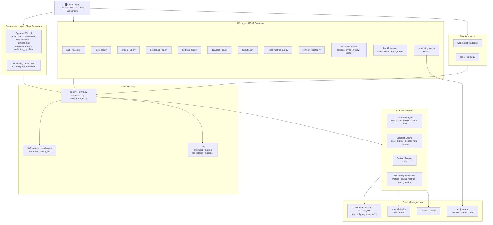
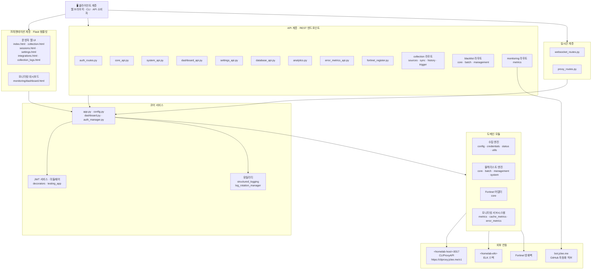

# Blacklist Service Management

[English](#english) · [한국어](#korean)


> A Python 3.11 / Flask-based service that consolidates **blacklist collection**, **operational monitoring**, **role-based API access**, **Fortinet firewall integration**, and **AI-assisted automation** behind a single, observability-first runtime.

---

<a id="english"></a>

## 🇺🇸 English

### 1. Overview

**Blacklist Service Management** is a Python 3.11 web application that centralizes every operational concern of a security-oriented blacklist pipeline into a single Flask runtime. It is purpose-built for homelab and small-team environments where the same operator who collects threat feeds also needs to manage firewall policy, audit sessions, and observe system health without juggling multiple tools.

The runtime under `app/` exposes a layered architecture:

- **Web tier** — Flask templates for operator workflows: `templates/index.html`, `templates/collection.html`, `templates/sessions.html`, `templates/settings.html`, `templates/integrations.html`, `templates/collection_logs.html`, and the dedicated monitoring view `templates/monitoring/dashboard.html`.
- **API tier** — REST endpoints under `app/core/routes/api/` covering analytics, auth, dashboard, database, error metrics, settings, system, Fortinet registration, plus the nested `collection/`, `blacklist/`, and `fortinet/` modules.
- **Domain modules** — purpose-built services for collection sources/sync/history/trigger, blacklist core/batch/management, and Fortinet core integration.
- **Cross-cutting** — JWT auth (`jwt_service.py`, `middleware.py`, `decorators.py`), structured logging and rotation (`utils/structured_logging.py`, `utils/log_rotation_manager.py`), and an AI gateway fronted by the public [CLIProxyAPI](https://cliproxy.jclee.me/v1) endpoint.

### 2. Features

- **Multi-source blacklist collection** — pluggable sources, scheduled sync, on-demand triggers, and full per-run history (see `app/core/routes/api/collection/`).
- **Operational monitoring** — first-class metrics, cache metrics, and error metrics surfaced through both the API and the dedicated `monitoring/dashboard.html` view.
- **Role-based API access** — JWT-issued tokens, decorators for route-level guards, and middleware for tenant/session enforcement.
- **Fortinet firewall integration** — automated device registration, policy push, and health checks via `fortinet/core.py` and `fortinet_register.py`.
- **AI-assisted automation** — outbound requests are routed through [CLIProxyAPI](https://cliproxy.jclee.me/v1) running on the homelab host, exposing models like `gpt-5.5` with `minimax-m3` as fallback.
- **Observability-first** — structured JSON logs, automatic log rotation, and per-route metrics make the runtime debuggable from day one.
- **Container-ready** — `Dockerfile` plus a Makefile-driven `docker compose` workflow for both dev (hot reload) and prod-like runs.

### 3. Architecture



The diagram intentionally uses the placeholders `<homelab-host>` and `<homelab-elk>` instead of concrete IPs. The public AI gateway endpoint is `https://cliproxy.jclee.me/v1`.

### 4. Automation Inventory

The repository ships with **18 GitHub Actions workflows** under `.github/workflows/`. They are grouped by lifecycle stage below; the file names shown are the exact on-disk names (numeric prefix preserved).

#### 4.1 Issue → Branch → PR Lifecycle

| Workflow | Purpose |
| --- | --- |
| `02_issue-to-branch.yml` | Creates a working branch from an issue (with Codex/agent bootstrap). |
| `01_branch-to-pr.yml` | Opens a pull request once a branch is ready and pushes commits. |
| `19_issue-backfill.yml` | Backfills missing metadata on stale issues. |

#### 4.2 Pull Request Lifecycle

| Workflow | Purpose |
| --- | --- |
| `10_pr-review.yml` | Automated PR review powered by [PR-Agent](https://github.com/qodo-ai/pr-agent). |
| `11_security-pr-review.yml` | Security-focused PR review (SAST heuristics, secret risk). |
| `13_pr-auto-merge.yml` | Auto-merges PRs that pass all required checks. |
| `12_dependabot-auto-merge.yml` | Auto-merges Dependabot PRs after CI/CodeQL succeed. |
| `14_bot-auto-fix.yml` | Bot-driven auto-fix commits (lint, formatting, simple refactors). |
| `15_merged-pr-cleanup.yml` | Deletes merged feature branches. |

#### 4.3 CI / Build

| Workflow | Purpose |
| --- | --- |
| `ci.yml` | Main CI: lint, type-check, unit/integration tests. |
| `_ci-node.yml` | Reusable Node.js CI step (frontend tooling). |
| `build-images.yml` | Builds and publishes container images. |

#### 4.4 Release Pipeline

| Workflow | Purpose |
| --- | --- |
| `24_release-notes.yml` | Drafts release notes from merged PRs. |
| `25_release-publish.yml` | Publishes a GitHub Release and triggers downstream consumers. |
| `release.yml` | End-to-end release orchestration. |

#### 4.5 Security & Supply Chain

| Workflow | Purpose |
| --- | --- |
| `security.yml` | CodeQL, Gitleaks, OpenSSF Scorecard pipeline. |

#### 4.6 Observability / Operational

| Workflow | Purpose |
| --- | --- |
| `29_downstream-health-check.yml` | Verifies the health of downstream consumer repositories after a release. |
| `37_ci-failure-issues.yml` | Auto-opens an issue when a CI run fails, with reproduction context. |

> **Go automation tools:** this repository does **not** ship Go-based CLI tools (`tools/` is intentionally absent). All automation lives in the workflows listed above.

### 5. Quick Start

The fastest way to run the service is via Docker Compose using the bundled Makefile.

```bash
# 1. Clone
git clone <repo-url> blacklist-service
cd blacklist-service

# 2. Configure
cp deploy/.env.example deploy/.env   # edit secrets/ports as needed

# 3. Boot (hot-reload dev mode)
make dev
```

Once the stack is up:

- Web UI → `http://localhost:2542`
- REST API → `http://localhost:2542/api/v1/...`
- WebSocket → `ws://localhost:2542/ws/...`
- AI gateway (proxy target) → `https://cliproxy.jclee.me/v1`

### 6. Local Development

For contributors iterating on Python code without a full container rebuild:

```bash
# 1. Create a virtualenv (Python 3.11)
python3.11 -m venv .venv
source .venv/bin/activate

# 2. Install runtime + dev dependencies
pip install -r app/requirements.txt
pip install pytest pytest-cov ruff mypy pre-commit

# 3. Install git hooks (Ruff, mypy, Gitleaks, commitlint)
make setup-hooks

# 4. Run the app directly
python -m app.run_app

# 5. Run tests with markers
pytest -m unit          # fast, no external deps
pytest -m integration   # requires running services
pytest -m security      # secret & SAST-related
pytest -m api           # REST endpoint tests
pytest -m db            # database-layer tests
```

Pytest is configured via `pyproject.toml` with `pythonpath = ["app"]`, so tests can import `app.*` modules directly.

### 7. Commands Reference

The `Makefile` is the single entry point for the most common operations.

| Target | Description |
| --- | --- |
| `make help` | Prints every documented target with a short description. |
| `make setup-hooks` | Installs pre-commit, commit-msg, and Husky hooks. |
| `make dev` | Starts the dev stack with hot reload (rebuilds changed images). |
| `make dev-no-build` | Starts the dev stack using existing images (fastest). |
| `make dev-prod` | Production-like stack — no override, no hot reload. |
| `make dev-app` | Restarts only the `app` service (quick iteration). |
| `make up` / `make down` | Bring the stack up / tear it down. |
| `make logs` | Tails compose logs. |
| `make restart` | Restarts the running services. |
| `make health` | Prints container health status. |
| `make test` | Runs the full pytest suite. |
| `make verify` | Runs lint + types + secrets + pre-commit. |
| `make verify-lint` | Ruff only. |
| `make verify-types` | mypy only. |
| `make verify-secrets` | Gitleaks only. |
| `make verify-pre-commit` | Full pre-commit framework. |
| `make verify-quick` | Fast verification subset for inner loop. |
| `make verify-all` | Strict gate used in CI. |
| `make release` | Cuts a release (runs `release.yml` locally). |
| `make release-dry` | Dry-run the release pipeline. |
| `make deploy` | Deploys the prod-like stack. |
| `make prod` | Production entrypoint. |
| `make clean` | Removes containers, volumes, and build cache. |

### 8. Contribution Guide

1. **Branch from an issue** — the `02_issue-to-branch.yml` workflow will scaffold the branch for you when you comment `/branch` on an issue.
2. **Follow Conventional Commits** — enforced by `commitlint.config.js` and the `commit-msg` hook installed via `make setup-hooks`.
3. **Pass the quality gate locally** — `make verify-all` must succeed before opening a PR. PRs that fail `verify` are auto-flagged by `37_ci-failure-issues.yml`.
4. **Open a Pull Request** — `01_branch-to-pr.yml` will convert your branch into a PR. Automated review runs via `10_pr-review.yml` (PR-Agent) and `11_security-pr-review.yml`.
5. **Auto-merge** — once `ci.yml`, `security.yml`, and required reviews pass, `13_pr-auto-merge.yml` will merge your PR.
6. **Cleanup** — `15_merged-pr-cleanup.yml` removes the feature branch automatically.

For downstream consumers (e.g. the automation hub at `bot.jclee.me`), every release triggers `29_downstream-health-check.yml` to verify the new version is healthy end-to-end.

### 9. License & Contact

See [`LICENSE`](./LICENSE) for license terms. Operational questions, security disclosures, and automation bugs can be filed as GitHub issues on this repository; PR-Agent and the workflows listed above will triage them automatically.

---

<a id="korean"></a>

## 🇰🇷 한국어

### 1. 개요

**Blacklist Service Management**는 Python 3.11 / Flask 기반의 웹 애플리케이션으로, 보안 위협 블랙리스트 수집·운영 모니터링·역할 기반 API 접근 제어·Fortinet 방화벽 연동·AI 자동화를 단일 런타임에서 제공합니다. 홈랩 및 소규모 운영팀이 별도 도구 없이 위협 피드 수집부터 방화벽 정책 반영, 세션 감사, 시스템 상태 관찰까지 한 곳에서 수행하도록 설계되었습니다.

`app/` 하위 디렉터리는 다음과 같은 계층 구조를 가집니다.

- **웹 계층** — 운영자용 Flask 템플릿: `templates/index.html`, `templates/collection.html`, `templates/sessions.html`, `templates/settings.html`, `templates/integrations.html`, `templates/collection_logs.html`, 그리고 전용 모니터링 화면인 `templates/monitoring/dashboard.html`.
- **API 계층** — `app/core/routes/api/` 하위의 REST 엔드포인트: 인증, 분석, 대시보드, 데이터베이스, 에러 메트릭, 설정, 시스템, Fortinet 등록, 그리고 중첩 모듈인 `collection/`, `blacklist/`, `fortinet/`.
- **도메인 모듈** — 수집 소스/스케줄/이력/트리거, 블랙리스트 코어/배치/관리, Fortinet 연동을 전담하는 서비스.
- **횡단 관심사** — JWT 인증(`jwt_service.py`, `middleware.py`, `decorators.py`), 구조화 로깅 및 로테이션(`utils/structured_logging.py`, `utils/log_rotation_manager.py`), 그리고 공용 AI 게이트웨이인 [CLIProxyAPI](https://cliproxy.jclee.me/v1) 연동.

### 2. 주요 기능

- **다중 소스 블랙리스트 수집** — 플러그인 방식의 소스, 정기 동기화, 수동 트리거, 실행 이력 보관을 `app/core/routes/api/collection/`에서 제공.
- **운영 모니터링** — 메트릭/캐시 메트릭/에러 메트릭을 API와 전용 대시보드 `monitoring/dashboard.html`에서 동시에 노출.
- **역할 기반 API 접근 제어** — JWT 발급, 라우트 단위 데코레이터, 미들웨어 기반의 테넌트/세션 강제.
- **Fortinet 방화벽 연동** — `fortinet/core.py`와 `fortinet_register.py`를 통한 장비 자동 등록·정책 반영·상태 점검.
- **AI 기반 자동화** — 외부 요청은 홈랩 호스트의 [CLIProxyAPI](https://cliproxy.jclee.me/v1)로 라우팅되며, 기본 모델 `gpt-5.5`와 폴백 모델 `minimax-m3`을 사용.
- **관측 가능성 우선 설계** — 구조화 JSON 로그, 자동 로테이션, 라우트별 메트릭 제공.
- **컨테이너 친화** — `Dockerfile`과 Makefile 기반의 `docker compose` 워크플로우로 개발(핫 리로드)과 운영 모드를 즉시 전환.

### 3. 아키텍처



다이어그램에서는 실제 사설 IP 대신 `<homelab-host>`, `<homelab-elk>` 같은 플레이스홀더를 사용합니다. 공용 AI 게이트웨이 엔드포인트는 `https://cliproxy.jclee.me/v1` 입니다.

### 4. 자동화 인벤토리

이 저장소는 `.github/workflows/` 하위에 **총 18개의 GitHub Actions 워크플로우**를 포함합니다. 아래는 수명 주기 단계별로 정리한 표이며, 표시된 파일명은 실제 디스크상의 이름(숫자 접두사 포함)입니다.

#### 4.1 이슈 → 브랜치 → PR 라이프사이클

| 워크플로우 | 설명 |
| --- | --- |
| `02_issue-to-branch.yml` | 이슈로부터 작업 브랜치를 자동 생성(Codex/에이전트 부트스트랩 포함). |
| `01_branch-to-pr.yml` | 브랜치가 준비되면 커밋 푸시와 동시에 PR을 자동 개설. |
| `19_issue-backfill.yml` | 오래된 이슈의 누락된 메타데이터를 보강. |

#### 4.2 풀 리퀘스트 라이프사이클

| 워크플로우 | 설명 |
| --- | --- |
| `10_pr-review.yml` | [PR-Agent](https://github.com/qodo-ai/pr-agent) 기반 자동 리뷰. |
| `11_security-pr-review.yml` | 보안 중심 PR 리뷰(SAST 휴리스틱, 시크릿 위험도). |
| `13_pr-auto-merge.yml` | 모든 필수 검증을 통과한 PR을 자동 병합. |
| `12_dependabot-auto-merge.yml` | CI/CodeQL을 통과한 Dependabot PR 자동 병합. |
| `14_bot-auto-fix.yml` | 린트/포맷팅 등 단순 수정의 봇 자동 적용. |
| `15_merged-pr-cleanup.yml` | 병합된 feature 브랜치를 자동 삭제. |

#### 4.3 CI / 빌드

| 워크플로우 | 설명 |
| --- | --- |
| `ci.yml` | 메인 CI: 린트, 타입 검사, 단위/통합 테스트. |
| `_ci-node.yml` | 재사용 가능한 Node.js CI 단계(프런트엔드 도구). |
| `build-images.yml` | 컨테이너 이미지 빌드 및 게시. |

#### 4.4 릴리스 파이프라인

| 워크플로우 | 설명 |
| --- | --- |
| `24_release-notes.yml` | 병합된 PR로부터 릴리스 노트 초안 작성. |
| `25_release-publish.yml` | GitHub Release 게시 및 다운스트림 소비자 트리거. |
| `release.yml` | 엔드 투 엔드 릴리스 오케스트레이션. |

#### 4.5 보안 및 공급망

| 워크플로우 | 설명 |
| --- | --- |
| `security.yml` | CodeQL · Gitleaks · OpenSSF Scorecard 파이프라인. |

#### 4.6 관측 / 운영

| 워크플로우 | 설명 |
| --- | --- |
| `29_downstream-health-check.yml` | 릴리스 이후 다운스트림 소비자 저장소의 상태를 점검. |
| `37_ci-failure-issues.yml` | CI 실패 시 재현 컨텍스트를 포함해 이슈를 자동 개설. |

> **Go 자동화 도구:** 이 저장소는 Go 기반 CLI 도구를 포함하지 않습니다(`tools/` 디렉터리 없음). 모든 자동화는 위에 나열된 워크플로우로 구현됩니다.

### 5. 빠른 시작

가장 빠른 실행 경로는 번들된 Makefile을 통한 Docker Compose 입니다.

```bash
# 1. 클론
git clone <repo-url> blacklist-service
cd blacklist-service

# 2. 환경 변수 구성
cp deploy/.env.example deploy/.env   # 시크릿/포트 필요 시 편집

# 3. 개발 스택 기동(핫 리로드)
make dev
```

스택이 올라온 뒤 다음 엔드포인트를 사용할 수 있습니다.

- 웹 UI → `http://localhost:2542`
- REST API → `http://localhost:2542/api/v1/...`
- WebSocket → `ws://localhost:2542/ws/...`
- AI 게이트웨이(프록시 대상) → `https://cliproxy.jclee.me/v1`

### 6. 로컬 개발

컨테이너 재빌드 없이 Python 코드만 빠르게 이터레이션하려면 다음 절차를 따르세요.

```bash
# 1. 가상환경 생성(Python 3.11)
python3.11 -m venv .venv
source .venv/bin/activate

# 2. 런타임 + 개발 의존성 설치
pip install -r app/requirements.txt
pip install pytest pytest-cov ruff mypy pre-commit

# 3. 깃 훅 설치(Ruff · mypy · Gitleaks · commitlint)
make setup-hooks

# 4. 앱 직접 실행
python -m app.run_app

# 5. 테스트 실행(marker 활용)
pytest -m unit          # 빠름, 외부 의존성 없음
pytest -m integration   # 가동 중인 서비스 필요
pytest -m security      # 시크릿/SAST 관련
pytest -m api           # REST 엔드포인트 테스트
pytest -m db            # 데이터베이스 계층 테스트
```

`pyproject.toml`에 `pythonpath = ["app"]`이 설정되어 있으므로 테스트에서 `app.*` 모듈을 바로 임포트할 수 있습니다.

### 7. 명령어 레퍼런스

`Makefile`이 가장 자주 사용하는 작업의 단일 진입점입니다.

| 타깃 | 설명 |
| --- | --- |
| `make help` | 문서화된 모든 타깃과 간단한 설명을 출력. |
| `make setup-hooks` | pre-commit, commit-msg, Husky 훅을 설치. |
| `make dev` | 변경된 이미지를 재빌드하며 핫 리로드 개발 스택 기동. |
| `make dev-no-build` | 기존 이미지를 그대로 사용해 기동(가장 빠름). |
| `make dev-prod` | 운영과 유사한 스택(오버라이드/핫 리로드 없음). |
| `make dev-app` | `app` 서비스만 재시작(빠른 이터레이션). |
| `make up` / `make down` | 스택 기동 / 종료. |
| `make logs` | compose 로그를 tail. |
| `make restart` | 가동 중인 서비스를 재시작. |
| `make health` | 컨테이너 헬스 상태 출력. |
| `make test` | 전체 pytest 스위트 실행. |
| `make verify` | 린트 + 타입 + 시크릿 + pre-commit 실행. |
| `make verify-lint` | Ruff만 실행. |
| `make verify-types` | mypy만 실행. |
| `make verify-secrets` | Gitleaks만 실행. |
| `make verify-pre-commit` | 전체 pre-commit 프레임워크 실행. |
| `make verify-quick` | 내부 루프용 빠른 검증 서브셋. |
| `make verify-all` | CI에서 사용하는 엄격한 게이트. |
| `make release` | 릴리스 절차를 실행(`release.yml` 로컬 트리거). |
| `make release-dry` | 릴리스 파이프라인 드라이런. |
| `make deploy` | 운영과 유사한 스택 배포. |
| `make prod` | 운영 진입점. |
| `make clean` | 컨테이너, 볼륨, 빌드 캐시 정리. |

### 8. 기여 가이드

1. **이슈에서 브랜치 생성** — 이슈에 `/branch`를 댓글로 달면 `02_issue-to-branch.yml` 워크플로우가 브랜치를 자동 생성합니다.
2. **Conventional Commits 준수** — `commitlint.config.js`와 `make setup-hooks`로 설치되는 `commit-msg` 훅이 강제합니다.
3. **로컬에서 품질 게이트 통과** — PR을 열기 전에 `make verify-all`이 성공해야 합니다. 실패한 PR은 `37_ci-failure-issues.yml`로 자동 플래깅됩니다.
4. **PR 개설** — `01_branch-to-pr.yml`이 브랜치를 PR로 자동 변환하며, `10_pr-review.yml`(PR-Agent)과 `11_security-pr-review.yml`로 자동 리뷰가 진행됩니다.
5. **자동 병합** — `ci.yml`, `security.yml`, 필수 리뷰가 모두 통과하면 `13_pr-auto-merge.yml`이 PR을 병합합니다.
6. **정리** — `15_merged-pr-cleanup.yml`이 feature 브랜치를 자동 삭제합니다.

다운스트림 소비자(예: `bot.jclee.me` 자동화 허브)의 경우, 모든 릴리스가 `29_downstream-health-check.yml`을 트리거해 신규 버전의 엔드 투 엔드 상태를 점검합니다.

### 9. 라이선스 및 연락처

라이선스 조건은 [`LICENSE`](./LICENSE)를 참고하세요. 운영·보안·자동화 관련 문의와 버그는 GitHub 이슈로 등록할 수 있으며, PR-Agent와 위에 나열된 워크플로우가 자동 분류/라우팅합니다.