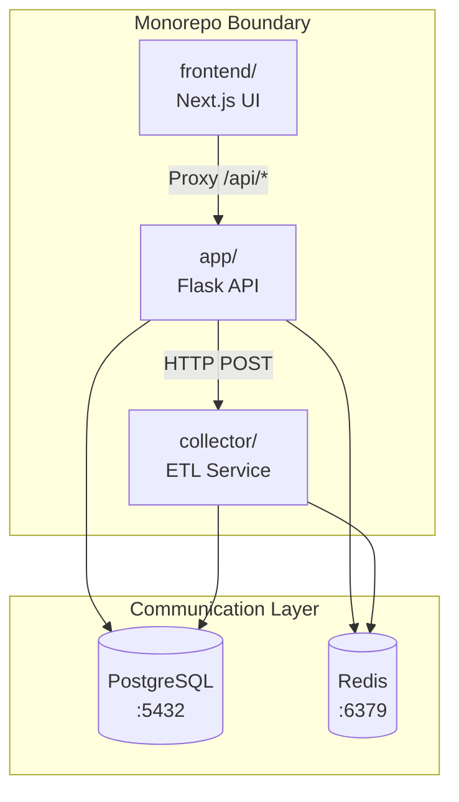

# Blacklist Intelligence Platform - Monorepo Structure

**Version**: 3.6.3

## Overview

Monorepo containing 5 services for threat intelligence collection, management, and enforcement.
All services use `network_mode: host` and Docker Named Volumes for persistent storage.

```
blacklist/
├── app/                    # Backend API Service (Flask)            :2542
├── collector/              # ETL/Collection Service (Python)        :8545
├── frontend/               # Dashboard UI (Next.js 15)              :443
├── deploy/                 # Deployment configurations
│   ├── docker-compose.yml  # Development compose (named volumes)
│   ├── base.yml            # Shared service definitions
│   └── install.sh          # Offline installer
├── postgres/               # Database schema & migrations
│   ├── initdb/             # Extension + schema bootstrap
│   └── migrations/         # Sequential SQL migrations (001–006)
├── docs/                   # Documentation hub
├── tests/                  # Backend tests (pytest, 107 files, 785+ tests)
└── .github/                # CI/CD workflows
```

---

## Services

### 1. Backend API (`app/`)

**Technology**: Python 3.11, Flask 3.x, Raw SQL (psycopg2)  
**Port**: 2542  
**Entry Point**: `app/run_app.py`

```
app/
├── run_app.py              # Application entry point
├── core/
│   ├── app.py              # Application Factory (479L)
│   ├── config.py           # 48 @property configurations
│   ├── routes/
│   │   ├── api/            # REST API (6 blueprints, CSRF-exempt)
│   │   │   ├── blacklist/  # Blacklist CRUD (core/management/batch/system)
│   │   │   ├── collection/ # Collection management (9 files, 18 endpoints)
│   │   │   ├── fortinet/   # Fortinet integration (threat feed, device, health)
│   │   │   ├── ip_management/ # IP management (11 routes)
│   │   │   └── ...         # dashboard, settings, analytics, error_metrics
│   │   └── web/            # Legacy Korean admin (5 blueprints, Jinja2)
│   ├── services/           # 14 business services (ServiceFactory DI)
│   ├── auth/               # JWT authentication (currently disabled)
│   ├── database/           # SmartConnectionManager, recovery
│   ├── monitoring/         # Prometheus metrics
│   ├── exceptions/         # RFC 7807 APIError hierarchy
│   └── utils/              # Response helpers, AES-256-GCM, caching, validation
├── requirements.txt
└── Dockerfile
```

**Key Patterns**:
- DI via `current_app.extensions['service_name']`
- No ORM — Raw SQL with parameterized `%s` only
- RFC 7807 error responses via typed exception hierarchy
- 101 route decorators across 29 API files

---

### 2. Collector Service (`collector/`)

**Technology**: Python 3.11, APScheduler (independent runtime, not Flask)  
**Port**: 8545  
**Entry Point**: `collector/run_collector.py`

```
collector/
├── run_collector.py        # CollectorApplication entry point
├── config.py               # CollectorConfig
├── scheduler.py            # CollectionScheduler (APScheduler, adaptive 300s–3600s)
├── scheduler_api.py        # Scheduler REST API
├── health_server.py        # HealthServer (:8545)
└── core/
    ├── database.py         # Collector DatabaseService
    ├── regtech/            # REGTECH collector package
    ├── multi_source/       # Multi-source collection
    ├── data_quality.py     # DataQualityManager
    ├── ip_validator.py     # IPValidator
    └── rate_limiter.py     # Token Bucket Rate Limiter
```

**Key Patterns**:
- Independent from `app/` — zero code sharing
- Communication: DB & Redis only (no direct imports)
- Scheduled jobs: REGTECH daily at 02:00, cleanup at 00:00

---

### 3. Frontend Dashboard (`frontend/`)

**Technology**: Next.js 15 (App Router), TypeScript, Tailwind CSS v4  
**Port**: 443 (SSL embedded in standalone image)  
**Entry Point**: `frontend/app/page.tsx`

```
frontend/
├── app/                    # Next.js App Router
├── components/             # React components
│   └── ui/                 # Radix UI / shadcn components
├── lib/
│   └── api.ts              # API client (ALL calls go here)
├── hooks/                  # Custom React hooks
├── types/                  # TypeScript types
├── __tests__/              # Unit tests (Vitest) — 44 files, 207+ tests
├── e2e/                    # E2E tests (Playwright)
└── Dockerfile
```

**Key Patterns**:
- All API calls through `lib/api.ts` (no direct `fetch()`)
- Server Components by default
- Standalone output with Self-signed SSL embedded in Docker image

---

## Database (`postgres/`)

```
postgres/
├── initdb/                 # Extension + schema bootstrap
│   ├── 01_extensions.sql   # uuid-ossp, pg_trgm
│   └── 02_schema.sql       # Table creation, indexes, triggers
└── migrations/             # Sequential SQL migrations (001–006)
```

**15 Tables**, **4 Views**, **50+ Indexes**, **2 Extensions** (uuid-ossp, pg_trgm)

---

## Service Boundaries



**Rules**:
1. **No cross-imports** between `app/`, `collector/`, `frontend/`
2. Communication only via: PostgreSQL, Redis, HTTP APIs
3. `collector/` operates independently — zero code sharing with `app/`

---

## Environment Variables

| Variable | Service | Description |
|----------|---------|-------------|
| `CREDENTIAL_MASTER_KEY` | app | AES-256-GCM encryption master key |
| `SECRET_KEY` | app | Flask session secret |
| `POSTGRES_HOST` | app, collector | PostgreSQL host |
| `POSTGRES_PORT` | app, collector | PostgreSQL port (default: 5432) |
| `POSTGRES_DB` | app, collector | PostgreSQL database name |
| `POSTGRES_USER` | app, collector | PostgreSQL username |
| `POSTGRES_PASSWORD` | app, collector | PostgreSQL password |
| `REDIS_HOST` | app | Redis host |
| `REDIS_PORT` | app | Redis port (default: 6379) |
| `FORTIMANAGER_HOST` | app | FortiManager API endpoint |

---

## Development Commands

```bash
make dev                    # Start all services with hot reload
make build                  # Build production Docker images
make test                   # All tests (backend + frontend)
make test-backend-coverage  # pytest with ≥80% coverage threshold
make test-frontend-e2e      # Playwright E2E
make release TYPE=patch     # Bump version, tag, changelog
```