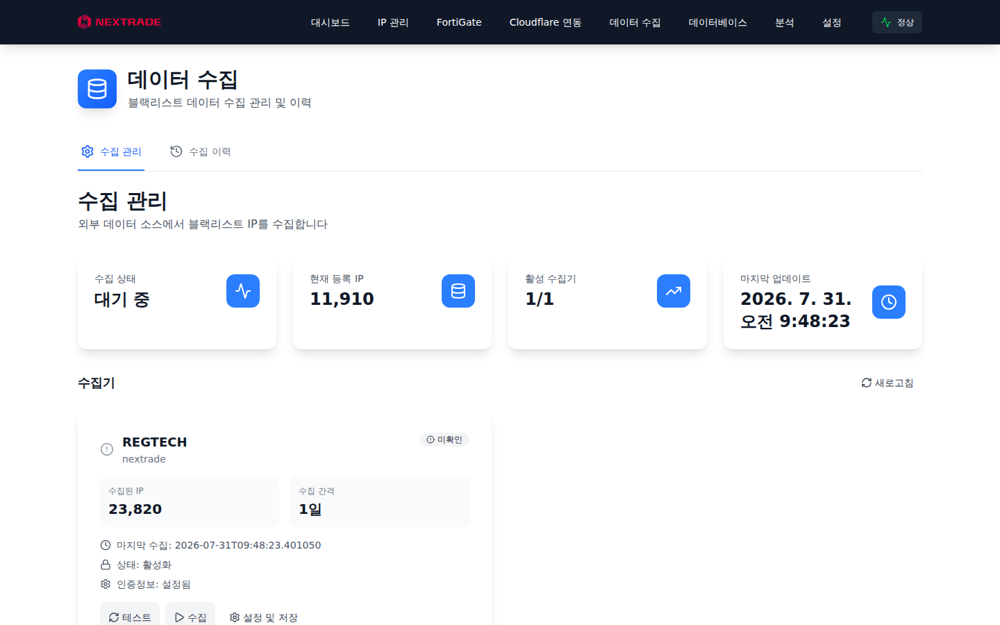
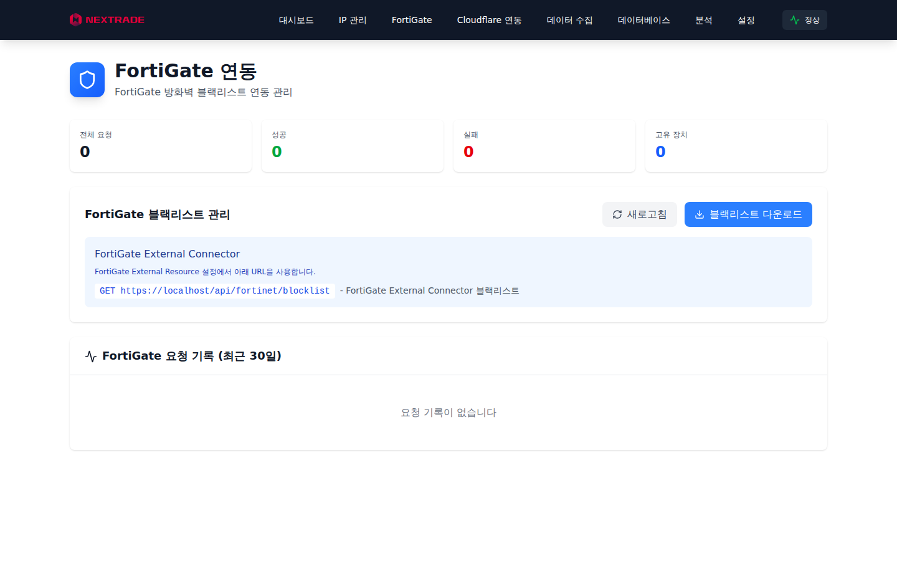
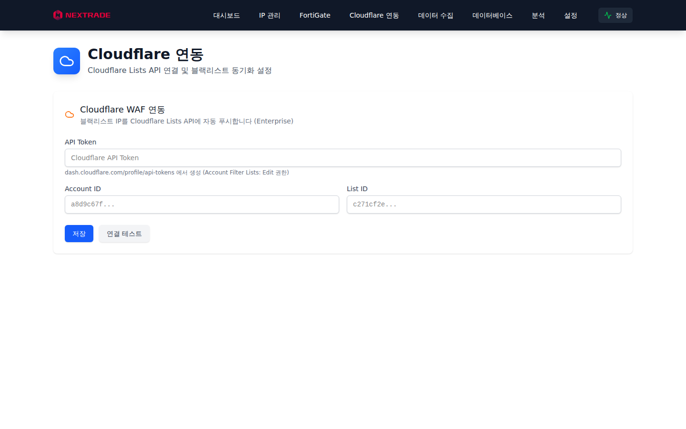
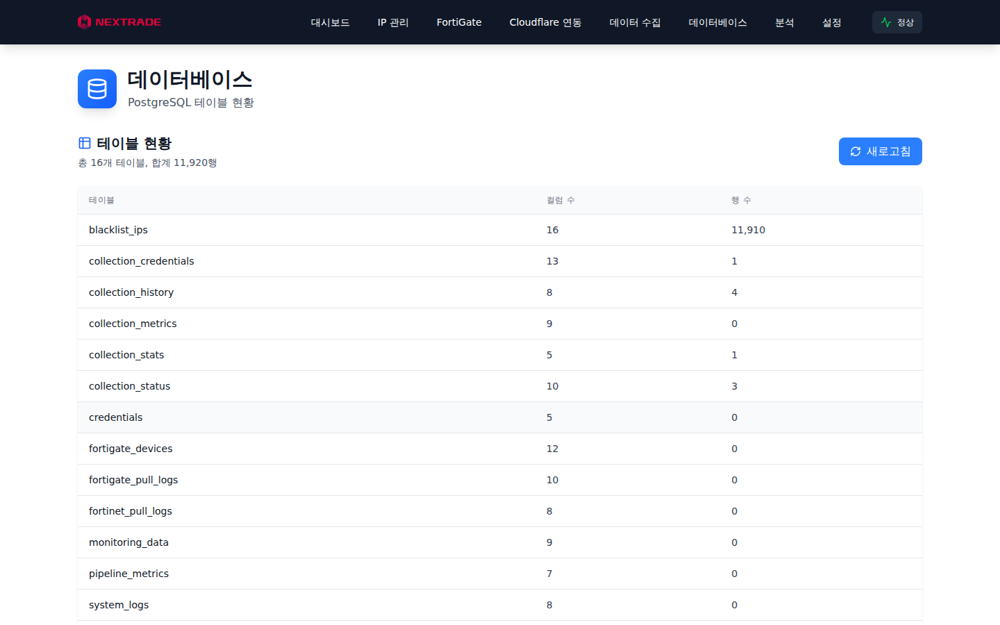

# Blacklist 관리자 가이드

**버전:** 5.0.0

이 문서는 Blacklist 운영 관리자를 위한 안내서입니다. 일반 조회 사용법은 [사용자 가이드](blacklist-user-guide.md), 설치·무결성 절차는 [오프라인 설치 가이드](blacklist-offline-installation-guide.md)를 참조하십시오.

## 1. 관리자 계정

- 최초 설치 시 설치 프로그램이 대상 호스트에서 관리자 자격증명(`ADMIN_USERNAME`/`ADMIN_PASSWORD`)을 생성해 한 번만 표시합니다. 반드시 안전한 곳에 보관하십시오.
- 대시보드와 애플리케이션 API는 JWT 인증이 기본입니다. 로그인·health·metrics·정적 자산·명시적 공개 피드만 인증 없이 접근됩니다.
- 계정 비밀번호는 DB 설정(`system_settings.admin_password`, 암호화 저장)이 환경변수보다 우선합니다. 설정값이 있으면 환경변수 변경만으로는 바뀌지 않으므로, 환경변수 기준으로 되돌리려면 해당 설정 행을 비활성화하십시오.

## 2. 데이터 수집 관리



`데이터 수집` 페이지에서 수집기를 등록·점검·실행합니다.

### 수집기 카드 항목

| 항목        | 의미                            |
| ----------- | ------------------------------- |
| 수집된 IP   | 해당 소스에서 누적 수집한 IP 수 |
| 수집 간격   | 스케줄 주기 (REGTECH 기본 1일)  |
| 마지막 수집 | 최근 수집 완료 시각             |
| 인증정보    | 소스 자격증명 등록 여부         |

### 작업

- `테스트`: 등록된 자격증명으로 소스 인증을 시험합니다. `인증 성공`이 나와야 수집이 가능합니다.
- `수집`: 전체 기간 수집을 즉시 실행합니다. 장시간(수십 분) 소요되며 진행 상태는 카드와 이력에서 확인합니다.
- `설정 및 저장`: 소스 자격증명·수집 간격·활성화 여부를 변경합니다.
- `수집 이력` 탭: 실행 시각, 신규/중복 건수, 성공 여부를 확인합니다.

### 수집 페이싱 (REGTECH WAF 대응)

원격 소스의 WAF가 IP당 요청 쿼터를 적용하므로, 수집 속도를 무리하게 올리면 출발 IP가 차단됩니다. 기본값은 5초에 1페이지(0.2 req/s)이며, 환경변수로 조정할 수 있습니다.

| 변수                                    | 기본값    | 의미                                                          |
| --------------------------------------- | --------- | ------------------------------------------------------------- |
| `REGTECH_RATE_INITIAL`                  | 0.2       | 초기 요청 속도 (req/s)                                        |
| `REGTECH_RATE_MIN` / `REGTECH_RATE_MAX` | 0.1 / 0.5 | 적응형 속도 하한·상한                                         |
| `REGTECH_RATE_BURST`                    | 1         | 버스트 허용량                                                 |
| `REGTECH_BLOCK_THRESHOLD`               | 3         | 연속 차단 신호 허용 횟수. 도달 시 수집을 즉시 중단하고 쿨다운 |

빈 응답·403·429가 연속 감지되면 수집기는 차단으로 판단해 즉시 중단합니다. 이 경우 수분~수시간 쿨다운 후 다시 실행하십시오. 반복 차단 시 속도를 더 낮추거나 WARP 프록시 경유를 검토하십시오.

## 3. FortiGate 연동



FortiGate 방화벽에 블랙리스트를 연동(외부 위협 피드)합니다. 장치 등록·연결 상태·푸시 결과를 이 화면에서 관리합니다. 장치 자격증명은 암호화되어 저장됩니다.

## 4. Cloudflare 연동



Cloudflare 계정의 IP 리스트로 블랙리스트를 푸시합니다. API 토큰과 리스트 매핑을 설정하고, 푸시 이력과 오류를 확인할 수 있습니다.

## 5. 데이터베이스



테이블 현황과 저장 상태를 조회합니다. 운영 DB는 PostgreSQL이며, 업그레이드 시 **기존 암호화 키를 반드시 유지**해야 저장된 수집 자격증명을 계속 복호화할 수 있습니다.

## 6. 운영 점검

### 일상 점검

```bash
# 5개 서비스가 모두 healthy인지 확인
docker compose ps

# 수집기 로그 확인 (차단 신호·백오프 여부)
docker logs blacklist-collector --tail 100
```

### 상태 확인 포인트

- 대시보드 우측 배지 `정상`과 수집 카드의 `수집 상태`
- 수집 직후 최대 5분간은 상태가 `수집 중`으로 표시될 수 있습니다(시각 기반 추정). 실제 진행 여부는 수집기 로그로 확인하십시오.
- Collector 제어 API(`/trigger`, `/api/test-auth/<source>`, `/api/force-collection/<source>`)는 Bearer 토큰 필수입니다. `/health`, `/status`, `/logs`는 공개입니다.

### 백업 권장 대상

- `/etc/blacklist/.env` (비밀값·암호화 키)
- PostgreSQL 볼륨 (`blacklist-pgdata`) — 블랙리스트·설정·수집 이력
- `/etc/blacklist/tls/` (남부 TLS 인증서)

## 7. 장애 대응 요약

| 증상                      | 조치                                                                                        |
| ------------------------- | ------------------------------------------------------------------------------------------- |
| 수집이 0건으로 기록됨     | 수집기 로그의 HTTP 상태 확인. 빈 응답 연속이면 WAF 차단 — 쿨다운 후 재시도                  |
| `인증 성공`인데 수집 실패 | 소스 페이지 구조 변경 또는 쿼터 차단 가능. 수집기 로그와 아카이브(`/app/data/archive`) 확인 |
| 대시보드 접속 불가        | `docker compose ps`로 frontend 상태 확인, 443 포트 점유 여부 확인                           |
| 자격증명 복호화 실패      | `.env`의 암호화 키가 초기 설치 값과 다른지 확인. 키 교체 시 저장 자격증명 재등록 필요       |
