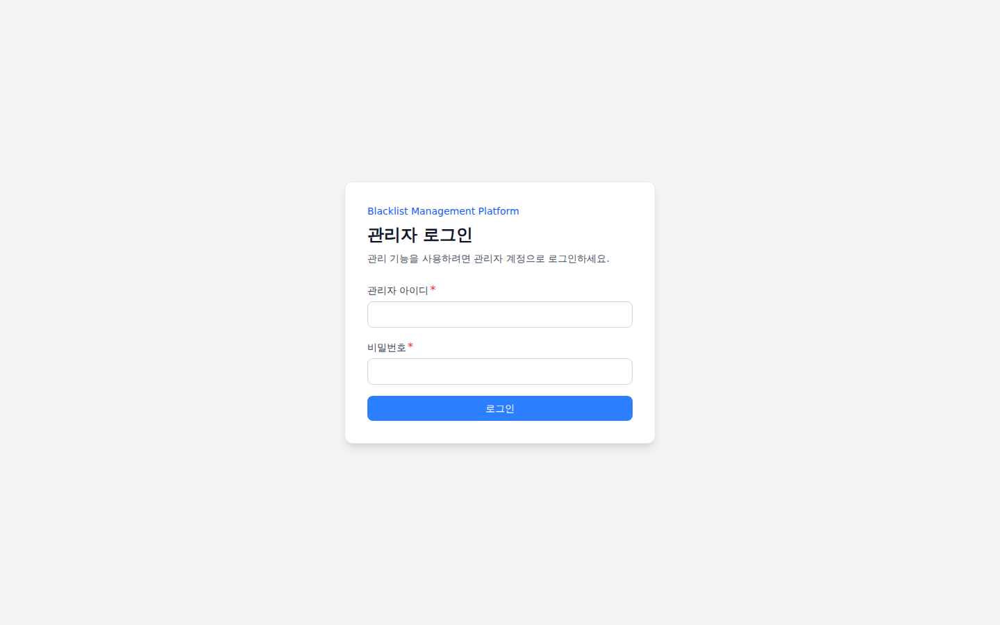
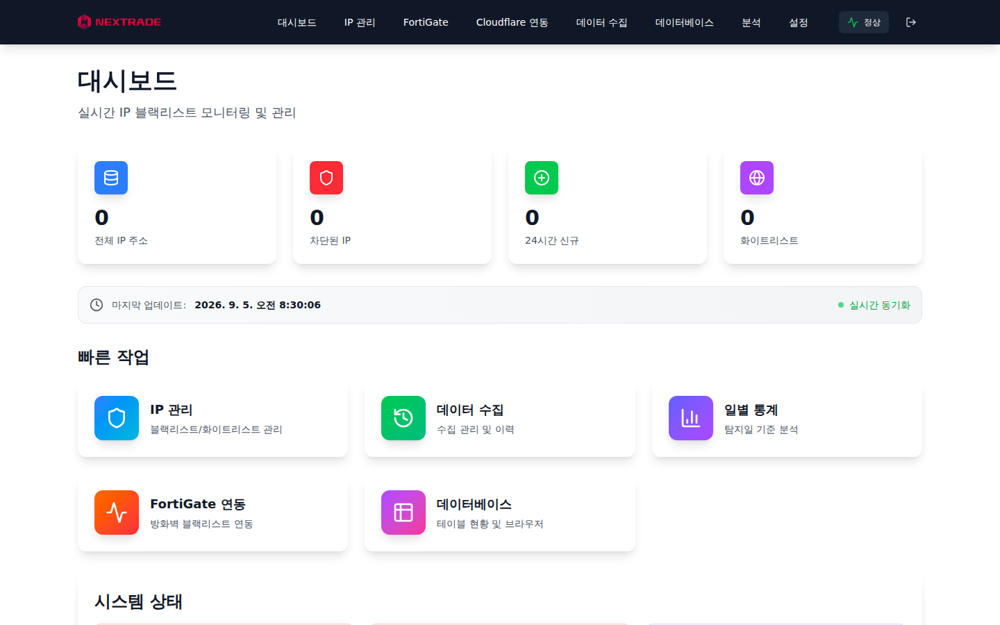
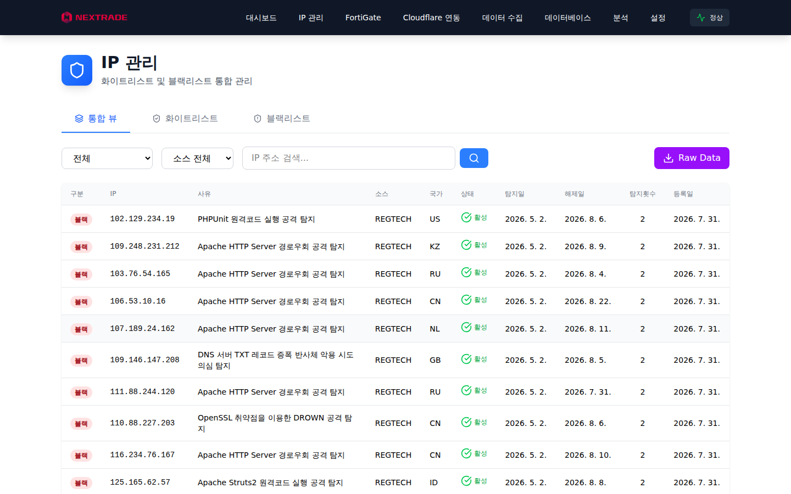
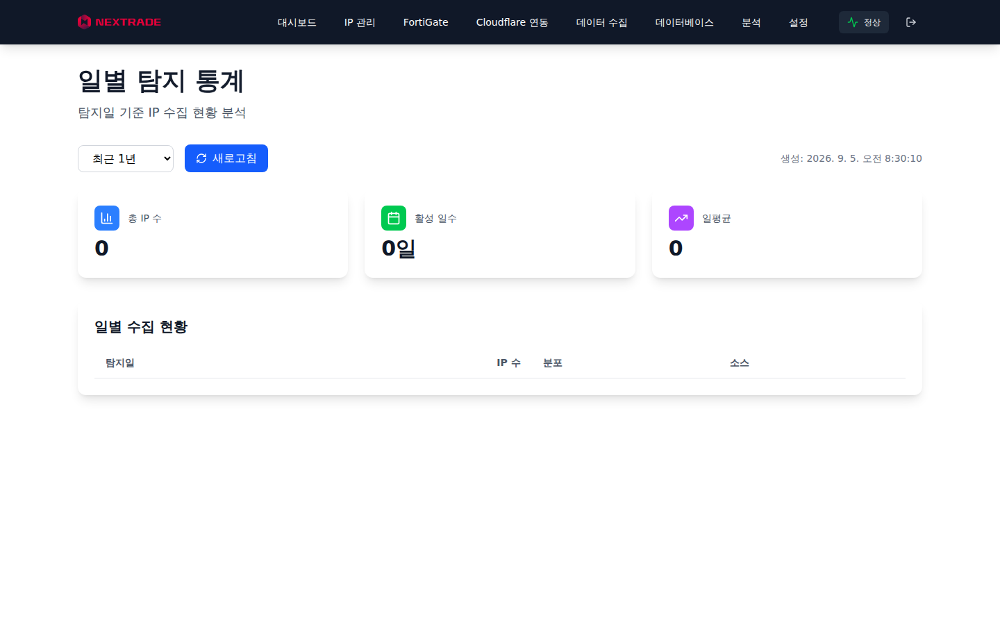

# Blacklist 사용자 가이드

**버전:** 저장소 루트 `VERSION` 기준

이 문서는 Blacklist 대시보드의 조회 기능을 안내합니다. 설정·연동·운영은 [관리자 가이드 PDF](blacklist-admin-guide.pdf)를 참조하십시오.

## 1. 접속, 로그인, 로그아웃

브라우저에서 배포된 주소(예: `https://blacklist.example.local`)에 접속하면 로그인 화면으로 이동합니다.

{ width=35% }

- 관리자가 발급한 사용자 이름과 비밀번호를 입력하고 **로그인**을 선택합니다.
- 로그인에 성공하면 대시보드로 이동합니다. 발급된 자격증명이 없거나 인증이 거부되면 관리자에게 문의하십시오.
- 데스크톱에서는 상단 우측의 로그아웃 아이콘을 선택합니다. 모바일에서는 상단 메뉴를 열고 **로그아웃을 선택합니다**.
- 로그아웃하면 현재 브라우저의 인증 정보가 삭제되고 로그인 화면으로 이동합니다.

## 2. 대시보드

{ width=35% }

로그인 후 첫 화면입니다. 상단 메뉴에서 기능 페이지로 이동하고 우측 배지에서 시스템 상태를 확인합니다.

- 전체 IP 주소: 현재 수록된 블랙리스트 IP 총수
- 차단된 IP: 차단 대상으로 활성화된 IP 수
- 24시간 신규: 최근 24시간 내 새로 수록된 IP 수
- 화이트리스트: 차단 예외로 등록된 IP 수

**빠른 작업** 카드에서 자주 쓰는 기능으로 이동합니다. 데이터 시각과 `실시간 동기화` 표시로 신선도를 확인하십시오.

## 3. IP 관리

{ width=35% }

블랙리스트와 화이트리스트를 조회·검색하는 화면입니다.

- **탭**: `통합 뷰` / `화이트리스트` / `블랙리스트`를 전환합니다.
- **필터**: 구분(전체·블랙·화이트)과 소스(예: REGTECH)로 목록을 좁힙니다.
- **검색**: `IP 주소 검색...`에 주소를 입력해 특정 IP의 등록 여부를 확인합니다.
- **표 항목**: 구분, IP, 사유, 소스, 국가, 상태, 탐지일, 해제일, 탐지횟수, 등록일.
- **사유**: 탐지된 공격 유형을 표시합니다. 예: 원격코드 실행 공격 탐지.
- **Raw Data**: 우측 상단 버튼으로 원본 데이터가 있는 블랙리스트를 CSV로 내려받습니다. 화면 필터는 적용되지 않으며 기본 활성 항목, 최대 10,000건을 제공합니다.

상태가 `활성`인 IP가 현재 차단 대상이며, `해제일`이 지나면 소스 정책에 따라 해제됩니다.

## 4. 분석

{ width=35% }\
그림 4: 분석

탐지일 기준의 일별 통계와 추세를 제공합니다. 기간별 수록량 변화와 소스별 분포를 확인하는 용도로 사용합니다.

## 5. 참고 화면

설정 변경은 관리자 권한이 필요합니다. 운영 절차는 관리자 가이드를 확인하십시오.

## 6. 문제가 보이면

로그인 오류는 자격증명을 확인하고, 오래된 통계는 데이터 시각을 확인합니다. 잘못 차단된 IP는 관리자에게 허용 등록을 요청하십시오.
