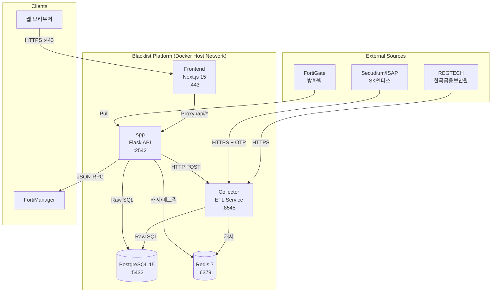
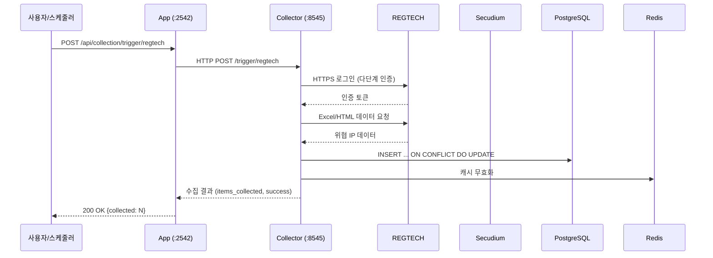
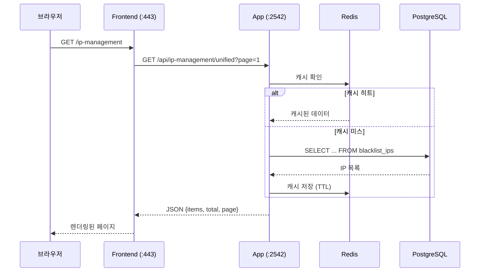
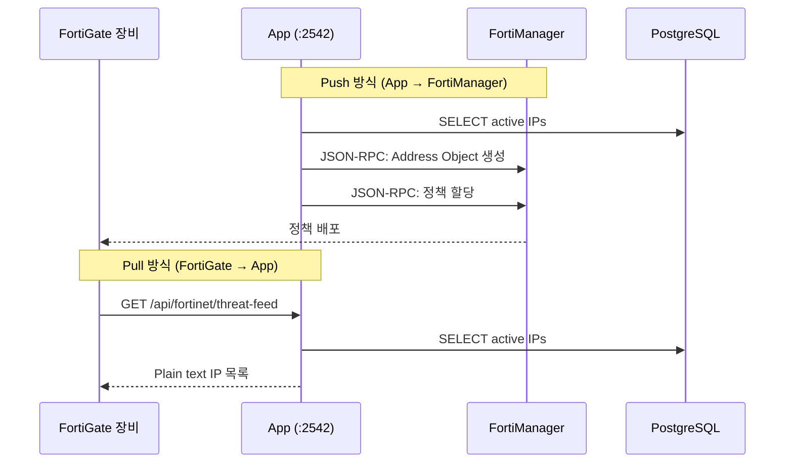
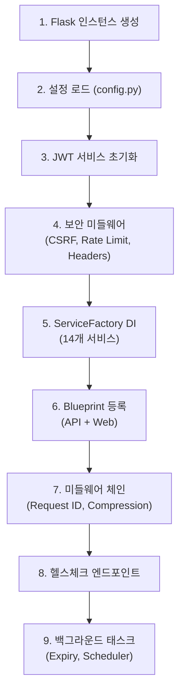

# 시스템 아키텍처

## 개요

Blacklist Intelligence Platform은 5개의 Docker 컨테이너로 구성된 마이크로서비스 아키텍처입니다.  
모든 서비스는 `network_mode: host`로 동작하며, Docker Named Volume으로 데이터를 영속화합니다.

---

## 서비스 토폴로지



---

## 서비스 상세

| 서비스 | 이미지 | 포트 | 헬스체크 | 의존성 | 볼륨 |
|--------|--------|------|----------|--------|------|
| **blacklist-postgres** | `postgres:15-alpine` | 5432 | `pg_isready` | 없음 | `blacklist-pgdata` |
| **blacklist-redis** | `redis:7-alpine` | 6379 | `redis-cli ping` | 없음 | `blacklist-redis-data` |
| **blacklist-collector** | `python:3.11-slim` | 8545 | `curl /health` | postgres, redis | `blacklist-collector-data` |
| **blacklist-app** | `python:3.11-slim` | 2542 | `curl /health` | postgres, redis | `blacklist-logs`, `blacklist-uploads` |
| **blacklist-frontend** | `node:20-alpine` | 443 | `curl --insecure /health` | app | — |

### 헬스체크 설정 (공통)

- **Interval**: 30초
- **Timeout**: 10초
- **Retries**: 3회
- **Start Period**: 서비스별 상이 (postgres 40초, app 90초, frontend 60초)

---

## 데이터 흐름

### 1. IP 수집 흐름 (ETL)



### 2. IP 조회 흐름



### 3. FortiGate 연동 흐름



---

## 통신 패턴

| 구간 | 프로토콜 | 인증 | 비고 |
|------|----------|------|------|
| 브라우저 → Frontend | HTTPS (443) | — | Self-signed SSL 내장 |
| Frontend → App | HTTP (2542) | Bearer JWT | Next.js rewrites 프록시 |
| App → Collector | HTTP (8545) | 없음 | 내부 네트워크 전용 |
| App → PostgreSQL | TCP (5432) | 패스워드 | ThreadedConnectionPool |
| App → Redis | TCP (6379) | 없음 | 캐시 전용 |
| App → FortiManager | HTTPS | API 키 | JSON-RPC |
| Collector → REGTECH | HTTPS | 다단계 인증 | 세션 기반 |
| Collector → Secudium | HTTPS | OTP (이메일) | 토큰 기반 (4시간 TTL) |

---

## Flask Application Factory

`app/core/app.py` (479줄, complexity 39.91)에서 Flask 앱을 생성합니다.

### 초기화 순서



### 핵심 패턴

```python
# DI 패턴 (필수): Flask extensions를 통한 서비스 접근
service = current_app.extensions['blacklist_service']

# 에러 처리: RFC 7807 Problem Detail
raise APIError(status=400, code="VALID_IP", message="유효하지 않은 IP 형식")

# 공개 엔드포인트: @public 데코레이터
@public
@bp.route("/health")
def health(): ...
```

---

## 환경별 구성

| 환경 | Compose 파일 | 네트워크 | 이미지 |
|------|-------------|----------|--------|
| **개발** | `deploy/docker-compose.yml` | host | 소스 빌드 |
| **CI** | `.github/docker-compose.ci.yml` | bridge | Pre-built |
| **프로덕션** | `deploy/base.yml` + `release.yml` | host | GHCR 이미지 |
| **오프라인** | `deploy/base.yml` + `release.yml` | host | `docker load` |
