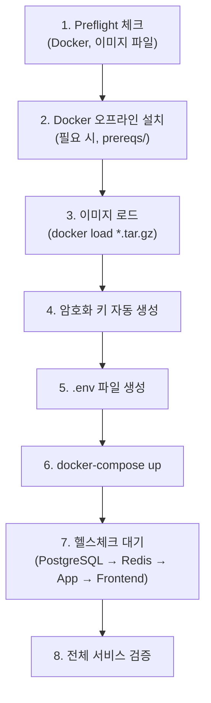
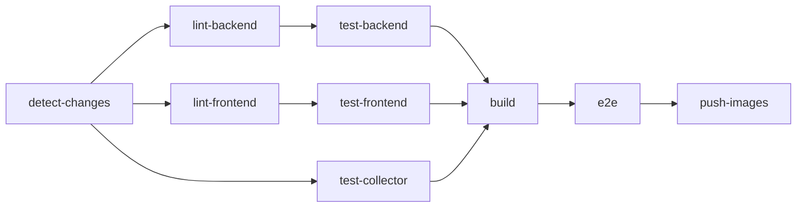
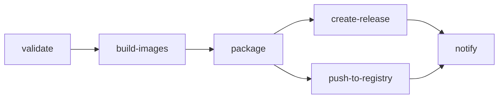

# 배포 가이드

## 개요

Blacklist Platform은 Docker 기반으로 배포되며, 오프라인 환경 설치를 지원합니다.

| 배포 방식       | 대상 환경      | Compose 파일                      |
| --------------- | -------------- | --------------------------------- |
| 개발 (make dev) | 로컬 개발      | `deploy/docker-compose.yml`       |
| CI/CD           | GitHub Actions | `.github/docker-compose.ci.yml`   |
| 프로덕션        | 서버           | `deploy/base.yml` + `release.yml` |
| 오프라인        | 폐쇄망         | `install.sh` + 이미지 번들        |

---

## Docker 이미지

| 서비스        | 베이스 이미지               | 빌드 스테이지                   | 사용자          | 포트 |
| ------------- | --------------------------- | ------------------------------- | --------------- | ---- |
| **app**       | `python:3.11-slim-bullseye` | 2단계 (build + runtime)         | `app:app`       | 2542 |
| **collector** | `python:3.11-slim`          | 2단계 (builder + runtime)       | 비root          | 8545 |
| **frontend**  | `node:20-alpine`            | 3단계 (deps + builder + runner) | `nextjs:nodejs` | 443  |
| **postgres**  | `postgres:15-alpine`        | 단일                            | postgres        | 5432 |
| **redis**     | `redis:7-alpine`            | 단일                            | redis           | 6379 |

### 빌드 인자

```dockerfile
ARG APP_VERSION=0.0.0-dev
ARG GIT_COMMIT
ARG BUILD_DATE
```

---

## 개발 환경

```bash
# 전체 서비스 실행 (핫 리로드)
make dev

# 개별 서비스 재시작
make dev-app
make dev-frontend

# 로그 확인
make logs

# 헬스 체크
make health

# DB 쉘
make db-shell
```

### 볼륨

| 볼륨                       | 마운트 위치                | 용도           |
| -------------------------- | -------------------------- | -------------- |
| `blacklist-pgdata`         | `/var/lib/postgresql/data` | DB 데이터      |
| `blacklist-redis-data`     | `/data`                    | Redis 캐시     |
| `blacklist-collector-data` | `/app/data`                | Collector 상태 |
| `blacklist-logs`           | `/app/logs`                | 공유 로그      |
| `blacklist-uploads`        | `/app/uploads`             | 업로드 파일    |
| `blacklist-app-data`       | `/app/data`                | App 상태       |

---

## 프로덕션 배포

### 사전 요구사항

- Docker Engine 24+
- Docker Compose V2
- 최소 4GB RAM, 20GB 디스크

### 환경변수 설정

`deploy/.env.example`을 복사하여 `.env` 파일을 생성합니다:

```bash
cp deploy/.env.example .env
```

**필수 환경변수:**

| 변수                        | 설명                    | 생성 방법                                                  |
| --------------------------- | ----------------------- | ---------------------------------------------------------- |
| `CREDENTIAL_MASTER_KEY`     | AES-256 마스터 키 (hex) | `python -c "import secrets; print(secrets.token_hex(32))"` |
| `SECRET_KEY`                | Flask 시크릿 키         | 위와 동일                                                  |
| `CREDENTIAL_ENCRYPTION_KEY` | 크레덴셜 암호화 키      | 위와 동일                                                  |
| `ENCRYPTION_SALT`           | 암호화 솔트             | 위와 동일                                                  |
| `POSTGRES_PASSWORD`         | DB 비밀번호             | 직접 설정                                                  |

**선택 환경변수:**

| 변수                  | 기본값                          | 설명                                |
| --------------------- | ------------------------------- | ----------------------------------- |
| `POSTGRES_USER`       | postgres                        | DB 사용자                           |
| `POSTGRES_DB`         | blacklist                       | DB 이름                             |
| `JWT_SECRET_KEY`      | —                               | JWT 서명 키                         |
| `JWT_EXPIRY_HOURS`    | 8                               | JWT 만료 시간                       |
| `ADMIN_USERNAME`      | **SET_ADMIN_USERNAME**          | 관리자 계정 (배포 시 변경 필수)     |
| `ADMIN_PASSWORD`      | **SET_ADMIN_PASSWORD**          | 관리자 비밀번호 (배포 시 변경 필수) |

| `COLLECTOR_URL`       | http://blacklist-collector:8545 | Collector URL                       |
| `LOG_LEVEL`           | INFO                            | 로그 레벨                           |
| `COLLECTION_INTERVAL` | 3600                            | 수집 간격 (초)                      |

### 빌드 및 실행

```bash
# 프로덕션 이미지 빌드 (clean git tree 필요)
make build

# 배포
make deploy
```

---

## 오프라인 설치

인터넷이 없는 폐쇄망 환경을 위한 배포 방식입니다.

### 번들 구조

```
blacklist-{VERSION}/
├── images/
│   ├── app.tar.gz
│   ├── collector.tar.gz
│   ├── frontend.tar.gz
│   ├── postgres.tar.gz
│   ├── redis.tar.gz
│   └── checksums.sha256
├── docker-compose.yml
├── base.yml
├── install.sh
├── prereqs/               # Docker 오프라인 바이너리 (선택)
└── VERSION
```

### 설치 과정

```bash
# 1. 번들 압축 해제
tar xzf blacklist-3.6.9.tar.gz
cd blacklist-3.6.9

# 2. 설치 스크립트 실행
chmod +x install.sh
./install.sh
```

### install.sh 동작 순서



### Rollback

`install.sh`는 `.rollback-images` 디렉토리에 이전 이미지를 백업합니다.

---

## CI/CD 파이프라인

### CI (`ci.yml` — Push/PR to master)



| Job                | 도구         | 상세                                          |
| ------------------ | ------------ | --------------------------------------------- |
| **detect-changes** | path filter  | frontend/, app/, collector/, tests/ 변경 감지 |
| **lint-backend**   | Ruff         | check + format (line-length 120)              |
| **lint-frontend**  | ESLint + tsc | `--noEmit` 타입 체크                          |
| **test-backend**   | pytest       | 785+ tests, coverage >= 80% 필수              |
| **test-frontend**  | vitest       | 207+ tests                                    |
| **test-collector** | pytest       | 세션 관리 보안 테스트 포함                    |
| **build**          | Docker       | matrix: frontend, app, collector              |
| **e2e**            | Playwright   | smoke + chromium + webkit                     |
| **push-images**    | GHCR         | master 브랜치만                               |

### Release (`release.yml` — Tag v\*)



| Job                  | 상세                                        |
| -------------------- | ------------------------------------------- |
| **validate**         | VERSION 파일 == 태그, CHANGELOG 확인        |
| **build-images**     | 5개 서비스 매트릭스 빌드                    |
| **package**          | 타르볼 생성 (이미지 + compose + install.sh) |
| **create-release**   | GitHub Release + 번들 asset                 |
| **push-to-registry** | GHCR: version + latest 태그                 |

### 릴리스 프로세스

```bash
# 패치 릴리스
make release

# 마이너 릴리스
make release TYPE=minor

# 메이저 릴리스
make release TYPE=major

# Dry-run
make release-dry
```

**`scripts/release.sh` 동작:**

1. Clean working tree + master 브랜치 확인
2. 현재 VERSION 파싱 (semver)
3. 버전 bump (patch/minor/major)
4. CHANGELOG 자동 생성 (git log)
5. VERSION + CHANGELOG 커밋
6. Annotated 태그 생성 (`v{VERSION}`)
7. master + 태그 Push
8. GitHub Actions 릴리스 파이프라인 자동 트리거

---

## 모니터링

### Prometheus 메트릭

| 도메인                | 파일               | 크기  | 메트릭                                      |
| --------------------- | ------------------ | ----- | ------------------------------------------- |
| **Request/Business**  | `metrics.py`       | 412줄 | HTTP 요청수, 블랙리스트 작업수, 수집 이벤트 |
| **Cache Performance** | `cache_metrics.py` | 397줄 | Hit/miss 비율, 레이턴시                     |
| **Error Rates**       | `error_metrics.py` | 289줄 | 에러 분류, 비율 추적                        |

**엔드포인트**: `GET /metrics` (public, JWT 불필요)

### 헬스체크

| 서비스    | 엔드포인트       | Interval | Timeout | Start Period |
| --------- | ---------------- | -------- | ------- | ------------ |
| postgres  | `pg_isready`     | 30s      | 10s     | 40s          |
| redis     | `redis-cli ping` | 30s      | 10s     | 10s          |
| collector | `/health`        | 30s      | 10s     | 40s          |
| app       | `/health`        | 30s      | 10s     | 90s          |
| frontend  | `/health`        | 30s      | 10s     | 60s          |

### 로깅

- 공유 볼륨: `/app/logs`
- 로그 레벨: `LOG_LEVEL` 환경변수 (기본 INFO)
- 형식: Python logging (Flask) + APScheduler (Collector)

---

## Makefile 타겟 요약

| 카테고리   | 명령                         | 설명                       |
| ---------- | ---------------------------- | -------------------------- |
| **개발**   | `make dev`                   | 전체 서비스 핫 리로드      |
|            | `make dev-app`               | App만 재시작               |
|            | `make dev-frontend`          | Frontend만 재시작          |
|            | `make logs`                  | 로그 확인                  |
|            | `make health`                | 헬스 체크                  |
| **테스트** | `make test`                  | 전체 테스트                |
|            | `make test-backend-unit`     | Backend unit (pytest)      |
|            | `make test-backend-coverage` | Coverage >= 80%            |
|            | `make test-frontend-unit`    | Frontend unit (vitest)     |
|            | `make test-e2e`              | E2E (Playwright)           |
| **빌드**   | `make build`                 | 프로덕션 이미지 빌드       |
|            | `make deploy`                | 프로덕션 배포              |
|            | `make release`               | 릴리스 (bump + tag + push) |
| **DB**     | `make db-shell`              | PostgreSQL 쉘              |
|            | `make db-backup`             | DB 백업                    |
|            | `make db-restore`            | DB 복원                    |
| **유틸**   | `make clean`                 | 정리                       |
