# 서비스 상세

## 개요

Blacklist Platform은 **14개 애플리케이션 서비스**를 `ServiceFactory` 패턴으로 관리합니다.  
모든 서비스는 Flask `app.extensions` 딕셔너리에 등록되어, `current_app.extensions['service_name']`으로 접근합니다.

**파일**: `app/core/services/service_factory.py` (278줄)

---

## DI (Dependency Injection) 패턴

```python
# 서비스 등록 (service_factory.py)
def initialize_services(app: Flask) -> Dict[str, Any]:
    services = {}
    db_service = DatabaseService()
    services["db_service"] = db_service
    
    blacklist_service = BlacklistService(db_service=services["db_service"])
    services["blacklist_service"] = blacklist_service
    # ... 14개 서비스 순차 초기화
    return services

# 서비스 사용 (라우트에서)
from flask import current_app
service = current_app.extensions['blacklist_service']
result = service.get_all_active()
```

> **금지 패턴**: `from app.core.services import BlacklistService` — 순환 import 발생  
> **금지 패턴**: `BlacklistService()` — DI 컨테이너 우회, 의존성 깨짐

---

## 초기화 순서 (변경 금지)

```mermaid
graph TD
    subgraph "1단계: Core Infrastructure"
        DB["db_service<br/>DatabaseService<br/>460줄"]
    end

    subgraph "2단계: DB 의존 서비스"
        BL["blacklist_service<br/>BlacklistService<br/>534줄"]
        AN["analytics_service<br/>AnalyticsService<br/>310줄"]
    end

    subgraph "3단계: Collection"
        CO["collection_service<br/>CollectionService<br/>624줄"]
        SC["scheduler_service<br/>CollectionScheduler<br/>220줄"]
    end

    subgraph "4단계: Integration"
        FM["fortimanager_service<br/>FortiManagerPushService<br/>208줄"]
    end

    subgraph "5단계: Configuration"
        CR["credential_service<br/>CredentialService<br/>395줄"]
        SE["secure_credential_service<br/>SecureCredentialService<br/>560줄"]
        RC["regtech_config_service<br/>RegtechConfigService<br/>374줄"]
        ST["settings_service<br/>SettingsService<br/>374줄"]
    end

    subgraph "6단계: Business Logic"
        SS["scoring_service<br/>ScoringService<br/>137줄"]
        EX["expiry_service<br/>IPExpiryService<br/>191줄"]
        AB["ab_test_service<br/>ABTestService<br/>97줄"]
        OB["optimized_blacklist_service<br/>OptimizedBlacklistService<br/>291줄"]
    end

    DB --> BL
    DB --> AN
    DB --> CO
    DB --> SC
    DB --> FM
    DB --> CR
    DB --> SE
    DB --> ST
    DB --> EX
    DB --> OB
```



---

## 서비스 카탈로그

### 1. Core Infrastructure

#### `db_service` — DatabaseService

| 항목 | 값 |
|------|----|
| **파일** | `app/core/services/database_service.py` |
| **크기** | 460줄 |
| **의존성** | 없음 |
| **역할** | PostgreSQL 커넥션 풀 관리 |

- `ThreadedConnectionPool` (psycopg2): minconn=3, maxconn=8
- Exponential backoff 재시도 (2^n초, 최대 10회)
- 메서드: `get_connection()`, `return_connection()`, `query()`, `execute()`, `execute_many()`
- 에러 억제: 60초 backoff 윈도우 내 최대 5회 로그

---

### 2. IP 관리 서비스

#### `blacklist_service` — BlacklistService

| 항목 | 값 |
|------|----|
| **파일** | `app/core/services/blacklist_service.py` |
| **크기** | 534줄 (complexity 39.43) |
| **의존성** | `db_service` |
| **역할** | IP 필터링, 화이트리스트/블랙리스트 비즈니스 로직 |

- Redis 캐싱 통합
- CRUD: 등록, 수정, 삭제, 일괄 처리
- 필터링: 소스별, 국가별, 카테고리별, 활성 상태별
- **알려진 이슈**: 하드코딩된 URL 3건 (L420, L462, L510)

#### `optimized_blacklist_service` — OptimizedBlacklistService

| 항목 | 값 |
|------|----|
| **파일** | `app/core/services/optimized_blacklist_service.py` |
| **크기** | 291줄 |
| **의존성** | `db_service` |
| **역할** | 성능 최적화된 IP 필터링 (대량 조회용) |

---

### 3. 분석 서비스

#### `analytics_service` — AnalyticsService

| 항목 | 값 |
|------|----|
| **파일** | `app/core/services/analytics_service.py` |
| **크기** | 310줄 |
| **의존성** | `db_service` |
| **역할** | 탐지 타임라인, 통계, 리포팅 |

---

### 4. 수집 서비스

#### `collection_service` — CollectionService

| 항목 | 값 |
|------|----|
| **파일** | `app/core/services/collection_service.py` |
| **크기** | 624줄 |
| **의존성** | `db_service` |
| **역할** | 수집 오케스트레이션, 이력 추적 |

- Collector 서비스 (`:8545`)와 HTTP 통신
- 수집 트리거, 상태 조회, 이력 관리
- 소스별 수집 설정 관리

#### `scheduler_service` — CollectionScheduler

| 항목 | 값 |
|------|----|
| **파일** | `app/core/services/scheduler_service.py` |
| **크기** | 220줄 |
| **의존성** | `db_service` |
| **역할** | APScheduler 기반 주기적 수집 스케줄링 |

- cron 표현식 기반 스케줄링
- 기본값: REGTECH 6시간, THREAT_INTEL 12시간

---

### 5. 통합 서비스

#### `fortimanager_service` — FortiManagerPushService

| 항목 | 값 |
|------|----|
| **파일** | `app/core/services/fortimanager_push_service.py` |
| **크기** | 208줄 |
| **의존성** | `db_service` |
| **역할** | FortiManager 정책 Push, 장비 관리 |

- Persistent LISTEN 커넥션
- Address Object 생성, 정책 할당
- **알려진 이슈**: DI 위반 (의도적 — standalone fallback)

---

### 6. 인증정보 서비스

#### `credential_service` — CredentialService

| 항목 | 값 |
|------|----|
| **파일** | `app/core/services/credential_service.py` |
| **크기** | 395줄 |
| **의존성** | `db_service` |
| **역할** | 수집 크레덴셜 CRUD |

#### `secure_credential_service` — SecureCredentialService

| 항목 | 값 |
|------|----|
| **파일** | `app/core/services/secure_credential_service.py` |
| **크기** | 560줄 |
| **의존성** | `db_service` |
| **역할** | AES-256-GCM 암호화/복호화 |

- 마스터 키: `CREDENTIAL_MASTER_KEY` 환경변수
- 암호화 키: `CREDENTIAL_ENCRYPTION_KEY` 환경변수
- Salt: `ENCRYPTION_SALT` 환경변수

#### `regtech_config_service` — RegtechConfigService

| 항목 | 값 |
|------|----|
| **파일** | `app/core/services/regtech_config_service.py` |
| **크기** | 374줄 |
| **의존성** | 없음 |
| **역할** | REGTECH 수집 설정 관리 |

#### `settings_service` — SettingsService

| 항목 | 값 |
|------|----|
| **파일** | `app/core/services/settings_service.py` |
| **크기** | 374줄 |
| **의존성** | `db_service` |
| **역할** | 시스템 설정 영속화 (암호화 값 지원) |

- **알려진 이슈**: DI 위반 (직접 인스턴스화)

---

### 7. 비즈니스 로직 서비스

#### `scoring_service` — ScoringService

| 항목 | 값 |
|------|----|
| **파일** | `app/core/services/scoring_service.py` |
| **크기** | 137줄 |
| **의존성** | 없음 (싱글턴 모듈) |
| **역할** | IP 위험도 점수 산출 알고리즘 |

#### `expiry_service` — IPExpiryService

| 항목 | 값 |
|------|----|
| **파일** | `app/core/services/expiry_service.py` |
| **크기** | 191줄 |
| **의존성** | `db_service` |
| **역할** | IP 만료 처리 (백그라운드 태스크) |

#### `ab_test_service` — ABTestService

| 항목 | 값 |
|------|----|
| **파일** | `app/core/services/ab_test_service.py` |
| **크기** | 97줄 |
| **의존성** | 없음 |
| **역할** | A/B 테스트 유틸리티 |

---

## Collector ETL 서비스 (독립 프로세스)

Collector는 Flask App과 **별도의 독립 프로세스**로 동작합니다.

| 항목 | 값 |
|------|----|
| **포트** | 8545 |
| **DB 풀** | 독립 커넥션 풀 (maxconn=20) |
| **IP 캐시** | TTL 24시간, 최대 100,000건, LRU 방출 |

### 수집기 목록

| 수집기 | 파일 | 크기 | 소스 |
|--------|------|------|------|
| **REGTECH** | `collector/core/regtech/` | auth 138줄 + collector 414줄 + data_processor 331줄 | 한국금융보안원 |

| **Multi-Source** | `collector/core/multi_source/` | collector 408줄 + parsers 200줄 | 다중 피드 |

### REGTECH 수집 흐름

1. 다단계 인증 (auth.py) → 세션 토큰 획득
2. Excel/HTML 데이터 요청 (collector.py)
3. 데이터 파싱 및 정규화 (data_processor.py)
4. `INSERT ... ON CONFLICT DO UPDATE` (DB)

### Collector 엔드포인트

| 메서드 | 경로 | 설명 |
|--------|------|------|
| GET | `/health` | 서비스 상태 |
| GET | `/status` | 상세 상태 + 통계 |
| POST | `/api/force-collection/REGTECH` | REGTECH 강제 수집 |

| GET | `/metrics` | Prometheus 메트릭 |
